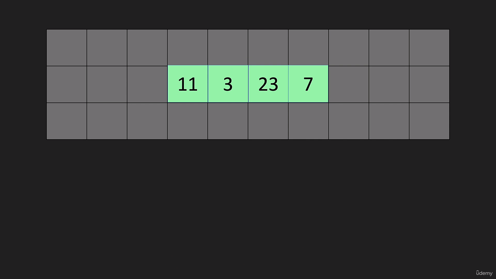
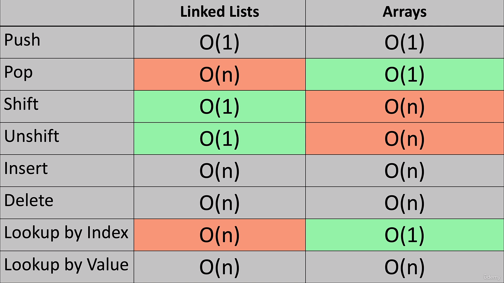
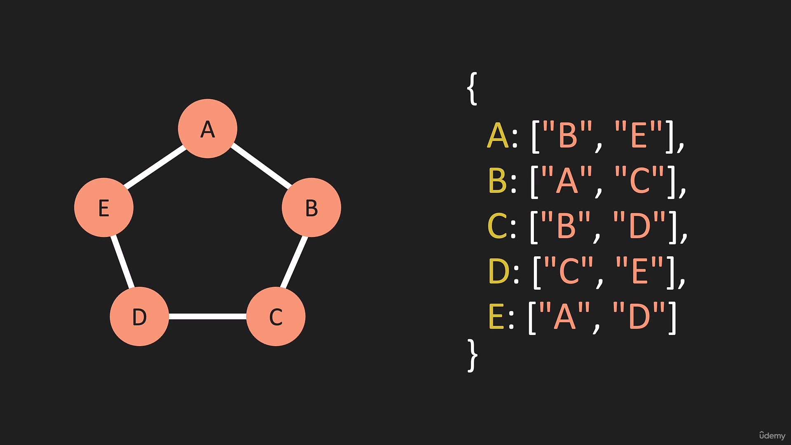
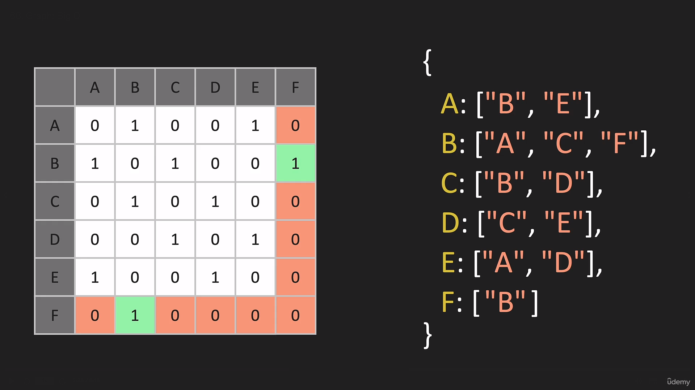

# Data Structure and algorithms

Data Structure are the organization of the data in the different ways and manners.

Algorithms is the set of the rules to achieve the problems solution for the fastest possible time and low memory consumption.

### Big O Notation

Big O notation is the measurement to measure the complexity and the performance of the code.

**How We Calculate the Time Complexity :-**

- First we find out no of oprations in the code.
- If we have any thing based on the input it stands as `n` in the bigO notation.
- Then we need to calculate if the `n` would be a million times how much oprations it will perform and thats how we will get to know the time complexity of the code.

Ex :

```
function sumUpTo(n){
    return (n* (n+1)) / 2;  
}
```

```
function sumUpTo(){
    let total = 0
    for(let i = 0; i<=n; i++){
        total+=i
    }
    return total
}
```

In the above Example the first programme runs only three times weather it will be millions input or not and second one depends on the input soo it will runs `1*n` as it have one opration soo

- Comlexity of 1st Programme :- `3`
- Comlexity of 2nd Programme :- `1*n`

**How to transform oprations in the time complexity :-**

- In the bigO notation we use `O()` for the representation of the time complexity.

- Soo The time complexity will be as follwed for the above examples :-

  1. 3 :- `O(3)`
  1. 1*n :- `O(1*n)`soo`O(n)`

**Some More Advanced Examples :-**

-

```
function shoutWordPairs(arr) {
  for (leti = 0; i < arr.length; i++) {
    for (letj0; j < arr.length; j++) {
      console.log(arr[i] + "" + arr[j]);
    }
  }
}
shoutWordPairs(["canoodle", "wabbit", "alcoholic"]);
```

Time Complexity of the above function will be `O(n^2)` because outer loop oprations are happening number of times `n` and inner loop happening the same times for the single itration of outer loop hence complexity will be **`O(n^2)`**.

-

```
function shoutWordPairs(arr, arr2) {
  for (let i = 0; i < arr.length; i++) {
    for (let j = 0; j < arr2.length; j++) {
      console.log(arr[i] + "" + arr2[j]);
    }
  }
}
let a1 = ["canoodle", "wabbit", "alcoholic"];
let a2 = ["cucamonga", "seattle"];

shoutWordPairs(a1, a2);
```

In the above example outer loop running `n` times and inner loop running the `m` times means in the first itration inner loop running the `m` times soo the time complexity of the above example would be `O(n*m)`.

### Simplifying BigO Notation With Rules of Time Complexity

Simplifying bigO notation means simplifying its equation like `O(6546) => O(1)` or `O(13n^2) => O(n^2)` further with the help of the rules as like mentioned below.

1. **Constant Does not matter :-**

   Constants does not matter in the equation like any kind of number multiplying, addition, substraction , or however it will be as like mentioned below.

- `O(12)→0(1)`
- `O(702)→0(1)`
- `O(2n)→O(n)`
- `O(n/2)→O(n)`
- `O(13n^2)→O(n^2)`

2. **Smaller term does not matter :-**

   In the BigO Notation equation we dont consider the smaller value if both will be there together we keep only the bigger value and cutdown the smaller value from the equation.

- `O(n+10)→O(n)`
- `O(1337n +50)→O(n)`
- `O(n^2+13n+8)→O(n^2)`

### Terminologies for Time Complexity

1. **Constant Time O(1) :-**

   In the constant time complexity it will take the same time to process it to the processor weather 1+1 or 1+100000 soo the time will be constnat.

2. **Linear Time O(n) :-**

   In the Linear Time Complexity Oprations is going to happen the 2 number of times depending on the input soo its called as linear time.

3. **Quadratic Time O(n^2) :-**

   In the Quadratic time complexity the oprations going to happen the square of the times of the input and its the very bad practice.

# Data Structure And Algorithms

Data structure and algorithm is the most important part of the problem solving which differs you from the rest of the crowd which masters your problem solving skills.

### Time complexity

Time complexity is the time required for code to run the code and complete the opration and normally that can be measured with the help of stopwatch right? but that time would be less in fast computers soo how we can figure out it?

We can figure out time complexity with the help of bigO notation which is mathematical representation in which we calculate the complexity based on the number of oprations.

### Space Complexity

Space Complexity is amount of space consumed by the programme while performing the oprations.

### Big O `O`, Thita `0`, Omega `_^_`

There is Best Case, Average Case and Worst caes in the programme as like mentioned below.


In the above example while for sorting we can see

- 1 is the best scenario because it can be found out in the first itration itself represented by omega.
- 4 is the average case scnario which is represented by the thita.
- 7 is the worst case scenario because it will the 7 itrations and time to reach it.

**Most Imp :- Big O is the always worst case scenario of the programme**

### Big O of n `O(n)`

Big O notation of n is the straight line on the time complexity graph.

Complexity of n means oprations will be performed the n times as like programmed mentioned below.

```
function logItems(n){
  for(let i = 0; i < n; i++){
    console.log(i);
  }
}
```

This programme going to run the n times as much we pass and n times it will return the output.

**Rule for o(n) :-**

- **Drop constants** means lets look at the example mentioned below.

  ```
  function logItems(n){
    for(let i = 0; i < n; i++){
      console.log(i);
    }

    for(let j = 0; j < n; j++){
      console.log(j);
    }
  }
  ```

  The above program will run the n + n times becuase it will run n times in the first for loop nad n times in the second for loop so it can be called as `n + n = 2n` so with that our complexity will be `o(2n)`.

  The rule is we need to drop the constants however it will be like 2,6,100 and rest out equation is `o(n)`. This is the drop constant rule.

### Big O of n2 `o(n^2)`

Big o of n2 is the worst case time complexity in the time complexity graph.

Complexity of n2 means oprations will be performed in `n2` times manner as like mentioned below.

```
  function logItems(n){
    for(let i = 0; i < n; i++){
      for(let j = 0; j < n; j++){
        console.log(i,j);
      }
    }
  }
```
In the above example first for loop runs n times nad internal for loop runs n*n times like in the first iteration of outer for loop it internal will run 10 times and soo on soo it become indirectly `n*n = n^2` times.

If number 10 has been passed `o(n^2)` means `10^2 = 100` it will run the 100 times and thats how `o(n^2)` can be defined.

**Rule For o(n^2) :-**

- **Drop Non Dominant :-**

  Drop non dominant means consider only worst case scneario as like mentioned below.

  ```
    function logItems(n){
    for(let i = 0; i < n; i++){
      for(let j = 0; j < n; j++){
        console.log(i,j);
      }
    }

    for(let k = 0; k<n;k++){
      console.log(i)
    }
  }
  ```

  Further Code's first nested for loop will run `O(n^2)` times and second for loop runs `n` times soo its time complexityr will be `O(n^2 + n)` but in it the dominant term is `n^2` so drop the `n` which is at right side and at last the equation will be `o(n^2)` and thats how we drop non-dominant members.

### Constant Time complexity `O(1)`

In the constant time complexity the number of optations are 1 and its the most efficient time complexity in the chart.

```
function addItems(n){
  return n + n;
}
```
The above function will have one opration in which the number can be even million as well but the oprations is one soo the time complexity of this will be 1.

**Rule for O(1)**

- **Drop Number the constant dependant on opration :-**
  ```
    function addItems(n){
      return n + n + n;
    }
  ```
  In the above example if we can notice the 2 oprations soo it would be `O(2)` but its are happening in a single opration so we need to drop the constant and the time complexity of this also will be `O(1)`.


### O of logn `O(log n)`

O of logn is the most powerful time complexity for the algorithms whre we apply the rule of devide and conqure as explained as below.

```
[1][2][3][4][5][6][7][8]
```
In the above array if we need to find the number 8 we divide into half soo and look in it soo array would be 

```
[1][2][3][4]
```

If we divide also this into half then array would be 

```
[1][2]
```

If we divide also this into half then
```
[1]
```

We would get our number and this can be calculated by below 2 methods.

**Ways to find out log n? :-**

- In the above example we 8 numbers and we had divided them by 2 so our n would be.

```
2^3 = 8;

// Time complexity in logn
log2 8 = 3;
```
**Most Imp :- We need to calculate 2 to the what power? equals 8. or We need to figure out how many times we need to cut 8 to until it comes to 2.**

**Power of logn time complexity :-**

If we have `1,073,741,824` items array and if we need to find last item number we need to itreate till a billion but we can do this with 31 times time complexity of log n like `log2 1,073,741,824 = 31`.

### Different Terms for input

Untill now we have calculated time complexity with the help of n but in the interviews they can ask us questions in the terms of input which can tricks us as like mentioned below.

```
function logItems(a,b){
  for(var i=0;i<a,i++){
    console.log(i);
  }

  for(var j=0;j<b,j++){
    console.log(j);
  }
}
```

In the above example if go to calculate time complexity with n it would be `n + n = 2n` and `O(2n)` so if we drop the constant then it would be `O(n)` but this is the totally wrong Because you cant consider the oprations both as n coz a can be 10 and b can be a million and that timecomplexity will be totally different.

**Soo How to calculate this :-**
- First for loop will be O(a) and second for loop will be O(b).
- So the time complexity will be `O(a+b)`.


Lets take another example.

```
function logItems(a,b){
  for(var i=0;i<a,i++){
    for(var j=0;j<b,j++){
      console.log(i,j);
    }
  }
}
```
**Soo How to calculate this :-**
- First For loop will be O(a) and second for loop going to itrate into `a*b` times.
- Soo the time complexity will be `O(a*b)`

### BigO's for Array Oprations and decitions of data structures with the help of BigO's

**Array Methods and its complexity :-** 

- `push()`

  In this scnario we are pushing the item at the end and this would be single opration so its time complexity will be `O(1)`.

- `pop()`

  In this scnario we are removing the item at the end and this would be single opration so its time complexity will be `O(1)`.

- `unshift()`

  In this scnario we need to reindex all the array item so the oprations would be n number of oprations where n will be array's length and time complexity will be `O(n)`.

- `shift()`

  In this scnario we need to reindex all the array item so the oprations would be n number of oprations where n will be array's length and time complexity will be `O(n)`.

- `splice()`

  In this scnario we need to reindex the items woule be `index of n - array.length` but here we are calculating worst case scnario by considerting item we are splicing the item at first and reindexing the rest soo its time complexity would be `O(n)`.

- `slice()`
  In this scnario we need to reindex the items woule be `index of n - array.length` but here we are calculating worst case scnario by considerting item we are slicing the item at first and reindex rest soo its time complexity would be `O(n)`.

**Most Imp :- By looking into BigO() of array methods its best where we need to add the items in the end but not in the first soo we can take decisions on the basis of BigO notation for choosing the data structures.**

**Time & Space Complexities of basic data structures & Operation :-**

- **1. Arrays :-**

	JavaScript arrays are dynamic and can hold elements of different types. They are implemented as objects, so their complexity can sometimes vary depending on the operation.

	- `Access by index (arr[i]) :-` 
		- Time -  `O(1)`	
		- Space -  `O(n)`

	- `Appending (arr.push()) :-`
		- Time - `O(1)` amortized
		- Space - `O(n)`

	- `Prepending (arr.unshift()) :-`
		- Time - `O(n)`
		- Space - `O(n)`

	- `Inserting at index (arr.splice(i, 0, el)) :-`
		- Time - `O(n)`
		- Space - `O(n)`

	- `Deletion by index (arr.splice(i, 1)) :-`
		- Time - `O(n)`
		- Space - `O(n)`

	- `Deletion from the end (arr.pop()) :-`
		- Time - `O(1)`
		- Space - `O(n)`

	- `Iteration (for or forEach) :-`
		- Time - `O(n)`
		- Space - `O(n)`

	- `Searching (arr.indexOf(), arr.includes()) :-`
		- Time - `O(n)`
		- Space - `O(n)`


- **2. Objects :-**

	JavaScript objects are essentially hash maps that store key-value pairs.

	- `Insertion (obj[key] = value) :-`
		- Time - `O(1)`
		- Space - `O(n)`

	- `Access by key (obj[key]) :-`
		- Time - `O(1)`
		- Space - `O(n)`

	- `Deletion (delete obj[key]) :-`
		- Time - `O(1)`
		- Space - `O(n)`

	- `Iteration (for...in) :-`
		- Time - `O(n)`
		- Space - `O(n)`


- **3. Maps :-**

	Map is a specialized object for key-value pairs where keys can be any type (not just strings, like in regular objects).

	- `Insertion (map.set()) :-`
		- Time - `O(1)`
		- Space - `O(n)`

	- `Access (map.get()) :-`
		- Time - `O(1)`
		- Space - `O(n)`

	- `Deletion (map.delete()) :-`
		- Time - `O(1)`
		- Space - `O(n)`

	- `Iteration (map.forEach(), for...of) :-`
		- Time - `O(n)`
		- Space - `O(n)`

	- `Search (map.has()) :-`
		- Time - `O(1)`
		- Space - `O(n)`


- **4. Sets :-**

	Set is a collection of unique values (no duplicates are allowed).

	- `Insertion (set.add()) :-`
		- Time - `O(1)`
		- Space - `O(n)`

	- `Access (set.has()) :-`
		- Time - `O(1)`
		- Space - `O(n)`

	- `Deletion (set.delete()) :-`
		- Time - `O(1)`
		- Space - `O(n)`

	- `Iteration (set.forEach(), for...of) :-`
		- Time - `O(n)`
		- Space - `O(n)`


- **5. Strings :-**

	Strings in JavaScript are immutable, meaning any operation that modifies a string creates a new string.

	- `Access by index (str[i]) :-`
		- Time - `O(1)`
		- Space - `O(n)`

	- `Concatenation (str1 + str2) :-`
		- Time - `O(n)`
		- Space - `O(n)`

	- `Substring extraction (slice, substring) :-`
		- Time - `O(n)`
		- Space - `O(n)`

	- `Iteration (for...of, forEach) :-`
		- Time - `O(n)`
		- Space - `O(n)`

	- **Note**: Concatenating two strings is `O(n)` because it creates a new string.

### Importance of classes in Data Structures

We are going to create The Data Structures with the help of classes and we are going to build the methods for the oprations like add, remove, delete and get as like mentioned below.

```
class LinkedList{
  // Value will create the first node
  constructor(value){}

  push(value){...}
  unshift(value){...}
  insert(index){...}
  remove(index){...}
  pop(){...}
  shift(){...}
}

let myLinkedList = new LinkedList(23);
myLinkedList.push(7)
myLinkedList.unshift(7)
myLinkedList.insert(1,23)
// and soo on
```

### Pointers
Pointers are the most important topic from the javascript in which we can say that is `thing 1 -> things 2` thing 1 is pointing towards thing 2.

Lets understand pointers with the help of example.

```
let a = 5;
let b = a;
a = 10;
console.log(a); // 10
console.log(b); // 5
```

In the above example value of b has not changed coz it was pointing towards the value not the adress and pointing towards the adress is called as pointers and we can achive that with the help of objects.

```
let obj1 = {value:10}
let obj2 = obj1;

obj1.value = 20;

console.log(obj1); // {value:20}
console.log(obj2); // {value:20}
```

### Garbage Collection

When we have object stored in the memory but we are not pointing any variable to it soo it get cleared by the javascript and which called as garbage collection.

```
let a = {value:20}
let b = {value:30}


let c = b;
a = b;

// {value:20} will moved in the garbage collection
```
### Arrays

### Linked Lists

Linked List is the data structure which is same as arrays but the linked list dont have indexes and they done take continues space in the memory as mentioned below.


Linked list first node called as head and last node called as tail. all nodes are pointing towards another node.


**Space Consumption in  memory for Array  :-**


**Space Consumption in  memory for linkedlist :-**


### BigO of LinkedList Oprations

Array And Linked List are the similar data structure but it have bigO's as like mentioned below.



**Most Imp :- Arrays are the data structure which is compatible for adding and removing oprations at the end where linked list is the data structure which is compatible for adding and removing the items from the end.**

### Linked List In Practical

Linked List is made up of objects in which first object is noted as head and last one is pointed as tail and its nothing but the nested object with `value and next property` which points towards the value and next node which is object as like mentioned below.

`1 -> 2 -> 3 -> 4 -> 5` is linked list represented as like mentioned below in javascript.

```
let LinkedList = {
  head:{
    value: 1,
    next:{
      value: 2,
      next: {
        value: 3,
        next:{
          value: 4,
          next: {
            value: 5,
            next:null
          }
        }
      }
    }
  }
}
```

### LinkedList Constructors

For LinkedList we need to create class `LinkedList` and class `Node` as well for creating new node in every opration as like mentioned below.

```
class Node{
    constructor(value){
        this.value = value;
        this.next = null;
    }
}

class LinkedList{
    constructor(value){
        const newNode = new Node(value);
        this.head = newNode;
        this.tail = newNode;
        this.length = 1;
    }
}

const myLinkedList = new LinkedList(5);
console.log("myLinkedList : ",myLinkedList);

// myLinkedList :  LinkedList {
  head: Node { value: 5, next: null },
  tail: Node { value: 5, next: null },
  length: 1
}
```

In the above code Node class creating a new node and we are creating new node in the constructor and we are pointing head and tail towards newnode coz its the first node and we are setting the length as well.

### Push Method for LinkedList

In the Push method what we needs to do is we need to add a new node to the linked list at last.

**Logically :- we need to point the tail towards it and we could have a scenario where we dont have linkedlist created yet so we need to handle that and we need create first node and point head and tail towards it.**

```
push(value){
        const newNode = new Node(value);
        if(!this.head){
            this.head = newNode;
            this.tail = newNode;
        }
        else{
            this.tail.next = newNode;
            this.tail = newNode;
        }
        this.length++;
        return this;
    }
```
In the above code we are getting value as input and creating new node first and we are pointing towards head and tail if we dont have head and if we have head already means there are nodes in the linkedlist soo we need to add that node at the last means `tail.next` and we need to point the tail towards it like `this.tail = newNode;`.

### Pop Method for LinkedList

In the Pop method what we need to do is go to the last node and remove the last node.

**Logically :- Point tail to second last node in which we can have 2 scenarios where we will get linkedList with no head or only 1 node soo we need to return undefined when no node and we need to remove present node when only one node is there.**

```
// 1 -> 2 -> 3 -> 4 -> 5 -> 6 -> 7 -> 8 -> 9 -> 10
    pop(){
        if(!this.head){
            return null;
        }
        let pre = this.head;
        let cur = this.head;
        while(cur.next){
            pre = cur;
            cur = cur.next;
        }
        this.tail = pre;
        this.tail.next = null;
        this.length--;
        if(this.length == 0){
            this.head = null;
            this.tail = null;
        }
        return cur;
    }
```

In the above code we are first checking with linkedList with no node and returns the undefined and when its have items then we are setting 2 variables `cur = which denotes to current node` and `pre = which denotes to previous node` and we are running while loop on `cur.next` which will runs until current node have next item and at the end we will have current node and previous node soo we are setting tail to previous node and setting `tail.next = null` so cur node has gone and we are reducing the length and if it have only one node as we did above length got 0 so we are setting tail and head to null if we have only one node.

### unShift Methood for LinkedList
In the unshift we need add the new node to the start of the linked list.

**Logically :- We need to create new node and its next point towards the head and then head points towards new node and if no items in the list head and tail would point towards newNode.**

```
unshift(value){
  let newNode = new Node(value);
  if(!this.head){
    this.head = newNode;
    this.tail = newNode;
  }
  else{
    newNode.next = this.head;
    this.head = newNode;
  }
  this.length++;
  return this;
}
```

### shift Method for LinkedList
In the shift we need to remove the node from the start of the linked list.

**Logically :- We need to point the head towards head.next and node.next to be null so it will detached from linkedList and if there is one node then head and tail will points null and linkedList with not item would retrun undefined.**

```
shift(){
  if(!this.head) return undefined;
  let temp = this.head;
  this.head = temp.next;
  temo.next = null;
  this.length--;
  if(this.length == 0) {
    this.head = null;
    return undefined;
  }
}
```

### Get Method for LinkedList

In the get method we need to return `indexth` item from the linked list.

**Logically :- We need to itrate on linkedList till that index and needs to return the last node.**

```
get(index){
  if(index<0 && index>this.length) return undefined;
  let temp = this.head;
  for(let i = 0; i<index; i++){
    temp = temp.next;
  }
  return temp;
}
```
### Set Methdhod for LinkedList

In the set method we need to set the value at the provided index.

**Logically :- We need to get the value of that index and set provided value to its value, In this we can use existing get method as well and through the get method we are able to handle the worst case scenario as well for negative index or non-existing index.**

```
set(index, value){
  let temp = this.get(index);
  if(temp){
    temp.value = value;
    return true;
  }
  else{
    return false;
  }
}
```

### Insert Method for LinkedList
In the insert we need to insrt the new node at the provided index.

**Logically :- For worstCase scenario's we can get index<0 or index>length soo we need return undefined and if the index are first or last we can use the existing method unshift() and push() else We need to itrate till `index-1` to get the node before provided index and set the new nodes' next to itration value's next and set the itration values next to new node.**

```
insert(index, value){
  if(index<0 || index>this.length) return undefined;
  if(index==0) return this.unshift(value);
  if(index==this.length) return this.push(value);

  let newNode = new Node(value);
  let temp = this.get(index-1);
  newNode.next = temp.next;
  temp.next = newNode;
  this.length++;
  return true;
}
```

### Remove Method for LinkedList

In the remove we need to remvoe the node from provided index.

**Logically :- For worst case scenario we cant remove the node from index<0 or more than lastIndex so we need to return `undefined` and if we got index 0 or the lastindex then we can use the existing methods like shift and unshift.Else We need to itrate towards that index and preIndex we need to assign index's next to preindex and we need to make index's next null afterwards for detaching it from linkedList.**

```
remove(index){
  if(index<0 || index==this.length) return undefined;
  if(index==0) return this.shift();
  if(index==(this.length-1)) return this.pop();

  let pre = this.get(index-1);
  let cur = pre.next;

  pre.next = cur.next;
  cur.next = null;
  this.length--;
  return cur;
}
```

### Reverse method for linkedList

In reverse we need to reverse the whole linkedList from start to end.

**Logically :- For reversing the linkedlist we need to set pre, cur, next node in linked list and we need to reverse the current's next to pre and move the current, next, and pre to 1 node further.**

```
      reverse(){
        let temp = this.head;
        this.head = this.tail;
        this.tail = temp;
        

        let prev = null;
        let next = temp.next;

        for(let i=0;i<this.length;i++){
            next = temp.next;
            temp.next = prev;
            prev = temp;
            temp = next;
        }
        return this;
      }
```

### Doubly LinkedList constructor
Doubly linkedList is nothing different than a linkedList but in the doubly linked list there we have a `previous` node as well and the node looks as like mentioned below.

```
class Node{
    constructor(value){
      this.value = value;
      // This is the only additional thing in the linked list
      this.prev = null;
      this.next = null;
    }
}
```

And out rest class architecture for the constructor remains same as like mentioned below.

```
class DoublyLinkedList{
  constructor(value){
    const newNode = new Node(value);
    this.head = newNode;
    this.tail = newNode;
    this.length = 1;
  }
}
```

### Doubly LinkedList Push

We need to add the item at the end of the linked list.

**Logically :- First we need to create a new node. For worst case scenario if there is no item in linkedlist point head and tail towards it. Else we need point newNode's next to head and head's prev to newNode and move head on newNode.**

```
    push(value){
        const newNode = new Node(value);
        if(!this.head){
            this.head = newNode;
            this.tail = newNode;
        }
        else{
            this.tail.next = newNode;
            newNode.prev = this.tail;
            this.tail = newNode;
        }
        this.length++;
        return this;
    }
```

### Doubly LinkedList Pop

We need to remove the node from the end.

**Logically :- For Worst case scenario return undefined if no node in linnkedlist and if 1 then point head and tail to null else Earlier we didnt had node before tail to set it as a tail so we needed to itrate through it but as we have prev node record in the last node we dont need to itrate it. We need to simply create pointer which will points towards tail and then move tail to tail's prev and disconnect node from linkedlist by setting temp's prev node to null.**

```
     pop(){
        if(this.length===0) return undefined;
        let temp = this.tail;
        if(this.length===1){
            this.head = null;
            this.tail = null;
        }
        else{
            this.tail = this.tail.prev;
            this.tail.next = null;
            temp.prev = null;
        }
        this.length--;
        return temp;
    }
```

### Doubly LinkedList unshift

We need to add the node at the start.

**Logically :- First we need to create newNode. For worst case scenario if no node in the list point head and tail towards newNode else point newNode's next to head and heads prev to newNode and move head to newNode.**

```
  unshift(value) {
    const newNode = new Node(value);
    if(!this.head) {
        this.head = newNode;
        this.tail = newNode;
    }
    else{
        newNode.next = this.head;
        this.head.prev = newNode;
        this.head = newNode;
    }
    this.length++;
    return this;
}
```

### Doubly LinkedList shift

We need to remove the node from the first.

**Logically :- First we need to create pointing towards head for returning it. For worst case scenario return undefined for no node present and if 1 node then set head and tail to null else moving head to head's next and then detaching heads prev and detaching temp's next from the list.**


```
  shift(){
    if(!this.head) return undefined;
    let temp = this.head;
    if(this.length===1){
      this.head = null;
      this.tail = null;
    }else{
      this.head = this.head.next;
      this.head.prev = null;
      temp.next = null;
    }
    this.length--;
    return temp;
  }
```
### DoublyLinkedlist Get

We need to get the item of the provided index.

In the doubly linkedlist we can reduce the time complexity for the get with the help of prev as like mentioned below

**Logically :- For Worst Case scenario we need to return undefined if `index > length` or `index < 0` Else For the Doubly linked list we can reduce the time complexity of the get method  by itrating the list form the start if the index is less than its half length or else we are going to start itrating from the tail if we have index more the its half length as like mentioned below.**

```
get(index){
  if(index<0 || index>this.length) return undefined;
  let temp;
  if(index<this.length/2) {
    temp = this.head;
    for(let i=0; i<index;i++){
      temp = temp.next;
    }
  }else{
    temp = this.tail;
    for(let i = this.length-1; i>index;i--){
      temp = this.tail;
      temp = temp.prev;
    }
  }
  return temp;
}
```

### DoublyLinkedList Set

We need to set the value for the provided index.

**Logically :- For Worst case scenario we need to return undefined if th `index > length` and `length < 0` Else we need to get the node by using already existing get method and we need to set the value to its value return the linkedList.**

```
set(index, value){
  if(index > this.length || index < 0) return undefined;
  let temp = this.get(index);
  if(temp){
    temp.value = value;
    return true;
  }
    return false;
}
```

### DoublyLinkedList Insert

We need to insert the value at provided index into the linked list.

**Logically :- First we need to create a node and then we need to check if the index is 0 then we can use inbuilt method for `unshift` and if the `index ==length-1` then we can use `push` inbuilt method nad for worst case scenario we need to return false else we need to get pre node by existing method get and we need to set the next with pre.next. we need to bind the next node to newnode as well as we need bind pre's next to newNode and next's prev to newNode and newNode's prev to pre as like mentioned below.**

```
      insert(index, value) {
        if(index < 0 || index>this.length) return false;
        if(index===0) return this.unshift(value);
        if(index===this.length-1) return this.push(value);
        let newNode = new Node(value);
        let pre = this.get(index-1);
        let next = pre.next;
        pre.next = newNode;
        newNode.prev = pre;
        newNode.next = next;
        next.prev = newNode;
        this.length++;
        return true;
      }
```

### DoublyLinkedList Remove

We need to remove the value form the provided inedex.

**Logically :- For worst case scenario we need to return undefined if `index<0` and `index>length` else if the `index==0` or `index==length-1` we can use the inbuilt method `shift` and `pop` else we need to get the node of that index with inbuilt method get and we need to bind its prev's next to its next and next's prev to its previous and detach the node by prev and next doing null return that as like mentioned below.**

```
    remove(index){
        if(index<0 || index>this.length) return undefined;
        if(index==0) return this.shift();
        if(index==this.length-1) return this.pop();
        let cur = this.get(index);
        cur.prev.next = cur.next;
        cur.next.prev = cur.prev;
        cur.prev = null;
        cur.next = null;
        this.length--;
        return cur;
      }
```

### Stacks

Stacks are the data structure which follows the **LAST IN FIRST OUT LIFO** in which only we can only remove the item which we had ended at last for removing the first item we need to remove the all item first.

Stacks can be built with 2 data structures which are array and linkedList form which if we are using array we should use last end becuase the time complexity for `push()` and `pop()` method is `o(1)` and for linkedlist we should use first end becuase its time complexity for `shift()` and `unshift()` is `o(1)` and for linkedlist.

**Most Imp :- The start of the linkedlist will be the topmost item and the last of linkedlist going to be bottom of the stack.**


### Constructor For Stack

For the stack we need to create first a node which going to be the same as linkedlist as like mentioned below.

```
class Node{
  constructor(value){
    this.value = value;
    this.next = null;
  }
}
```

Earlier we had used the terminology `head` and `tail` which not present in the linkedlist and we are going to use `top` and `bottom` but most importantly the stack is only one way oprations and we had choosed the first end due to its time complexity its going top we are going to use only top in the stack as like mentioned below.

```
class Stack{
  constructor(value){
    const newNode = new Node(value);
    this.top = newNode;
    this.length = 1;
  }
}
```

### Stack Push

As stack have only top and its stacks the new node on another node and it becomes the top of the stack.

We need to add a node on the top.

**Logically :- First we need to create a newNode and for wrost case scneario if no element in the stack we need to point the top towards it. else we need to connect the rest stack to new node's next and move the top to it.**

```
push(value){
  const newNode = new Node(value);
  if(!this.top && this.length == 0) {
    this.top = newNode;
  }else{
    newNode.next = this.top;
    this.top = newNode;
  }
  this.length++;
  return this;
}
```

### Stack Pop

We need to remove the node form the top.

**Logically :- For worst case scenario if no node in stack then we need to return undefined else we need move the top to top.next and detach the top node form stack and return that.**

```
pop(){
  if(this.length==0 && !this.top)return undefined;
  let temp = this.top;
  this.top = temp.next;
  temp.next = null;
  this.length--;
  return temp
}
```

### Queue 

Queue is the data structure which follws `First In First Out (FIFO)` principle in which adding the node is called as enquing and removing the node is called decueueing.

In the queue we need to add node from one end and remove the node from the another end.

We can implement the data structure queue with the help of array as well as linked list but with the array and modified linkedlist.

But you should always use the modified linkedlist for the queues due to it have `O(1)` time complexity for `unshift()` and as well as for push. But when it comes to array it have `O(1)` for push and `O(n)` for `unshift()` as it needs to do reindexing.

We are going to implement the queues with the help of modified linkedlist and the head called as first and tail called as the last in the linkedlist.


### Queue Constructor 

For Creating the queue we need to create a node which going to be the same as the linkedlist but the name going to change for the class `QUEUE` and terminologies like `first and last` instead of `head and tail.`

```
class Node{
  constructor(value){
    this.value = value;
    this.next = null;
  }
}

class Queue{
  constructor(value){
    const newNode = new Node(value);
    this.first = newNode;
    this.last = newNode;
    this.length = 1;
  }
}
```

### Queue Enqueue

Enque means the adding someone in the line means adding a node at the last as it follow `FIFO`.

**Logically :- First we need to create a node. For the worst case scneario if there is no node in the queue we need to point first and last towards it else we need to point last's next to it nad mvoe the last to it and return the queue.**

```
enqueue(value){
  const newNode = new Node(value);
  if(!this.first && !this.length==0){
    this.first = newNode;
    this.last = newNode;
  }
  else{
    this.last.next = newNode;
    this.last = newNode;
  }
  this.length++;
  return this;
}
```

### Queue Dequeue

Dequeue means removing someone from the first means removing the node from the first as queue follows `FIFO`.

**Logically :- For worst case scenario we need to return undefined if no node is present in the queue else we need to to point first towards first's next and we need to detach the prev node from the queue and return that.**

```
dequeue(){
        let temp = this.first;
        if(this.length==0 && !this.first){
            return undefined;
        }
        else{
            this.first = temp.next;
            temp.next = null;
        }
        this.length--;
        return temp
    }
```

### Trees

A linkedList is the form of tree which does not fork, In the tree the node remains the same as like linkedList but rather than next or prev it have properties like left and right as like mentioned below.


Node in the tree looks like mentione below.

```
{
  value:4,
  left:'',
  right:''
}
```

**Terminologies about trees :-**

- **Full Tree :-** Full tree is defined as the node points towards 0 or 2 nodes.

- **Perfect Tree :-** When line is filled and have items in it that called as perfect tree.

- **Complete Tree :-** Either the tree is full or perfect its always a complete tree.

**Node Terminologies :-**

- **Parent Node :-** The node which have left and right node is called as parent node of that nodes.

- **Child :-** Left and right node of a parent node is called as child node.

- **Leaf Nodes :-** When there are no nodes below them and dont have left and right node then that nodes are leaf nodes where the tree ends.
 
 ### Binary Search Tree

 The Binary search tree is the tree where parents root node have some value and if the values are less than it root node will all be on left side in hirarchial manner and if those are greater than that root node value its always going to be all at right side.


 **How node get placed in the binary search tree :-**

 - First it will be compared to root node and if is `node value>root value` then it will be placed right side.
 - If their is chid node present for root node it will be compared to its value and if it would be less than it it will be placed at left node and if its greater it will be placed at right side.
- Every node comes down by comparing with the nodes value and follow the manner for right and left if values are greater or lesser than it.


### Big O of binary search tree

Binary Search tree follows the divide and conquer rule means if need to go down 4 levels deeper that oprations are denoted as `2^4`.

If we need to go down 4 steps we have time complexity of `O(log n)` and most of the oprations in the binary search tree have time complexity of `O(log n)`.

The only Worst Case scenario in the binary search tree is when that a straight leftwards or straight rightwards tree as like mentioned below.


Its the similar case to the linkedlist and in this scenario we need to loop through till the end until we get the item and so it have time complexity of `O(n)` as like linkedList.

**The BigO for binary search tree is O(log n) for best case scenario and for a worst case scenario its O(n) as we need to itrate though it but we consider the Binary search tree is O(log n) data structure.**


### Contructor For Binary Search Tree

For creating node we need to have pointers for left and right for pointing towards childrens and our node class should be as like mentioned below as per BST rules.

```
class Node{
  constructor(value){
    this.value = value;
    this.left = null;
    this.right = null;
  }
}
```

The first node of Binary Search Tree called as root node and normally should create a node and root pointing towards it but in the BST we are going to create the binary search tree with `root=null` and we need to start inserting node with insert method which we will have look further. The Binary Search Tree class as like mentioned below.
```
class Node{
  constructor(value){
    this.value = value;
    this.left = null;
    this.right = null;
  }
}

class BST{
  constructor(){
    this.root = null;
  }
}
```

### BST Insert 

Inserting a node into binary search tree by comparing with the node's values and to decide its placement accordingly left or right.

**Logically :- Firstly We create node and if no root its present we set the root to newly created node. For worst case scenario if the values matched with any node then need to undefined else in with the help of while loop need to check node's value less than or greater than its itration value for example its greater than node vales then it will check for right node is null then place the node else take the itration node further with temp's right accordingly as like mentioned below.**

```
    insert(value){
        const newNode = new Node(value);
        // Set the root node if no nodes available
        if(!this.root){
            this.root = newNode;
            return this;
        }

        let temp = this.root;
        while(true){
            // Don't insert duplicate nodes if value matches with any node
            if(newNode.value===temp.value) return undefined;

            // NewNode's value less than temp value then place the node at left.
            if(newNode.value<temp.value){
                if(temp.right==null){
                    temp.left = newNode;
                    return this;
                }
                temp = temp.left;
            }
            // // NewNode's value less than temp value then place the node at right.
            else{
                if(newNode.value>temp.value){
                    if(temp.right==null){
                        temp.right = newNode;
                        return this;
                    }
                    temp = temp.right;
                }
            }
        }

    }
```

### BST Contains

Contains method checks if the node present in the BST.

**Logically :-For worst case scenario we need to return false if no node in the BST else create a pointer temp pointing towards root and we need to itrate with the help of while loop by comparing value less than or greater than temp.value and moving temp further to temps right or left untill temp gets null means the end of tree and when value matches with node return true else false as like mentioned below.**

```
contains(value){
  if(this.root==null) return false;
  let temp = this.root;
  while(temp){
    if(value>temp.value){
      temp = temp.right;
    }
    else if(value<temp.value){
      temp = temp.right
    }
    else{
      return true;
    }
  }
  return false;
}
```

### Minimum Value node

Returns the minimum value node in the BST.

**Logically :-For worst case scenario if no subtree node has passed consider the root to current node and itrate over its left until you get null and return the last node as like mentinoed below.**

```
minValueNode(value){
    let currentNode;
    if(value){
        currentNode = value;
        while(currentNode.left){
            currentNode = currentNode.left;
        }
    }else{
        currentNode = this.root;
        while(currentNode.left){
            currentNode = currentNode.left;
        }
    }
    return currentNode;
  }
```

### Hash Tables

Hash tables is the data structure which driven by hash generator function which does mathamatical calcaulations we pass the key and value pair which returns a adress for it at which we are going to store the values in the form of array like `['nuts',1000]` at adress 2 in adress space.

**Limitations of Hash Generator :-**

- It is one way only which returns the adress by taking values but cant return value by taking adress.

- Value determined by it is deterministic and it never gonna change after 1000's of oprations for the same key and value.

### Collision in Hash Tables

Collision is the scenario in hash table where hash generator function returns same adress for multiple key and value and we need to store them all at one adress only rather than overriding them.

In practical in the memory its storing multiple entities at a same in adress space would be `[['nuts',1000],['bolts',500]]` in the form of parent array itself.

**Methods For handlling collisions in hash tables :-**

- **Seprate Chaining :-** In Collision The process of putting all of the key value pairs that mapped to perticular adress in the same adress space called as seprate chaining.

- **Linear Probing :-** In Collision to check if already value exists and moving to next and so on until get the empty adress and mapping value to that adress is called Linear Probing.

- **Using Linked List :-** In Collision mapping the different values at same adress space in the form of linked list can be a method for handelling collision.

### Hash Table Constructor

Hash table creates an array of provided length else with the defualt value of 7 which starts from 0 and that array is called as dataMap.

**hash generator method :-** Hash generator method runs a loop on the keys length and in the part of calculation it adds the existing hash with charcode of itration value multiplied by any prime number `(hash + key.charCodeAt(i) * primeNumber)` and modules oprator which will return the remainder in between 0 to data map's length `% dataMap.length` so total equation will look like `(hash + key.charCodeAt(i) * primeNumber) % dataMap.length` and returns the hash as like mentioned below.


```
// HashTable constructor only creates an dataMap array with provided length.
class HashTable{
  constructor(size=7){
    this.dataMap = new Array(size)
  }

  // _ in Hash function determines it should called only with another method and it will return the hash of passed key with the help of equation.
  _hash(key){
    let hash = 0;
    for(let i = 0; i<hash.length; i++){
      hash = (hash + key.charCodeAt(i) * 23) & this.dataMap.length;
    }
    return hash
  }
}
```

### Set for hash Table

We need to set the empty array the index produced by the hash function and set the key value in the form of subarray of it.

**Logically :- For worst case scenario check for the key and value and create the empty array at the index produced by _hash funtion and append the values to same array if hash produces again that same index as like mentiond below.**

```

set(key,value){
  const index = _hash(key);
  if(!this.dataMap[index]){
    this.dataMap[index] = [];
  }
  this.dataMap[index].push([key,value]);
  return this;
}
```

### Get for hash Table

We need to get the value for the key from the hash table form its adress space.

**Logically :- For worst case scenario if there is no array at the index of dataMap which _hash function produced we need to return undefined and when you have array in that array it might be multiple values soo we need to itrate through it and returns the value of subarray whenre the key matches as like mentioned below.**

```
get(key) {
    let index = this._hash(key);
    if(this.dataMap[index]){
      for(let i = 0; i<this.dataMap[index].length; i++){
        if(this.dataMap[index][i][0]===key){
          return this.dataMap[index][i][1]
        }
      }
    }
    return undefined;
  }
```

### Keys for hash function

We need to return keys of whole hash table.

**Logically :- For worst case scenario return undefined if there is not item in dataMap else you need itrate through all index and at all index you need to itrate through its item array in which values got stored from the data array you need to push its key to a variable as like mentioned below.**


```
  keys(){
    let allKeys = [];
    for(let i = 0; i < this.dataMap.length; i++){
      if(this.dataMap[i]){
        for(let j = 0; i<this.dataMap[i].length;j++){
          allKeys.push(this.dataMap[i][j][0])
        }
      }
      
    }
    return allKeys;
  }
```
### BigO of Hash table

The Hash function in hash tables plays the major role in the time complexity by providing the index based on the key.

As the acessing the value or setting value at perticular value in array with the help of index the no of operation is only 1 and time complexity is `O(1)`.


Above mentioned adress space is the worst case scenario for getting the value of screws as its at 2 index but we need to look up into it and time complexity would be `O(n)` BUTTT 

In the javascript the built in hash table data structure is object and for objects there is a huge adress space get assigned due to which hash function be more efficient to randomized the data and it will look as like mentioned below.


Collisions would be so rare.

### Hash Table Interview Questions

If we have 2 arrays as an input and we need to check the duplicates from it soo write efficient code for it.

**Traditional Solution :-**
```
function doesHaveDuplicates(arr1,arr2){
  arr.forEach(i=>{
    arr2.forEach(j=>{
      if(i==j) return true
    })
  })
  return false
}
```
We are runnig for loop in for loop so the time complexity above code will be `O(n2)`.

**Efficient Method :-**

```
function doesHaveDuplicates(arr1,arr2){
  const obj = {}
  arr.forEach(i=>{
    obj[i] = true
  })
  arr2.forEach(j=>{
    if(obj[i]) return true
  })

  return false
}
```

In the above method we are running 2 for loops so number of opration are 2 `O(2n)` but 2 is constant soo the it will be `O(n)`.

### Graphs

Graphs is another data structure in which `nodes called as vertex` and the `connection between 2 vertex called edge`.

In the graph nodes can be connected bidirectional and it represented as plan line without array.


The uni directional connection in nodes or vertexes are represented as line with arrow.


So We are going to study the graphs withouts weights which will look as like mentioned below.


### Adjecency Matrix

Graph can be represented by 2 methods as adjecency matrix and adjecency list.

In the adjecency matrix it will create matrix with x axis and y axis which will represent the coreation in between their edges.

When ther will be connection between 2 vertices we will plot the value one and rest 0 as like mentioned below.


the connection of mentioned nodes of pentagon will be represented in the matrix with values 0 and 1 as like mentioned above.

### Adjecency List

In the adjecency List we represent the vertex as the key of object and its edges or conenction as the value of array for the key as like mentioned below.



The graph for above pentagon will look like above in the form of code.

### Big O of Graph
We are going to look into Big O for adjecency lists and adjecency matrix with the various as like mentioned below.

- **Space Complexity :-** 
  The space complexity for adjecency list is more efficient than adjecency matrix because in the adjecency list we need only store the edges or connected node but in the adjecency matrix we need to store the non-connected nodes as well so the space complexity for adjecency matrix is very inefficient.

  

  1. **Adjecent Matrix  O(|V|^2) :-** :- Square of the vertices due to every node is getting stored in both x and y coordinates.

  2. **Adjacency List O(|V|+|E|) :-** :- In the adjacency list Its addition of `no of Vertices + no of Edges`.


- **Big O For Add :-**

  1. **Adjecency Matrix O(|V|^2)** :- 
    To add the node in adjecency matrix we have to change the matrix to add the node in both directions and to store the non-edges nodes as well and it will be equivalent to recreating the adjacency matrix.

    

  2. **Adjecency List O(1):-**
    We just need to add key in the object to add the vertex in adjecency list as like mentioned below.

    

- **BigO For Add the edges :-**  

  1. **Adjecency Matrix O(1) :-**
    To add the edges in the adjacency matrix we just need to change the value of that index so it will be single opration and `O(1)`.

  2. **Adjecency List O(1):-**
    To add the edges in the adjacency list we just need to push the value at that keys edges array and it will also be single opration and `O(1)`.

  

- **BigO for removing edge :-** 

  1. **Adjecency Matrix O(1) :-**
    To remoe the edge we adjecency matrix we just need to change the value of that index from 1 to 0 and here in this opration adjecency matrix is more efficient.

  2. **Adjecency List O(|E|) :-**
  To remove the edge in adjecency list we need to loop through its all edges and then remove it soo its BigO will be number of edges connected to that vertex.

- **BigO For removing vertex :-** 

  1. **Adjecency Matrix O(|V|^2) :-**
    To remove the edge we need to touch the each and every vertex and edges of matrix to check and modify its value to 0.

  2. **Adjecency List :-**  
    To remove the edge we need to touch the each and every vertex and edges of matrix to remove it from the edges as well as an vertex soo it will be `Number of vertices + Number of edges connected ` here advantage goes to Adjecency list.

  

So in the comparison Adjecency list is more efficient than Adjecency matrix with the all operations.

### Add vertex

We need to add a vertex in the adjacency list.

**Logically :- For a worst case scenario we need to check if vertex already present and else we need to add the vertex with empty list in the adjecency list as like mentioned below.**

```
class Graph{
  constructor(){
    this.adjecenyList = {};
  }

  addVertex(vertex){
    if(!this.adjecenyList[vertex]){
      this.adjecenyList[vertex] = [];
      return true;
    }
    return false;
  }
}

const myGraph = new Graph();
console.log(myGraph.addVertex('A'))
// returns true and adds the vertex and the graph will look like `{A:[]}`.
```

### Add edge

We need to add edge between two vertices means they are bothe bi-directionaly connected to each other.

**Logically :- For worst case scenario we need to check if the both vertices exists in the adjecency list and if yes as its bi-directional conenction we need to add the vertex on both vertices vice versa as like mentioned below.**

```
addEdge(vertex1, vertex2){
  if(this.adjecencyList[vertex] && this.adjecencyList[vertex2]){
    this.adjecencyList[vertex1].push(vertex2);
    this.adjecencyList[vertex2].push(vertex1);
    return true;
  }
  return false;
}
```

### Remove Edge

We need to remove the edge form adjecency list.

**Logically :- For worst case scenario we need to check if those both vertex does exists in the list if yest then we need to check in each vertex's list of edges and we need to remove the edge form each vertex, so we can filter the list of edges which does not matches to provided vertex as like mentioned below.**

```
removeEdge(vertex1, vertex2){
  if(this.adjecencyList[vertex1] && this.adjecencyList[vertex2]){
    this.adjecencyList[vertex1] = this.adjecencyList[vertex1].filter(res=>res!=vertex2);
    this.adjecencyList[vertex2] = this.adjecencyList[vertex2].filter(res=>res!=vertex1);
    return true;
  }
  return false;
}
```

### Remove Vertex

In order to remove a vertex first we need to remove its edges and then when it has no edges we can remove the vertex as well as it doesn't have connectoin with any other vertex.

**Logically :- For worst case scenario we need to check if vertex exists in the adjecency list if yes then we need to itrate through the edges list and we can directly go to that vertex and remove the passed vertex from its list of edges. For this we can use prebuilt method for removing edges as like mentioned below.**

```
removeVertex(vertex){
  if(this.adjecencyList[vertex]){
    while(this.adjecencyList.[veretx].length){
      let temp = this.adjecencyList[vertex].pop();
      this.removeEdges(vertex, temp);
    }
    delete this.adjecencyList[vertex]
    return this
  }
}
```

### Recursion
Recursion is a strategy to solve a problem by calling the function itself until it reaches the solution and stop calling itself.

```
function reduce(number){
    console.log("number :",number)
    if(number==0) return number;
    number--;
    reduce(number)
}
reduce(10)
```
**Rules For Recursion :-**
- It should have if statement which should stop it on certain condition.
- It should have return in if statement to come out of function else it will cause stack overflow.
- People make mistakes by writing the conditon which is never true and it stills overflows the stack and runs in infinite loop.

### Call Stack
Call stack is mechanism to keep the track of function calls in the stack and its follows FILO (First in last out) while running in the function it will be pushed in the call stack and when the opration is completes it will be removed from the call stack.

Last function will be removed first after its completion. and in the descending order other functions will be removed from the call stack as like mentioned below.

```
function one(){
  two()
  console.log('one)
}

functino two(){
  three()
  console.log('two')
}

function three(){
  console.log('three')
}
```

In the above mentioned pseudo code first will go in the call stack first and it adds the second and third and when third compeltes it will be removed form the stack and then second will be removed and then first will be removed at last.

### Bubble Sort

In bubble sort we compare the item of array to next item and if its greater than next item we switch them and if not greater than next item we move to next item as like mentioned below.

**Logically :- We itrate through array and we compare items with its next item and if its greater than next item we switch them else we move to the next item as like mentiond below.**

```
function bubbleSort(arr){
  for(let i = arr.length-1; i >= 0; i--){
    for(let j = 0; j<i;j++){
      if(arr[j]>arr[j+1]){
        let temp = arr[j];
        arr[j] = arr[j+1]
        arr[j+1] = temp
      }
    }
  }
  return arr;
}
```

### Selection Sort

In selection sort we compare the item of array to all the items in the array and keep track of index as well which we update if the current item is lower then our item.

**Logically :- In selection sort we keep track of index on which the currnet item greater than with means we itrate through array and take the current item and we compare it with all the rest element if the our element is greater than next elemnt we update the index and at last we swap the items with that index's value with our current index's value as like mentioned below.**

```
function selectionSort(arr){
  let min;
  for(let i=0;i<arr.length-1;i++){
    min = i;
    for(let j=i+1;j<arr.length;j++){
      if(arr[i]>arr[j]){
        min = j;
      }
    }
    if(i!==min){
      let temp = arr[i];
      arr[i] = arr[min];
      arr[min] = temp;
    }
  }
  return arr;
}
```


### Insertion sort

Insertion sort is unique sorting technique which starts from 2nd item in array which compares the all items to the left and if left item is greater than the current item it swithces.

**Logically :- In insertion sort we start itrating from second item and we compare it to all left items and if its left item is greater than item then we swap the item and keep itrating to left and if left item is not greater than current item then we drop it to cur index as like mentioned below.**

```
function insertionSort(array){
  let temp;
  for(var i = 1; i<arr.length; i++){
    temp = arr[i];
    for(var j = i -1; arr[j]>temp && j>=0;j--){
      arr[j+1] = arr[j];
    }
    arr[j+1] = temp;
  }
  return arr;
}
```

### Merge Sort

- **Merge Method (combines two arrays and returns sorted array) :-**

  **Logically :- it comapres both values while itrating over both arrays and pushes the less one first and increments the index and runs loop for left over item as well and for left over items in array itrate over it and directly.**
```
merge(arr1,arr2){
  let combined = []
  let i = 0;
  let j = 0;
  while(i<arr1.length && arr2.length){
    if(arr[i]<arr[j]){
      combined.push(arr[i]);
      i++;
    }else{
      combined.push(arr[j]);
      j++;
    }
  }
  while(i<arr1.length){
    combined.push(arr[i]);
    i++;
  }

  while(i<arr2.length){
    combined.push(arr[j]);
    j++;
  }

  return combined;
}
```

- **Merge Sort Strategy :- We take the mid point of array and we split the array in half and we pass that arrays recursively to merge function as like mentioned below.** 

```
mergeSort(arr1){
  if(arr1.length===1) return arr;

  const mid =Math.floor((arr1.length-1) / 2)
  const left = arr.slice(0,mid);
  const right = arr.slice(mid)l;

  return merge(mergeSort(left),mergeSort(right))
}
```

### Big O MergeSort

Space complexity for mergeSort is `O(n)` because mergeSort devides that array into single item array soo it needs to consume n times space.

**Time Complexity for MergeSort :-**
- `O(log n)` - O(log n) is the space complexity for breaking down the array n times is `O(log n)` it needs to be 3 oprations done in which slicing array from left and another is from right and third is to combine sorted arrays.

- `O(n)` - Merging back array to single array is `O(3n)` but by considering 3 constant its `O(n)`.

Final Time Complexity for merge sort is `O(n log n)` becasue it nees `O(log n)` for breaking down it and to merge it n times then it will be `n times log n`  needs to repeat and the time complexity for mergeSort is **`O(n logn)`**.


### Quick Sort

Quick Sort is efficent sorting algorithm for random data and in the terms of space complexit.

It works on the principle of pivot which is a mechanism to to place a item in an array to its right position where all left items will be less than that and all the right items will be greater than that.

Then we take the array left side of pivot and right side of pivot and do the same opration recursively.

### Swap helper function

Swap is the helper function which takes 3 arguments form which first is the array, and first index and second index and we need to swap the items in the array as per the provided first and second arguments.

```
function swap(array,first,second){
  let temp = array[first];
  array[first] = array[second];
  array[second] = temp;
}
```
### Pivot Helper function

Pivot is a helper function which we use for quick sort which compares the item with further items and if it finds the item less than the pivot we swap the item with it.

**Logically :- We itrate over array in which we initially set the pivot and swap variable to the first item of array and we start iterating in array. when we get the less item than pivot we swap pointer to next item and we swap the current item with swap pointer and at the end of itration we swap the pivot item with last swap pointer like mentioned below.**

```
function pivot(array,pivotIndex=0,lastIndex=array.length-1){
  let swapIndex = pivotIndex;
  for(let i = pivotIndex+1; i <=endIndex; i++){
    if(array[i]<array[pivotIndex]){
      swapIndex++;
      swap(array,swapIndex,i);
    }
  }
  swap(array,pivotIndex,swapIndex);
  return swapIndex;
}

}
```

### QuickSort 

QuickSort going to be a recursive funciton which calls itself until we get the sorted array by using pivot and swap helper function.

**Logically :- We take the pivot from the array by callig it with pivot and setting varible to it and we run the quickSort recursively on its left hand side array as well as right hand side array and at one point right and left going to be the same so we need to stop the loop and returns the array as like mentioned below.**

```
function swap(array, first, second) {
  let temp = array[first];
  array[first] = array[second];
  array[second] = temp;
}

function pivot(array, pivotIndex = 0, lastIndex = array.length - 1) {
  let swapIndex = pivotIndex;
  for (let i = pivotIndex + 1; i <= lastIndex; i++) {
    if (array[i] < array[pivotIndex]) {
      swapIndex++;
      swap(array, swapIndex, i);
    }
  }
  swap(array, pivotIndex, swapIndex);
  return swapIndex;
}

function quickSort(array, left = 0, right = array.length - 1) {
  let pivotIndex = pivot(array, left, right);
    if(left < right) {
        quickSort(array,left,pivotIndex-1)
        quickSort(array,pivotIndex+1,right)
    }
  return array;
}
let arr = [4, 6, 1, 7, 3, 2, 5];

console.log(quickSort(arr));

```

### QuickSort Big O

In the quick sort we are not breaking the array n times and we are doing the oprations in the same array by swapping the item from left and right side to the pivot soo its time complexity is `O(1)`.

Time Complexity for the best case scenario for quick sort is first we need to itrate through whole array to get the pivot point and run the quick sort recursively on left and right array its `O(n)` and again finding pivot taking left and right array for that 3 steps time complexity is `O(log n)` soo the time complexity for the quick sort is `O(n log n)` coz we need to do it for as much items present in the array.

**WorstCase Scenario for quick sort :-**

Time complexity for the worstcase scenario for quick sort is `O(n2)` if data is already sorted because splitting the array into half to left and right makes it efficient and if the array would be sorted then it will never split it into half and the time complexity for it would be `O(n2)`.

QuickSort algorithm is better when you have random data but if you already have sorted data insertion or selection sort would be the better and quicker option.

###  Tree Traversal

As the word defines traverse means going through each item and maybe checking it or doing some opration with it but have to go through each item means the traversal.

Like itrating over an array is an another example of array traversal.

**There are 2 major categories of traversal of trees :-**
- **Breadth First Search :-** We Go line by line like first node and its left and right then second line nodes and its left and right all the way to the end of tree.

- **Depth First Search :-** We go deep down to end node at left side and we go up and down to another side then again up to top. Going to last left node on right side and then again up and thne another right side of tree and this terminology is called as depth first search.


### Breadth First Search

In the breadth first search we create two array for the que and results and we push the nodes values to the results array and we que its left and right in the que and it continues untill the left and right of current becomes null and we push that nodes in results and returns array.

**Steps For BFS :-**
- We first create 2 arrays for que and results.
- first push the entire node with left and right in queue. 
- We take current node and pushes its value to results array.
- Que the left and right nodes of current node and we need to do 3 steps
    - Create the mechanism to clearout the que by taking the current item.
    - Push its value to the results array and queue its left and right in que and move to next node in queue.
    - Run the same until you reach teh end of the queue with the null values at left and right of current node and push that nodes in results and returns array.
- Remove the que array and return the results array.

```
function BFS(){
  // Root as the first node as we are traversing on tree.
  let currentNode = this.root;
  let que = [];
  let results = [];
  que.push(currentNode);

  while(que.length){
    let cur = que.shift();
    results.push(cur.value);
    if(cur.left) que.push(cur.left);
    if(cur.right) que.push(cur.right);
  }

  return results;
}
```
This method is the part of BST class and we are going to use and test it in BST class.

### DFS PreOrder
In DFS preorder we go from top to left bottom and then we cover left siders right nodes and then we go to right node left bottom and we cover the right right nodes as well.


When we visit a node we push its value to results and then again traverse on it again.

Traverse method we going to need which would be recursive function which pushes the value to results and recursively executes on tree as like mentioned below.

We push the value first and then we traverse on further child nodes.

```
DFSPreOrder(){
  let results = [];
  function traverse(node){
    results.push(node.value);
    if(node.left) traverse(node.left)
    if(node.right) traverse(node.right)
  }
  traverse(this.root)
  return results;
}
```

### DFS PostOrder
In the DFS postorder everything remains same only the thing changes is it will traverse first to the untill left bottom node nad it will push the value to results if no left and right to current node and if not alredy visited.


We only push the nodes value in results when no left and right present and already not visited.


```
DFSPostOrder(){
  let results = [];
  function traverse(node){
    if(node.left) traverse(node.left)
    if(node.right) traverse(node.right)
    results.push(node.value);
  }
  traverse(this.root)
  return results;
}
```
### DFS InOrder
In the DFS InOrder remains same only the things changes is it will all the way to left leaf node it will push the node's value and its parents node value then its right avlue and it will exit the recursion for the already visited node.


We only push our value after going to child node and pushing parents value before pushing its another value.
```
DFSPostOrder(){
    let results = [];
  function traverse(node){
    if(node.left) traverse(node.left)
     results.push(node.value);
    if(node.right) traverse(node.right)
  }
  traverse(this.root)
  return results;
}
```

