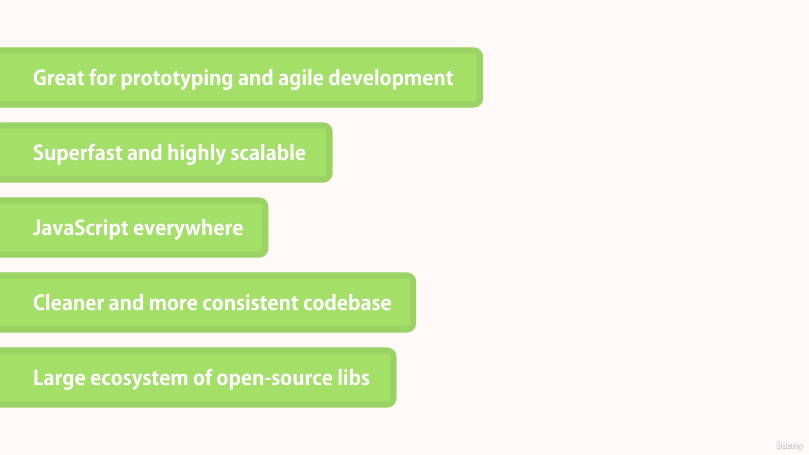
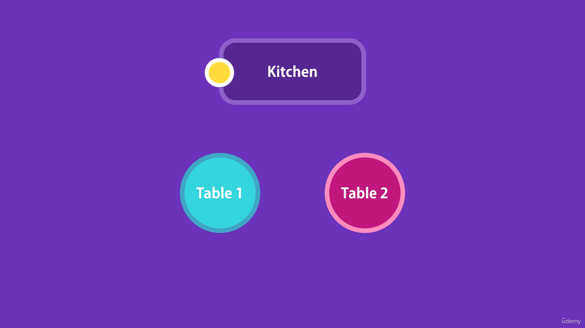

# NODE JS

### What is backend
We cant perform the buissness and major logic to the client side on the browser like front-end it can slowdown your application soo thats why we need backend to perform major tasks and our side and minimum and required only oprations should run on the client side soo the application will be faster.

A compiler which compiles the higher level language can convert the things into machine understandable code and perform the tasks.

Its serverside javascript runtime enviornment.


### What api does

When we request an api call it will take data from the database and file server and give it to mobile app and web applications.

### Server :-
When we write the code like in example if we built an software like calculator and someone wants to use it but he is not able to create from scratch soo he will ask you to provide files for the software but we cannot provide our files to everyone who resides in the another corner of the world soo the concept of **Sever** comes up.

### Deployement :-
On the server we can put our local code files of our software called as deployement and with the specific adress now everyone can use it by acessing that adress from their browsers.

A serve converts your local code to global which can be used by rest of the world by acessing it on specific adress.

### How dow we get files from server :-
When we acess the adress of server it will send us the HTML and CSS files and Javascript as well and this files will get executed on the client side and thorugh the javascript it will give the call server for the data and at the server side the code will get executed and it will return data in the form of response.

### API and Cloud Services
Api stands for application programminhg interface but backend can be only called by the front-end soo if another backend code wants interact with another backend code which is built in another language here API comes out.

API's are language independant and platform independat means transfering data in some format which can be understandable with every programming language soo api returns the data in the form of json.

soo with the another backend language as well we can consume the data just by calling its functions and giving the required inputs and will get the data in the form of json.


### Types of Api's :-

- **SOAP :-** Simple object acess protocol. 

It transfeer the data in small envolop which will be in the format in XML.


- **REST :-** Representational state transfer protocol.

    In REST api it will be designed for any resource which means create,retrive,update and delete.

    Any resource to be created in which we can create,retrive, update and delete can be performed.

    Methods : 
    - Get
    - Post
    - Put
    - Delete

**NPM (Node package Manager) :-**
    We can install packages and libraries with the help of npm.

- It will create node modules folder.
- It will create package.json and package.lock.json in which installed packages details and dependencies will be present there.

### What is NodeJs

NodeJs is javascript runtime environment to execute the javascript code outside of the browser.

### Why should we use NodeJs rather than otherb backend services

- Great Prototyping and agile developement.

- Superfast and highly scalable.

- javascript everywhere.

- Cleaner code base.

- Largest ecosystem of open-source libraries.



###  NodeJs Architecture

The founder of NodeJs Ryan Dahl created node by embeding chrome's v8 engine with c++ to execute the javascript out of the browser.

Its not an framework to be compared with ASP.NET or Ruby or Django, Its just an javascript runtime enviornment outside of the browser.

The runtime enviornment differs in browser and in the NodeJS. As like we have document, window object in the browser but in the node we dont have it.

Instead we have the modules like File System, Http or the modules to interact with computer systems.


### Uses of Node Js

1. Node Js is mostly used for api.

2. We can connect the same database with Web App, Mobile App.

3. Node Js is super-fast for API.

4. You can be a full stack developer, you can become full stack developer.

### Blocking Code

Blocking-code means while prpcessing the executin of the one thing another process can't be start untile the completion of previous process.

Ex : In hotel there are 2 table and one waiter, When waiter takes the order from first table and takes to chef it waits and do nothing until the completion of first table order and it dont look for further table for order. The work of waiter is blocked due to uncompletion of previous process and thats called as blocking behaviour.



The other frameworks are multi threaded by default like ASP.Net or Ruby on rails but they have blocking code behaviour by default.

In a thread is assigned to completion of one request and it waits until the completion of database query and for the next requests new threads are assigned.


In the terms of multiple requests at same time and if all the threads are busy and if we dont want the requests to wait we need to increase the hardware capabilities which is inefficient way for consuming the resources.


This is the problem with blocking and synchronous execution of code with the other frameworks asynchronous behaviour can be achieved by doing some more with it but we dont need to do anything with nodeJs as it have bydefualt non-blocking behaviour.

### Non-blocking Code

Non-blocking code means while completing execution of one thing it doesn't stops further processing and thats called non-blocking code.

Ex : In hotel there is 2 table and one waiter. If waiter takes order from one table and takes 2 chef and while chef preparing order it takes order from another tables so the work of waiter is not blocking and he is not waiting for completion of previous order to take further orders.


As NodeJs is single threaded application and the waiter in above example works as a thread in NodeJs which deals with multiple requests at a same time.

### How NodeJS Works

In nodeJs single thread handles the requests, It takes one requests and query the database while query executing and completing it handles the another requests. As soon as data is ready it will notify in event queue and node is always watching event queue at background and it takes and data and sends the response.


With the help of this feature we can use node for the application which uses lot of discs or network acess and huge data interaction realtime.

We can server more clients without the need of throwing more hardware due to which node applications are highly scaleable.

**Note :- We should not use node CPU intensive apps as video encoding or image manipulation service in which we have to do lot of calculations should be done with cpu and touch the file system or network, And as node is single threaded others clients needs to wait while calculatinons are being performed and thats not the ideal case for usign node.**

### Global Object
In the browser we have global object named as window by which we can access any properties, methods declared.

Where in node we have global object named as global itself, we can acess core modules, properties and method with itself.

But in the node due to modular system variables and methods have only scope in thier file itself.

### Modules

NodeJs have module based architecture.

Every file in node considered as module and its properties and methods wont be accessible outside of that file, In the terms of oops that properties and methods are private.

The below mentioned code will give us the information about the current mdoule in which we are in.

```
console.log(module)

Module {
  id: '.',
  path: '/home/lnv157/Desktop/code_files/17_Node JS/Node-JS-Practice',
  exports: {},
  parent: null,
  filename: '/home/lnv157/Desktop/code_files/17_Node JS/Node-JS-Practice/index.js',
  loaded: false,
  children: [],
  paths: [
    '/home/lnv157/Desktop/code_files/17_Node JS/Node-JS-Practice/node_modules',
    '/home/lnv157/Desktop/code_files/17_Node JS/node_modules',
    '/home/lnv157/Desktop/code_files/node_modules',
    '/home/lnv157/Desktop/node_modules',
    '/home/lnv157/node_modules',
    '/home/node_modules',
    '/node_modules'
  ]
}
```

### Creating Modules

Creating module is nothing different than creating methods and properties as per our requirement.

We can create loggerModule as like mentioned below.

```
let url = 'http://logger.io/'

function log(messgae:string){
    console.log(`Log => ${messgae}`)
}
```

**Exporting Module :-**

we can export the methods and properties from the file with the help of module object itself provided by core modules which we saw above.

We can set the properties and the methods in `module.exports` object as like mentioned below.


```
let url = 'http://logger.io/'

function log(messgae){
    console.log(`Log => ${messgae}`)
}

module.exports.url = url;
module.exports.log = log;
```

**Importing method or property directly rather than object :-**

If we have only single method or property to export from module then rahter than setting property or method in `module.exports` we can directly assign that method or property to `module.exports` and directly use in imported file as like mentioned below.

```
function log(message){
    console.log(message)
}
module.export = log;

// Imported file
const log = require('./logger')

log('messgae')
```

### Loading Modules

We use the `require()` method to importing the modules inside our currnet file.

`require(mdoulename, path+filename)` we need to pass the modulename inside the string in require method which returns the `module.exports` object from the module.

We can accidentally override the module methods or properties which can cause problems in our code so use `const` for importing the modules methods or properties.

```
// app.js
const loggerModule = require('./logger') ;

loggerModule.log('messgae') ;

```
**Importing method or property only from module :-**

If the module have multiple methods or properties but rather than importing whole module we can import just property or method by accesing the method or property in setting constants itself.

```
const log = require('logger').log;

log('message');
```
### Module Wrapper function

In NodeJs code get executed with module wrapper function internally which is a immedietly invoked function which looks as like mentioned below.

```
(function (exports, module, require,__filename, __dirname) {
    // code in file
})
```

Earlier we thought that `require()` ,`module()` are the core modules whereas they are global modules and methods but those are not global, they are local arguements passed to module wrapper function.

exports is object refrence to `module.exports` so we can export the properties and methods with `exports.property = property` or `exports.method = method` itself, But as its object refence we cant directly assign method or property to it as we used to do with `module.exports = method` or `module.exports = property`.

`__filename :-` This returns the filename along with path.

`__dirname :-` This returns the file containing directory only without filename.

### undefined in node js

As node uses chromes v8 engine soo as we get undefined on the chromes javascript compiler we also get the undefined in the node js as well.

`undefined :-` when any line or statement doesnt return something it will say the undefined as well

### Core Modules

Core modules are the modules are predefined modules where we dont need to write it from scratc. like ex : `fs,console,buffer,http,etc`.

- **Global Module :-** The modules we dont need to import and we can use them without importing is called as global modules.

- **Non-Global Module :-** The modules we need to import it before using it is called as non-global modules.

- **Directory and files :-**
    - `__dirname :-`  it will returns the directory path.
    - `__filename :-`  it will returns the files which are mentioned in the directory.

- **How to import module with specific function :-**

    Yes we can import the specific function from the module as like mentioned below.

    `let fsWrite = require('fs').writeFileSync` And we an use it.

### Difference between importing core and custom modules

While importing module node looks that module in core moduels and then it looks inside the project directory.

While importing the core module we dont need to give any path to those modules so it will search and import from core modules as like mentioned below.

`const fs = require('fs') :-` 


While importing the custom module we need to provide absolute path to that module.

`const loggerModule = require('./logger')`

If We give absolute path to core modules or if we dont provide absolute path while importing custom module we will get error due to the same.

### Path Module

We have path module which gives us more information about the paths about the filename and dirname.

**How to use :-**
 First we need to import path module like `const path = require('path');` then we can use internal functions like `path.methodName()`.

**Details about path with filename :-**

`path.parse(__filename) :-` This returns the details object for that file and path as like mentioned below.

    ```
    const parsed = path.parse(__filename)

    console.log(parsed)

    {
    root: '/',
    dir: '/home/lnv157/Desktop/code_files/17_Node JS/Node-JS-Practice',
    base: 'index.js',
    ext: '.js',
    name: 'index'
    }
    ```

    Path is nodejs's core module which is very usefull for the directory creating, returning paths for the required oprations.

**Get path of specific folder :-**

`__dirname` returns your current directory but if you want to create the files inside the folder then you need to get the path of that folder first and than only we can create the files in it.

For getting path we have `path.join(dir,foldername)` which returns the path to that folder and we can create file inside it as like mentioned below.

```
// Foldername is Data which is created manually

const path = require('path')
const dataPath = path.join(__dirname,'data/') // returns dir/folder/
```


### OS Module

Os module is the module usefull for grabbing clients systems information in nodejs.

It is usefull when we need to run different conditinos and functionalities based on the different os information and when we need to work on the things os related like showing systeminfo and all then we use os module.

For using the os module we need to install it by `npm i os` and we need to import with `const os = require('os')`.

**Some Usefull methods :-**

- **Architecture (32bit or 64bit) :-** `os.arch()`

- **Free Ram :-** `os.freemem()`

    Freemem returns the free memory in bits and we need to convert it acording to our requriement as like mentioned below.

    - **kb :-** `os.freemem()/(1024)`
    - **mb :-** `os.freemem()/(1024*1024)`
    - **gb :-** `os.freemem()/(1024*1024*1024)`

- **Total Ram :-** `os.totalmem()`
    totalmem returns the free memory in bits and we  need to convert it acording to our requriement as like mentioned below.

    - **kb :-** `os.totalmem()/(1024)`
    - **mb :-** `os.totalmem()/(1024*1024)`
    - **gb :-** `os.totalmem()/(1024*1024*1024)`
    
- **HostName :-** `os.hostname()`

- **Oprating System :-** `os.platform()`

That's how we can work with os stuff.

### File System

File system is the module in the node js which is usefull for creating, reading, writing, deleting files in the current directory.

File system Comes with Sync and Asynchronus methods from which we should use most probably Asynchronus methods for non-blocking behaviour of the single thread.

**How to use :-**

- import file system like `const fs = require('fs')` and we can use its internal functions for the oprations.

**Fs Oprations :-**

- **create File :-** 
    
    `fs.writeFileSync(name,content)` It will checks for the file availability and if not then it creates new file and it appends the content in it.

- **create with folder path :-** 
    
    `fs.writeFileSync(path+fileName,content)` this will create the file inside directory which is mentioned.

- **Read File :-**

    `fs.readFile(dir/file,'utf8',(err,res)=>{console.log(res)})` this will read the file in ut8 format.

- **Append Data in file :-**    

    `fs.appendFile(dir/file,data,(err)=>{if(!err){console.log("Data Appended")}})` this will append the file and this will only have one parameter in its callback which is err and we need to show the sucess massage on it.

- **Rename File :-**

    `fs.rename(dir/file,dir/newfilename,(err)=>{if(!err){console.log("File Renamed")}})` This also takes only one parameter in its callback which is err and we need to show the sucess massage on it.


- **Read Directory :-** 

    `fs.readdir(path,(err,res)=>{console.log(res)})` this will take path as first arguement and a callback as the sec parameter in which first param will be error and sec will be response.

    This will return an array of file names.

### Events and Event Emitters (For Visitors count)
When we listen our server on some port whenever we get api request different classes in the node emits different kind of events on which we perform some buissness logic and can respond to that events.

Best Use of the events can be understand throuh counter programme in which we can emit event in every api call and on the counter we can get the visitors count.

**How to use it :-**

- first import it like `const EventEmitter = require('events')`.

- Then we need to create instance of it like `const event = new EventEmitter()`.

**Event Methods :-**

- **Emit :-**

    Whenever we want to emit the perticular type of event we can use the `.emit('name',{data} | ...args)` form which name is the unique keyword to identified events and we can pass the pericular data as spreaded arguements.

    Its good practice to pass the data in the object format for the multiple arguements with its keys so it would be easy to identify the data.

- **On :-**
    We can detect the emitted events with on method `.on('name',(data | ...data)=>{})` from which name is the unique event name passed while emitting the name and we need to pass the callback in which we can perform our buissness logic along with the data passed in event which we are gettting as parameter here in callback.

- Ex : 
    ```
    // Imported which returns class
    const EventEmitter = require('events')

    // Actual Instance
    const event = new EventEmitter()    

    // Detector 
    event.on('count',(data)=>{
        console.log("Event Called...");
        console.log(data.prevCount);
        console.log(data.curCount);
    })

    // Emitting event in api call.
    app.get('',(req,resp)=>{
        resp.send("<h1>home</h1>")
        event.emit('count',{prevCount:prev,curCount:cur})

    })
    ```

### Creating Modules in Node

For the modularity in the application we need to create modules with the simplified methods like services and use that services rather than hardcoding with the modules by importing all of the files as like mentioned below.

**Ways to Create Modules :-**

- **Creating Functions and Exporting as Object :-**

    Create methods for your module and export by preparing an object and consume it by directly importing it.

    ```
    let counter=0;
    functoin one(){
        console.log('one')
    }

    function two(){
        console.log('two')
    }

    const SimpleModule = {
        counter,
        one,
        two,
    }

    module.exports = SimpleModule;
    ```

    ```
    // Consuming moudle
    const simpleModule = require('./simpleModule)

    simplemodule.one()
    ```
- **Creating Class with methods and properties and Exporting as Object :-**

    When we have dependencies of singular object instance everywhere and we need to implements some other class properties and methods into it then we used class based module as like mentioned below.

    ```
    const EventEmitter = require('events');

    class LoggerModule extends EventEmitter{        
        id=1;
        log(message){
            console.log(`Logger Service : ${message}`);
            this.emit('loggerEvent',{id:1})
            this.id++;      
        }    
    }

    module.exports = LoggerModule;
    ```

    ```
    // Consuming Class Based Module
    const Logger = require('./loggerModule');
    const loggerModule = new LoggerModule();

    loggerModule.log(`First Message`);
    ```

### HTTP Module & Basic Server and Output on browser

We can create server and do server related stuff with the help of http module.

Internally HTTP module used net server for acessing networking functionlities.

`HTTP Module` implements `EventEmitter` class so it have all the functionalities included in EventEmitter class like `.emit()`, `.on()` etc.

When any api is called it emits `connection` event which we can acess and run our buissness logic.

**How to Use :-**

- First we need to import the http and store it in variable like `const http = require('http')`

- Then we have `createServer(req,res).listen(port)` this function will create server which will be running on `localhost:4500/` and `createServer()` will take a call back function the first param will be `request` and second will be `response`.

- Then we can write on the server with the help of `response.write()` function.

- And at the end we need to tell the node js as well where to stop soo we have `response.end()` so it will end the process over there.


```
const http = require('http')

const server = http.createServer((req,resp)=>{
    if(req.url==='/'){
        resp.write("Hello World");
        resp.end()
    }

    if(req.url==='/api/courses'){
        const courses = [1,2,3,4,6]
        resp.write(courses);
        resp.end()
    }
});

server.listen(4800)

// This will create server on localhost:4800 port and will show what we written on it.
```

**Most Imp :-** When we make changes in our code will not show on the server we need to rerun the our nodejs server for it.

We will not use the HTTP server normally in the application because we need to handle each and every route in single callback which is not the optimal way so we will use `EXPRESS.JS` which is the framework built on http module itself in the optimal and clean way.


### NPM
NPM is node package manager which is the platform for reusable third-party libraries to install in our application.

As well as we can make our own libraries and publish it to NPM.

`npm cli` gets installed in your system while the time of installing node itself.

npm version and node version will not match in some cases because they are developed independenly.

**Installing Perticular Version of NPM :-**

- **windows :-**
    Open terminal in adminstrative acess and run `npm i -g npm@5.5.8`, with the help of administrative acess we will not receive any permission error.

- **linux or mac :-**
    Open terminal and run `sudo npm i -g npm@5.5.8`, with the help of sudo we will not receive permission error.

### Package Dependencies

When we install any package from npm if it dependant on some other packages then that also will be get installed `with the help of package.json of that library` and thats called as package dependencies.

Earlier npm used to create hirarchy of node_module inside of node_modules package nested deeply but in the latest update it stores its dependencies in our node_modules directory itself.

If we have same package dependencies with its different versions then current version will be installed inside the `node_modules/library/node_modules`.

### Package.json

Package.json holds all the packages information and project information and detials about your project and some commands as well about your project.

**Its most important file of project which should not be deleted never. Else the project will be destroyed.**

- **How to create package.json :-** We can create package.json with the command `npm init` soo it will ask you for project detials and it will create package.json.

If you not wishing to answer that all questions we can run `npm init --yes`.

- **How to create node modules and package.lock.json :-** Whenever we install any node package in our project package.lock.json and node modules folder will be created.

- `package.lock.json :-` package.lock.json file holds the detial information of packages which you installed in your project and if its deleted whenever we do npm install it will be created again.

- `node modules :-` It will hold the folders of the packages and npm will  automatically install its related and dependant packages as well which will be stored in the node modules folder itself.

- **How to ignore node modules while pushing to github :-** For skipping the node modules folder while pushing the project on github or bitbucket we need to create .gitignore file and in that we need to do `/node modules` soo it will ignore all the node modules folder.

### NPM Packages and Source Control

When we enter into real world applications `node_modules/` folder will have huge size with n number of packages but if we save it to cloud or git it will take huge space as well as time to install and upload it.

Fortunately with the help of `dependencies:[]` we can install that all packages and dependencies even after deleting them with the help of `npm i` in the project directory.

**Ignore node_modules/ :-**

We can ignore `node_modules/` directory for pushing to git with the help of `.gitignore` and writing node_modules/ in it.

### NPM Semantic Versioning

We have any packages or library versions naming convections as `1.12.3` which means `Major Updates.Minor Updates.Patches` have their meanings as follows ;

- **Patch Updates :-**

    If library contributers have found any bug in the library they fix without breaking the existing api and update the Patch version.

- **Minor Updates :-**

    If library contributers have add any new features in the library they fix without breaking the existing api and update the Minor version and releases new version like `1.13.0`, 0 for patch version because they haven't found any bugs or they didn't patched any fixes yet.

- **Major Updates :-**

    If library contributers have add any new features in the library they but which might breaks the existing api then they update the Major version and releases new versions like `2.0.0`.

We can control the dependencies packages updation behaviour in our `package.json` as following.

- `^1.12.1 :-` 
    
    `^` Caret defines installation of any Minor and Patch version updates as long as major version is same, It can be written as `1.x` well.

- `~1.12.1 :-` 

    `~` Taidle defines installation of all Patch versions untill and unless Minor version is same. It can be written as `1.12.x`

- `1.12.1 :-`

    No charecter means dont update package version ever and install the same version all the time.

### Listing Installed package with their versions

Sometimes there can be case where we had mentioned different version in our `package.json` and installed version is different so to crosscheck that we can do that by going package.json of that library but that could be tidious.

We can do the same thing with following commands.

- `npm list :-` It lists all the installed packages with their dependencies to and their verisons in details.

- `npm list --depth=0 :-` It lists only installed package in our project without their dependencies and their versoins.
 
### Viewing Registry of Package 

We can view the registeries and all the metadata of any package on npm website by navigating to that package but we can do the same in our terminal as well with the following commands.

- `npm view mongoose | packagename :-` It will view package.json of mongoose packge.

- `npm view mongoose dependencies | property :-` It will view depencies only from the package.json of mongoose.

- `npm view mongoose versions :- ` It will view all released versions of mongoose.

### Installing specific version of packages

We can install specific versions of packages with the help of `npm i package@version` like `npm i mongoose@1.2.0` which will install that version package and updates its version in `package.json`.

### Updating Local Packages

For Updating Local Packages we need to check first for the outdated packages which we can do with `npm oudated`.


**Package Statuses :-**`

- **Current :-** Current Installed Package.

- **Wanted :-** Wanted package is the package latest available for as mentioned in package.json along with semantic versioning.

- **Latest :-** Latest package available for the library.

**Updating Packages to wanted packages :-**

We can update the packages to the wanted packages as per the semantics in package.json with the help of `npm update`.

**Updating Packages to Latest available packages :-**

Sometimes We will need to update the package to latest available version but which can break your code to so you need to checkout its compatibility and then we do with the help of `npm-check-udpate`.

First install `npm i -g npm-check-update` and then run `npm-check-update | ncu -u` for updating the `package.json` to latest available versions.

Then install the latest packages with `npm i`.

### Dev Dependencies

There Can be some development dependencies like Eslint & jshint and etc which have no use in the production environment and that should not be pushed to production so `package.json` seprates it than prod dependencies.

We can add any package in dev dependencies with the help of `npm i jshint --save-dev`

```
// package.json
 "devDependencies": {
    "@types/node": "^18.7.6"
  }
```

### Uninstalling package

Sometimes we no more need some package so we can uninstall the packages as well with the help of `npm (un | uninstall) (mongoose | packageName)` which will remove that package from `package.json` as well as `node_modules/`.

### Global packages

We have some global packages like `npm` & `ng` which is angular cli which we dont need to install in perticular folder or project we install them globally to acess it anywhere in the system.

We instll packages globally with the help of `npm i -g @angular/cli` with `-g` flag.

And `sudo npm i -g @angular/cli` for linux.

**Outdated npm global packages :-**
We can check global outdates packages with `npm -g outdated` and we can update them with the help of `npm update`.

**Uninstalling npm global package :-**

We can uninstall global package with `npm un -g packageName`.

### Publish Node package to NPM

We can create the package by initialising the `package.json` in the directory and by creating `index.js` as its an entry point to our package.

First you need to make sure that your package name is unique so you will not get update permissions error.

Then we can login to npm wit the help of `npm login`.

After logging in we can publish the package with the help of `npm publish`.


You can install your published package with `npm i packageName` and consume it with `const package = require('packageName')`.

**Note :- Package Name should be unique else you will not be able to publish it. For registration on npm you can use `npm adduser` or you can registre on their official website.**
### Update Published Package

We can make the changes as per the requirements in the package and we cant publish it directly as like before with `npm publish` due to the same version number.

First identify the update type of your fix and you can update the version manually in `package.json` or you can run `npm version (major | minor | patch)` and then you can publish the package with the help of `npm publish`.

### NodeMon
Nodemon is the node package which will used for time saving purpose and which will work as live reload, we dont need to rerun the files again and again it will do it automatically.

 - **Installation :-** `npm i nodemon`

 - **Use :-** Before we used to use the `node filename` soo rather than it we can use now `nodemon filename` soo it will run the server with the nodemon with live reload.

### Input From Command line

We can grab input from the command line with the help of `process` object with the help of `process.argv` which returns an array of `node.exe path` and `current dir path` and the things we put further of run command that things will be appended in this array.

```
let input = process.argv
console.log(inupt) // returns an array with node path, and current file path and further the inputs.
```
### Rest API & RestFull services
A REST API is an application programming interface that adheres to the constraints of REST architectural style and enables interaction with RESTful web services.

A web service is a set of open protocols and standards used for exchanging data between client-server applications. Web services that follow the REST architecture are known as RESTful web services.

**REST :-**

REST stands for REpresentational State Transfer. Rest is an architectural style for creating websites using the HTTP protocol. There are certain architectural constraints that developers should follow when building websites or APIs.

Suppose we have a web client and a web server(API). The client requests a resource and the server fetches the response from its database. Resource refers to something that belongs exclusively to the server. When a client requests a resource via the restful API, the server sends a Representation of that resource. So, Representation is what the server sends as a response.

Representational State transfer means the transfer of the state of the Representation of the resource. These representations are transferred via HTTP through various formats, including  JSON (Javascript Object Notation), HTML,XML or plain text. 

**Api URL :-**

We have 3 parts in the api url as like mentioned below.

`http://videly.com/api/customers`

-`http | https :-` http or https are the protocols to interact with http webs services.

- `videly.com :-` Domain name for the server which is variable as per the company to company.

- `/api :-` Naming convention to differentiating the api's than web urls.

- `/customers :-` This further path refers to an resource like customers, movies, etc for their entities.

**Types of HTTP Requests :-**

We use all http modules internal methods for the api's which determines its intensions as like mentioned below.

- `GET :-` 
    
    To Getting the data from the server like get users, get courses etc.

    GET Ex : 
    ```
    api/customers

    // Resp
    [
        {id:1,name:'customer 1'},
        {id:2,name:'customer 3'}
    ]
    ```
    
- `POST :-` 
    
    To post the data to the server or create the entity or save the data.

    POST EX : To add the user in users entity on the server.
    ```
    api/customers

    // Body
    {
        name:'customer',
        age:18,
        email:'customer@example.com
    }

    // Response
    {
        id:1,
        name:'customer',
        age:18,
        email:'customer@example.com
    }
    ```
- `PUT :-` 

    To Update the existing data for an entity on the server.

    PUT Ex : To update the existing user with new data on the server with its unique id.
    
    ```
    api/customers/1

    // body
    {
        name:'customer 1 Updated`,
        age:20,
        email:customer@example.com
    }


    // Response
    {
        id:1,
        name:'customer 1 Updated`,
        age:20,
        email:customer@example.com
    }
    ```

- `DELETE :-` To delete the existing data for an entity on the servers.

    DELETE EX : To delete the user on the server.
    
    ```
    api/customer/1

    // Response
    {
        id:1,
        name:'customer 1 Updated`,
        age:20,
        email:customer@example.com,
        deleted:true
    }
    ```
### Express Js

Express is the node js framework which helps us to create api's in less time and to save our time rather than writing api's in scratch node js.

Genrally Express simplifies our work.

You can install express with the commans `npm i express`.

**How to use Express :-**

- Import express `const express = require('express')`

- Create instance of `express()` `const app = express()`

**Fundamentals of express :-**

- **starting server :-**    

    As previously we used to start the server with the help of `http` module with `createServer()` method we can do the same here with `app.listen(port)`.

- **Creating Calls with routes :-**    

    We can create requests as like mentioned below.

    - **Strucure of calls and routes :-**

        ```
        
        app.get(route,callback(req,res)=>{
            res.send(data)
        })
        ```

    - **Created Server and Some basic api calls :-**
        ```
        const express = require('express')
        const app = express()

        app.get('/home',(req,res)=>{
            res.send("home")
        })

        app.get('/contact',(req,res)=>{
            res.send("contact")
        })

        app.listen(4800)
        ```
- **Render HTML on browser :-**

    Through the node Js we can render html as well on the browser by sending html as a string in the resonse.

    ```
    // This will be rendered as h1 tag of html  

    app.get('/home',(req,res)=>{
    res.send("<h1>home</h1>")
    })
    ```
We can group all files related to some entity like `/users` in same file named as `users.js` and thats how we can bring modularity in the application.

### Status Codes With Meanings

We send HTTP status codes along with response so user can identiy what happened with the request exactly and whats the status of request.

**Status Codes :-**
1. **404 (Object Not found) :-**

    We returns this sttatus code normally when we dont find the data for the desired request.

    Ex : User requested course with id 10 but we have only 3 courses so we send status code 400 with desired error message.

2. 

    
### Get Request
When user demands for some data it request get method. In the below example we are writing api's for possible get request with dummy data of courses as like mentioned below.

When we develope get request we need to develope it for all courses as well as get single course and thats how we need to think about all possible scenarios like filter, sort etc.

While creating get api first we need to check the worst case scenarios and error handelling of it. If everything seems fine then only go for the response as like mentioned below.


```
// Get api for all courses
app.get('/api/courses',(req,res)=>{
    res.status(200).send(courses)
})

// Get api for single course with id
app.get('/api/courses/:id?',(req,res)=>{
    const course = courses.find(c => c.id === parseInt(req.params.id));
    if(!course) return res.status(404).send('Course with given id not found')
    res.status(200).send(course)
    
})
```
### Input Validations
We need to validate user's input most importantly for post and put request for which we need to write the manual validations as like mention below.

```
app.post('/api/courses',(req,res)=>{
    const course = {
        id:courses.length+1,
        name:req.body.name
    }
    courses.push(course);
    res.status(200).send(course);
})
```
Above before creating course we are checking for name required and its length should be greater than 3.

### Input Validaitons with JOI

When we have complex objects for which we need to apply the validaitions for multiple properties its tidious job to write each and every validations so we have npm package called `joi` which is widely used for input validations which validates the data by his own and creates even the error messages for the same.

**Installation :-**

We can install joi with `npm i joi`

**How to use :-**

- First we need to improt joi from joi like `const Joi = require('joi');` which returns Joy class so declared the name with `Pascal Case`.

- Then we need to create the interface or schema for the body object with joi's validations as like mentioned below.
    ```
    const courseType = {
        name:Joi.string().min(3).required()
    }
    ```

- Then we need to validate the input data with joi's validations with `Joi.validate(data,schema | interface)` which returns joi result object as like mentioned below.

    ```
    const result = Joi.validate(req.body, courseType);

    console.log(result);

    // Execution of result
    {
        error: null,
        value: { name: 'Four' },
        then: [Function: then],
        catch: [Function: catch]
    }
    ```
- You can send the status code of error and error message with joi's error message as like mentioned below.

    ```
    // Validation
    const courseType = {
        name:Joi.string().min(3).required()
    }
    const {error} = Joi.validate(req.body, courseType);

    // Validations with Joi
    if(error)  return res.status(400).send(error.details[0].message);
    ```

### Post Request
When user wants to save some data in database then request post method. In the below example we are writing api's possible post request with dummy data of courses and validations as well as like mentioned below.

When we develope post api we need to think about all possible scenarios for validations, required parameters etc.

While creating post api first we need to check the worst case scenarios and error handelling of it. If everything seems fine then only go for the response as like mentioned below.

```
app.post('/api/courses',(req,res)=>{

    // Validation
    const {error } = validateCourse(req.body)
    if(error)  return res.status(400).send(error.details[0].message);

    const course = {
        id:courses.length+1,
        name:req.body.name
    }
    courses.push(course);
    res.status(200).send(course);
})

function validateCourse(course) {
    const courseType = {
        name:Joi.string().min(3).required()
    }
    return Joi.validate(course, courseType);
    
}
```
In the above code we created validateCourse reusable method which we can use for the further use as well.

### PUT Request
When user wants to update the existing record in the database user requests with the help of put method.

When we develope put api we need to think about all possible scenarios for validations, required parameters, if entity exists or not etc.

```
app.put('/api/courses/:id',(req,res)=>{
    // Checking If course exists
    const course = courses.find(c=>c.id===parseInt(req.params.id))
    if(!course) return res.status(404).send("Course with provided id not found.")

    // Checking Is valid
    const {error} = validationsModule.validateCourse(req.body);
    if(error) return res.status(400).send(error.details[0].message);

    // Updating Course and sending response
    course.name = req.body.name;
    res.status(200).send(course);
})

function validateCourse(course) {
    const courseType = {
        name:Joi.string().min(3).required()
    }
    return Joi.validate(course, courseType);
    
}
```

### Delete Request
When user wants to delete the existing course then user requests with the help of delete method.

While delete we need to think the worst scenarios first like if the record with provided id still exits else send 404 etc.

```
app.delete('/api/courses/:id',(req,res)=>{
    // Checking if course exists
    const course = courses.find(c=>c.id===parseInt(req.params.id));
    if(!course) return res.status(404).send("Course with provided id not found.");

    // Deleting Course
    const courseIndex = courses.indexOf(course);
    courses.splice(courseIndex,1);

    // Sending Response
    res.status(200).send(course);
})
```

### Environment Variables

Whenever we listen the express server on the port there could be chances of unavailability of that port so we can set and dynamic enviornment variable which can be set from anywhere from the system.

- **Setting env variable :-**

    We can set the enviornment variable with `export variable=value` like `export NODEPORT=4800` in linux or mac and `set variable=value` in windows.

- **Consuming env variable in node app :-**

    We can consume env variable with the help of global object `process` like `process.env` means for enviornement and we can acess the variables of it with `process.env.variable` like `process.env.NODEPORT` and we can set else value as like mentioned below.

    ```
    const port = process.env.NODEPORT || 4800
    express.listen(port,(req,res)=>{
        console.log(`Listening on ${port}...`)
    })
    ```

### Route Parameters

We need to get some parameters to fetch some data or find something in the data with the help of `req` object which is first arguement in callback passed in method as like `app.get(route,(req,res)=>{})`.

**Types of params :-**

- **Params (Essential) :-**
    Params are the passed values after `/value` in the request route in the specified manner as like mentioned below.

    ```
    app.get('/api/courses/:id',(req,res)=>{
        res.send(req.params.id);  
    })

    app.listen(4800)

    // Req
    http://localhost:4800/courses/1
    ```

    If we set parameter to the route then route will not be accesible without parameter its strictly required.

    If we have multiple parameters we can acess the object along with its keys mentioned above in the route with `req.params`

    We can keep the parameters optional by `route/:param?` by adding questionmark `?` for denoting it as optional parameter.

- **Query Paramters (Optional) :-**

    Query params are the optional parameters which user can send as the additional information like filterby name with `api/courses/1?filterBy=id` or sortby id with `api/courses/1?sortBy=id` as like mentioned below.

    ```
    app.get('/api/courses/:id',(req,res)=>{
        res.send(req.query.sortBy);  
    })

    app.listen(4800)

    // Req
    http://localhost:4800/courses/1?sortBy=name

    ```
    Without even query parameters api for that route will work totally fine.

    We can acess the object of query params through `req.query` with its keys and values.


### 404 routing in expressJs

404 page is the page which appears on the hitting of invalid url and that can be done by mentioning `app.get('*',(req,res)=>{})`.

This will Route to the page or the response which we have sent on the 404 page.

```
const express = require('express')
const app = express()

 app.get('*',(req,res)=>{
        res.send('Invalid URL')
    })
```

### Middleware in expressJs (Global - For all Routes)
Middle wares are the functions which either terminates the request lifecycle by returning response or passing `req,resp` object to another middle ware function.

Middle ware is the intermediator of browser and the server which process the things as per the requirement before fullfilling the response like checking age, uesr login and all.


In the above pipe line `app.use(express.json())` `express.json()` returns middleware function which returns goes in next route middleware and it terminates the request lifecycle by providing response.

**Custom Middleware function :-**

Custom Middle ware is the function with the 3 params, `(req,res,next)` in which `req, and res` are request and response as usual and `next()` proceeds the request.

```
  const ageFilter = (req,res,next)=>{
        if(req.query.age==undefined){
            res.send("Please provide your age.")
        }
        else if(req.query.age<18){
            res.send('You Cannot acess this url, as your age is not 18+.')
        }
        else{
            next()
        }
    }
    app.use(ageFilter)
```

**Note :- We need to create seprate directory for the middlewares which we should use by importing in index.js with the help of `app.use(middlewareFunc)`**


### Built in middlewares

We have some built in middlewares in nodejs which provides certain functionlities as per the requirements.

**Built-in Middlewares :-**
- `express.json() :-`

    If any body would be included with the request it will create req.body object with the containing data.

- `express.urlEncoded({extends:true}) :-`

    With the help of urlEncoded we can pass key value pairs rather than body with the request rather than data in json format.

### Third Party Middlewares
As express provides `express.json()` or `express.urlEncoded()` there are some middlewares provided by express for different different purposes like logging, adding http headers in the request for the security etc.

**Third Party Middlewares :-**

- `helmet :-` 

    Helmet can help protect your app from some well-known web vulnerabilities by setting HTTP headers appropriately.

    You can install helmet with `npm i helmet` and use as like mentioned below.

    ```
    const helmet = require('helmet');

    app.use(helmet())
    ```

    In the above code helmet returns the function which we can use in `app.use(func)`.

- `morgan :-`

    Morgan is usefull to log the HTTP requests in details whenever the request is fired to the server with its types of formats.

    You can install `morgan` with the help of `npm i morgan` and use as like mentioned below.

    ```
    const morgan = require('morgan');

    app.use(morgan('combined))
    ```

### Enviornment Profiling
As we saw above we have global object `process.env` which returns the environment variables object from which we can acess the environment variables.

Sometimes we need to add some functionality with the help of middlewares like for only pericular enviorment `like logging, consoling only for development environments` so we can achieve that with the help of `process.env.NODE_ENV` which returns `developement` by default and if we set the variable we will receive that enviornment.


```
const morgan = require('morgan');

if(app.get('env')==='development'){
    app.use(morgan('tiny'))
}
```
In the above code we are applying logging only for the developement enviornment.

### Config's


### Acess Server Folder Files through browser

We can directly acess the server files which for the acessible directory we provided.

We can do that with the help of `app.use(express.static(dir))` and by this we can enter the filename in the url to hit and the file will be rendered on the browser.

```
const express = require('express')
const app = express()
const path = require('path')

let dataDir = path.join(__dirname,'data/')

app.get('',(req,res)=>{
    res.send("<h1>home</h1>")
})

app.use(express.static(dataDir))

app.listen(4800)

```

### Send File without extension with express

Above as we mentioned with the help of `express.static(dirname)` we needed to use the filenames with extensions soo, as its not a good practice we can hendle the thing with the help of `app.sendFile(path/filename)` as like mentioned below.

```
const express = require('express')
const app = express()

let dataDir = path.join(__dirname,'data/')

app.get('/data',(req,res)=>{
    res.sendFile(`${dataDir}/data.js`)
})
// app.use(express.static(dataDir))

app.listen(4800)
```


### Route Level Middleware

Route level middleware is where we apply middlewares for the perticular routes only and it will not be applied as global middleware.

For creating the route level middleware we need to pass the middlewear in the routes as an arguement after route defination and before callback.


```
const ageFilter = (req,res,next)=>{
    if(req.query.age==undefined){
        res.send("Please provide your age.")
    }
    else if(req.query.age<18){
        res.send('You Cannot acess this url, as your age is not 18+.')
    }
    else{
        next()
    }
}
 app.get('/data',filter,(req,res)=>{
        res.sendFile(`${dataDir}/data.js`)
      
    })

```
We can create the middlewares in the another directory as well, we need to import `const filter = require('./Middlewares/Filters')` and export the middlewear from the file with the help of `module.exports = ageFilter`.

### Middleware for group of routes.

We can't apply the middlewear for the every route soo we need to group the route and we need to apply the middlewear for the route group.

**How to create group routes :-**

- create the router with `const router = express.Router()` which can be used for grouping of routes.

- create the routes with the help of `router.get(path,callback)` rahter than `app.get(path,callback)`.

- use the middleware for the custom router like `router.use(middleware)` it will apply the middleware to the defined routes with it.

- use the router for the app soo it can recognize the routes made with router. `app.use('/',router)`. 

The above step will apply the middleware for the group routes only which are created by the router itself.


### MongoDb

MongoDb is the NOSQL database in which the data is stored in the format of objects and not in rows and columns.

There are no tables in the mongoDb rather than it have collections which are act as the tables in the mongoDb.

**Basic Commands for ubuntu :-**

- **To start the server :-** `sudo service mongod start`

- **To Stop the server :-** `sudo service mongod stop`

- **To restart the server :-** `sudo service monogod restart`

- **To check the status :-** `sudo service mongod status`


### MongoDb compass

MongoDb compass is the gui tool for the mongoDb as like php myadmin form which we can manipulate the databases, collections and all.

**MongoDb Command Line (Basic Commands) :-**

- `show dbs :-` It will list down the all the databases.

- `use database_name :-` It will use the database.

- `db.createCollection('name') :-` It will create collection with name.

- `db.collection_name.drop() :-` It will drop collection.

- `db.dropDatabase() :-` It will drop database.


### CRUD in MongoDb CLI

**CRUD through commandline :-**

- `db.collection_name.insertOne(obj) :-` 
    
    It will insert data in the form of object in collection.

- `db.collection_name.find() :-` 
    
    It will list down the data in the collection.

- `db.collection_name.updateOne({name:'mohan'},{$set:{brand:'Oppo'}}) :-`

    This will update the entry where name will be mohan and updates the brand or inserts a key value if key does not exists.

- `db.collection_name.deleteOne({name:'shiv'}) :-`  

    This will delete the entry where name will be shiv.

### CRUD in NodeJs with MongoDb

For connecting the mongoDb with nodeJs we need to install `npm i mongodb` which is official driver of the mongoDbl.

**Steps to connection and getting data :-**

- First import `mongoClient` like `const {MongoClient} = require('mongodb')`.

- Create config variables as like mentioned below.

    ```
    const {MongoClient} = require('mongodb');
    const url = 'mongodb://localhost:27017';
    const db_name = 'Users'
    const collection = 'Users_data'

    const client = new MongoClient(url)
    ```

- Create Function for the connection in which tell the mongo client about the dbname and collection as like mentioned below and use the mongo Methods on the `col_obj` as like mentioned below.

    ```
    // Config
    const {MongoClient} = require('mongodb');
    const url = 'mongodb://localhost:27017';
    const db_name = 'Users'
    const collection = 'Users_data'
    const client = new MongoClient(url)

    // Connection and get Data Function
    async function connect() {
        let connection = await client.connect()
        // console.log("Connection =>",connection)

        let db = connection.db(db_name)
        let col_obj = db.collection(collection)
        let data = await col_obj.find().toArray();
        console.log("Data =>",data)
    }
    
    // It will return the array of objects in which data will be stored.
    connect() 
    ```

In the above process, when we want to get the data from mongo we need to convert the resolve promise into array. like `let data = await col_obj.find().toArray();`.


### DB Config File and Calling function in another files

- First create seprate file for database configuration and return the `collection` like mentioned below and weather if it will be function but pass it as variable at the `module.exports = connect`.

    ```
        const {MongoClient} = require('mongodb');
        const url = 'mongodb://localhost:27017';
        const db_name = 'Users'
        const collection = 'Users_data'

        const client = new MongoClient(url)
        // let col_obj;

        async function connect() {
            let connection = await client.connect()
            // console.log("Connection =>",connection)

            let db = connection.db(db_name)
            let col_obj = db.collection(collection)
            return col_obj
        }

        module.exports = connect
    ```
- Import `dbConnection` in the another file like `const connection = require('./db/mongoConfig')`.

- Create the Get Data Function in which call the connection first and use the `await` bcoz it's async function return and which returns the promise.
`let dbObj =  await connection()`.


- And Now we can use the all the collection methods on the dbOnj variable liek get and all as like mentioned below.

    ```
    const connection = require('./db/mongoConfig')

    async function getData() {
        let dbObj =  await connection()
        let data = await dbObj.find().toArray();
        console.log("Data =>",data)
    }
    getData()

    ```


### Insert Opration in mongo In nodeJs

Nothing special for the insert opration, same we need to import the connection and we need call it asynchronusly and we need to call the `.insert({name:'shiv'})` for the single insertion and `.insert([{name:'shiv'},{name:'Sai'}])` for the batch insertion.


```
    // For single insertion
    async function insert(){
        let dbObj =  await connection()

        let inesrted = await dbObj.insertOne({name:'shiv2'})
        console.log("Inserted result =>",inesrted)
    }

    insert()

    // For batch insertion
    async function batch_insert(){
        let dbObj =  await connection()

        let inesrted = aw dbObj.insertOne([{name:'shiv2'},{name:'sai2'}])
        console.log("Inserted result =>",inesrted)
    }

    batch_insert()
```

### Update Opration in mongoDb in nodeJs

For the update opration in mongodb through nodejs is done with the help of `dbObj.updateOne({property:'value'},{$set:{proprty:value}})` which checks for the existing proerty and updates the value and if property is no exists will update the property with the provided value.

```
// Update
async function update(){
    let dbObj = await connection()
    let update = await   dbObj.updateOne({name:'shiv1'},{$set:{name:'First Shiv'}})
    console.log("Update Result =>",update)
}
update()
```

### Delete Opration in mongoDb in nodeJs

Delete opration in mongodb through nodejs is done with `dbObj.deleteOne({name:'shiv5'})`.

```
// Delete 
async function deleteSingle(){
    let dbObj = await connection()
    let deleteSingle = await dbObj.deleteOne({name:'shiv5'})
    console.log("Deleted Response =>",deleteSingle)
}
deleteSingle()
```

### Get Api with mongoDb

We need to make connection in the get function and we need to get the data with the method `find().toArray()` and we need to send the data as response like `res.send(data)` as like mentioned below.

```
    app.get('/data',async (req,res)=>{
        let dbObj = await connection()
        let data = await dbObj.find().toArray()
        console.log("Data Fetched =>",data)
        res.send(data)
    })
```

### Post Api with mongoDb

For posting the data most importantly we need to acess the `request.body` and for that we need to use `app.use(express.json())` with the help of this we can acess the body of the request.

And we need to pass the body data to the `insert` function like `dbObj.insert(reqData)` and further as like mentioned below.

```
// Acessing request body
    app.use(express.json());

// Post
    app.post('/user',async (req,resp)=>{
        let dbObj = connection()
        let reqData = req.body
        console.log("Data Recieved in Post=>",reqData)
        let insert = (await dbObj).insertOne(reqData)
        resp.send(reqData)

    })
```

### Put api with mongoDb

For Update api with mongoDb most importantly we need to grab the property and its value from the request.

syntax : `dbObj.updateOne(conditionalObj,{$set:valueObj})`

**Conditional :-** 
    
`app.put('/user/:name',callback)`  name will be property of params obj.

`/user/Abhishek` Abhishek will be the value of the name property like `{name:'Abhishek'}`.

**How to acess conditional obj :-**

- `let propertyToUpdate = req.params` This will return an obj `{name:"Abhishek"}` which we can put as the conditional obj in the update Query.


- `let dataToUpdate = req.body` This will return the body object as we passed to the body as same as post.

**Update Query dynamic :-**

```
let update = await dbObj.updateOne(propertyToUpdate,{$set:{...dataToUpdate}})
```

Whole update function is like mentioned below.

```
//To acess the request body
    app.use(express.json());

// Whole update function
    app.put('/user/:name',async (req,resp)=>{
        let dbObj = await connection()

        let propertyToUpdate = req.params

        let dataToUpdate = req.body

        console.log("Query Params =>",propertyToUpdate)

        console.log("Data to update =>",dataToUpdate)

        let update = await dbObj.updateOne(propertyToUpdate,{$set:{...dataToUpdate}})

        console.log("Data Updated Resopnse =>",update)

        resp.send(dataToUpdate)
    })
```

### Delete Api with mongoDb

In Delete api if we want to delete the data based on the id, 

**In mongoDb id is not only string, its mongodb.ObjectId and we need to convert our id in to the same with `new mongo.ObjectId(req.params.id)`.**

We can delete the object with the query ` let deleting = await dbObj.deleteOne({_id:new mongo.ObjectId(req.params.id)}).`

All the code is mentioned below for the delete.

```
// Delete
   app.delete('/user/:id',async (req,resp)=>{
        
        console.log("Params =>",req.params.id)
        let condition = {
            _id:new mongo.ObjectId(req.params.id)
        }
        resp.send(condition)

        // deleting
        let dbObj = await connection()
        let deleting = await dbObj.deleteOne(condition)
        
        console.log("Condition For delete =>",condition)
        console.log("Deleted")
    })
```

### Mongoose and db Connection in mongoose

Mongoose is also a npm package to connect nodejs with mongodb with some advance features like validations, models, interfaces and all.

**How to connect with db with mongoose :-**

- import mongoose `const mongoose = require('mongoose')`

- then connect with the db with `mongoose.connect(url)`.

### Mongoose Model and Schema

Mongoose have advance functionalities like model and schema which helps us to create interfaces and restrict the data in the format.

- **Schema :-**

    We create schema in the mongoose with the help of `mongoose.schema(schemaObj,collectionObj)` as like mentioned below.

    ```
    const userSchema = new mongoose.Schema({
    name:String
    },
    {
        collection:'Users_data'
    })
    ```

- **Model :-**

    We create a model which can be used for the further all oprations with the help of collection name and schema as like mentioned below.

    ```
    let userModel = mongoose.model('Users_data',userSchema)

    // For creating new user
    let user = new userModel({name:'Mongoose',age:18})
    let result = await user.save()
    console.log("Result =>",result)
    ```

### Crud with mongoose

In the mongoose earlier as we used to get the dbObj instance of `connection()` here we need to create model in every function get, put, post, delete.

First we need prepare userSchema and make connection as like mentioned below.

```
const mongoose = require('mongoose')

//Schema
const userSchema = new mongoose.Schema({
    name:String
},{
    collection:'Users_data'
})

// Connection
const url = 'mongodb://localhost:27017/Users';
mongoose.connect(url)

// Model
const User = mongoose.model('Users_data',userSchema)
```

- **get :-**

    For fetching all the data from the db as normal we need to call the `Model.find()` method asynchronusly with await as like mentioned below.
    
    ```
    // Get
    async function getAllData(){
    let User = mongoose.model('Users_data',userSchema)

    let data = await User.find()
    console.log("All Data Fetched =>",data.length)
    }

    getAllData()
    ```
- **insert :-**

    For inserting the data into db we need to pass the data to `new Model(data)` as like mentioned below.

    ```
    // Insert

    async function insert(){
    let user = new User({name:'Mongoose',age:18})
    let result = await user.save()
    console.log("Result =>",result)
    }
    insert()
    ```

- **update :-**

    For updating the record we need to use the 
    `Model.updateOne(conditionalObj,{$set:valueObj})` same as before.

    ```
    async function update(){
    let update = await User.updateOne({name:'Mongoose'},{$set:{name:'Mongo DB'}})
    console.log("User updated =>",update)
    }

    update()
    ```

- **delete :-**

    For deleting the record we need to use the `Model.deleteOne(conditionalObj)` same as before, as like mentioned below.

    ```
    async function deleteOne(){
    let deleting = await User.deleteOne({name:'Mongo DB'})

    console.log("Deleting Mongo DB =>",deleting)
    }

    deleteOne()
    ```
### Crud Api's mongoose

First we need to connect with the mongoDb with mongoose with `mongoose.connect(url)` and we need to create schema and model as like mentioned below.
```
const userSchema = new mongoose.Schema({
    name:String
},{
    collection:'Users_data'
})
const url = 'mongodb://localhost:27017/Users';
mongoose.connect(url)

var User = mongoose.model('Users_data',userSchema)
```

After connection we need to create the api's with the help of `app = express()` and with its calls.

- **Get :-**

    For the get api we need call the get method with the route and we need to use find method only on the model like `let data = await User.find()` as like mentinoed below.

    ```
    app.get('/users',async (req,resp)=>{
    let data = await User.find()
    console.log("Data Fetched =>",data)
    resp.send(data)
    })
    ```

- **Post :-**

    For the post api we need to call the post method with the route and we need to creae new Model like `let data = new UserModel(req.body)` and we need to save like `let save = await data.save()` as like mentioned below.


    ```
    app.post('/user',async (req,resp)=>{
        let reqData = req.body
        // console.log("Data Recieved in Post=>",reqData)
        let insert = new User(reqData)
        let save = await insert.save()
        resp.send(reqData)
    })

    ```

- **Put :-**

    For the put api we need to put method with the route and we need to grab the data from the req like `let dataToUpdate = req.body`  and we need to grab the property and its value `let propertyToUpdate = req.params` and finally for the update opration use the `Model.updateOne()` method like `let update = await User.updateOne(propertyToUpdate,{$set:{...dataToUpdate}})` as like mentioned below.

    ```
    app.put('/user/:name',async (req,resp)=>{
        let propertyToUpdate = req.params
        let dataToUpdate = req.body

        console.log("Query Params =>",propertyToUpdate)
        console.log("Data to update =>",dataToUpdate)

        let update = await User.updateOne(propertyToUpdate,{$set:{...dataToUpdate}})

        console.log("Data Updated Resopnse =>",update)
        resp.send(dataToUpdate)
    })
    ```

- **Delete :-**

    For the delete method we need to grab the id or unique key from the params and create the condition with it like `let condition = {_id:req.params.id}` and we need to call the `Model.deleteOne` method as like mentioned below.

    ```
    app.delete('/user/:id',async (req,resp)=>{

    console.log("Params =>",req.params.id)
    let condition = {
        _id:req.params.id
    }
    // resp.send(condition)

    // deleting
    let deleting = await User.deleteOne(condition)
    
    console.log("Condition For delete =>",condition)
    console.log("Deleted")
    resp.send(deleting)
    })
    ```

Thats how we can create dynamic crud api's with nodejs and mongoose.

### Search Api with nodejs and mongoose

For the search api firstly we need to grab the search value from the url by `req.params.value` and for the search purpose we need to use the find method with ``$or`:[{"name":{$regex:req.params.value}}]` as like mentioned below.

```
   app.get('/users/:searchVal',async (req,resp)=>{
        console.log("Search Value =>",req.params.searchVal)
        let data = await User.find({
            "$or":[
                {"name":{$regex:req.params.searchVal}}
            ]            
        })
        console.log("Data Fetched =>",data)
        resp.send(data)
    })
```
---
### File Upload in Node Js
---


### REPL shell in node

Read Evaluate Print Loop is the thing where we can write the javascript in the terminal itself for the small things and calculations.

For activating the REPL shell type `node` and to exit from it `.exit`.

### MySql connection

Previously we have used nodejs with nosql db with mongodb but here we are going to use the nodejs with sql db and we can run the queries here itself.

**Installation :-** `npm i mysql`

**Connection :-**

- First import mysql module like `const db = require('mysql')`.

- Then we need to create the connection object as like mentioned below.

```
const conn = {
    host:'localhost',
    user:'root',
    password:'',
    database:''
}
```
- Then we need to call the `db.connect(cb)` method in which check the error and log the connection status.


 


