# Angular JS

Angular js the framework to add custom directives to your html & make the process easier of dom manipulation.

Its has most of 3 parts, view, model & controller in which view is our template & model is our data & controller is our functional code which interacts with servers to retrieve the data.

### Instllation

We can install angular app without even downloading or something, we can just include the script of angularjs in `head tag` in html as like mentioned below.

```
<head>
<script src="https://cdnjs.cloudflare.com/ajax/libs/angular.js/1.8.3/angular.min.js" integrity="sha512-KZmyTq3PLx9EZl0RHShHQuXtrvdJ+m35tuOiwlcZfs/rE7NZv29ygNA8SFCkMXTnYZQK2OX0Gm2qKGfvWEtRXA==" crossorigin="anonymous" referrerpolicy="no-referrer"></script>
</head>
```

### Creating First Angular App

**Steps to create :-**
1. **Create Module :-**
   
    For Creating the application we need to create module with `angular.module('name',[])` which will create the module.

    Remember that if you dont provide the second parameter like `angular.module('name')` it will look for existing module with that name and will return it. But here we are creating the module so we need to pass second parameter as `[]` so it will intialize the new module.

    ```
    <!DOCTYPE html>
    <html lang="en">
    <head>
        <meta charset="UTF-8">
        <meta name="viewport" content="width=device-width, initial-scale=1.0">
        <title>Document</title>
        <script src="https://cdnjs.cloudflare.com/ajax/libs/angular.js/1.8.3/angular.min.js" integrity="sha512-KZmyTq3PLx9EZl0RHShHQuXtrvdJ+m35tuOiwlcZfs/rE7NZv29ygNA8SFCkMXTnYZQK2OX0Gm2qKGfvWEtRXA==" crossorigin="anonymous" referrerpolicy="no-referrer"></script>

        // Creating Angular Module
        <script type="text/javascript">
            angular.module('main',[])
        </script>
    </head>
    <body></body>
    </html>
    ```

2. **Bind that module to ng-app :-**
   
   Even if you create the module but untill and unless you bind the module to angular app we cant use angular features in our html.

   For binding module to app we need to bind to any html element or body of tag as like mentioned below.

   ```
    // Binding module to app
    <body ng-app="main">
    </body>
    </html>
   ```

3. **Write Your First Code :-**
   
   Now we can start consuming angular features like interpolation or angular expressions `{{javascript code}}` in which we can write simple single liner javascript code for computing the javascript in html itself.

   ```
   <body ng-app="main">
    sum of 3 + 2 = {{ 3 + 2}} // sum of 3 + 2 = 5
    </body>
   ```

### How Angularjs Get Executed


**Steps of Angular Execution :-**
- **Angular Engine Execution & Initialization :-**
   When we integrate the CDN link into our head tag angualr engine gets executed.

- **Module Creation :-**

    When we add module into application its get created.

- **Template Identification :-**
  
    Angular HTML compiler is different from browser html compiler, it looks for angular directives which usually starts with `ng-directiveName` and looks for angular templates which contains interpolation `{{}}` data binding etc.

    HTML containing angular directives, interpolations and angular stuff are called as templates.

    Basically angular html compiler identifies angular templates first.

- **Template Processing :-**
  
  After being done identifying angular template it Compiles the template to checking if syntax is correct or does contains any errors.

  After compilation it loads the template in instance of memory of browser itself & transforms the template into simple browser understandable HTML.

- **Rendering Transformed HTML :-**
  
  The transformed HTML is rendered on the page with the help of browser's html engine itself.

### Controllers

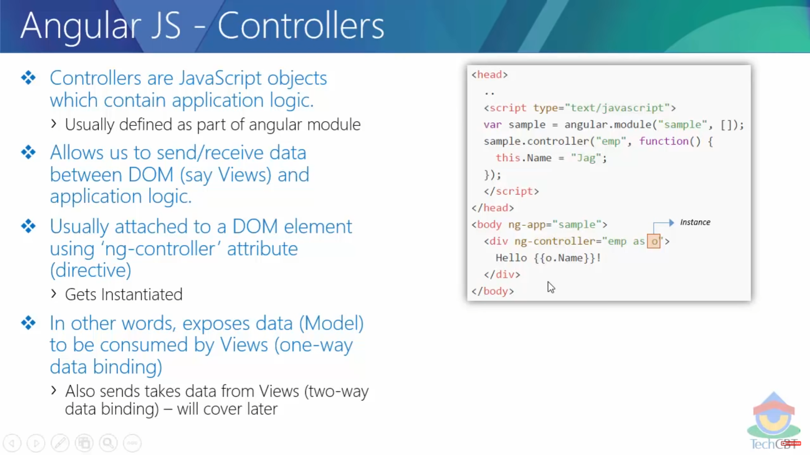

Angular controllers are nothing but the javascript objects which contains data, variables, methods etc.

With the help of controllers we can execute our complex logic or javascript in it and then we can interact with view for displaying the results in the application.

We can consume the controller with the help of `ng-controller="controllerName as variableName` attribute, the attributes starts with `ng` are called as directives in angular. variable name contains the refrence to the controller and we can consume controllers properties and method as like mentioned below.

```
// Controller
    const app = angular.module('sampleApp',[]);
    app.controller('main',function(){
        this.name = 'Shivprasad';
    })

// Template
 <div ng-app="sampleApp" ng-controller="main as c">
        Hello {{c.name}}! // Hello Shivprasad!
    </div>
```

**Role of Controllers :-**


Data is termed as `Model` in angular & controllers are usually used to exchange of data with views.

View doesn't have any idea about controllers, it only believes in model's but controller works as middle man or data provider to view in terms of model.

Even controllers doesnt interact with databases directly, controllers communicate with web services & web services communicate with databases and delivers data to controller which controllers pass to view in terms of model.

### Scope


As we saw earlier Controller returns the model which is data indirectly but it doesn't send the data directly to view.

Scope is the mediator in between view & controller which carries the context of controller due to which it contains the all the data, method etc.

Remember if any property not present in the controller and still we try to access it through scpoe it does not throw any error, that why we use `use strict` in the controller.

Previous we was accesing the variable of controller through refrence created with the help of `as`, when we set the property to scope in controller we can directly access in the view without creating any refrence to controller as like mentioned below.

```
<script type="text/javascript">
        const app = angular.module('sampleApp',[]);
        // Assigned value to scope
        app.controller('main',function($scope){
            $scope.name = 'Shivprasad';
        })
</script>

<body ng-app="sampleApp" ng-controller="main">
    sum of 3 + 2 = {{ 3 + 2}}
    <br>
    // Consuming the variables from scope directly
    <div class="greet">
        Hello {{name}}!
    </div>
</body>
```

**Providing Collections rather than direct variables :-**

Browsers or servers usually minimzes our code in which case our variables get replaced with some simple charecters as like menioned below.
```
 // Assigned value to scope
        app.controller('main',function($scope){
            $scope.name = 'Shivprasad';
        })

// Minified
    app.controller('main',function(c){
        c.name = 'Minified';
    })
```

But the code gets minified it modifies the variables as it wants to be but that wont work in the view. To prevent this modification by browsers and servers we need to provide the collections for variables or dependencies as like mentioned below.

```
 // Assigned value to scope
        app.controller('main',function($scope){
            $scope.name = 'Shivprasad';
        })

// With Collection
    app.controller('main',['$scope',function(scope){ // Provided collection with ['instance',function(varible)]
        scope.name = 'Minified';
    }])
```
This is the standard we follow world wide for preventing the modification of dependencies but we need to keep in mind that its mapping is purely index based. If you provided a dependency at index 1, parameter 1 of the function will redirect to it.

```
app.controller('main,['inj1','inj2',function(var1, var2){

}])
```

**Creating & Using Multiple Controllers :-**

```
    // Shiv controller for Employee shiv
    app.controller('shiv',['$scope',function(scope){ // Provided collection with ['instance',function(varible)]
        scope.name = 'Shivprasad';
    }])

    // Sai controller for Employee Sai
    app.controller('sai',[$scope,function($scope){
        $scope.name = 'Saikiran'
    }])

    <div ng-controller="shiv">
        Employee name : {{name}} // Shivprasad
    </div>

    <div ng-controller="shiv">
        Employee name : {{name}} // Saikiran
    </div>
```

When we bind controller to some div it will refer its method & properties to its controller itself. No matter if proerties or methods are same.

**Controller Binding Syntax Differences :-**

- **Using refrence for controller :-**

    ```
     app.controller('main',function(){
        this.name = 'Shivprasad';
    })
    <div ng-app="sampleApp" ng-controller="main as c">
        Hello {{c.name}}! // Hello Shivprasad!
    </div>
    ```

    In this syntax controller scope is accesible from the view but rather the methods & properties of the scope will be set as refrence variable in scope like `scope.c` will refer to scope. there will be c property in the scope in which properties and methods from the controller will exists.

- **Using scope for controller :-**

    ```
     app.controller('main',function($scope){
        $scope.name = 'Shivprasad';
    })

    <div ng-app="sampleApp" ng-controller="main">
        Hello {{name}}! // Hello Shivprasad!
    </div>
    ```

    In this syntax controller variables & methods will be directly accesible through scope itself. it will exist in scope object with other inbuilt properties and methods rather than creating another property refering to this controller data.

### Scope Inheritance


When the angular html compiler sees ng-controller directive then it creates a scope context referring to directives scope, anything will be defined in the scope of controller like properties, methods or everything will be accessible withing the html elment on which ng-controller binded.

When we use another controller within that existing div element which is already binded with some controller then it creates another scope context in existing parents scope context, so in the child scope context parent scope's properties and methods will be accessible due to inheritance as like Oops concept.

```
// Controllers
    const app = angular.module('sampleApp',[]);
    app.controller('main',["$scope",function($scope){
        $scope.name = 'Shivprasad';
    }])

    app.controller('child',['$scope',function($scope){
        $scope.salary = 45000;
        $scope.age = 25;
    }])

// View
<body ng-app="sampleApp" ng-controller="main">
    sum of 3 + 2 = {{ 3 + 2}}
    <br>
    <br>
    <div class="greet" ng-controller="child">
        Hello {{name}}!
        <br>
        Your Salay is {{salary}}
        <br>
        Your Age is {{age}}
    </div>
</body>

// Result
sum of 3 + 2 = 5

Hello Shivprasad!
Your Salay is 45000
Your Age is 25
```

As you can see we are able to access name which is declared in main controller in the scope of child scope.

We can nest n numbers of scope in each other as we have saw above, if you want to seprate the logic mdoule wise then we can use multiple controllers nested within same entity such as Employee will be main scope & Personal details, Financial details will act as child scope where they would contain its relative logic.

### Root Scope

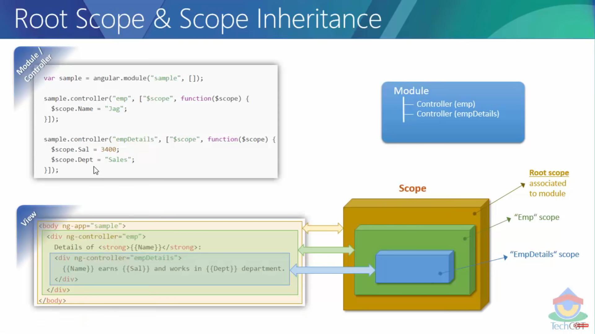

Rootscope is the scope gets created when the the ng-app binding(module binding) is declared with root module for the application.

Root scope contains all the nested or child scopes it as gets created for module binding with dom.

And nesting of the scopes in hirarchial order will be the same in its child scopes.

**Root Scope Access :-**

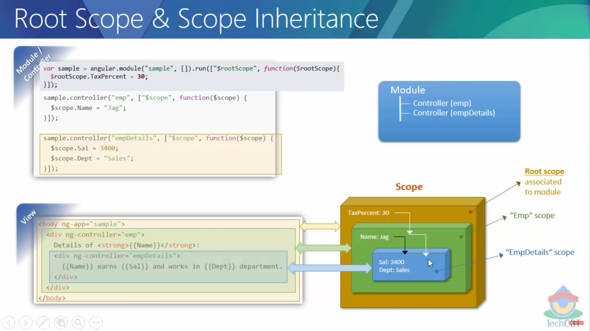

All the child scopes have access to rootscope methods & properties due to inheritance, When we bind module to dom element it creates root scope by default & as we declare the controllers in it creates controllers context inside the rootscope due to which all the scopes have access to root scope properties & methods.

**Declaring properties & methods in root scope :-**

We have `.run(['',function(){}])` method on module which gets executes when the module is initialized.

```
   const app = angular.module('sampleApp',[]).run(['$rootScope',function($rootScope){
            $rootScope.manager = 'SK';
        }]);

    app.controller('child',['$scope',function($scope){
            $scope.salary = 45000;
            $scope.age = 25;
        }])

<body ng-app="sampleApp">
    <div class="greet" ng-controller="child">
        Your Salay is {{salary}}
        <br>
        Your Age is {{age}}
        <br>
        Your manager is {{manager}}
    </div>
</body>
```

**RootScope Modifications :-**


As mentioned above every controller scopes are referring to same rootscope variable TaxPercent, if we modify the rootscope values then it will be reflected in each and every controller.

`Note :- Rootscope gives us the comfortability to have access in each & every scopes but its not the good practice to use rootscope for sharing the data across multiple controllers. It should be only opted when there is no else way is remaining.`


**Accessing Root scope in Controllers :-**


If we dont have variable named in our local scope or parent scope it will directly refer to root scope if we have declared the variable with that name.

But it's not good practice to access the rootscope variable with direct access as it doesn't gives any clarity from where exactly we are accessing the values or where are those declared.

Best way to access the rootscope variable or values is with `$rootScope` parameter which is reserved keywork in angualr which we can inject as same as scope in the controller.

```
   const app = angular.module('sampleApp',[]).run(['$rootScope',function($rootScope){
            $rootScope.manager = 'SK';
            $rootScope.tax = 1500;
        }]);

    app.controller('child',['$scope',function($scope){
            $scope.salary = 45000 + $rootScope.tax; // We have accessed rootscope with $rootScope instance.
            $scope.age = 25;
        }])

<body ng-app="sampleApp">
    <div class="greet" ng-controller="child">
        Your Salay is {{salary}}
        <br>
        Your Age is {{age}}
        <br>
        Your manager is {{manager}}
    </div>
</body>
```

There is not necessity to declare the rootScope values in the `module.run` method only, we can declare the rootScope values from any of the child controllers as well. But it just should be declared before consuming it as like mentioned below.

```
const app = angular.module('app', []);

app.controller('myController',['$scope','$rootScope',function($scope,$rootScope) {
    $scope.name = 'Shiv';
    $rootScope.manager = 'SK'; // Setting rootscope values from child controller.

}])
```

### Data Binding (One way, 2 way & one time binding)


Data binding is the binding of data between the view & controller which will sync automatically and will reflect on the Ui as well when the data gets updated.

**Types of Data Binding in angularjs :-**

- **One Way Binding :-**

    

    One Way data binding is the data binding in which data updations reflects on view on real time but data cannot be updated in scope from the view.

    We can use one-way binding with Evaluation Expressions (interpolations) like `{{}}` or `ng-bind` for one way data binding.

    Data binding done with ng-bind or interpolation will integrate the data as content of the html tag where its used. It can be accessed through `innerText` property of html element.

    `ng-bind` does not works with input based tags, it only works with readonly or non-input based tags only.

    ```
    // View
    <div class="class" ng-controller="child">
            Your Initial Salay is {{::salary}}
            <h1>ng-binding</h1>
            Your Updated Salary is <span ng-bind="salary"></span>! // One Way binding
        </div>
        <hr>
        <button ng-click="doubleSalary()">Double Salary</button>
    </div>

    // Controller
    app.controller('child',['$scope',function($scope){
        $scope.salary = 45000;
        $scope.doubleSalary = function() {
            $scope.salary = $scope.salary * 2;
        };
    }])
    ```

- **Two Way Binding :-**

    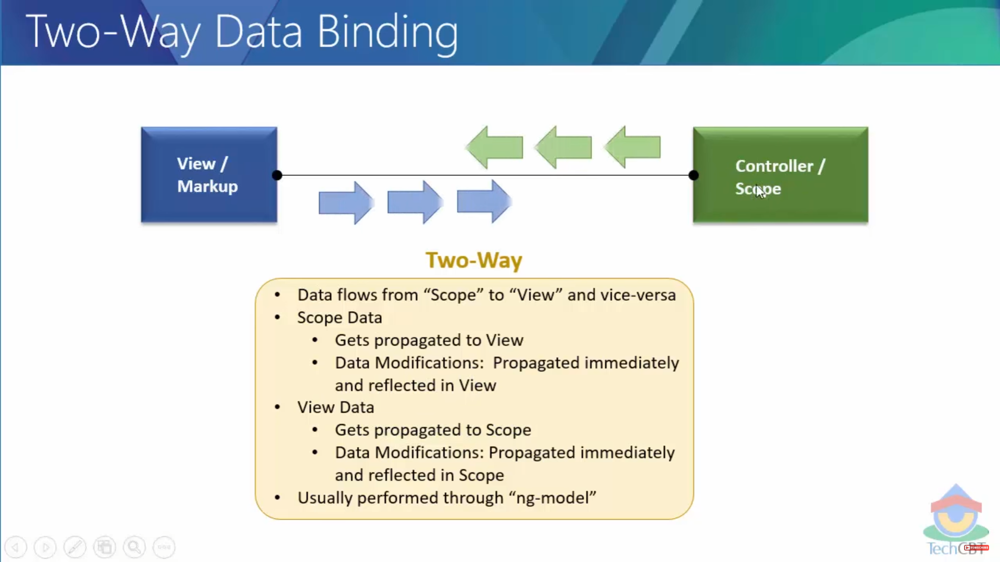

    Two way data binding the data binding in which updated data will reflect on view on real time as well as data can be updated in scope from the view ie with input field value updation etc.

    we can achieve 2 way data binding with `ng-model`.

    ```
    // View
     <div class="greet" ng-controller="child">
        You can modify your salary
        <br>
        <input type="text" ng-model="salary">
        <hr>
        <div class="class">
            Your Updated Salary is <span ng-bind="salary"></span>!
        </div>
        <hr>
        <button ng-click="doubleSalary()">Double Salary</button>
    </div>

    // Controller
    app.controller('child',['$scope',function($scope){
    $scope.salary = 45000;
    $scope.doubleSalary = function() {
        $scope.salary = $scope.salary * 2;
    };
}])
    ```

- **One Time Binding :-**

    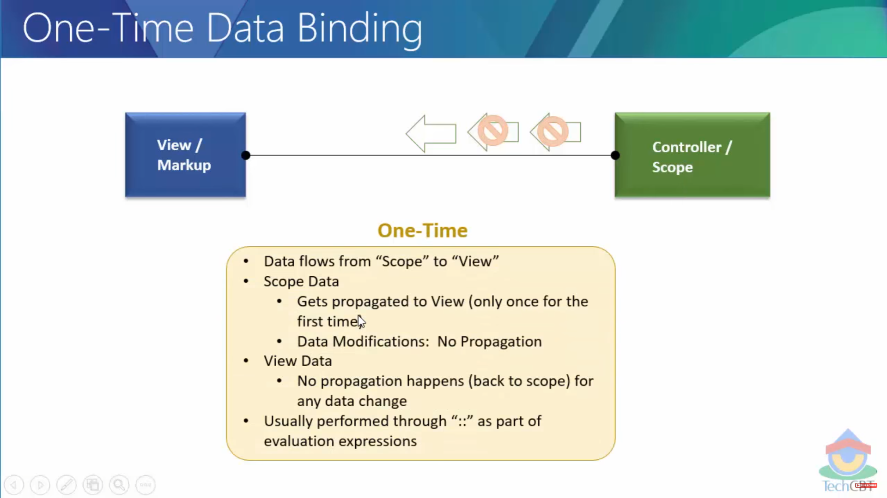
    
    One time data binding is similar as one-way binding in which data flows from controller or scope to view but it will not be reflected realtime on view as like one way data binding.

    When the scope initializes or data get initializes it will sent to the view only once, and if any changes happens to that data later it will not be reflected in view.

    We can achieve 1 time data binding by using `::` in Evaluation Expressions (interpolation).

    ```
    // View
    <div class="class" ng-controller="child">
        Your Initial Salay is {{::salary}} // One Time Binding
        <h1>ng-binding</h1>
        Your Updated Salary is <span ng-bind="salary"></span>!
    </div>
    <hr>
    <button ng-click="doubleSalary()">Double Salary</button>
    </div>

    // Controller
    app.controller('child',['$scope',function($scope){
        $scope.salary = 45000;
        $scope.doubleSalary = function() {
            $scope.salary = $scope.salary * 2;
        };
    }])
    ```

### AngularJs Events & Event bindings

### AngularJs API Calls & AJAX


AJAX stands for Asynchronous javascript And XML which is the network between the server and client(browser) for the data interchange.

We recieve the data in terms of html, xml or data. When we recieve the full page with HTML is known as Full page post back.

When we recieve the data in terms of xml, json or data then its called as partial page post back.


When we request webpage from one domain or if webpage is loaded from one domain & then the webpage tries to access the data or resources from another domain then its called as cross-origin which is restricted.

If we want to allow cross-origin then we need to implement server 2 (secondary) the server accordingly.

We can make ajax calls in angular with `$http` built-in service, jquery or any third party library which provides ajax functionaliies.

**How to make API call in angularjs :-**

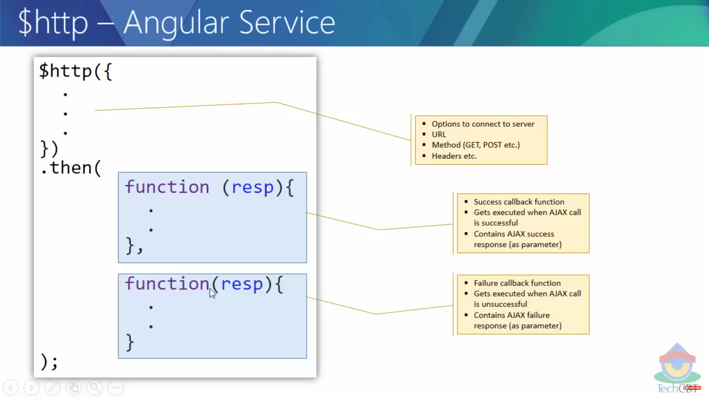

We use http built-in service provided by the angular for API calls with `$http({config...})`.

- Import `$http` built-in service in controller.

- Construct `$http({url:'URL',method:'METHODTYPE'})` which takes config object as an arguement in which url is the server url & method like `GET`, `POST`, `PUT`, `DELETE` etc. We will checkout config object properties & methods in detail further ahead.

- When above http method initialized it returns response or error in terms of promise which we will catch with `$http({config}).then((res)=>{},(err)=>{})`.

```
// Template
<button ng-click="doubleSalary()">Double Salary</button>

// Controller
$scope.getUsers = function () {
    $http({
        url: 'https://jsonplaceholder.typicode.com/users',
        method:'GET'
    }).then((res) => {
        console.log("Users => ", res.data);
        alert(res.data[0].name);
        }, (err) => {
        console.log("Error Occured while getting users=>", err);
    })
}
```

### Angularjs Services


Angularjs service is common code for business logic or non-controller dependent which can be used in entire application.

Service only gets initialized once in the angularjs application memory and that only if any of controllers have consumed it. When its already initialized all controllers refers to the same instance of service in entire application.

Services can be used in another services as well for segrigating logics of perticular features.

**Service Types :-**

- **Built-in Services :-**

    Built-in services are the services provided by the angular which can be consumed for consuming angularjs functionalities.

- **Custom Services :-**

    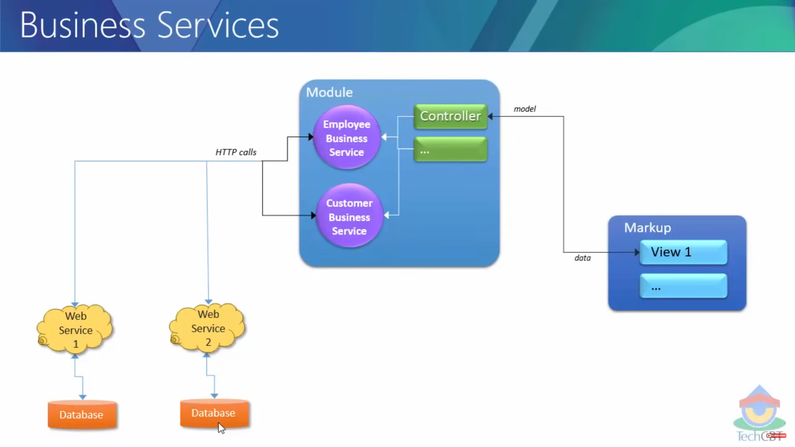

    Custom services are the services created by the us for business logic, according to features or specific parts of the application. ie if i have user management application i will have different services for user, admin etc.

    **How to create custom service :-**

    We can create the custom services with 3 different ways, Factory, Service & Provider as mentioned below.

    **Factory :-**

    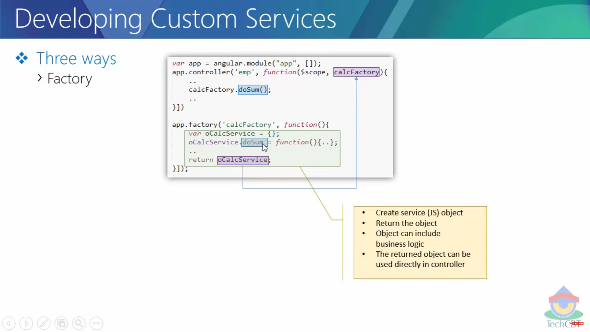

    Factory is inbuit feature provided by the angular with which we can create our custom service, we create an object in the factory & we assign the properties & methods to that object & return it.

    We will be able to access the properties & methods across the application with the help of factory.

    ```
    // Module
    const app = angular.module('app',[]);

    // Factory
    app.factory('userService',function(){
        // Created factory object, assinged methods & properties & returned it
        let service = {};
        service.setURL = function(url){
            service.URL = url;
        }

        return service;
    })

    // Controller
    app.controller('main',['$scope','userService',function(userService){
        userService.setURL('https://api.github.com')
    }])
    ```

    **Service :-**

    

    Service is another way to create an custom service in which the syntax is little bit different but have same purpose as factory.

    we directly assign the properties & methods to `this` keyword which refers to object its property of as like mentioned below.

    ```
     // Module
    const app = angular.module('app',[]);

    // Factory
    app.service('userService',function(){
        // Created service, assigned function with this keyword
        this.setURL = function(url){
            service.URL = url;
        }
    })

    // Controller
    app.controller('main',['$scope','userService',function($scope,userService){
        userService.setURL('https://api.github.com')
    }])
    ```

    **Provider :-**

    

    Service, Factory are the wrappers built upon the provider but provider is an core funcitonality behind the angularjs services.

    Provider can be used when you want to pass the configuration or data which needs to do some operation before service gets initialized.

    In the provider we have `this.$get = function(){}` method which gets executed after the service's configuration for execution of the service.

    `Note :- app.config will get called in the initial stage of the application where no controllers, views and all initliazed yet so we cant access anythings related to those in the config callback.`

    ```
         // Module
    const app = angular.module('app',[]);

    app.config(['userService',function(userService){
        userService.setURL('http://localhost:4200');
    }])

    // Factory
    app.provider('userService',function(){
        let URL = '';

        // Created service, assigned function with this keyword
        this.setURL = function(url){
            URL = url;
        }

        this.$get = function(){
            let service = {};
            service.getUserInfo = function(){
                return // API CAll
            }
            return service;
        }
    })

    // Controller
    app.controller('main',['$scope','userService',function($scope,userService){
        userService.setURL('https://api.github.com')
    }])
    ```

### Bulit-In directives

There are bunch of built-in directives provided by angularjs which can be used accordingly to requirements.

- **ng-if :-**

    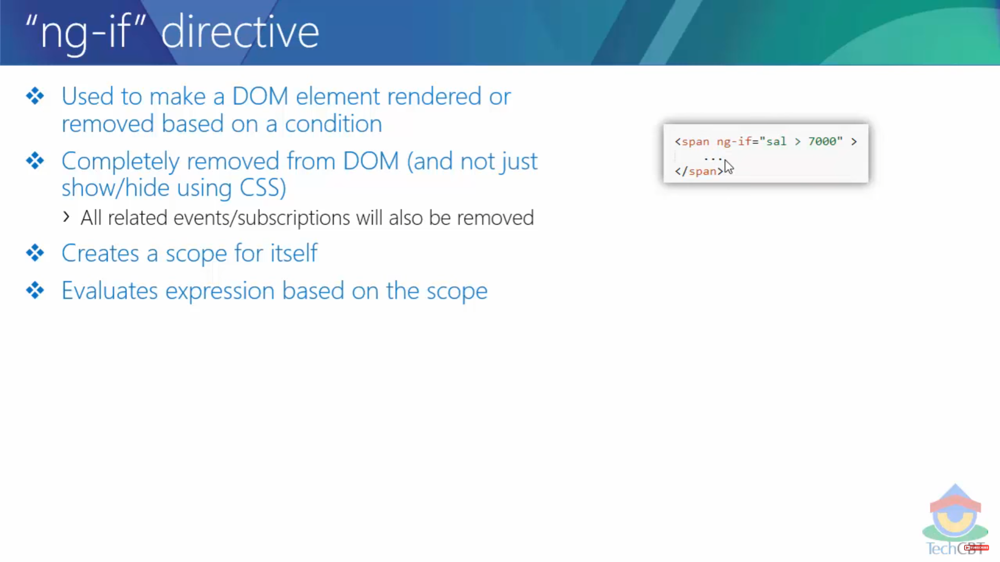

    ng-if directive takes expression as an arugment & if expressions returns true then only element will be rendered in the dome. It will not be hidden with the help of css but it will not rendered itself.

    It creates its own scoep & search the expression variables & method in its scope if it does not exist then it will keep checking to parent scope till root scope.

    ```
    // Template
    <div class="class" ng-if="salary">
            Your Updated Salary is <span ng-bind="salary"></span>!
    </div>

    // Controller
     $scope.salary = 45000;
    ```
    
- **ng-show or ng-show :-**

    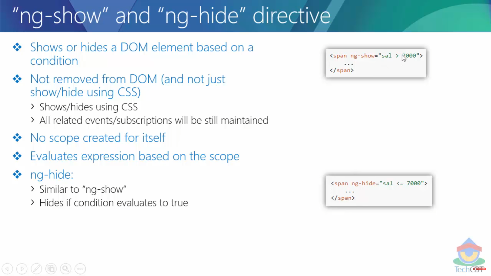

    ng-show is similar to ng-if directive but ng-if will show or hide element with the help of css but it will be part of dom.

    No scope will be created for ng-show directive properties & methods.

    ng-hide works vice versa to ng-show if the condition will be true and used ng-hide then element will be hidden or if ng-show is true then element will be visible.

    ```
    // Template
    <div class="class" ng-hide="!salary">
            Your Updated Salary is <span ng-bind="salary"></span>!
    </div>

    // Controller
     $scope.salary = 45000;


     // Template
    <div class="class" ng-show="salary">
            Your Updated Salary is <span ng-bind="salary"></span>!
    </div>

    // Controller
     $scope.salary = 45000;
    ```

- **ng-repeat :-**

    

    ng-repeat is kind of for-loop reusable template in html, in which same tempalte but different data will be rendered.

    It creates its own scope of an item while iterating through array of items & that items properties & data will be accessed through its instance variable.

    ```
    // Template
      <div class="users" ng-if="users.length>0">
            <div class="card" style="border:1px solid;padding:10px;" ng-repeat="user in users">
                Id : {{user.id}}
                <br>
                Name : {{user.name}}
                <br>
                Email : {{user.email}}
            </div>
        </div>

        // Controller
        $scope.getUsers = function () {
        UserFactory.getUsers().then((res) => {
                $log.log("Users => ", res.data);
                $scope.users = res.data;
            }, (err) => {
                console.log("Error Occured while getting users=>", err);
        })
        }
    ```

### Bootstrap CSS Integration

We can simply integrate bootstrap in angular application by including cdn scripts related to it.

**Scripts to include :-**

- **Bootstrap CSS :-** `    <link rel="stylesheet" href="https://cdn.jsdelivr.net/npm/bootstrap@4.6.2/dist/css/bootstrap.min.css" integrity="sha384-xOolHFLEh07PJGoPkLv1IbcEPTNtaed2xpHsD9ESMhqIYd0nLMwNLD69Npy4HI+N" crossorigin="anonymous">`

- **Boootstrap Bundles (Includes everything such as popper, jquery) :-** 
  
    Note that always include the script files at the end of the body tag, so dom elements would be accesible through it as we are accesing them after they rendered.

    ```
    <script src="https://cdn.jsdelivr.net/npm/jquery@3.5.1/dist/jquery.slim.min.js" integrity="sha384-DfXdz2htPH0lsSSs5nCTpuj/zy4C+OGpamoFVy38MVBnE+IbbVYUew+OrCXaRkfj" crossorigin="anonymous"></script>
    <script src="https://cdn.jsdelivr.net/npm/bootstrap@4.6.2/dist/js/bootstrap.bundle.min.js" integrity="sha384-Fy6S3B9q64WdZWQUiU+q4/2Lc9npb8tCaSX9FK7E8HnRr0Jz8D6OP9dO5Vg3Q9ct" crossorigin="anonymous"></script>
    ```

### AngularJs Filters


AngularJs filters are the similar as angular pipes, which are pure functions to transform & manipulate the data according to our requirements. We can use filters for sorting,filtering & transforming data according to our requirements.

There are some built-in filters provided by angularjs such as `number,date,filter,uppercase, lowercase, orderby etc` & we can create our own filters as well for our custom requirements.

We can consume filters directly inside html using evaluation expressions like `{{12 | number}}` & in controllers, services etc.

**How to consume filters :-**

- **Filters in View :-**
  
    For using filters into html we need to use evaluation expressions as like mentioned below. The key or value will be taken as input & result will be returned in evaluation expression which will be displayed as final output on screen.

    ```
    // Controller
    $scope.empName = 'shiv'

    // Tempalte
    {{empName | uppercase}}
    ```

- **Filters in Controllers & Services :-**

    For using filters into controllers we need to inject `$filter` into controller or services and we need to pass the filterName & input data as arguement to method like `$filter(filterName)(inputData)` which will returned transformed value.

    ```
    app.controller('sample',['$scope','$filter',function($scope,$filter){
        // UpperCase value will be stored in variable
        $scope.empNameUpperCase = $filter('uppercase')('Shiv');
    }])

    app.service('sampleService',['$filter',function($filter){
        this.getUpperCaseValue = function(inputValue){
            // Returning transformed value
            return $filter('uppercase')(inputValue)
        }
    }])
    ```

**Built-In Filters :-**

- **uppercase :-**

    {{inputValue | uppercase}}

- **lowercase :-**

    {{inputValue | lowercase}}

- **number :-**
  
    {{inputValue | number:"2"}}

- **currency :-**
  
    {{inputValue | currency:"$":2}}

- **dates :-**
    
    {{inputValue | date:"medium"}}

- **orderby :-**

    {{objArray | orderby:''}}

- **filter :-**

    {{objArray | filter:{property:value}}}

- **json -**

    {{inputObj | json}}

- **limitTo :-**

### Custom Directives

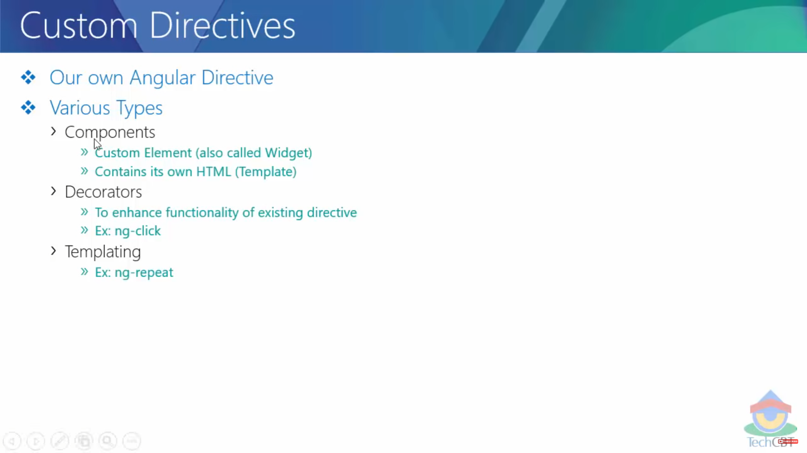

Custom directives are nothing but the child components which we used to create in angular with and we were consuming with its selector.

Directives are functionality provided by angular with the help of which we can execute logic, change the tempalte structure and moreover template related logic within template itself.

Angular provdes built-in directives such as ng-show, ng-hide, ng-repeat etc. we can create our own custom directives as well according to our requirements.

We can create our own custom directives with the help of `app.directive(nameInCamleCase)` and we can use it with `- seprator`  like `myDirective to <span my-directive></span>`.

    
**Types of Custom directives :-**

- **Component :-**

    Component directives are the directives which contain or returns the HTML is known as component directive.

    ```
    app.directive('testDirective',function(){
        return {
            template : `<strong>Content</strong>`
        }
    })

    <div class="content-from-directive" test-directive>
    // Content will be projected here
    </div>
    ```

    **Consuming Scope Data in directive :-**

    There is no such difference between consuming scope data in template & directive, we can consume the scope data in directives in the same way as we do in the template as like mentioned below. the properties used in the scope will refer to the scope in which its used for.

    ```
    app.controller('sample',['$scope',function(){
        $scope.msg = 'This messgae is declared in controller!'
    }])
      app.directive('testDirective',function(){
        return {
            template : `<strong>{{msg}}</strong>`
        }
    })

    <div class="content-from-directive" test-directive ng-controller="sample">
    // Content will be projected here
    </div>
    ```

    **Creating complex template into directives :-**

    Normally if we have complex template which needs to be used into directives we can either create `script with type="text/ng-template & id="myTemplate.html"` or we can create new html file for it. Angular tries to find your template within your view or it will lookout for the file with the provided name as mentioned below.

    ```
     app.controller('sample',['$scope',function(){
        $scope.msg = 'This messgae is declared in controller!'
    }])
      app.directive('testDirective',function(){
        return {
            template : `myTemplate.html`
        }
    })

    <div class="content-from-directive" ng-controller="sample">

    // Template declared here with script of type="text/ng-template"
    <script type="text/ng-template" id="myTemplate.html">
        <strong>{{msg}}</strong>
    </script>

    // Consumption of template
    <div test-directive>
    // Content will be projected here
    </div>

    </div>
    ```

    OR 

    ```
     app.controller('sample',['$scope',function(){
        $scope.msg = 'This messgae is declared in controller!'
    }])
      app.directive('testDirective',function(){
        return {
            template : `myTemplate.html`
        }
    })

    // Template in different file named as myTemplate.html
    <strong>{{msg}}</strong>

    <div class="content-from-directive" ng-controller="sample">
    // Consumption of template
    <div test-directive>
    // Content will be projected here
    </div>
    </div>
    ```

    **Consume directives as component or html tag:-**

    If we have compoennt directive then we can consume those directives as like html tag as well such as `<your-directive-name></your-directive-name>` and the content will be project at the place of its declaration.

- **Decorators :-**

    Decorators are the directives which manipulates the existing html according to requirements.

- **Templating :-**


### LifeCycle (Execution Phase) of directive

We can use the method's as lifecycle hooks as we have in angular to do some operation in some phase of rendering of component.

Lifecycle of an angularjs directives are the phases of execution of directives from compiling to rendering. It does have 2 major phases compilation & link phases as like mentioned below.

- **Compilation :-**
  
  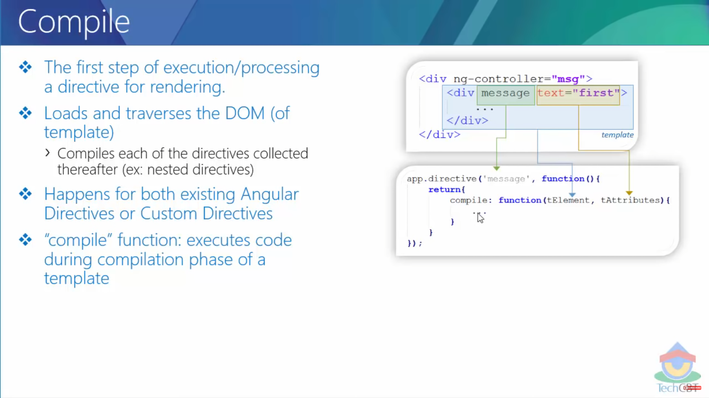

  Compilation is the first phase of directive processing or rendering in which compiler loades & traverses throuh through template for compiling each and every directive collected. If we want to do something while compiling a directive we can use `compile` callback as like mentioned below.

  ```
  app.directive('myDirective',function(){
    return {
        compile: function(tElement, tAttributes){ // Target Element , Target attributes

        }
    }
  })
  ```

- **Link :-**
    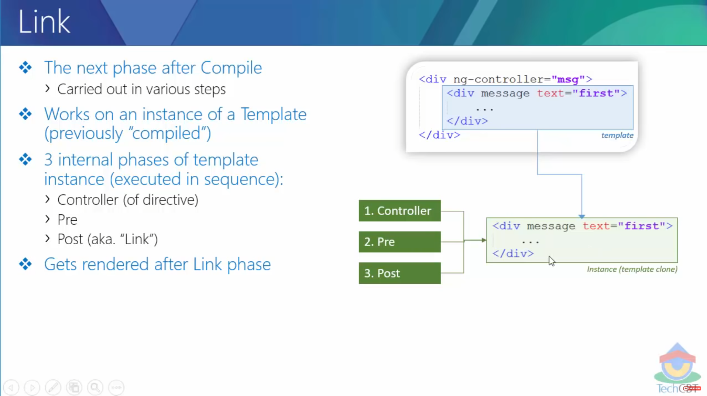

    Its the next phase of compilation phase, it involves multiple steps within itself. it clones the instance of target element on which the directive is used & There are 3 internal phases in it such as 
        - Controller (of directive)
        - Pre
        - Post ("Link")

    Directive will not be rendered untill & Unless linking phase has been completed.

- **Compilation & Linking :-**

    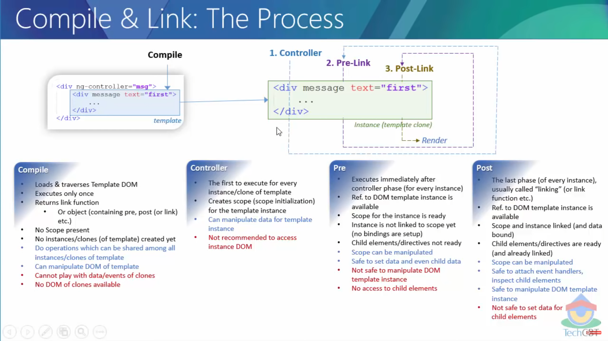

    1. **Compile :-**

        Compilation phase gets executed only once, in compilation phase there is no dom instance, scope available so we are not able to make any kind of manipulation related to data but this can be used for making such changes which should be available at every instance of the directive.

    2. **Controller :-**

        After the compilation phase the instance of template will be created & scope and internal controller of that directive is got created. We can manipulate the data in this phase but its not recommended to Access dom in this phase. We can use this phase for making chnages which should be done before the data linking or binding phase.

    3. **Pre Link :-**

        Prelink is the immediate phase which gets performed on the created instance in controller phase, refrennce to dom template gets created in this phase & scope is ready but dom instance is not linked and no binding are setup with scope yet. We can manipulate the data in this phase related to scope for even its childs as well but only at the scope level.

        Its not advised to make changes related to dom instance but there is no access to child elements.

    4. **Post Link :-**
        
        Its the last phase of directive rendering & scope related to dom instance is completely bound in this stage & we can make changes related to dom & scope before rending in this phase. Even child elements are ready in this phase. we can add events listners and all to dom elements.


- **Compile & Linking for Nested directives :-**

    

    When there are child directives present as you can see in the above image first all directives compilation gets completed & after that controller & prelink phase gets executed for all the directives in sliding manner but it does not execute the postlink phase immediately, it completes controller and prelink phase for all the child directives and when there is no more child directives remainig it executes postlink phase from innermost directive template instance to outermost directive template inistance in ladder manner as mentioned in image above.

```
app.directive('myDirective', function(){
    return {
        // Compilation Phase
        compile: function(tElement, tAttributes){
            console.log("Compilation Phase of" + tAttributes.text);
            return {
                // PreLink & PostLink are the phases of compilation 
                pre : function(scope,iElement,iAttributes) {
                    console.log("PreLink Phase of" + iAttributes.text);
                },
                post : function(scope,iElement,iAttributes){
                    console.log("PostLink Phase of" + iAttributes.text);
                }
            }
        },
        // Angular executes controller before prelink & postlink
        controller : function($scope,$element,$attrs){
            console.log("Controller Phase of" + $attrs.text);
        }
    }
})

// Template
<div my-directive type="first">
    <div my-directive type="second">
        <div my-directive type="third">
        </div>
    </div>
</div>

// Logs
Compilation Phase of first
Compilation Phase of second
Compilation Phase of third

Controller Phase of first
PreLink Phase of first

Controller Phase of second
PreLink Phase of second

Controller Phase of third
PreLink Phase of third

PostLink Phase of third
PostLink Phase of second
PostLink Phase of first
```

**How to execute interpolation expression in controller :-**

**Dom manipulation in custom directives :-**

We can manipulate the dom inside `compile` if we want to make the common changes for every instance of template in the application & if we want to manipulate the dom for instantiated element we can do that inside `postLink` as like mentioned below.

```
app.directive('myDirective', function($interpolate){
    return {
        // Compilation Phase
        compile: function (tElement, tAttributes) {

            // Common Element Level styling
            tElement.css('border', '1px solid');

            console.log("Compilation Phase of " + tAttributes.text);
            return {
                // PreLink & PostLink are the phases of compilation 
                pre : function(scope,iElement,iAttributes) {
                    console.log("PreLink Phase of " + iAttributes.text);
                },
                post : function(scope,iElement,iAttributes){
                    console.log("PostLink Phase of " + iAttributes.text);

                    if (iAttributes.text == '3') {
                        iElement.css('background-color', 'beige');
                    }
                    iElement.on('click', scope.btnClick);

                    // Binding event for each Element with iElement
                    iElement.on('click', scope.btnClick);
                }
            }
        },
        // Angular executes controller before prelink & postlink
        controller: function ($scope, $element, $attrs) {

            // We need to parse interpolated value manually with $interpolate
            let parsedValue = $interpolate($attrs.text)($scope);

            console.log("Controller Phase of " + parsedValue);

            // Method of scope which will be called by each Element
            $scope.btnClick = function () {
                alert(parsedValue);    
            }
            
        }
    }
})

// Template
<div my-directive text="{{i}}" ng-repeat="i in [1,2,3,4,5]">
    {{i}}
</div>
```

In the above example as you can see we had applied our common styling on template level itself because we are not dealing with data in it.

We needed to bind the click event to each Rendered element based on its data & as we know that seprate controller will be created for each instance of directive template so we are declaring btnClick method in it which will hold data of respective iElement value.

As we have discussed earlier we need to do the dynamic dom manipulation or on rendered element dom manipulation it should be done in `postLink` so we bound the event to dom element in `post` so it will be binded to each element as well as dynamic styling we have done in post itself.

**Short hands for compile, pre, post, controller :-**

- **When we dont want compile but we want pre & post :-**

    When we want to do some operations in pre & post related to directives and we dont have any need for compile then we can use `'link'` object directly instead of returning `{pre:function(){}, post:function(){}}` as like mentioned below.

    ```
    app.directive('myDirective', function($interpolate){
        return {
        // Compilation Phase
            link:{
                pre : function(scope,iElement,iAttributes) {
                },
                post : function(scope,iElement,iAttributes){
                }
            },
            controller: function ($scope, $element, $attrs) {
                
            }
        }
    })
    ```

- **When we want compile but not preLink :-**
  
    When we want compile but not `preLink` then we can return the callback function for post directly because angular consider the callback as `post` bydefault.
  
    ```
    app.directive('myDirective', function($interpolate){
        return {
        // Compilation Phase
            compile: function(tElement,tAttributes) {

                // PostLink Callback
                return function(scope,iElement,iAttributes){
                }
            },
            controller: function ($scope, $element, $attrs) {
            }
        }
    })
    ```

- **When we want only postLink without compile, controller etc :-**

    When we want postLink directly rather than using compile, controller then we can directly return `post` callback form directive as angular consider callback as `post` bydefault. And standard is mostly used worldwide as shorthand.

    ```
       app.directive('myDirective', function($interpolate){

        // PostLink Callback
        return function (){
            // Post link operations
        }
    })
    ```

### AngularJs Watchers


Watchers are similar to change detectors in angularjs, in which every variable used in view & scope is monitored by angular watchers. New watcher will be created for data binding variables or ng-model bindings.

When the value gets changes for variables it performs necessary updates to propogate the new values on the UI with the help of digest cycle Loop, Its automatically managed by angularjs internally but we can list the functions as well like lifecycle hooks such as ngDoCheck, ngAfterContentCheck, ngAfterViewCheck etc.

Angularjs recommends to keep the no of watchers less than 2000 in the application, if that limits exceeds application may not work properly in terms of performance aspect. We can count the watchers as well with the help of `Angular Watchers, Batarang` extensions provided by chrome.

Number of watchers doesn't count your variables in the scope but it gets counted depending on bindings made in view.

**Custom Watchers :-**

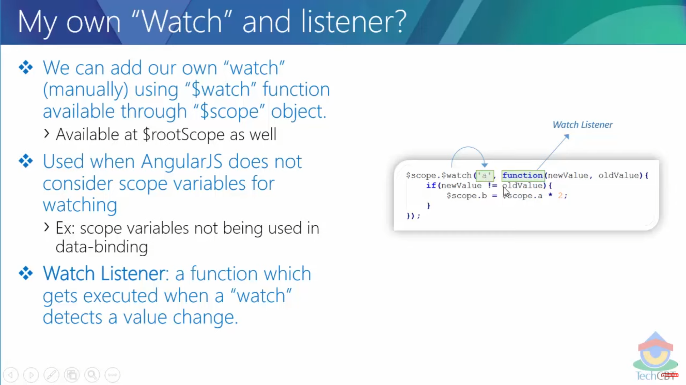
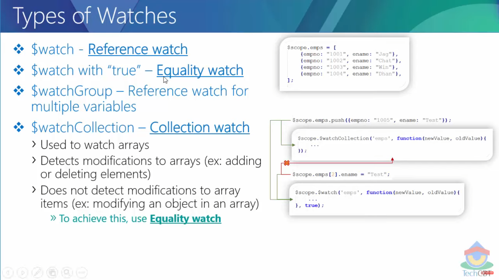

We can add watchers to our variables with the `.watch((prevValue,curValue)=>{})` method available on `$scope & $rootScope` objects. We use watchers only on the variables which are not getting watched by angualr itself. The callback will be called whenever the value will be changed for the variable by any means.

**Types of watchers :-**

- **$watch :-** 
  
    Refrence watch can be great match for the premitive data types such as boolean, integer, string etc. But if you watch the object with $watch then it will notify you when the another object will be assinged but not when the properties or values will be updated for same object.

    ```
      $scope.salary = 45000;
      $scope.$watch('salary', (newValue, oldValue) => {
        if (newValue != oldValue) {
            console.log("Salary got updated from ",oldValue," to ", newValue);
        }
    })

    // Template
    <input type="text" ng-model="salary">
    <hr>
    <div class="class" ng-if="salary">
        Your Updated Salary is <span ng-bind="salary"></span>!
    </div>
    ```

- **$watch with true :-**

    The drawback we had with watcher for objects can be resolved by `deep watch` with `$watch(variable,()=>{},true)` by passing true as an third arguement to watch. Its also known as deep watchers.

    ```
        $scope.emp = {
            salary : '45000'
        }
       $scope.$watch('emp', function (newValue, oldValue) {
        if (newValue != oldValue) {
            console.log("Salary got updated from ",oldValue," to ", newValue);
        }
    },true)

    // Template
      // Template
    <input type="text" ng-model="emp.salary">
    <hr>
    <div class="class" ng-if="emp.salary">
        Your Updated Salary is <span ng-bind="salary"></span>!
    </div>
    ```

- **$watchGroup :-**

    We have watchgroup for watching multiple entities at the single time by providing array of variables as an argument as first argument to the $watchGroup which will get called when any of the value will get changed out of the array elements.


    ```
    $scope.salary = 45000;
    $scope.name = 'Shivprasad';
    $scope.$watchGroup(['name','salary'], function (newValue, oldValue) {
            if (newValue != oldValue) {
                console.log("Salary got updated from ",oldValue," to ", newValue);
            }
        },true)

    // Template
    <input type="text" ng-model="name">
    <input type="text" ng-model="salary">
    <hr>
    <div class="class" ng-if="salary">
            Your Updated Salary is <span ng-bind="salary"></span>!
    </div>
    <div class="class" ng-if="name">
            Your Updated Salary is <span ng-bind="name"></span>!
    </div>
    ```

- **$watchCollection :-**

    We have watchCollection for watching array of objects specifically or for watching the collections which gets notified when the object will be removed, inserted or different object will be assigned at the refrence of another objects. 

    This also have drawback as like $watch without true for not getting notified when the properties & values will be changed against the object. In such cases we still go with `Deep Watch $watch with true` for achieving the same.


    ```
      $scope.getUsers = function () {
      UserFactory.getUsers().then((res) => {
            $log.log("Users => ", res.data);
            $scope.users = res.data;
         }, (err) => {
            console.log("Error Occured while getting users=>", err);
      })
    }
      $scope.$watchCollection('users', function (newValue,oldValue) {
        if (newValue != oldValue) {
            console.log("Users Got updated From ",oldValue," to ", newValue);
        }
    })

    // Template
      <div class="users" ng-if="users.length>0">
            <div class="card my-3 p-3 card" ng-repeat="user in users">
                Id : {{user.id}}
                <br>
                Name : {{user.name}}
                <br>
                Email : {{user.email}}
            </div>
        </div>
    ```

### Angularjs Digest Cycle


Angularjs maintains watchers list for each scope & its binding in the views. It included $rootScope as well for which also angularjs maintains the watchlist. If we dont have any data binding's in our view then it will not create `watchers list`.

**Digest process :-**

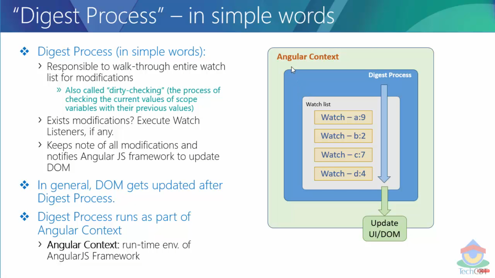

Digest process in the angular walks through entire watchlist & watchers for modifications, which keeps track of variables previous values, current values and when those gets updated or changes updates the view accordingly.It checks if the variables is dirty or not which means changed and the process is called as dirty-checking.

Digest process executes watch-listners when it finds any kind of modifications while dirty-checking & informs the angularjs to update the view and dom. Even when we make any changes manually to the dom bindings dome gets updated only after the digest process completion.

Digest process runs are the part of angular context, which is an runtime enviornment which keeps track & responsibility of built-in angular functonalities and processes.

**Digest cycle :-**

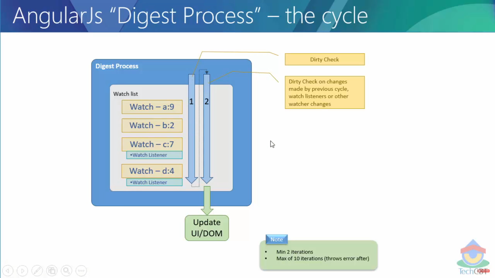


Digest cycle is executed when any changes has been made to the data binding elements, it executes atleast 2 phases.

In the first phase it checks & take note of modifications & in the second phase it again checks all the variables because in the first listener user might update other scope variables which will be observersed by second cycle.

In the second phase of cycle if there will be no modifications then it will updates the UI & DOM accordingly. If in the second phase it caughts any modifications it agian runs one more phase untill it finds no changes before making update ui & dom.

The digest cycle phases have limitations to 10 cycles, if we exceed more than 10 then it throws an error thinking that we might have ran into infintie loop.

**Example for digest cycle initial execution & after value change :-**

```
  // Controller
  $scope.salary = 45000;
  $scope.$watch('salary', function (newValue,oldValue) {
        if (newValue != oldValue) {
            console.log("Users Got updated From ", oldValue, " to ", newValue);
        }
    })

    $rootScope.$watch(function () {
        console.log("---digest process executed---");
    })

    // View
    <div class="class" ng-if="salary">
            Your Updated Salary is <span ng-bind="salary"></span>!
    </div>

    // Logs
    ---digest process executed---
    ---digest process executed---

    // When Value changed from 45000 to 50000
    ---digest process executed---
    Users Got updated From 45000 to 50000
    ---digest process executed---
```

**Example for digest cycle changes another variable which have watchlistner :-**


```
  // Controller
  $scope.name = 'Executive';
  $scope.salary = 45000;

    $scope.$watch('name', function (newValue,oldValue) {
        if (newValue != oldValue) {
            console.log("Name Got updated From ",oldValue," to ", newValue);
        }
    })
  $scope.$watch('salary', function (newValue,oldValue) {
         if (newValue != oldValue) {
            console.log("Users Got updated From ", oldValue, " to ", newValue);
            if ($scope.salary > 5000) {
                $scope.name = 'Executive';
            }
            else {
                $scope.name = 'Manager';
            }
        }
    })

    $rootScope.$watch(function () {
        console.log("---digest process executed---");
    })

    // View
    <div class="class" ng-if="salary">
            Your Updated Salary is <span ng-bind="salary"></span>!
    </div>

    // Logs
    ---digest process executed---
    ---digest process executed---

    // When Value changed from 45000 to 50000
    ---digest process executed---
    Users Got updated From 45000 to 50000
    ---digest process executed---
    Name got updated from Executive to manager
    ---digest process executed---
```

**Digest Process Execution flow :-**


Digest process always starts executing from rootScope & if it doesnt find anything in the dirty cycle it moves further ahead with second iteration and like so on. As soon as digest process finds any modification it goes to next dirty cycle by making note of modifications in sequential manner per phase.


**How the digest process gets initialized :-**


As you can see above digest process is part of angular context(angular runtime env) which resides in javascript context(runtime). When the `DOM events, Ajax with callbacks, Timers with callbacks, Navigations & Manual invocations` kicks in digest process into work.

`Note :- When you use browser specific things like getElementbyId & eventslistners, javascript timeouts or basically non-angular things of javascript your digest process will not be executed. You will need to manually invoke the digest process for it. Its better to use built-in angular features for any kind of applications. If we dont have any systematic feature of alternatives for it then only we should go for vanila havascript alternatives.`

We have 2 loops here, First is the digest loop which is getting executed in digest process & an event loop running from the browser side for catching events and everything those 2 loops works hand in hand with eachother.

### Manual Change detection ($digest & $apply)

We have saw digest process & digest cycle which figure out realtime modifications of the varibles or scope entities which reflected on the ui realtime. But we have saw earlier the limitation of the digest process as well if we use vanilla javascript alternatives for anything to manipulate hte scope data etc it doesn't make call to digest process and the changes will not be reflected on the UI for same.

For reflecting such kind of changes on the ui realtime we need to use `$scope.$apply()` & `$scope.$digest()` which calls the digest process manually to determine the changes & reflect the changes on view in realtime.

**Difference between $digest $apply :-**

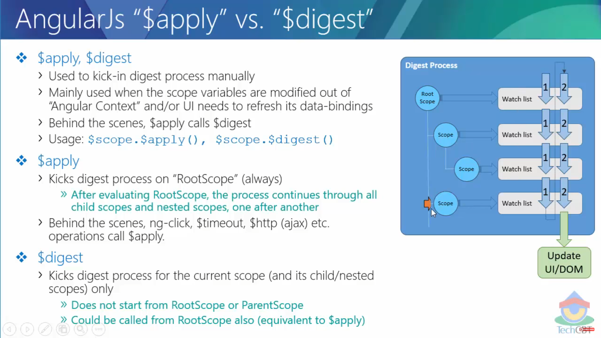

- **$apply :-**

    Kicks in the digest process from the rootScope & the digest process executes from rootscopeto childscopes. All the built-in angular features calls `$apply` behind the scene for executing digest process to reflect the changes on ui realtime.

    ```
    // Controller
    app.controller('child',['$scope',function($scope,{
        $scope.name = 'Saikiran';
    })]);
    function updateName() {
        let $scope = angular.element($('.child')).scope();
        console.log("Name before updation =>", $scope.name);
        $scope.name = 'Shivprasad';
        console.log("Name after updation =>", $scope.name);
        $scope.$apply();

        // OR WE CAN PASS LOGIC IN APPLY CALLBACK
         $scope.$apply(function(){
            console.log("Name before updation =>", $scope.name);
            $scope.name = 'Shivprasad';
            console.log("Name after updation =>", $scope.name);
         });
    }

    // Template
      Hello {{name}}!
      <button class="btn btn-secondary" onclick="updateName()">Change UserName</button>
    ```

- **$digest :-**

    digest process does not calls the digest process from the rootscope, it only calls the digest process for current scope & its child scopes in it.

    When you have 1000's of controllers into your applications if you use `$apply` it will take some time but with `$digest()` you will be running change detection only for your scope & its child scopes which will increase the performance of your application.

    ```
    app.controller('main',['$scope',function($scope,{
        $scope.name = 'Saikiran';
    })]);
    app.controller('child',['$scope',function($scope,{
        $scope.name = 'Saikiran';
    })]);
    function updateName() {
        let $scope = angular.element($('.child')).scope();
        let $mainScope = angular.element($('.main')).scope();

        // You will be able to see initial logs
        console.log("Scope before updation =>", $scope.name);
        console.log("Main Scope before updation =>", $mainScope.name);
        
        $scope.name = 'Scope Updated';
        $mainScope.name = 'Main Scope Updated';

        // You will be able to see the updaated values here for both but it will not be visible on ui due to digest ran digest process only for child controller not from the rootScope.
        console.log("Scope after updation =>", $scope.name);
        console.log("Main Scope after updation =>", $mainScope.name);
        $scope.$digest();
    }

    // Template
    <div class="main" ng-controller="main">
        Hello {{name}}! (Main Scope)
        <div class="child" ng-controller="main">
        Hello {{name}}! (Child Scope)
        <button class="btn btn-secondary" onclick="updateName()">Change UserName</button>
        </div>
    </div>
    ```

### Evaluating Angular Expressions ($eval, $parse & $interpolate)

As we know that we can evaluate angular expressions in the view by using `{{a * b}}` etc in which we can use angular expressions as well as javascript expressions.

When we need to execute such expressions in the controller we have options such as $eval, $parse & $interpolations as described below.

- **$eval :-**

    `$eval` the method available on the `$scope` itself in which we can provide angular expressions. When we provide expressions in the view we dont need to refer to scpoe while consuming the variables the same we can achieve with $eval as like mentioned below.

    ```
    $scope.salary  = 20;

    // Template
    <div> {{salary + 1000}} </div> // Returns 45000

    // Using Eval
    $scope.displaySalary = function () {
        const r = $scope.$eval('salary + 1000');
        alert(r);
    }
    ```

    Now when we you dont have any variable inside your scope but when you are trying to achieve it does not throws an error as we dont get any if we consume any undeclared variable in the view.

    ```
    // Using Eval
    $scope.displaySalary = function () {
        const r = $scope.$eval('salary + bonus'); // returns 45000 as bonus is not defined
        alert(r);
    }
    ```

    We can provide our local variables as well while using evalulation by passing an object containing local data in it. If we use any variable in eval it first gives priority to its local scope & if it doesnt exist then it will refrers to the scope variables.

    ```
    $scope.displaySalary = function () {
        // We have declared bonus inside eval local data
        const r = $scope.$eval('salary + bonus',{bonus:1000});
        alert(r);
    }
    ```

    If we want to avoid the automatic reference for local & then scope then we can manually provide the values in another fashion as mentioned below.

    ```
    $scope.displaySalary = function () {
        // We have declared bonus inside eval local data
        const r = $scope.$eval(function(scope,locals){

            // We can chnage the context or scope values with $eval
            scope.salary = locals.salary;
                
            return scope.salary + locals.bonus;
        },{bonus:1000});
        alert(r);
    }
    ```
- **$parse :-**

    We need to inject parse service as its not an part of scope as like $eval.

    `$parse` get used in similar manner as `$eval` for evaluating angular & javascript expressions in it. But parse returns function rahter than result directly in which we need to pass the scope or data to which expressions will refer as their scope and context.

    ```
        // Template
        <div> {{salary + 1000}} </div> // Returns 45000

        // Using Eval
        app.controller('child',['$parse',function(){
            $scope.salary  = 20;

            // Using Parse
            $scope.displaySalary = function () {
                const parseCb = $parse('salary + 1000');
                const r = parseCb($scope); // We need to pass the scope or data to which expressions will refer
                alert(r);
            }

        }])
        
    ```

    `$parse` is different from `$eval` in only way that it returns a function to which we need to pass the scope or data to which expressions will refer, and as we need to pass the custom data we can reuse the expressions on multiple different locations with different data.

    We can consume parse in different fashion as well in singular line as like mentioend below.
    ```
    $scope.salary = 45000;

    // We are calling parse & passing context in currying fasion
    const result = $parse('salary + 1000')($scope);

    const result2 = $parse('salary + 1000')({salary:9000}) // Returns 1000
    ```

    We can assing the values as well to with the help of `$parse(propertyRefrence).assign(data,value)` and it does calls the angular digest process due to which changes will be visible on ui as like mentioned below.

    ```
    $scope.salary = 45000;
    $scope.displaySalary = function () {
        alert('Salary Before ' +  $scope.salary);
        $parse('salary').assign($scope, 9000);
        const r = $parse('salary + 1000')($scope);
        alert("Salary After changing with $parse = " + r);
    }
    ```

- **$interpolate :-**

    Interpolate is similar as $parse which we will need to inejct before using & it also returns the function to which we can pass the data to which expression will refer.

    Only difference between `$parse` and `$interpolate` is that interpolate takes string containing interpolation as like html itself such as `$interpolate("Salary After changing {{salary + 1000 | currency : 'USD'}}")($scope)` due to which we can use the filters as well inside it.

    In the string containing interpolation we can add multiple interpolations inside the string which is also reusable like `$eval`.

    `$interpolate` also uses `$eval` behind the scenes but with the help of interpolation we cannot change the values with interpolate.

    ```
        $scope.displaySalary = function () {
        const r = $interpolate('Salary Before : {{salary}} & Salary after addition : {{salary + 1000}}')($scope);
        alert(r);
    }
    ```

### Shared Scope


When we use an directive under any kind of controller controller bound view & directive shares the same scope if until we have not declared values inside directives scope. If those values are changed then those values will be changed everywhere.

```
app.controller('child',['$scope',function($scope){
    $scope.a = 10;
    $scope.b = 20;
}])

app.directive('sample',['',function(){
    return {
        template : 'sample-template.html'
    }
}])

// Template
<div ng-controller="child">
    Controller Values a = {{a}} & b = {{b}}
    <div sample></div>
</div>

// Sample Template
<div>
    Directive Values a = {{a}} & b = {{b}}
    // When the value will be updated for a it will be reflected everywhere
    <input type="text" ng-model="a" placeholder="Type to update a..."> 
</div>
```

In teh sample template the value we bound with input box a the value will be updated in child controller because its refrerring to refrence of a from child controller.


### Inherited / Child Scope

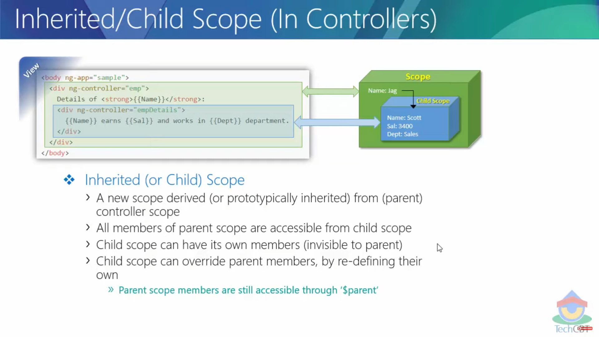

When we have nested controllers in each other child controller have access to parents properties & methods but parent component does not have the control over child controllers scope.

When we redefine the parents member or properties those will be refrered by the child scope but if we still wants to access parents properties and methods we can access with `$parent`.

**Inherited & Child scope in terms of directives :-**

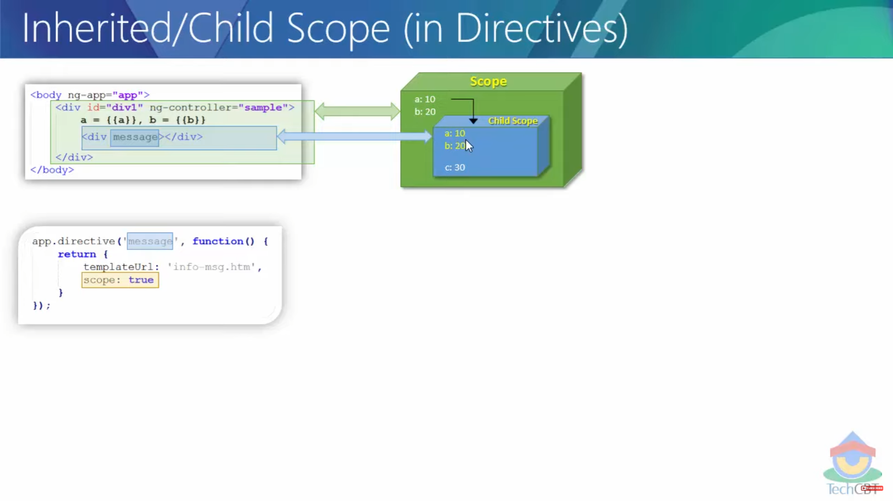

As we have saw directives use shared scope by default which comes froom parent same as controllers above example but if we want to create own directives scope we can create by using `scope:true` in return object of directive as mentioned in above code.


**Trying to update parent premetive member from child :-**

If the parents property gets updated from parent component it will be reflected in the child component as well.

BUT

If we try to update and parents `premetive property such as string, number, boolean etc expect array & objects` property which does not exist in child controller or scope and if we try to modify it from child scope then it creates a new property which will be only limited to child scope as mentioned below.

```
// Parent Controller
$scope.a = 10;
$scope.b = 20;

// Child Controller
$scope.c = 30;
$scope.d = 30;

<div ng-controller="parent">
    Values in parent : a = {{10}}, b = {{20}}

    <div ng-controller="child">
    Parent values  : a ={{a}} , b ={{b}}
    Child Values : c = {{c}}, d = {{d}}

    // When we are trying to update parents value here which does not exist in child component it will create new variable in child scope with variable a.
    <input ng-model="a"> // Updating value of parent components variable
    </div>
</div>
```

**Trying to update parent non-premetive member from child :-**

As we saw above if we update the non-premetive property of parent such as `object & array` then it will udpate the parents scope value itself which will be reflected in parent as well which used to create new variable in terms of premitive variables as mentioned below.

```
// Parent Controller
$scope.a = {value:10};
$scope.b = {value:20};

// Child Controller
$scope.c = 30;
$scope.d = 30;

<div ng-controller="parent">
    Values in parent : a = {{10}}, b = {{20}}

    <div ng-controller="child">
    Parent values  : a ={{a}} , b ={{b}}
    Child Values : c = {{c}}, d = {{d}}

    // When we are trying to update parents non-premetive value here which does not exist in child component it will update parents property iteself rather than creating its own even if it does not have that property in child scope.
    <input ng-model="a"> // Updating value of parent components variable
    </div>
</div>
```

**Trying to update parents premitive values from directive :-**

When we try to update the value of parent scope through directive it also creates its own new property with overridden value which will only limited that directive instance template. 

Even if we have bound multiple directives to multiple elements it will still updates its own scope values which will not be reflected to any other even directive instance.

**Trying to update the parents non-premetive scope values from directive :-**
When we try to udpate the value of parent scope through directive and `if its an non-premetive data type variable such as object or array then it updates directly the parents value does not matter if scope is true or false`

**Directive with ng-repeat :-**
When we use ng-repeat with directive binding as we know that ng-repeat creates its own scope for each rendered element no matter `scope:true or scope:false` is provided in the directive.

### ng-include 

We can embed an shared template from another file directly into the view or template without returning from the directive itself.

```
// Sample.html'
<h1>Sample File inlcuded</h1>

// Main Template or Main view
<div>
<span ng-inlcude="samnple.html">
</div>
```

Whenever we are using ng-include it uses inherited scope which is not shared by parent. so whatever value we update in this scope will be limited to this template itself rather than reflecting the changes everywhere.

### Isolated Scope


Directives creates their own scope which dont have any relation or inheritance to parent scope or controller scope. Modifications to directive scope will not affect parent scope vice versa parent scope modifications will not affect the directive scope.

We can create isolated scope by creating object against the `scope` key in directive as like mentioned below.

```
app.directive('sample',function(){
    return {
        scope : {} // Isolated Scope
    }
})
```

**Communication to isolated scope :-**

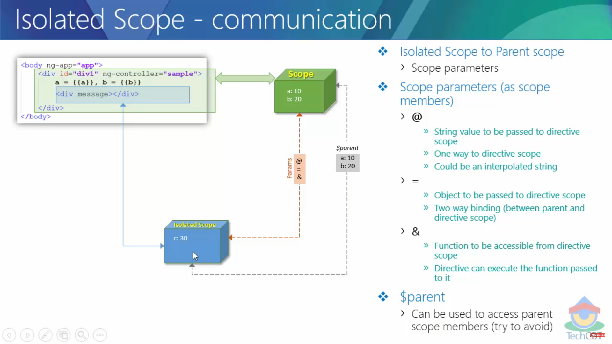

When we have some scenario such as we have to have communicate with parent scope or controllers scope then we can do that with the help of scope parameters as like mentioned below.

Scope parameters are nothing but as input decorator in the angular which used to get input from parent component to child component.

**Scope Parameters :-**

  - **@ :-**
  
    Whenever we want to pass interpolation or the string value which will be one way binding then we use `@` as scope parameter.

    ```
    app.directive('childComponent', function($interpolate){
    return {
        templateUrl: 'child.html',
        scope: {
            name: '@',
            salary: '@',
        },
    }
    })

    // Directive html
    Child Component : name =  {{name}} , Salary= {{salary}} 

    // Consumption of directive

    // Passing plain string values
    <child-component name="Directive Scope" salary="Directive Salary"></child-component> 

    // Passing interpolated values
    <child-component name="{{'Directive' + ' Scope' + ' With Interpolation'}}" salary="{{1000 * 30}}"></child-component> 


    // Passing parent scope variables in interpolation
    <child-component name="{{name}}" salary="{{name}}"></child-component> 
    ```

    **Alias declaration for inputs :-**

    Whenever we declare the scope parameters without anything we need to values against the same varaible to which they bound in directives.

    When we want to take input to directives isolated scope with different alias or attribute names then we need to specify as `@attrbuteName` as like menitioned below.

    ```
    app.directive('childComponent', function($interpolate){
    return {
        templateUrl: 'child.html',
        scope: {
            name: '@childName',
            salary: '@childSalary',
        },
    }
    })

    // Directive html
    Child Component : name =  {{name}} , Salary= {{salary}} 

    // Consumption of directive

    <child-component child-name="Directive Name" child-salary="Directive Salary"></child-component>
    ```

    We can access the scope values into directive's controller as well with through the scope object itself as like mentioned below.

    ```
      app.directive('childComponent', function($interpolate){
        return {
            templateUrl: 'child.html',
            scope: {
                name: '@childName',
                salary: '@childSalary',
            },
            controller : function(scope,element,attr){
                // Accesing input data in directive's controller
                scope.annualSalary = scope.salary * 12;
            }
    }
    })
    ```
  - **= :-**
  
    Whenever we want to pass object to the directive scope which needs to be 2 way binding then we use `=` as scope parameter.

    ```
    // Directive
    app.directive('childComponent', function($interpolate){
        return {
            templateUrl: 'child.html',
            scope: {
                emp:'='
            },
        }
    })

    // Directive html
    Child Component : name =  {{emp.name}} , Salary= {{emp.salary}}
    <br>

    // Consuming Directive

    // We can pass directly object or its refrence from parents scope
    <child-component emp="{name:'First Employee', salary : 45000}"></child-component>
    ```

    We can use the alias for the input function in the same order as we have saw earlier for other scope params.

  - **& :-**
    
    Whenever we want to pass function from parent scope to directie scope then we use `&` as scope parameter.

    When we need to call the parent function from directive then we need to call the function with 2 banana braces like `ng-click="parentFunction()(params)"` as like mentioned below.

    ```
    // Parent Scope function
      $scope.alertEmp = function (name,salary) {
        alert(`Hi ${name}, Your salary is ${salary}`);
        // alert(`Hi ${$scope.name}, Your salary is ${$scope.salary}`);
    }

    // Directive
    app.directive('childComponent', function($interpolate){
        return {
            templateUrl: 'child.html',
            scope: {
                emp: '=childEmp', // Taking data object from parent
                displayEmp : '&' // Taking function as input
            },
        }
    })

    // Directive HTML
    Child Component : name =  {{emp.name}} , Salary= {{emp.salary}}
    <br>
    <button class="btn btn-primary" ng-click="displayEmp()(emp.name,emp.salary)">View Details</button>

    // Consuming directive
    <child-component child-emp="{name:'First Emp', salary:45000}" display-emp="alertEmp"></child-component>
    ```

    **Calling parent function with data object rather than single params :-**

    For passing data to parent function in terms of object format we need to declare in direction consumption wiht `alias="functionName(param1, param2)"` and then we can call the function with arguements as `ng-click="functionNameInDirectiveScope({param1 : value, param2 : value})"` as like mentioned below.

    ```
    // Parent Scope function
      $scope.alertEmp = function (name,salary) {
        alert(`Hi ${name}, Your salary is ${salary}`);
        // alert(`Hi ${$scope.name}, Your salary is ${$scope.salary}`);
    }

    // Directive
    app.directive('childComponent', function($interpolate){
        return {
            templateUrl: 'child.html',
            scope: {
                emp: '=childEmp',
                displayEmp : '&'
            },
        }
    })

    // Directive HTML
    Child Component : name =  {{emp.name}} , Salary= {{emp.salary}}
    <br>
    <button class="btn btn-primary" ng-click="displayEmp()({name : emp.name,salary : emp.salary})">View Details</button>

    // Directive Consumption
    <child-component child-emp="{name:'First Emp', salary:45000}" display-emp="alertEmp(name,salary)"></child-component>
    ```

    We can use the alias for the input function in the same order as we have saw earlier for other scope params.

    **Calling Parent method from directives controller :-**

    We can call the parent method from directives controller as well by creating seprate method which will be called by directives template & that directive method will give call to parents method as like mentioned below.

    ```
    // Parent Scope function
    $scope.alertEmp = function (name,salary) {
        alert(`Hi ${name}, Your salary is ${salary}`);
        // alert(`Hi ${$scope.name}, Your salary is ${$scope.salary}`);
    }

    // Directive
    app.directive('childComponent', function($interpolate){
        return {
            templateUrl: 'child.html',
            scope: {
                emp: '=childEmp',
                displayEmp : '&'
            },
            controller: function ($scope, $element, $attrs) {
                $scope.executeParentMethod = function () {
                    $scope.displayEmp()()
                    // {name : $scope.emp.name, salary : $scope.emp.salary}
                }
            }
        }
    })

    // Directive HTML
    Child Component : name =  {{emp.name}} , Salary= {{emp.salary}}
    <br>
    <button class="btn btn-primary" ng-click="executeParentMethod()">View Details</button>

    // Consumption of directive
    <child-component child-emp="{name:'First Emp', salary:45000}" display-emp="alertEmp"></child-component>
    ```

  - **$parent :-**
    
    `$parent` also can be used to access the parent scope members but we should use this only in case when we are not able to accomplish anything with scope parameters.


    ```
    // Parent Scope function
      $scope.alertEmp = function (name,salary) {
        alert(`Hi ${name}, Your salary is ${salary}`);
        // alert(`Hi ${$scope.name}, Your salary is ${$scope.salary}`);
    }
    
    // Directive
    app.directive('childComponent', function($interpolate){
    return {
        templateUrl: 'child.html',
        scope: {
            emp: '=childEmp',
            displayEmp : '&'
        },
        controller: function ($scope, $element, $attrs) {
            $scope.executeParentMethod = function () {
                $scope.displayEmp({name : $scope.$parent.employee.name, salary : $scope.$parent.employee.salary})
            }
        }
    }
    })

    // Directive Template
    Child Component : name =  {{emp.name}} , Salary= {{emp.salary}}
    <br>
    <button class="btn btn-primary" ng-click="executeParentMethod()">View Details</button>

    // Consumption of directive
    <child-component child-emp="{name:'First Emp', salary:45000}" display-emp="alertEmp(name,salary)"></child-component>
    ```

### Transclusion

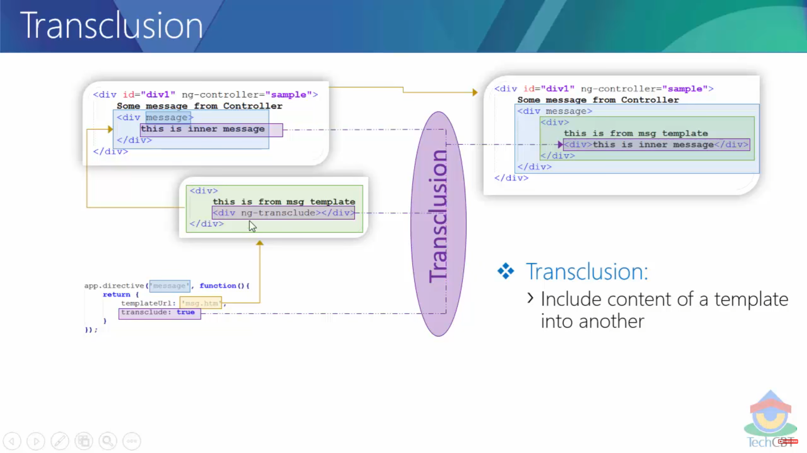

Transclusion is nothing but content projection as we have in angular as `ng-content`,  We can pass the html from parent component or view to directive as we pass the html from parent to child in angular.

For using transculsion we need to mark `transclusion:true` while returning directive object like `{template :'sample.html',transclude:true}` In angularjs we have `ng-transclude` built-in directive which can be used on the element where you want to inject the template input from the parent as like mentioned below.

```
// Directive
app.directive('childComponent', function($interpolate){
    return {
        templateUrl: 'child.html',
        scope: {
            emp: '=childEmp',
            displayEmp: '&',
            transclude : true
        },
    }
})

// Directive Template
Child Component : name =  {{emp.name}} , Salary= {{emp.salary}}
<br>
Template Recieved by parent component = <div ng-transclude></div>

// Passing template from parent
<child-component child-emp="{name:'First Emp', salary:45000}" display-emp="alertEmp(name,salary)">
    <h1>Content recieved from parent component</h1>
</child-component>
```

- **How to use transclude in link :-**

    For using transclude in link method we need to import transclude as an `5th arguement` of link function & we need to call that method to get the template passed by the parent as like mentioned below.

    Make sure that transclude flag is marked as true in directive configuration else the transclude function will not be available.


    ```
    // Directive
    app.directive('childComponent', function($interpolate){
        return {
            templateUrl: 'child.html',
            scope: {
                emp: '=childEmp',
                displayEmp: '&',
                transclude:true
            },
            link: function (scope, iElement, iAttrs, controller, transclude) {
                let content = transclude();
                iElement.find('#transclusionDiv').append(content);
            }
        }
    })

    // Directive Template
    Child Component : name =  {{emp.name}} , Salary= {{emp.salary}}
    <br>
    Template Recieved by parent component = <div id="transclusionDiv"></div>
    ```

- **How to use transclusion in controller :-**

    Its similar as using in the link function, only difference is in the controller function its `4th argument` and everything rest is the same, We need to mark transclude true for using transclusion in the controller.

    ```
    // Directive
    app.directive('childComponent', function($interpolate){
        return {
            templateUrl: 'child.html',
            scope: {
                emp: '=childEmp',
                displayEmp: '&',
            },
            controller: function ($scope,$element,$attrs,$transclude) {
                $scope.content = $transclude();
                $element.find('#transclusionDiv').append(content);
            }
        }
    })

    // Directive Template
    Child Component : name =  {{emp.name}} , Salary= {{emp.salary}}
    <br>
    Template Recieved by parent component = <div id="transclusionDiv"></div>
    ```

- **Creating our own transclusion directive :-**

    We can create our own directiv as well as like `ng-transclude` such as `your-directivename` and we can bind the content to element as we was using previous as like mentioned below.

    ```
    // MyTransclude Directive
    app.directive('my-transclude', function () {
        return {
            transclude:true,
            link: function (scope, iElement, iAttrs, controller, transclude) {
                let content = transclude();
                iElement.append()
            }
        }
    })

    // Directive Template
    Child Component : name =  {{emp.name}} , Salary= {{emp.salary}}
    <br>
    Template Recieved by parent component = <div my-transclude></div>
    ```

- **transclude method :-**

    

    Transclude functions is used when we dont want to use `ng-transclude` built-in directive and we want more control over the transcluded content. It creates instance of transcluded content with jquery dom element and transclusion scope if not created already only once if its not already created or else it reuses the already existing instance for transclusion.

    When we pass the callback function as well to the transclude method it clones the existing transclusion instance & creates its own scope rahter than reusing it. When the transclude used with the callback is called as `clone linking function`.

    When we want to use transcluded content to be rendered at multiple locations, we cant do it without clone linking function because as we saw earlier it reused that transcluded element which means it will remove the transcluded element from one location to the latest location. but when we use clone linking function everytime we call transclude it will return clone version of transcluded instance as like mentioned below.

    ```
    // Without clone linking function
    app.directive('my-transclude', function () {
        return {
            transclude:true,
            link: function (scope, iElement, iAttrs, controller, transclude) {
                let content = transclude();
                iElement.find('#element1').append(content);
                // Content will be shifted to last instance where we used transclude.
                iElement.find('#element2').append(content); 
            }
        }
    })

    // Directive Template
    Child Component : name =  {{emp.name}} , Salary= {{emp.salary}}
    <br>
    Template Recieved by parent component = <div id="element1"></div>
    Template Recieved by parent component = <div id="element2"></div>
    ```

    ```
    // With clone linking function
    app.directive('my-transclude', function () {
        return {
            transclude:true,
            controller: function (scope, iElement, iAttrs, transclude) {

                // Content will be rendered at the both places because we are cloning transcluded element instance.
                transclude((transEle)=>{
                    iElement.find('#element1').append(content);
                });
                transclude((transEle)=>{
                    iElement.find('#element2').append(content); 
                });
                
                
            }
        }
    })

    // Directive Template
    Child Component : name =  {{emp.name}} , Salary= {{emp.salary}}
    <br>
    Template Recieved by parent component = <div id="element1"></div>
    Template Recieved by parent component = <div id="element2"></div>
    ```


- **transclusion scope :-**

    

    As we know that scope gets created for controller, directive and when we use the ng-translcude then a transclusion scope also gets created for it before its content get inserted in the directive's template.

    - **transclusion scope & directive shared scope :-**

        

        As we know that in directive by default directive scope inherits all the properties & values from the parent component or controller with the help of proto and same scope gets inherited into the transclusion scope as well.

        So all the properties & values from parent component will be available to the transclusion scope.

        ```
        app.controller('sampleCtrl',function($scope){
              $scope.employee1 = {
                salary: 45000,
                name : 'First Employee'
            }
        })
        app.directive('child-component', function () {
        return {
            transclude:true,
            controller: function ($scope, $element, $attrs) {
                $scope.employee2 = {
                    salary: 55000,
                    name : 'Second Employee'
                }
            }
        }
        })

        // Directive Template
        <br>Directive Employee1 Salary = {{employee1.salary}}
        <br>Directive Employee2 Salary = {{employee2.salary}}
        <div id="element1" ng-transclude></div>

        // Controller
         Employee 1 Salary : {{employee1.salary}}
        <br>
        Employee 2 Salary : {{employee2.salary}}
        <child-component>
            <h1>Employee 1 Salary : {{employee1.salary}}</h1>

            // Here Employee 2 salary also will be visible because we are creatign employee2 in directive controller which is having shared scope
            <h1>Employee 2 Salary : {{employee2.salary}}</h1>
        </child-component>
        ```

    - **transclusion scope & directive inherited scope :-**
        
        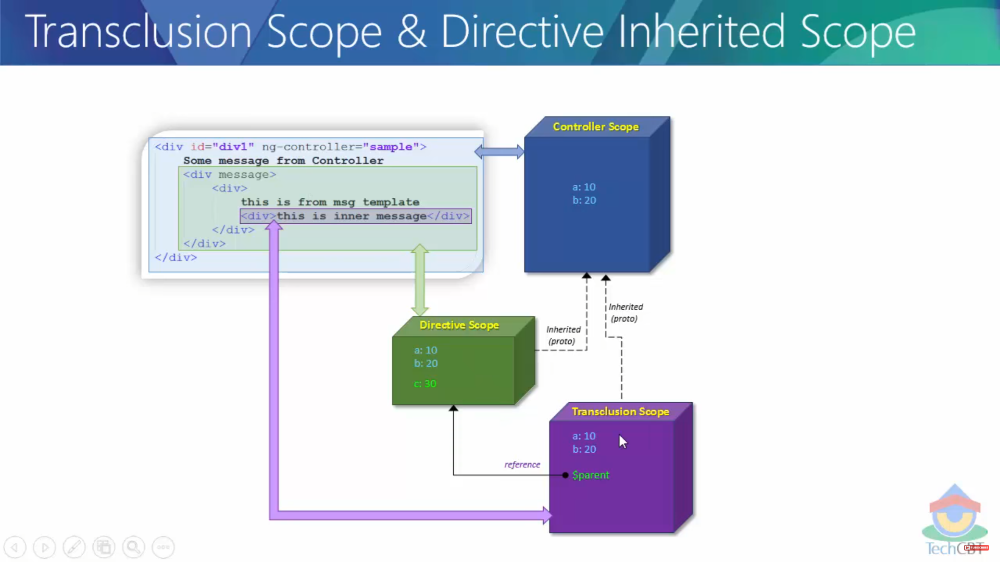

        As we know that when we have inherited scope in directive parents scope will be inherited to directive scope but directive members will be not accesible to parent scope.

        when transclusion scope is created inside the inherited directive enviornemnts its also going to have parent scope inherited to it but with the help of `$parent` we can access the directives inherited scope as well.

        ```
           app.controller('sampleCtrl',function($scope){
              $scope.employee1 = {
                salary: 45000,
                name : 'First Employee'
            }
        })
        app.directive('child-component', function () {
        return {
            transclude:true,
            scope:true,
            controller: function ($scope, $element, $attrs) {
                $scope.employee2 = {
                    salary: 55000,
                    name : 'Second Employee'
                }
            }
        }
        })

        // Directive Template
        <br>Directive Employee1 Salary = {{employee1.salary}}
        <br>Directive Employee2 Salary = {{employee2.salary}}
        <div id="element1" ng-transclude></div>

        // Controller
        Employee 1 Salary : {{employee1.salary}}
        <br>
        Employee 2 Salary : {{employee2.salary}}
        <child-component>
            <h1>Employee 1 Salary : {{employee1.salary}}</h1>
            
            // As we are using inherited scope on directive employee2 object will not be available in transclusion scope
            <h1>Employee 2 Salary : {{employee2.salary}}</h1>

            
            // But b exists in directive scope for which we have refrence through $parent and here employee2 salary is visible
            <h1>Employee 2 Salary : {{$parent.employee2.salary}}</h1>
        </child-component>
        ```

    - **transclusion scope & directive isolated scope :-**
        
        

        As we know that when we have directive with isolated scope we dont have any inheritance in directive scope of parent but we can access the parent compoentns members with the help of `$parent`.

        when transclusion scope is created inside the isolated directive scope it will still be inherited from parent scope which means it will have properties of parent controller or component but it will not be inherited properties from directive scope as its an isolated scope.

        We can access the directives members with the help of `$parent` inside the transclusion scope.

        ```
        app.controller('sampleCtrl',function($scope){
              $scope.employee1 = {
                salary: 45000,
                name : 'First Employee'
            }
        })
        app.directive('child-component', function () {
        return {
            transclude:true,
            scope:{},
            controller: function ($scope, $element, $attrs) {
                $scope.employee2 = {
                    salary: 55000,
                    name : 'Second Employee'
                }
            }
        }
        })

        // Directive Template
        // As we are having isolated scope employee1 will not be available so we are accesing it through $parent
        <br>Directive Employee1 Salary = {{$parent.employee1.salary}}

        <br>Directive Employee2 Salary = {{employee2.salary}}
        <div id="element1" ng-transclude></div>

        // Controller
        Employee 1 Salary : {{employee1.salary}}
        <br>
        Employee 2 Salary : {{employee2.salary}}
        <child-component>
            <h1>Employee 1 Salary : {{employee1.salary}}</h1>

            // b exists in directive with isolated scope for which we have refrence through $parent and here employee2 salary is visible
            <h1>Employee 2 Salary : {{$parent.employee2.salary}}</h1>
        </child-component>
        ```

    - **transclusion scope - custom scope / custom data :-**

        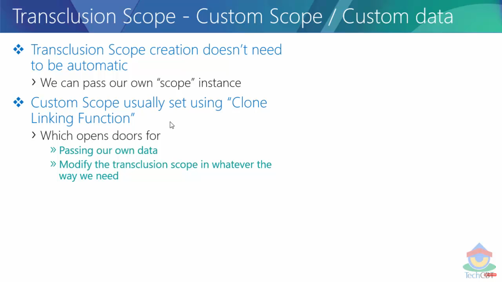

        We can pass our own custom scope as transclusion scope rather than let it create it automatically which can be used insid the transclusion content.

        If we have used some interpolation which points towards some variable but we want to reusue the transclusion content then we can passs our own scope to it for different data.

    
        ```
        app.controller('sampleCtrl',function($scope){
              $scope.employee1 = {
                salary: 45000,
                name : 'First Employee'
            }
        })
        app.directive('child-component', function () {
        return {
            transclude:true,
            scope:{},
            controller: function ($scope, $element, $attrs, $transclude) {
                $scope.employee2 = {
                    salary: 55000,
                    name : 'Second Employee'
                }

                // we can access transclusion scope with 2nd arguement to $transclude method callback
                $transclude(function(transEl, transScope){
                    transScope.employee2= {salary:55000};
                    $element.find('element1').append(transEl);
                })
            }
        }
        })

        // Directive Template
        <br>Directive Employee1 Salary = {{$parent.employee1.salary}}
        <br>Directive Employee2 Salary = {{employee2.salary}}
        <div id="element1"></div>

        // Controller
        Employee 1 Salary : {{employee1.salary}}
        <br>
        Employee 2 Salary : {{employee2.salary}}
        <child-component>
            <h1>Employee 1 Salary : {{employee1.salary}}</h1>

            // employee 2 data we have provided with transclusion scope which will be render here without $parent
            <h1>Employee 2 Salary : {{employee2.salary}}</h1>
        </child-component>
        ```

    We can create our own new custom scope from the directive scope with `let customScope = $scope.$new(true)` and we can attach that scope data to transclusion element by passing customscope as first arguement to `$transclude(customScope,callbackFn)` element as mentioned below.

    ```
     app.directive('child-component', function () {
        return {
            transclude:true,
            scope:{},
            controller: function ($scope, $element, $attrs, $transclude) {
                $scope.employee2 = {
                    salary: 55000,
                    name : 'Second Employee'
                }
                let customScope = $scope.$new(true);
                customScope.employee1 = {salary : 5000};
                customScope.employee2 = {salary : 5000};

                // we are passing first our custom scope as first arguemnt to $transclude method
                $transclude(customScope,function(transEl, transScope){
                    transScope.employee2= {salary:55000};
                    $element.find('element1').append(transEl);
                })
            }
        }
        })
    ```

### Routing


Routing on client-side is the navigations within the application when we have large scale enterprise application and different modules seprately.


**Routing in Angularjs :-**


There are multiple libraries & frameworks out there for routing but we are going to use ngRoute here in the application.


**ngRoute Configuration :-**

- First we need to inlcude the script for `ngRoute` which is `https://cdnjs.cloudflare.com/ajax/libs/angular-route/1.8.3/angular-route.min.js`.

- We need to import `ngRoute` in the module dependencies in array which is provided as second argument while declaring the module.

- We need to use `$routeProvider` to configure the routes with its `$routeProvider.when('/path',{templateUrl : 'my-template.html',controller : 'myController'})`.

- As we had `router-outlet` in angular we need to declare here the body element with `ng-view` directive which will inject our views into that div element.


Now the router config you have settle up you can navigate to that route with `index.html#routeName` or we can bind the route to anchor tag href like `<a href="#/route"></a>`.

When we navigate to any navigationURL then it makes an ajax request for that file and Once the template is loaded on the first navigation it gets stored in cache storage and it will not make `xhr` request for that file anymore.

**Default Route Configuration :-**

We can specify default route without specifying the route in router config as like `$routerProvider.when('/',{template:'<h1> Default Template </h1>'})` which will be loaded initially when you redirect to the page.

**WildCard Routing :-**

Wildcard routing is the route which gets triggered when no route matches with specified route which can be achieved by `$routerProvider.otherwise({templateUrl:'', controller:''})`

**redirection :-**

When we want to redirect to another route after firing an specific route then we can achieve it by providing `redirectTo:routeName` in the route configuration object passed as second arguement in `.when(route,config)`.

**Case Insensitive Routes :-**

Angularjs routes are by default case sensitive but if we want case insensitive routing thne we can do that by providing `caseInsensitiveMatch:true` in the route configuration object passed as second arguement in `.when(route,config)`.


**Home Page layout :-**

```
// Router Config
app.config(['$routeProvider', function ($routeProvider) { 
    $routeProvider
    .when('#/first', {
        template : '<h1>Welcome to the application 1</h1>'  
    })
    .when('#/second', {
        template : '<h1>Welcome to the application 2</h1>'  
    })
    // Default Route
    .when('/', {
        template : '<h1>Welcome to the default</h1>',
    })
}])
<body ng-app="sampleApp" class="main container p-5 " ng-ontroller="main">
<div class="row border">
    <h1>Header</h1>
</div>
<div class="row">
    <div class="col-sm-3 well border">
        <ul>
            <li><a href="#/">Default</a></li>
            <li><a href="#/first">First</a></li>
            <li><a href="#/second">Second</a></li>
        </ul>
    </div>
    <div ng-view class="col-sm-9 well border"></div>
</div>
</body>
```

**Navigate from controller :-**

Whenever we want to navigate after performing certain action in the controller then we need to use the built-in `$location` from which we can navigate to some path with `$location.path(route)` as like mentioned below.

```
// Controller
app.controller('myController', ['$location',function($location){
    $scope.navigateToProfie = function(){
        $location.path('/profile');
    }
}])
```

**Routing Parameters :-**

We have some scenarios where we need to pass some data from page1 to page2 but that we need to pass through route parameters.

**Steps to passing & catching route parameters :-**

- First we need to tell the route that we are expecting parameters with the route with `/route/:var` in which route can be anything and when we specify the colon then we are telling that its not the route but there will be parameters which needs to be assigned to the mentioned variable and that value will sent against that variable.

    ```
    $routerProvider.when('/sum/:a/:b',{
        templateUrl : 'sum-template.html',
        controller : 'sumController.js'
    })
    ```

- We need to create the controller & we need to inject `$routeParams` service for consuming those parameters as like mentioned below.
  
  ```
  app.controller('myController',['$routeParams',function($routeParams){
    $scope.a = $routeParams.a;
    $scope.b = $routeParams.b;
  }])
  ```

- We need can pass those parameters through template by `<a href="#/sum/10/20">` or we can pass the parameters through controller as like mentioned below.
- 
```
app.controller('myController', ['$location','$interpolate',function($location,interpolate){
    $scope.navigateToProfie = function(){
        const path = $interpolate('/sum/{{a}}/{{b}}')($scope);
        $location.path(path);
    }
}])
```

- As we have catched the parameters into the a & b now we can use those parameters into our tempalte according to our requirements as like mentioned below.

```
// Sum template
a = {{a}}
b = {{a}}
sum = {{parseInt(a) + parseInt(b)}}
```


**Redirection based on through params :-**

When we have such scenarios where we need to redirect the user to some another route based on his passed parameter to the current route then we can achieve that with the help of callback function against the `redirectTo: function(params,path,search)`.

Search here is the object of key value pairs for the passed query parameters else its an empty object.

path is the total path which provided by user from which we can derive the values if we want to do some string operations.

params is same as `$routeParams` which contains the passed parameters.

```
// redirection based on passed optionUrl
$routerProvider.when('/goTo/:optional/:a/:b',{
    redirectTo : function(params,path,search){
        // redirecting based on optional parameter
        if(params.optiona=='sum'){
            return '/' + params.optional + '/' + params.a + '/' + params.b
        }
        else{
            return '/' + params.optional;
        }
        
    }
})
```

**Optional Parameters :-**

When we declare parameters while declaring the route such as `/route/:var` if we dont provide that parameter the route will be considered as invalid and it will be redirected to wildcard route which we saw above with the help of `$routeProvider.otherwise('/route')`.

If we want to keep the parameter as optional then we need to provide the `?` after the variable such as `/route/:var?` then even if we dont pas the variable it will not be available in `$routeParams` but route will not be invalidated and user will be able to navigate to that route even without params.


### $route service & ajax requests with it

There are various things we can perform with route service like intercepting the route, checking, redirection, refresh etc. 

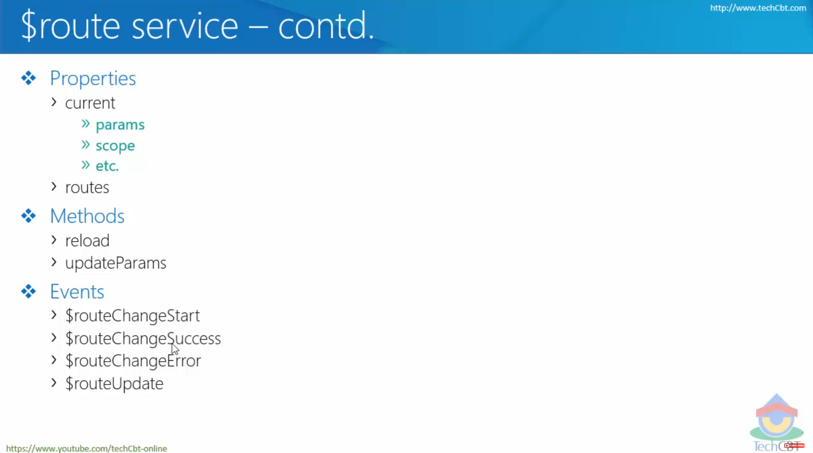

We can access params,scope etc for current route with `$route.current.params` and so on as mentioned above.

Lets consider if we are calling api on route change but sometimes we want to call the api as we call the route either with same & different data but angular by default does not