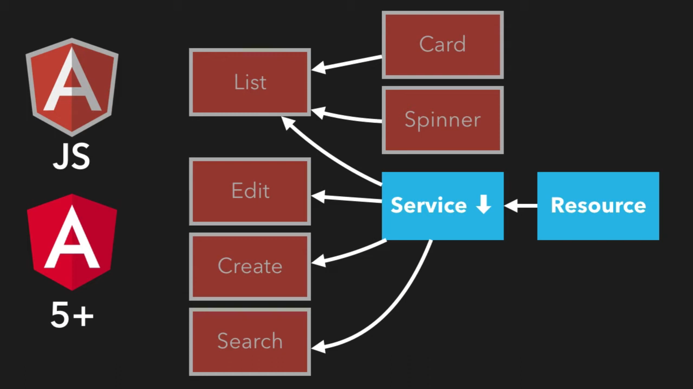
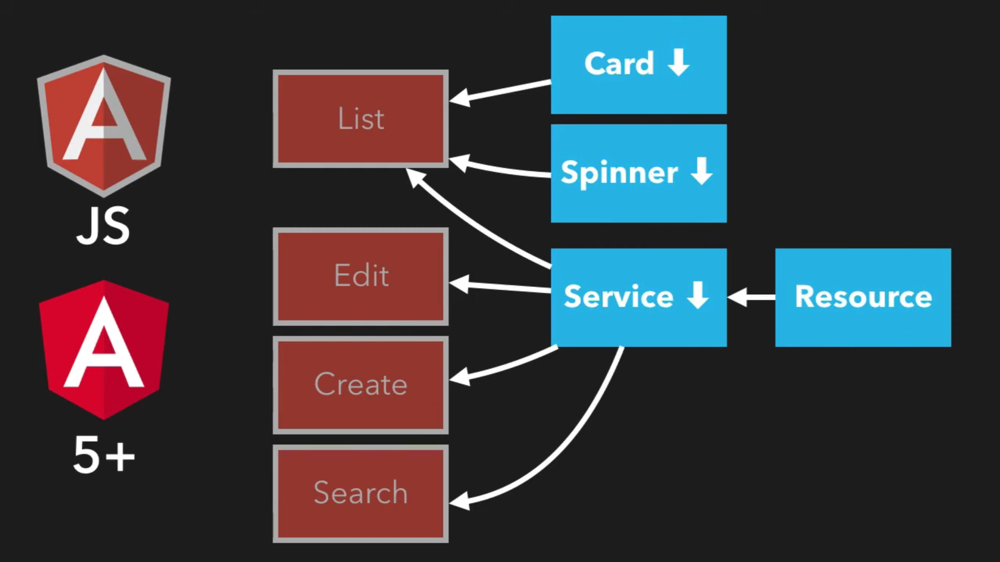
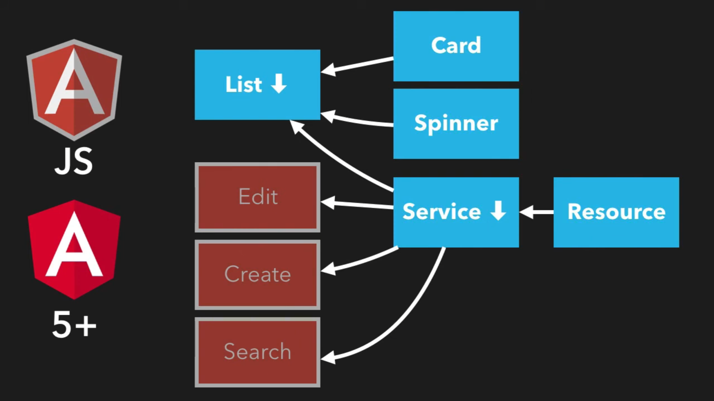
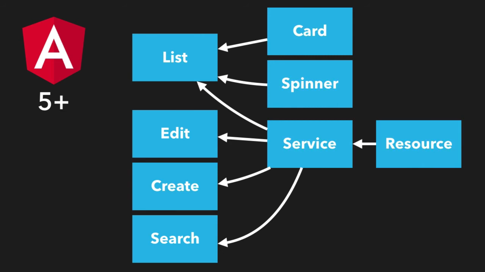

# AngularJS Migration

In this course we will be going to learn about the angularjs migration.

### Differences between terminologies

- **Angularjs Filters -** `Angular Pipes`
- **Angularjs Controllers -** `Angular Components`
- **Angularjs Directives with HTML -** `Angular Components`
- **Angularjs Directives without HTML -** `Angular Directives`
- **Angularjs Services / Factories :-** `Angular Services`

### Dual Booting


Dual booting means we run the angularjs & angular in the same application simulataneously so when we are migrating application we dont need to stop the application servies in the market.

### Change Detection


In angularjs we had `$scope.apply()` for the changes which not detected by angularjs but in the angular zones handle those things and we dont need to use them anymore.

## Interoperability


Interoperability means as we are running angularjs & angular in our hybrid application we need to sometimes use our `angular entities into angularjs which we call downgrade` & `angularjs entities into angular which we call upgrade`.

**interoperability example :-**


As you can see above if we have a service which we are using in list component for sharing data with other part of application and if our edit component is still not migrated yet so how we are going to access that data in edit component?

That's what exactly is interoperability means we will need to downgrade the service to use in angularjs edit component which we will going to look into more details.

### Root component or application entrypoint

In the hybrid apps angularjs does have most of the control of the application such as bootstraping the application & the entrypoint of application is from the angularjs itself.

Angularjs get bootstrapped first & then only anglular comes into picture in hybrid applications.

### Approach for migration







We go from leaves to root which means we migrate or reimplement resources, services, components and the foundation blocks of application and then we downgrade those to use in angularjs components which are not migrated yet.

Slowly slowly we take less dependency parts of the application we migrate those & use it angular as it is & if needed to use in angular we downgrade it.

**Final stage :-**



At one point we come to a point where every parts & components of applications are migrated to angular then we slowly remove the dependency from angularjs to angular such as packages, routings and bootstrapping application in the final stage.

### Plan for migration


- **Single Responsibility :-**

    In this phase we will be migrating files with single responsibility principles in which each file should only have one responsibility & entity.

- **Typescript & Webpack :-**

    In this phase we will be migrating to typescript & we will be building the application with webpack.

- **Angularjs 1.5+ :-**

    We will be migrating angularjs version to `1.5.x`, if your application is below that we need to upgrade it & if it is already we can upgrade to latest version or just keep as it is.

- **Componenti'fy :-**

    We will be able to convert our angularjs controllers into angularjs components which will be very easier for us to migrate it later to angular.

- **Modernise :-**

    In this phase we will be modernising writing of our application in which we will be writing in typescript, classes types etc.

    Most of the clients wants to stop at this stage because its looks modern view applicaiton & most of the things are pretty similar.

- **Dual boot :-**

    In the dual boot we will introducing angular into picture so we can run angular migrated components of application and also non-migrated component together.

- **Services to Angular :-**

    In this phase we will migrating all of the angularjs services to angular as the start of our migration process.

- **Components to Angular :-**

    In this phase we will be migrating all of the components which includes indirectly the features which gets used by the end user or some small parts of those features.

- **Routing to Angular :-**

    This would be major & largest phase of our migration in which we need to migrate routings in one go and we can stop dual booting after this phase.

    There are 2 ways for migrating routes those are migrating routes one by one but the healthier way is to migrate the routings at the end when every other components would be already migrated to angular.

- **Remove Angularjs :-**

    In this phase it will be moreover cleaning phase, removing templates, older files, combining css and etc

    In the end we will be removing angularjs from the application.

### Angularjs & Angular Style guide

Angularjs style guide is the best practices to implement in our angularjs application according to industry standards.

We have style guide for angular as well which we will be able to go through before migrating our application & migrating that application according to industry standards & best practices itself.

**References :-**
- **Angular :-** `https://www.johnpapa.net/angular-style-guide/`
- **Angularjs :-** `https://github.com/johnpapa/angular-styleguide?ref=johnpapa.net`

### STEP 1 Single responsibility

In this step we will going to move consolidated files into their individual files.

For example if we have controllers, filters, services, directives coupled into single files we need to segrigate those in individual files such that every file should have only one controller, service, filter and directive etc.

After segrigating entities per file we need to create their directories such as `services/`, `filters/`, `directives/` and place all your controllers, services & directives into it.

### STEP 2 Typescript & Webpack

- **Replace js to ts & bundle into index.ts :-**

    In this step we need to rename all the `.js` files to `.ts` & we are going to take advantage of typescript moduleing feature for bundelling our controllers, directives, services etc.

    Create `index.ts` file in every directory which we created in earlier step such as `index.ts` in `services/`, `/directives`, `/services` etc.

    ```
    // Index.ts for controllers.
    import './oneController.ts'
    import './twoController.ts'

    // Index.ts for directives
    import './oneDirective.ts'
    import './twoDirective.ts'

    // Index.ts for services
    import './oneService.ts'
    import './twoServices.ts'
    ```

- **Removing bower & shifting dependencies to npm :-**

  - In the first step we need to copy paste `dependencies` section from `bower.json` to `package.json`.

  - Resolve the Errors you will encounter.
    
      - rename the packages from camelcase to snake case.
      - resolve the naming conventions of packages version from `#^1.2.0 or @1.20.0` to `^1.2.0 & 1.20.0`.
    - the packages which are not having versions available check out the versions & install the healthier one with lts & udpate its version in `package.json`.

- **Prepare build tools for bundelling & processing ts files with webpack :-**

    `npm install rimraf ts-loader typescript webpack --save-dev`

    - **rimraf :-** package for removing and adding files.
    - **ts-loader :-** package for loading typescript files.
    - **typescript :-** typescript for processing our ts files.
    - **webpack :-** bundeller for typescript files into single javascript files.

- **Implementing tsconfig.json :-**

    In order to know typescript how to convert the typescript files to JavaScript files the required configuration we can implement in `tsconfig.json`.

    `Copy paste tsconfig.json from angular project & make sure target should be es5`

    ```
    /* To learn more about this file see: https://angular.io/config/tsconfig. */
    {
    "compileOnSave": false,
    "compilerOptions": {
        "baseUrl": "./",
        "outDir": "./dist/out-tsc",
        "forceConsistentCasingInFileNames": false,
        "strict": false,
        "noImplicitOverride": false,
        "noPropertyAccessFromIndexSignature": true,
        "noImplicitReturns": true,
        "noFallthroughCasesInSwitch": false,
        "sourceMap": true,
        "declaration": false,
        "downlevelIteration": true,
        "experimentalDecorators": true,
        "moduleResolution": "node",
        "importHelpers": true,
        "target": "ES2022",
        "module": "ES2022",
        "useDefineForClassFields": false,
        "lib": ["ES2022", "dom"]
    },
    "angularCompilerOptions": {
        "enableI18nLegacyMessageIdFormat": false,
        "strictInjectionParameters": false,
        "strictInputAccessModifiers": false,
        "strictTemplates": false
    }
    }
    ```

- **webpack.conf.json :-**
  
    In order to know webpack how to bundle our typescript files & convert into single javascript files we can implement in `webpack.conf.json`.

    `Copy paste webpack.conf.json from angular project`

    ```
    module.exports = {
        entry : "./src/app/main.ts",
        output : {
            filename : "src/dist/bundle.js
        },
        resolve : {
            extensions : [".webpack.js",".web.js",".ts",".tsx",".js"]
        },
        module : {
            loaders : [
                {test : /\.tsx?$/,loader : "ts-loader"}
            ]
        }
    }
    ```

    As we have mentioned the entry point as `main.ts` we need to create `main.ts` file.

  - **Implementing main.ts file :-**

      Main.ts file contains all the imports of every singe entity from the application, but as it can be tidious job to import each & everything one by one we have created `index.ts` file in which we have imported all the directory entities.

      And we can directly import the directory containing `index.ts` inside the `main.ts` so it `main.ts` will look for `index.ts` file in directory and imports all the entities automatically inside it as mentioned below.

      We need to make sure about the order because we use this things in the routing so all the other entities of the application should be installed prior to such modules.

      We need to import all the core libraries of angularjs as well as mentioned below.

      ```
      import 'angular';
      import 'angular-resource';
      import 'angular-animate';
      import 'ng-infinite-scroll';
      import 'angular-spinner';
      import 'angular-auto-validate/dist/jcs-auto-validate';
      import 'angular-ladda';
      import 'angular-strap';
      import 'angularjs-toaster';
      import 'angular-ui-router';

      import './app/main';
      import './services';
      import './directives';
      import `./filters`;
      import `./controllers`;
      import `./app.routes`;
      ```

      Basically we are removing all the script tags from the application `index.html` and combining all those things into `main.ts` and we need to import that single file into `index.html`.

    - **Executing bundle process :-**
  
    `./node_modules/.bin/webpack --bail --progress --profile`    

    As we have webpack installed locally we need to execute webpack by navigating it with `.node_modules` and with some necessary flags.

    We can create this command as npm script as well to which we can add this command and we can simply run `npm run scriptName` and that command will be executed.

    ```
    // package.json
    {
        scripts : {
            "build" : 'rimraf src/dist && webpack --bail --progress --profile'
        }
    }
    ```

    As we are using `npm scripts` we dont need to give the path for file as we was executing webpack with `.node_modules` npm automatically navigates to that package and executes it automatically.

    - **Resolving error while executing npm build :-**
  
      - **angular not defined :-** 
        
        As we are using `.ts` extension for each entitiy files in the tyepscript we need to let know typescript what & which angular you are using that we can resolve by importing `import * as angular from 'angular';` on the top of every file.

    - **strict type checking errors :-**

        You might recieve typechecking related errors such as any object not having any property or method so we need to resolve those typechecking errors.

  - **Removing dependencies from index.html :-**
  
    Once your build get sucessfull `dist/` folder will be get created in which there will be `bundle.js` file.

    Now finally we can remove all the dependencies from `index.html` with script and we can add only `<script src="dist/bundle.js"></script>` and our application would still work as fine as it was working previously.

### Step 3 Angularjs 1.5+

In this step we need to update the current version of angularjs project to atleast till `1.6.6` for using the feature of componentify of angularjs.

**We can upgrade version with the help of below steps :-**

- Update version into package.json for angularjs & its same version dependencies.
- run `npm install`
- run `npm run build` for webpack build in which we will be able to find if anything is broken in the application.
- If you face any kind of issues Google search that issue first & if you get solution then good to go.
- If you have any other problems then go the angular.js repository & checkout for migration guide or chnage log for what changes has been done in the angular version upgrade & what are the braking chnages might occur & how to deal with.

### Step 4 Componenti'fy

In this step we will be converting our directives to the components which are very simpler version of directives and which is used in latest version of angular.

**Steps to componentify directives :-**

- Create `components/` directory to keep migrated components into it.
  
- First rename the directive file to `name.directive.ts` TO `name.components.ts`.
  
- Create simple object with component name as like mentioned below.
    ```
    app.module('appName').directive('userCcard',['',function(){

    }]);

    let CardComponent = {

    }
    ```

- Create `selector : 'directiveName'` which is the name of directive and it will be consumed in the same wasy by using snake case such as `<directive-name></directive-name`as it was previously.

    ```
    app.module('appName').directive('userCard',['',function(){

    }])

    let CardComponent = {
        selector : 'userCard'
    }
    ```


- Integrate tempalte into its tempalte property or if your tempalte is so big then you can attach file against `templateUrl : 'myTemplate.html'` or `template : '<div></div>` as like mentioned below.
    
    ```
        app.module('appName').directive('userCard',['',function(){
            template : '<div></div>'
            // templateUrl : 'myTemplate.html'
        }])

        let CardComponent = {
            selector : 'userCard',
            template : '<div></div>'
            // templateUrl : 'myTemplate.html'
        }
    ```
  
- Integrate the bindings from `scope:{}` objects into inside the `bindings:{}` as like mentioned below.
  
    ```
      app.module('appName').directive('userCard',['',function(){
            template : '<div></div>'
            scope : {
                user : '='
            }
        }])

        let CardComponent = {
            selector : 'userCard',
            template : '<div></div>'
            bindings : {
                user : '='
            }
        }
    ```

- Implement the controller now but not as we used to do with `function(depedency){}` but with the new typescript class syntax as like mentioned below.


    ```
        // Controller
        angular.module('myApp').directive('userCard',['',function($scope,ContractService){
            templateUrl : 'templates/card.html',
            scope : {
                user : '='
            },
            controller : function($scope,ContactService){
                $scope.isDeleting = false;

                $scope.deleteUser = function(){
                    $scope.isDeleting = true;
                    ContactService.deleteUser($scope.user).then(function(){
                        $scope.isDeleting = false;
                    })
                }
            }
        }])

        // Component
        let CardComponent = {
            selector : 'userCard',
            template : `template goes here`,
            bindings : {
                user : '='
            },
            controller : class CardController{
                private contactService;
                private isDeleting;
                private user;

                contructor(ContractService){
                    this.ContactService = ContactService;
                    this.isDeleting = false;
                }

                deleteUser(){
                    this.isDeleting = true;
                    this.contactService.deleteUser(this.user).then(res=>{
                        ths.isDeleting = false;
                    })
                }
            }
        }
    ```

- Now remove the directive code from the file as like mentioned below.

    ```
        // Component
        let CardComponent = {
            selector : 'userCard',
            template : `template goes here`,
            bindings : {
                user : '='
            },
            controller : class CardController{
                private contactService;
                private isDeleting;
                private user;

                contructor(ContractService){
                    this.ContactService = ContactService;
                    this.isDeleting = false;
                }

                deleteUser(){
                    this.isDeleting = true;
                    this.contactService.deleteUser(this.user).then(res=>{
                        ths.isDeleting = false;
                    })
                }
            }
        }
    ```

- Now declare this component in our angualrjs modules as with `angualr.module('name').component('name',componentObj)` as like mentioned below.
  
  ```
      // Component
        let CardComponent = {
            selector : 'userCard',
            template : `template goes here`,
            bindings : {
                user : '='
            },
            controller : class CardController{
                private contactService;
                private isDeleting;
                private user;

                contructor(ContractService){
                    this.ContactService = ContactService;
                    this.isDeleting = false;
                }

                deleteUser(){
                    this.isDeleting = true;
                    this.contactService.deleteUser(this.user).then(res=>{
                        ths.isDeleting = false;
                    })
                }
            }
        }

    angular.module('appName').component(CardComponent.selector, CardComponent);
  ```

- If we do have built-in angularjs services used in our component we need to inject those services into contructor & assign it to properties as we did for `ContactService`  above as like mentioned below.

```
let CardComponent = {
    private $state;
    private $stateParams;

    contructor($state, $stateParams){
        this.$state = $state;
        this.$stateParams = $stateParams;
    }
}
```
- We need to make some changes in our templates now such as previously we was directly using variableNames in the template such as `<span> {{user.name}}</span>` but now we need to declare controller explicitly witht `$ctrl.user` as like `<span>{{$ctrl.user.name}}</span>` instead wherever its required.

- For using components as directives we will not be able to bind with `ng-controller="controllerName"` but now we wont be able to do that. We need to use our component tag directly in the html without doing specific anything related to controller binding such as `directiveName` as `<directive-name></directive-name>` and it will bind the controller automatically to that directive.

**Updating routings after componentify components :-**

Previously we was declaring the tempalte along with controller in routeConfig object but after componentify it will act as template as we saw earlier so we need to remove `controller:'ctrlName'` and we need to update template with `template : component-name` as like mentioned below.

```
// Previously 
$routerProvider.when('#/user-card',{
    template : 'user-card.html',
    controller : 'userCardController'
})

// After componentify components
$routerProvider.when('#/user-card',{
    template : '<user-card></user-card>',
})
```

**Updating index.ts & main.ts** 

- Rename the imported controllers in `index.ts` from `import "./userCardController.ts` to `import "./user-card.component` & make sure so snake case the filename form `useCardController.ts` to `user-card.component.ts` as you have imported into `index.ts`.
  
    ```
    // index.ts from /controllers
    import "./userController.ts";
    import "./userCardController.ts";

    // After componentify components
    import "./user.component";
    import "./user-card.component";
    ```

- Update the `main.ts` in which we previously imported controllers & directives but as we have deleted controllers & directives directory we need to remove those imports & and we need to import `/components` directory in it.

    ```
    // main.ts previously
    import "./controllers";
    import "./directives";

    // main.ts after componentify components
    import "./components";
    ```

**Check the build & resolve the errors :-**

Now execute the build with `npm run build` after which there might be possiblity we can recieve erros but that would be most probably for renaming, file names & imports.

Resolve the errors once & checkout if application is working fine & healthy as like previous.


### Step 5 Modernise 

In this step we will be modernising the entities in the application step by step as mentioned below.

**Steps Modernise Services or Services with $resource :-**

- If we have used `$resource` for making ajax requests in our application in the as there is no `$resource` available in angualr we need to replace it with `$http` as its present in the latest version of angular.
    ```
    // Factory with $resource
    angular.module('appName').factory('Contact',function($resource){
        return $resource(
            'http://localhost:3000/contacts/:id',
            {id : "@id},
            {
                update : {
                    method : 'PUT
                }
            }
        )
    })

    // Service with typescript classes & $http

    export class ContactService{
        private $http;
        private apiRoot:string = 'http://localhost:3000/contacts/';

        constructor($http){
            this.$http = $http;
        }

        getContact(id:string | number, params?:{string:string}){
            return this.$http.get(this.apiRoot + '/' + id, {params})
        }
    }
    ```

- Now remove the previous factory code & declare our service in the application with `app.module('name').service('name',serviceClass)`  as like mentioned below.

    ```
    // Service with typescript classes & $http

    export class ContactService{
        private $http;
        private apiRoot:string = 'http://localhost:3000/contacts/';

        constructor($http){
            this.$http = $http;
        }

        getContact(id:string | number, params?:{string:string}){
            return this.$http.get(this.apiRoot + '/' + id, {params})
        }
    }

    angular.module('ContactService',ContactService);
    
    ```

**Checkout build & Resolve the errors :-**

Create the build with `npm run build` through which we will be able to get to know any compile time errors are there and that would be most probably related to your service business logic.

So figure that out with debuggin & resolve it.


`Note :- Some cliets wish to stop after this step because everything is modernised now in the applicatoin such as components, services & also build tooing with webpack, it totally depends on the clients so we can deliver them till now.`


### Step 6 Dual boot

In this step we will be configuring our application for angular & in such a way that our application will be able to run simultaneously on angular & angularjs.

**package.json & polyfills.ts setup :-**

- Add the dependencies for angular which will be angular core packages which needs to be mentioned in the package.json & should be installed as like mentiond below.
  
    ```
    // package.json
    dependencies : {
        "@angular/animations": "^5.0.0",
        "@angular/common": "^5.0.0",
        "@angular/compiler": "^5.0.0",
        "@angular/compiler-cli": "^5.0.0",
        "@angular/core": "^5.0.0",
        "@angular/forms": "^5.0.0",
        "@angular/http": "^5.0.0",
        "@angular/platform-browser": "^5.0.0",
        "@angular/platform-browser-dynamic": "^5.0.0",
        "@angular/platform-server": "^5.0.0",
        "@angular/router": "^5.0.0",
        "@angular/upgrade": "^5.0.0",
        "angular-in-memory-web-api": "~0.5.0",
        "core-js": "^2.4.1",
        "rxjs": "^5.5.0",
        "web-animations-js": "^2.3.1",
        "zone.js": "^0.8.4",
    }
    ```
- Now install the added dependencies in our project by running command `npm install`.

- Now create `polyfills.ts` file in our `app/` directory and add some imports in it as mentioned below & basically polyfill.ts file does imports some of the functionalities does not supported by browser in it & also `zone.js` which is runtime environment of our angular.
  
  ```
    // Polyfills.ts
    // This file includes polyfills needed by Angular and is loaded before
    // the app. You can add your own extra polyfills to this file.
    import 'core-js/es6/symbol';
    import 'core-js/es6/object';
    import 'core-js/es6/function';
    import 'core-js/es6/parse-int';
    import 'core-js/es6/parse-float';
    import 'core-js/es6/number';
    import 'core-js/es6/math';
    import 'core-js/es6/string';
    import 'core-js/es6/date';
    import 'core-js/es6/array';
    import 'core-js/es6/regexp';
    import 'core-js/es6/map';
    import 'core-js/es6/set';
    import 'core-js/es6/reflect';

    import 'core-js/es7/reflect';
    import 'zone.js/dist/zone';
  ```

- Make sure to include `polyfills.ts` in our `main.ts` which is entrypoint of our application as mentioned below.

    ```
    // Main.ts
    import "./polyfills.ts".
    ```

- Check out the build for compile time erros & resovle the errors which will be related to imports in your polyfills.ts file & npm dependencies.

**Steps for implementing dual boot :-**

- First remove `ng-app="appname"` from `index.html` of your application which starts the booting of your application with the help of angualrjs as we will be booting with javascript & angualr.

- **First Way :-**
  - Import angular modules into your `main.ts` along with upgrade module which is used for dual booting & upgrading our application angualrjs to angular.
    
    ```
      // main.ts
      import {NgModule} from '@angular/core';
      import {BrowserModule} from '@angular/platform-browser';
      import {UpgradeModule} from '@angular/upgrade/static';
      import {platformBrowserDynamic} from '@angular/platform-browser-dynamic';
    ```

  - Create App Moudle with the help of NgModule decorator & import our basic BrowserModule & UpgradeModule in it.

      ```
      // main.ts
      import {NgModule} from '@angular/core';
      import {BrowserModule} from '@angular/platform-browser';
      import {UpgradeModule} from '@angular/upgrade/static';
      import {platformBrowserDynamic} from '@angular/platform-browser-dynamic';

      @NgModule({
          imports : [
              BrowserModule,
              UpgradeModule
          ]
      })
      export class AppModule{

          // Override Angular bootstrap module so it doesn't do anything
          ngDoBootstrap(){

          }
      }
      ```

  - Now bootstrap the application by using UpgradeModule with the follwing code.

      ```
      // main.ts
      import {NgModule} from '@angular/core';
      import {BrowserModule} from '@angular/platform-browser';
      import {UpgradeModule} from '@angular/upgrade/static';
      import {platformBrowserDynamic} from '@angular/platform-browser-dynamic';

      @NgModule({
          imports : [
              BrowserModule,
              UpgradeModule
          ]
      })
      export class AppModule{

          // Override Angular bootstrap module so it doesn't do anything
          ngDoBootstrap(){

          }
      }

      // Bootstrap using the UpgradeModule
      platformBrowserDynamic().bootstrapModule(AppModule).then(platFormRef =>{
          console.log('Bootstraping in Hybrid mode with Angular & AngularJs);

          const upgrade = platFormRef.injector.get(UpgradeModule) a UpgradeModule;

          upgrade.bootstrap(document.body,['appName']);
      });
      ```

- **Modern Way :-**

    - Create file name with `app.module.ts` & import the angualr core modules into it along with upgrademodule for dual booting & upgrading our application angualrjs to angular.

    ```
      // app.module.ts
      import {NgModule} from '@angular/core';
      import {BrowserModule} from '@angular/platform-browser';
      import {UpgradeModule} from '@angular/upgrade/static';
      import {platformBrowserDynamic} from '@angular/platform-browser-dynamic';


    ```

    - Create App Moudle with the help of NgModule decorator & import our basic BrowserModule & UpgradeModule in it.

        ```
        // app.module.ts

        import {NgModule} from '@angular/core';
        import {BrowserModule} from '@angular/platform-browser';
        import {UpgradeModule} from '@angular/upgrade/static';
        import {platformBrowserDynamic} from '@angular/platform-browser-dynamic';

        @NgModule({
            imports : [
                BrowserModule,
                UpgradeModule
            ]
        })
        export class AppModule{

            constructor(){

            }

            ngDoBootstrap(){

            }
        }
        ```

  - Now inject our UpgradeModule into AppModule constructor & bootstrap application with `upgradeMoudle.bootstrap(document.documentElement,['Emserve'],{strictDi: true})` as like mentioned below.

        ```
        // app.module.ts

            import {NgModule} from '@angular/core';
            import {BrowserModule} from '@angular/platform-browser';
            import {UpgradeModule} from '@angular/upgrade/static';
            import {platformBrowserDynamic} from '@angular/platform-browser-dynamic';

            @NgModule({
                imports : [
                    BrowserModule,
                    UpgradeModule
                ]
            })
            export class AppModule{

                constructor(private upgradeModule: UpgradeModule){

                }

                ngDoBootstrap(){
                    this.upgradeModule.bootstrap(doucment.documentElement,['appName'],{
                        // Configuration option used for strict type checking in templates
                        strictDi : true
                    });
                }
            }
        ```

    - Now import AppModule in main.ts & bootstrap AppModule with `platformBrowserDynamic().bootstrapModule(AppModule)` as like mentioned below.
  
    ```
    import { platformBrowserDynamic } from '@angular/platform-browser-dynamic';
    import { AppModule } from './app/app.module';

    platformBrowserDynamic().bootstrapModule(AppModule)
    .catch(err => console.error(err));
    ```

- Now run the build for error & warning checking and if you get any please resolve with the help of google search.

- Execute the application & checkout if there are any erros in the console & is application is working fine.


`Note :- In dual booting our modern angular is launching first & then angularjs gets loaded and bootstrap rest of the application in angualrjs in the browser so even if we have hybrid application you can consider that our entry point & whole application are in control with angularjs untill now.`


### Step 7 - Migrate Services

In this phase we need to convert our angularjs services to Latest angular services.

**Steps to migrate services :-**

- As we have dependencies with `$http` with our typescript angular servies we need to resovle the dependency with latest httpClient & use it as mentioned below.
```
// Service with typescript classes & $http

    export class ContactService{
        private $http;
        private apiRoot:string = 'http://localhost:3000/contacts/';

        constructor($http){
            this.$http = $http;
        }

        getContact(id:string | number, params?:{string:string}){
            return this.$http.get(this.apiRoot + '/' + id, {params})
        }
    }

    angular.module('ContactService',ContactService);

// Migrated
import {HttpClient} from 'angular/common/http';

export class ContactService{
        private apiRoot:string = 'http://localhost:3000/contacts/';
        constructor(private http:HttpClient){
        }

        // More stable approach for dependency injection 
        constructor(@Inject(HttpClient) private http:HttpClient){
        }

        getContact(id:string | number, params?:{string:string}){
            return this.http.get(this.apiRoot + '/' + id, {params})
        }
}
```

- Previously our `$http` clients used to return `Promise` but new http client returns Observable so if that service is getting used in angularjs components where we are consuming then we need to return promise by converting Observable to Promise.

If you have multiple services in which we need to convert Observable to Promise then we can import `toPromise()` in main.ts itself.

```
// Migrated
import {HttpClient} from 'angular/common/http';
imoprt {toPromise} from 'rxjs/operators';

export class ContactService{
        private apiRoot:string = 'http://localhost:3000/contacts/';
        constructor(private http:HttpClient){
        }

        getContact(id:string | number, params?:{string:string}){
            return this.http.get(this.apiRoot + '/' + id, {params}).toProimse();
        }
}
```

- Make service injectable with `Injectabe({provideIn:'root'})` as mentioned below.

```
// Migrated
import {HttpClient} from 'angular/common/http';
imoprt {toPromise} from 'rxjs/operators';

@Injectable({
    provideIn: 'root',
})
export class ContactService{
        private apiRoot:string = 'http://localhost:3000/contacts/';
        constructor(private http:HttpClient){
        }

        getContact(id:string | number, params?:{string:string}){
            return this.http.get(this.apiRoot + '/' + id, {params}).toProimse();
        }
}

angular.module('appName').service('ContactService',ContactService);
```

- Now our service is totally migrated so if we want to use that service into angularjs unmigrated components we need to downgrade the service and register into angularjs with `downgradeInjectable(migratedService)` and we need to register service with `factory` rahter then `service` with `angualr.module('appName').factory('ContactService',downgradeInjectable(migratedService));` as like mentiond below.

```
// Migrated Service
import {HttpClient} from 'angular/common/http';
imoprt {toPromise} from 'rxjs/operators';

@Injectable({
    provideIn: 'root',
})
export class ContactService{
        private apiRoot:string = 'http://localhost:3000/contacts/';
        constructor(private http:HttpClient){
        }

        getContact(id:string | number, params?:{string:string}){
            return this.http.get(this.apiRoot + '/' + id, {params}).toProimse();
        }
}

angular.module('appName').factory('ContactService',ContactService);
```

- Registering service into `appModule` & `HttpClientModule` for using it in migrated components by importing it in providers array as like mentioned below.

```
    // app.module.ts

            import {NgModule} from '@angular/core';
            import {BrowserModule} from '@angular/platform-browser';
            import {UpgradeModule} from '@angular/upgrade/static';
            import {platformBrowserDynamic} from '@angular/platform-browser-dynamic';
            import { ContactService } from './services/ContactService';

            @NgModule({
                imports : [
                    BrowserModule,
                    UpgradeModule
                ],
                providers : [
                    ContactService
                ]
            })
            export class AppModule{

                constructor(private upgradeModule: UpgradeModule){

                }

                ngDoBootstrap(){
                    this.upgradeModule.bootstrap(doucment.documentElement,['appName'],{
                        // Configuration option used for strict type checking in templates
                        strictDi : true
                    });
                }
            }
```
  
Now we can use that service into migrated as well as non-migrated components.

If we dont need to use our service in angualrjs thne we can remove its downgrading which with `angular,module('appName').factory('ContactService',downgradeInjectable(ContactService))` and as we have removed the angualrjs registration of service its totally been migrated.

Run the build with `npm run build` and check if any errors are there & if there resolve those errors.

`Note :- If you are recieving any error witht @Injectable() decorator if you remove it then we cant inject that service directly in consructor like constructor(private contactService:ContactService) instead we will need to inject with @Inject(ContactService) private contactService:ContactService then only it can be consumed in injected project.`

### Step 7 Migrating 3rd party modules or services


For using third party libraries form angularjs we have couple of ways such as mentioned below.

- **Re-Write :-**
  
  We can re-write those services as we migrate our services.

- **Find an Angular version :-**
  
  We need to find angular version for the package we are using in angularjs but if we don't have then we can look for alternate packages as well according to our requirements & compatibility.

- **Upgrading temporarily :-**

  We can upgrade our services temporarily to use in angular until we migrate our project to angular totally.

  As we can downgrade angualr things to use in angualrjs & we can also upgrade the angularjs things to use in angular.

**Steps to upgrade the dependencies :-** 

- Create seprate file for upgrading an serivice into angular with the semantic name.

- Create Injection token for Service with `InjectionToken<>(name)` as mentioned below.

    ```
    import {InjectionToken} from '@angular/core';

    export const Toaster = new InjectionToken("Toaster");

    ```

- Add the provider for the service which we wants to use from angularjs.

    ```
    import {InjectionToken} from '@angular/core';
    
    export const Toaster = new InjectionToken("Toaster");

    export function toasterServiceFactory(i:any){
        return i.get('toaster');
    }

    export const toasterProvider = {
        provide : Toaster,
        useFactory : toasterServiceFactory,
        deps : ['$injector']
    }
    ```

    we have declared toasterProvider in which we have used `provide:Toaster` where Toaster is injection token & `useFactory:toasterServiceFactory` in which toasterFactory is the function in which we get passed dependency as argument and with the help of `$injector.get('toaster')` we are getting dependencies from angularjs.

- Add the `toasterProvider` which we have declared in the file previously to the `AppModule` providers for registering angualrjs service in angular.

- For using it we need to use inject it with `@Inject(injectiontokenName) private varName;` as mentioned below.\

```
import {Inject} from '@angular/core';
import { Toaster } from "./factories/toasterFactory"

constructor(@Inject(Toaster) private toaster){

}
```

- Run the build & checkout if you are getting any erros & resolve it.

Now you can use angualrjs services in the angular as well as like we saw above.


### Step 8 Components Migration

In this section we will be migrating our components step by step into details.

**Built-in directives from angularjs to angular :-**

- **ng-class :-** `ngClass`

- **ui-sref :-** `href` until you migrate your routings then you can use `[routerLink]=['/url']`

- **ng-show & ng-hide:-** ng-hide => `[hidden]="true"` & ng-show => `[hidden]="true"` 

- **ng-if :-** `*ngIf`


**Steps to component migration :-**

- **Creating Angular Component from componentified angularjs compoennt :-**

    After we have componentified our angularjs components we have transformed controllers into components with object containing properties such as `selector, template, controller & bindings` if you can remember and now we will be extracting controller defined with class seprately out of the component.

    ```
       // Componentified AngularJS components
        let CardComponent = {
            selector : 'userCard',
            template : `template goes here`,
            bindings : {
                user : '='
            },
            controller : class CardController{
                private contactService;
                private isDeleting;
                private user;

                contructor(ContractService){
                    this.ContactService = ContactService;
                    this.isDeleting = false;
                }

                deleteUser(){
                    this.isDeleting = true;
                    this.contactService.deleteUser(this.user).then(res=>{
                        ths.isDeleting = false;
                    })
                }
            }
        }

    angular.module('appName').component(CardComponent.selector, CardComponent);

    // extracing class from componentified component 
    export class CardComponent{
         private contactService;
            private isDeleting;
            private user;

            contructor(ContractService){
                this.ContactService = ContactService;
                this.isDeleting = false;
            }

            deleteUser(){
                this.isDeleting = true;
                this.contactService.deleteUser(this.user).then(res=>{
                    ths.isDeleting = false;
                })
            }
    }
    ```

- **Migrating Angularjs component Bindings :-**

    If your component contains bindings as we used to declare into angualrjs componentified components, we need to convert those bindings into `Input() varname:type` & function which are getting passed from parent component `@Output() varName:type` and it can carry any data type with input & functions with output, it doesn't have any specific syntax for string value, array & object as like angularjs as like mentioned below.


    ```
        // Componentified AngularJS components
            let CardComponent = {
                selector : 'userCard',
                template : `template goes here`,
                // Convert this bindings into input
                bindings : {
                    user : '='
                },
                controller : class CardController{
                    private contactService;
                    private isDeleting;
                    private user;

                    contructor(ContractService){
                        this.ContactService = ContactService;
                        this.isDeleting = false;
                    }

                    deleteUser(){
                        this.isDeleting = true;
                        this.contactService.deleteUser(this.user).then(res=>{
                            ths.isDeleting = false;
                        })
                    }
                }
            }

        angular.module('appName').component(CardComponent.selector, CardComponent);

        // extracing class from componentified component 
        export class CardComponent{
                // Bindings migration with input
                @Input() user:any;

                private contactService;
                private isDeleting;
                private user;

                
                contructor(ContractService){
                    this.ContactService = ContactService;
                    this.isDeleting = false;
                }

                deleteUser(){
                    this.isDeleting = true;
                    this.contactService.deleteUser(this.user).then(res=>{
                        ths.isDeleting = false;
                    })
                }
        }
    ```

    We need to make sure that if we are using migrated component in angualrjs by downgrading it while passing input data & output event emitters to it we need to use angular syntax such as `[inputProperty]="inputValueVar" & (outputProperty)="methodName($event)"` etc.

    `Note :- Even if while we are using downgraded component in angularjs if our input & output property name as declared in camelCase such as userName, we need to use inside [propertyName] but as we are using it angularjs enviornment we need to convert that camelCase propertyName to snake case such as property-name. For ex : we consider above example for userName we will need to consume it as <app-child[user-name]="valueVar" (salary-updated)="method"></app-child> instead of <app-child [userName]="valueVar" (salaryUpdated)="method"></app-child>`


- **Decorating Component wiht @Component Decorator :-**

    Decorate the class with `@Component({selector:'name',tempalte:'',templateUrl:''})` so it will be prperly considered as angualr component in angular application as like mentioned below, we can use `template:'html'` if we want to write html in single file or if we want to create another file for it we can provide the file name against `templateUrl` inside component decorator configuration.

    ```
    @Component({
        selector : 'app-card',
        templateUrl : 'app-card.html.html'
    })
    export class CardComponent{
         private contactService;
            private isDeleting;
            private user;

            contructor(ContractService){
                this.ContactService = ContactService;
                this.isDeleting = false;
            }

            deleteUser(){
                this.isDeleting = true;
                this.contactService.deleteUser(this.user).then(res=>{
                    ths.isDeleting = false;
                })
            }
    }
    ``` 

- **Resolving Dependencies while component migration :-** 
  
    Change the dependencies injection to angular way as if we are injecting the service which is still not migrated & we are using those with injection token we need to inject them with `@Inject(serviceName) private var` or else we can import that services as angular way as mentioned below.
        
    ```
    @Component({
        selector : 'app-card',
        templateUrl : 'app-card.html.html'
    })
    export class CardComponent{
            private isDeleting;
            private user;

            // use @Inject() if your service is not migrated yet or getting used in hybrid mode.
            contructor(private contactService:ContractService){
                this.ContactService = ContactService;
                this.isDeleting = false;
            }

            deleteUser(){
                this.isDeleting = true;
                this.contactService.deleteUser(this.user).then(res=>{
                    ths.isDeleting = false;
                })
            }
    }
    ```

- **Migrating Forms while component migration :-**

    If your template contains any forms or any other angularjs functionalities we  need to find the alternative for it in latest angular & we need to implement it accordingly. Let's consider an example with form which we will going to migrate to reactive form.

    ```
    // Template
    <form class="form-group">
    <input type="text" class="form-control" ng-model='userForm.name'>
    </form>

    @Component({
            selector : 'app-card',
            templateUrl : 'app-card.html.html'
        })
        export class CardComponent{
                private isDeleting;
                private user;

                // use @Inject() if your service is not migrated yet or getting used in hybrid mode.
                contructor(private contactService:ContractService){
                    this.ContactService = ContactService;
                    this.isDeleting = false;
                }

                deleteUser(){
                    this.isDeleting = true;
                    this.contactService.deleteUser(this.user).then(res=>{
                        ths.isDeleting = false;
                    })
                }
        }

    // Migrated Form in Component & template
    <form class="form-group" [formGroup]="userForm">
    <input type="text" class="form-control" formControlName='name'>
    </form>

    // Component

    import {FormGroup, FormControl} from '@angular/forms
    @Component({
            selector : 'app-card',
            templateUrl : 'app-card.html.html'
        })
        export class CardComponent{
                private isDeleting;
                private user;
                private userForm;

                contructor(private contactService:ContractService){
                    this.ContactService = ContactService;
                    this.isDeleting = false;

                    this.userForm = new FormGroup({
                        name : new FormControl('')
                    })
                }

                deleteUser(){
                    this.isDeleting = true;
                    this.contactService.deleteUser(this.user).then(res=>{
                        ths.isDeleting = false;
                    })
                }
        } 
    ``` 

- **Migrating Ui-Router for using it in migrated components :-**

    If any of the component have the routing in it and while migration we need to upgrade the `uiRouter` or `ngRouter` to use the routing from angualrjs itself in angualr migrated components untill we completely replace the angualrjs routing with new angular inbuilt routing.

    As we know that we will be taking care about the routing migration in the very end so till then if we want to use the routing we need to upgrade to `ui-router` as we had updated the toaster previously.

    ```
    import {InjectionToken} from '@angular/core';

    // Prepare the injection token to use in provider
    export const UIRouterState = new InjectionToken('UIRouterState');

    // Factory to use against the provider
    export function UiRouterFactory(i){
        return i.get('$state');
    }

    // Ui Router Provider
    export const uiRouterProvider = {
        provide : UIRouterState,
        useFactory: UIRouterFactory,
        deps : ['$injector']
    }
    ```

    Register the `uiRouterProvider` in angular `AppModule` so we can use it in migrated components as like mentioned below.

    ```
    import {uiRouterProvider} from './path'

    // App Module
    providers : [
        uiRouterProvider
    ]
    ```
    Now we can inject uiRouterProvider into components with its injection token like  `@Inject(UIRouterState) private uiRouter;` as we can use its functionalities such as `this.$state.go('path')` etc.

- **Migrating Ui-Router Params for using it in migrated components :-**

    If any of the component have the using `routerParams or uiRouterParams` and for keep using it until we completely migrate our routing to angular inbuilt routing we need to upgrade uiRouter Params as same as we previously upgraded uiRouter as mentioned below.

    ```
    import {InjectionToken} from '@angular/core';

    // Prepare the injection token to use in provider
    export const UIRouterStateParams = new InjectionToken('UIRouterStateParams');

    // Factory to use against the provider
    export function UiRouterParamsFactory(i){
        return i.get('$stateParams');
    }

    // Ui Router Provider
    export const uiRouterParamsProvider = {
        provide : UIRouterStateParams,
        useFactory: UiRouterParamsFactory,
        deps : ['$injector']
    }
    ```

    Register the `UIRouterStateParams` in angular `AppModule` so we can use it in migrated components as like mentioned below.

    ```
    import {UIRouterStateParams} from './path'

    // App Module
    providers : [
        UIRouterStateParams
    ]
    ```
    Now we can inject UIRouterStateParams into components with its injection token like  `@Inject(UIRouterStateParams) private $stateParams;` as we can use its functionalities such as `this.$stateParams.user` etc.

- **Component Declaration in Angualr (AppModule) :-**
    
    After we extraced our component controller as class lets declare it in `app.module.ts` in declarations as well as entry component untill & unless we are using that component in hybrid mode.

    ```
       // app.module.ts

            import {NgModule} from '@angular/core';
            import {BrowserModule} from '@angular/platform-browser';
            import {UpgradeModule} from '@angular/upgrade/static';
            import {platformBrowserDynamic} from '@angular/platform-browser-dynamic';
            import { ContactService } from './services/ContactService';

            @NgModule({
                imports : [
                    BrowserModule,
                    UpgradeModule
                ],
                declarations : [
                    // declarations
                    CardComponent
                ],
                entryComponents : [
                    // declarations
                    CardComponent
                ]
                providers : [
                    ContactService
                ]
            })
            export class AppModule{

                constructor(private upgradeModule: UpgradeModule){

                }

                ngDoBootstrap(){
                    this.upgradeModule.bootstrap(doucment.documentElement,['appName'],{
                        // Configuration option used for strict type checking in templates
                        strictDi : true
                    });
                }
            }
    ```

- **Downgrading migrated component for using in angularjs as directive :-**

    Lets declare that migrated component as part of angularjs application as well so we can use that component in angualrjs views with `downGradeComponent(component:ComponentClass)` as we have used `downGradeInjectable()` from upgradeModule.

    ```
    // Component

    import {FormGroup, FormControl} from '@angular/forms
    @Component({
            selector : 'app-card',
            templateUrl : 'app-card.html.html'
        })
        export class CardComponent{
                private isDeleting;
                private user;
                private userForm;

                contructor(private contactService:ContractService){
                    this.ContactService = ContactService;
                    this.isDeleting = false;

                    this.userForm = new FormGroup({
                        name : new FormControl('')
                    })
                }

                deleteUser(){
                    this.isDeleting = true;
                    this.contactService.deleteUser(this.user).then(res=>{
                        ths.isDeleting = false;
                    })
                }
        } 

    angular.module('name').directive('cardComponent',downGradeComponent({component : CardComponent}))
    ```

    If we have inputs & outputs declared in our migrated component & if we want to use that components in angularjs as well we need to declare inputs & outputs while downgrading components as like mentioned below.

    ```
    angular.module('name').directive('cardComponent',downGradeComponent(
        {
            component : CardComponent,
            inputs : [''],
            outputs : ['']
        }))
    ```

    `Note :- We can downGrade all the components in `app.module.ts` itself as it will be at single place if we want to look for it.`

- **Consuming migrated component in angularjs :-**
  
    For using this component into angularjs we need to use it as directive as we used to convert our directive name from camelcase to snake case as mentioned below.

    ```
    // Component

    import {FormGroup, FormControl} from '@angular/forms
    @Component({
            selector : 'app-card',
            templateUrl : 'app-card.html.html'
        })
        export class CardComponent{
                private isDeleting;
                private user;
                private userForm;

                contructor(private contactService:ContractService){
                    this.ContactService = ContactService;
                    this.isDeleting = false;

                    this.userForm = new FormGroup({
                        name : new FormControl('')
                    })
                }

                deleteUser(){
                    this.isDeleting = true;
                    this.contactService.deleteUser(this.user).then(res=>{
                        ths.isDeleting = false;
                    })
                }
        } 

    angular.module('name').directive('appCardComponent',downGradeComponent({component : CardComponent}))

    // Some View
    <app-card-component></app-card-component>
    ```

- **Check Build & Resolve Erros :-**

    Lets run the bulid & check if everything is fine & if not please resolve the erros by researching or resolving your errors.


**Filters from angualrjs to angular :-**

As we don't have specific way for migrating filters from angularjs to angular we need to rewrite filters into the angular pipes by understanding & replicating their business logic & purpose as like mentioned below.

```
// angualrjs filter

import * as angular from  'angular';

angular.module('name').filter('myFilter',function(){
    return function(input,param){
        // Business Logic
        return // your output
    }
})

// Migrated Pipe
import {Pipe, PipeTransform} from  '@angular/core';

@Pipe({
    name : 'myPipe'
})
export class MyPipe implements PipeTransform{
    transform(){
        // Business Logic
        return // your output
    }
}
```

Once you have migrated your pipe create `index.ts` into pipes directory & import the created pipes in it, Import that `./pipes/index.ts` in main.ts for bundelling.

`Note :- Dont forget to import that pipe into appModules declarations array as like mentioned below.`

### Step 9 Migrating Routing

Till now we have migrated components, services, filters & directives from our angularjs applicatoin.

But we have some dependencies we are using from angularjs by upgrading those such as `toaster, $state, $stateParams etc`, before shifting to routing we need to remove dependencies of those upgraded services from angularjs & we need to find alternative ways of implementing these with angular version.

`Note :- This step comprises lot of things so we wont be able to boot & build our application until this step is completed so we need to complete all the things included in this step in one go.`

**Migrate angularjs services which we are using by upgrading :-**

There was some packages and services which we was using from angularjs by upgrading those with injection token & creating providers for it.

We need to checkout if preexisting packages have angular version of them & find the angualr version of those libraries or equivalent.

We Need to implement those packages with new ones & we need to remove the injection token of it along with their upgraded providers from AppModule.

**Migrating toaster :-**

- As we have toaster we have `angular2-toaster` package available which is the toaster implementation of angularjs toaster so we need to install it with `npm install angular2-toaster`.

- Register `ToasterModule & ToasterService` in AppModule by importing `ToasterModule.forRoot()` in AppModule Imports.

- For using toaster in components we need to inject the `ToasterService` like `private toaster:ToasterService` in constructor.

- Now we can use `toaster.sucess('')` etc from toaster as like its angularjs versions.

`Note :- Make sure your syntax is correct for new & old implementations if you are not rewriting toaster messgaes & only resolving toaster dependencies with migrated one`


**Injection token for toaster :-**

Previously we was using toaster service form angular js in our components like `@Inject(toaster) private toaster` but we have now `ToasterService`.

If we have 100's of components in application using toaster & if we dont want to resolve the dependencies in each & every component then we can declare injection token for toaster according to previous syntax & we can declare the `ToasterService` against that injection token in AppModule.

```
// Injection token for toaster service with previous syntax
export const toaster = new InjectionToken<string>('toaster');

// AppModule
providers : [
    {provide : toaster, useValue : ToasterService}
]
```

Now we dont need to even resolve the dependencies in each & every component due to syntax differenciation.

**Implementing AppComponent as entrypoint of our applilcation :-**

- First create the component called as AppComponent wiht selector `app-root` with `ng g c app` & change its selector to `app-root` & Dont forget to add it in AppModule declarations.

- Remove entryCmponents, Dual booting from application & simply boot `AppModule` as default angular implementation.

    ```
    // Dual Booting
     ngDoBootstrap(){
                    this.upgradeModule.bootstrap(doucment.documentElement,['appName'],{
                        // Configuration option used for strict type checking in templates
                        strictDi : true
                    });
    }

    // Removing Dual Booting
    ngDoBootstrap(){
        // Remove the code for booting application with upgradeModule.
    }
    ```

- Declare `AppComponent` as bootstrapping root component of application by declaring in `bootstrap:[AppComponent]` of AppModule.

- Integrate the `<app-root></app-root>` in index.html & shift the template code of `index.html` for home page layout into `app.component.html` so our homepage code now resting in `app.component.html` rather than `index.html` & app component is entrypoint of our application.

- Run `npm run build` to check out if we are facing any errors & resolve it if we are facing any.

- Don't expect application to be running at this time because we are in middle of process so wait patiently until we complete this step & completely migrate our application to angular.


**Migrating Angularjs routings to angular :-**

- Very first & import step we need to do is add `<base href="/">` in first line of head tag of `index.html` of our application.

- Replace `ui-view` with `<router-outlet></router-outlet>` for main router outlet & for named one such as `ui-view="header"` replace with `<router-outlet name="header"></router-outlet>`.

- Replace `ui-sref-active="active"` or equivalent of ngRouter wiht `[routerLinkActive]="active"` & `ui-sref="stateName"` to `routerLink="route"` & if we are using variable instead of route we can use `[routerLink]="varIncludingRoute"` & make sure to specify router outlet with name router outlet routing.

- Now lets create `AppRoutingModule` which holds the routing configuration of our application as like mentioned below & in routes array we declare our routes & dont forget to export `RoutingModule` from `AppRoutingModule`.

    ```
    import {RouterModule} from '@angular/router';

    const routes:Routs = [
        {
            path : '/',
            redirectTo : '/home',
            pathMatch : 'full'
        },
        {
            path : '/home',
            component : HomeComponent,
        }
    ]

    @NgModule({
        imports : [
            // While migrating from angualrjs use hasbased routing
            RouterModule.forRoot(routes,{useHash:true})
        ],
        exports : [RouterModule]
    })
    export class AppRoutingModule{}
    ```

- Register `AppRoutingModule` in `AppModule` so angular will get to know which module we need to use for routing.

- Now remove the upgraded dependencies form angularjs for `$state & $stateParams` & remove it from providers array as well from AppModule which are mentioned below.

```
// Remove downgraded dependencies from factories

    // Prepare the injection token to use in provider
    export const UIRouterState = new InjectionToken('UIRouterState');

    // Factory to use against the provider
    export function UiRouterFactory(i){
        return i.get('$state');
    }

    // Ui Router Provider
    export const uiRouterProvider = {
        provide : UIRouterState,
        useFactory: UIRouterFactory,
        deps : ['$injector']
    }
    
    // Prepare the injection token to use in provider
    export const UIRouterStateParams = new InjectionToken('UIRouterStateParams');

    // Factory to use against the provider
    export function UiRouterParamsFactory(i){
        return i.get('$stateParams');
    }

    // Ui Router Provider
    export const uiRouterParamsProvider = {
        provide : UIRouterStateParams,
        useFactory: UiRouterParamsFactory,
        deps : ['$injector']
    }

    // Remove providers from AppModule
    providers : [
        uiRouterProvider,
        uiRouterStateParamsProvider
    ]
```
- Remove downgrade logic for the components which we most probably do in AppModule for using angular component into angularjs functionalities as like mentioned below.

    ```
    // Remove Downgrade Logics from the application

    angular.module('name').directive('cardComponent',downGradeComponent({component : CardComponent}))
    ```

**Migrate $state, $stateParams like routing services :-**

- As we have already migrated our routing to angular now we need to migrate the router Services for `$state, $stateParams` to `Router,ActivatedRoute` instead.

- Which ever component we have used those services as dependencies remove its dependency injections & replace it with `private route:Route, private activatedRoute:ActivatedRoute`.

- Now use equivalent methods of properties from the `router & activatedRouter` for achiving same functionalities as required.


### Step 10 Remove Angularjs

In this section we will be removing angularjs totally from the application & some cleanup about the same.

**Remove Angularjs Dependencies :-**

- Remove downgradeComponent, downgradeInjectable all the downgrading code from the application.
  
- Remove `import * as angular from 'angular';` for using `angular.module()` etc from all the files from your application.

- Make sure we have migrated all the filters to the pips & remove the old angularjs filters folder & also remove it from `main.ts`

- Remove `app.js` or `app.ts` file which is main angualrjs application file.

- Remove upgraded providers file as well in which we had upgraded angularjs libraries & services.

- Remove angularjs imports from `main.ts` file.

- Remove dependencies from angularjs from `package.json` file.

- Make sure you are not loading any dependencies from `src/libs/` as its an bower package directory & Remove all the bower files.

- Remove libs folder for removing dependencies installed with the help of bower.

- Remove scripts & css links for angularjs packages & integrate for the new packages along with their documentations.

- Build the application & check if everything is working fine & resolve if any errors occurs

Thats how finally we have migrated from angularjs application to angular.


### Troubleshooting Issues


