# Web Design

### Web Design Softwares
There are some recommended softwares for web designing as per its ideal usage mentinoed below.

1. **Adobe photoShop :-**  Image Editing

    All the images are pixlated and bit mapped soo when you zoom in it you will find pixlated color box which needs to be remember by the PC and each and every image related editing creation we are going to use adobe photoshop.

2. **Adobe Illustrator :-** Vector Editing

    Vectors are the images or icons which are not pixlated and mainly when you zoom in it doesnt need to remember the colors of each pixel and all.

    Its basically points joining somewhere by having calucations in them and it even faster than images.

    And for vectors editing, creation, and icons we are going to use adobe illustrator.

3. **Adobe XD :-** Layouts

    Adobe XD is the simplified version of illustraor but more tools and features for the layouts designs soo we are going to use adobe xd for layouts mainly. 

### Foundation of softwares

- **Layers :-** 

    Layrers is the most important topic in the designing softwares bcoz we need to know the interaction of the layers with each other and in some design the layers can be 100 or 150 and we need to know which layers are it exactly soo we use layers naming in softwares as per our understanding.

- **Styling :-** 

    Styling and Typography styling is the most important concept in the web design bcoz for the better web design we need to maintain consistancy in headings, content, typography and all soo when we style our someting part and we can save it in styles soo we dont need to repeat it again and again, we can apply that styles directly on the components.

### Typography

We have 2 most important category for fonts are : 

- **Serif :-**  

    Serif Font With sharp edges.

    - **UseCases :-**
    
        1.  Old School feel and need to keep the supremacy of the website or need to show the tenure.

        2. Ex :- Banks, Old Companies and supremacy.

- **Sans Serif :-** 

    Which means in italic non serif soo this kind of fonts are modern fonts.

    - **UseCases :-**

        1.  We use sans serif fonts for modern and clean look and feel for the minimalistic Websites.

        2. Ex :- Latest Websites.

- **Fonts :-**

- **Font Scaling :-**

    **`typescale.com`** -  We can choose fonts from google fonts and We have scale dropdown where we have categories and there we can see on how it will look on the websites as well.

    **Most IMP :- Do not try to reinvent the wheel.** 

- **Excercies :-**

    Choose typographic combination of the quotes form your favouraite author and design daily quotes And we can use that content to build our social media profiles.

- **Fonts Styling Softwares :-**

    Take Title and paragraph which are the key compoenents of web design as well as graphic design.

    1. **Charecters Tab :-**

        - **font-family Dropdown :-** 

            Font family matters a lot bcoz it will define the type of your website and the minimalism on your website.
        
            We have bunch of fonts available inside that and as we mentioned above the list of fonts we can use the fonts similar to those rahter than reinventing the wheel.

        - **Font Boldness (Font Weight):-** 
            
            Font boldness is important thing like if we want to grab attention on our website we can use the bold fonts and it looks more black and the paragraph would like greyish.

        - **Tracking (Letter Spacing):-**

            Letter spacing effects on the premiumness on the text and it shows the importance of the spacing of the 2 letters in the text.

            `option + ->` Or `option + <-` For increasing and reducing in 
            softwares.

        - **Curning (Space between specific 2 letters) :-** 

            Curning can be more important topic bcoz When your titles are more big and if you notice there spacing in some letters is more or less we can use curning with the same shortcut.

        - **Font Size :-**

            Font size shows the importance of your fonts and that why we need to choose the apropriate ratios can be refered on `typescale.com` by seeing it how it will look on websites.

        - **Line Height :-**

            Line height totally effect on the readability of the paragraph and it should be that much ki we cant see a blank line between it and our focus should be on the font rather than spacing.

        - **Text Wrap :-**

            Text wrapping can be also most important thing bcoz human do not tend to move thier heads when the line will be too long and it wouldnt feel uncomfortable and we need to tilt the head while reading.

            Soo Text wrapping should be not too much long as well as not too much short and we prefer 10,11 words per line and further it would wrap the text.

**Typography Practice and example :-**

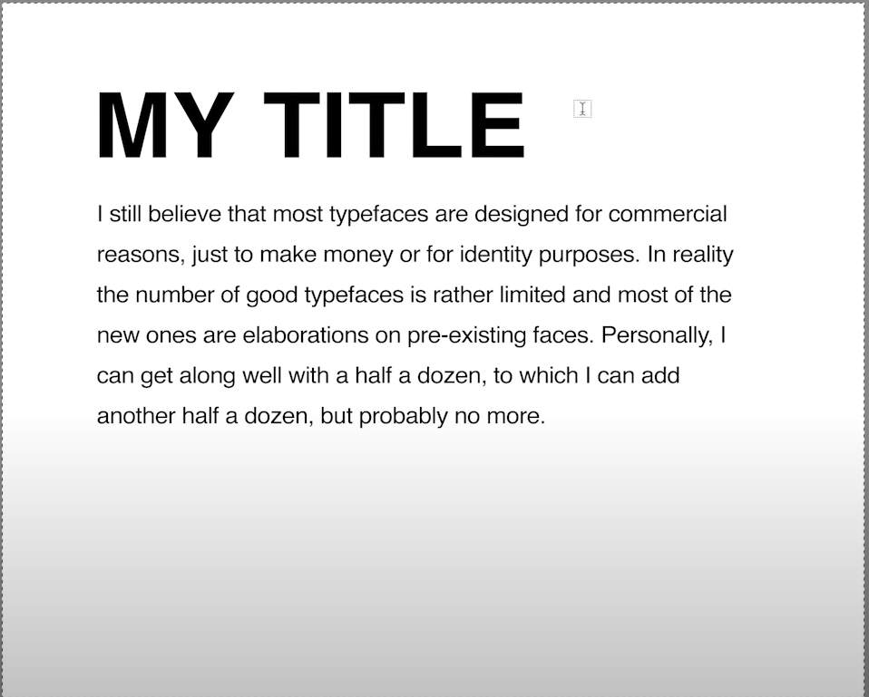

### Images and visuals

- **PhotoGraphy :-** 
    
    Where we need to show the things in reality like wearables and all where users can see the product or something in the reality.

    Content which is grounded and based on the reality.

    - **Resources :-** 

        1. unsplash
        2. adobe free cloud
        3. Gratisography
        4. FoodiesFeed - for food
        5. Pixels

- **Illustration :-** 

    Where we need to tell the story or process and where we cant tell a story in a single photo we can use the illustration.

    Content which is grounded on Story and based on the Process or story.

    - **Resources :-** 

        1. unDraw
        2. Vecteezy
        3. Pixabay
        3. Freepic
        

- **How To Pick images :-** 

    1. The Image should be high quality.

    2. Think about how image can be used in your project.

    3. Text should not overlay the content of the image.

    4. There should be empty space on the image on which can think about out layout on it.

    5. Backgound and text should be match as per the contrast.

    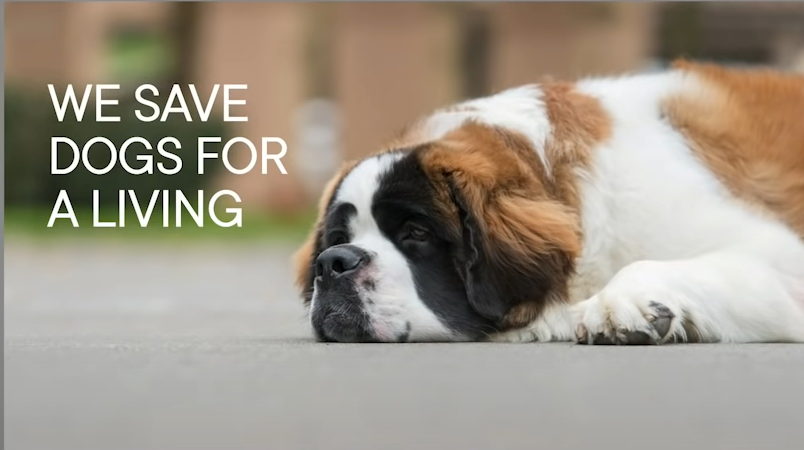

**Excercises :-**

- Pick Images from the free resources and try to use it in the context in the website.

- Visit `words` or `lapaninja` where the best website structures are there and try to find example of mathcing images and try to work with it.

### Layouts

The most important skills for the web design between crap websites and the beautiful and easy to consume.

**What makes good Layout :-**

- Crystal clear and not confusing.

- Intresting and not boaring.

- Helps user to consume content.

**Rules For Layout :-**

- We need to follow the hirarchy like `BIG, MEDIUM, and SMALL` and we need decide what should be the first focus like humans most probably mentally more focuses at faces or persons or visuals and that can be the `BIG`, and Hero text Which can be title which can grab attention after image should be `MEDIUM`, and the rest the actions and all can be small and that will be flexible which can be placed at its best position whihc would be `SMALL`.

- **Layout with sizing and hirarchy :-** 

    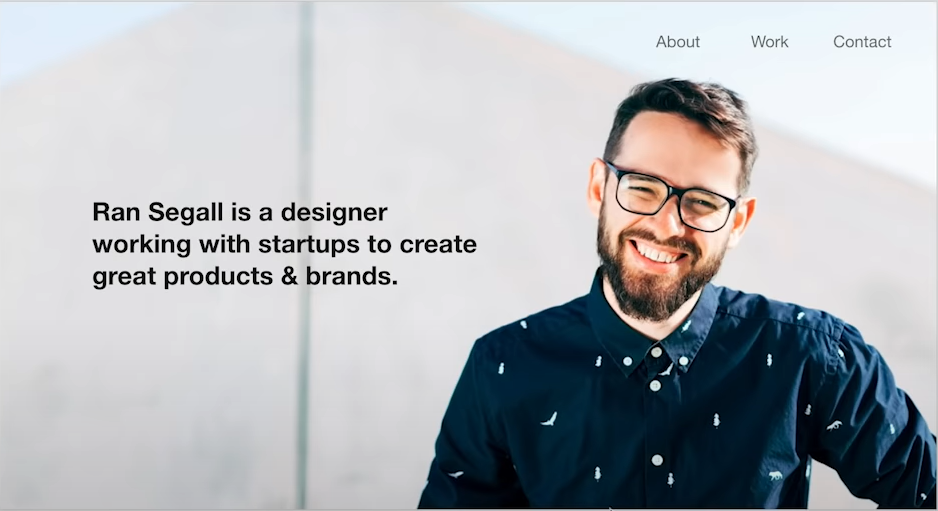

- Secondly We need to follow the `12 COLUMNS GRID` for the layout and our design should be as per that and its benifits as like mentioned below.

    - Nowdays the monitors are really big and biger sized and we cant spread our content at one end to another soo by following the grid our content will be always centered.

    - By using grid system for the layout your desing would be same on all size devices it would not be disturbed by using grid system.

    - The Space between the items should be decided on the type of content like that would be text or image that would not look great it would look tight and unreadable soo content spreading should be decided on the basis of contnet type.

- **Layout with 12 columns grid :-**

    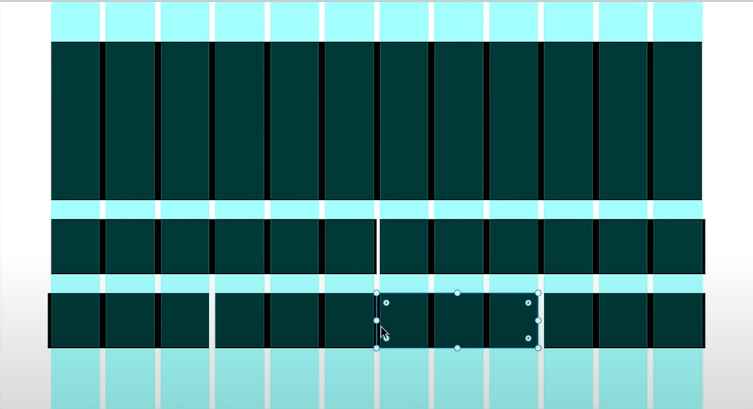

**Excersices :-** 

- Try to analyze use of grid system on the websites.

- Try to create the content or poster on the basis of the grid system with image,text and healines.

### Colors

First We will try to understand the meaning of the colors and its psychology.

- `Green` - 

    Green represents the nature like grass and leaves and can be used nature realted websites.

- `Blue` - 

    Blue is realted to blue soo it will give us the feeling of the optimistic and health and nature too.

- `Red` - 

    Red defined love and can be food related colour can be used in the realted websites.

For This psychology of the colour we have resource :- `empower yourself with color psychology`

**Most importantly we need to understand the meaning of the color and we need to realte with needs of the website, content type, and the audience of the website.**

**Best Resource for the colors :-** `Adobe Colour` To choose our colour pallate.

- **Colur by combinations :-** 

    We can make colour combinations with the help of patterns on the color wheel.

    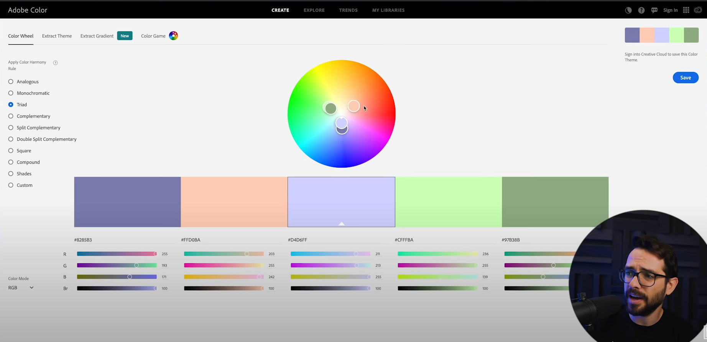

- **Colour by image :-** 

    We can choose our pallate colours by posting an image related to our content and we can get the colur pallate.

    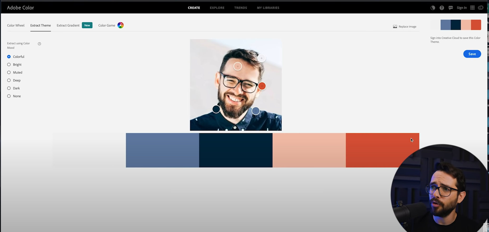

**Rule for using Colours :-**

- `60% 30% 10%` rule which comes from interior design and the fasion industry. 
    
    Which means **60% Primary Color** and **30% Secondary Color** and **10% innocent color**.

- Use the colours in that manner that can create contrast on the website and can be attentino grabbable.

### Hierarchy

Hierarchy is the thing by which we can take user with us on the website flow like how the users focus should eb on the parts of the website is achieved by hierarchy in the web design.

**3 Rules for hirarchy :-**

- **By Size :-** 

    We can create hirarchy with the sizing the big the more imp and others as per their importance level. Ex : any modern design which takes us as they want with the element sizing.

    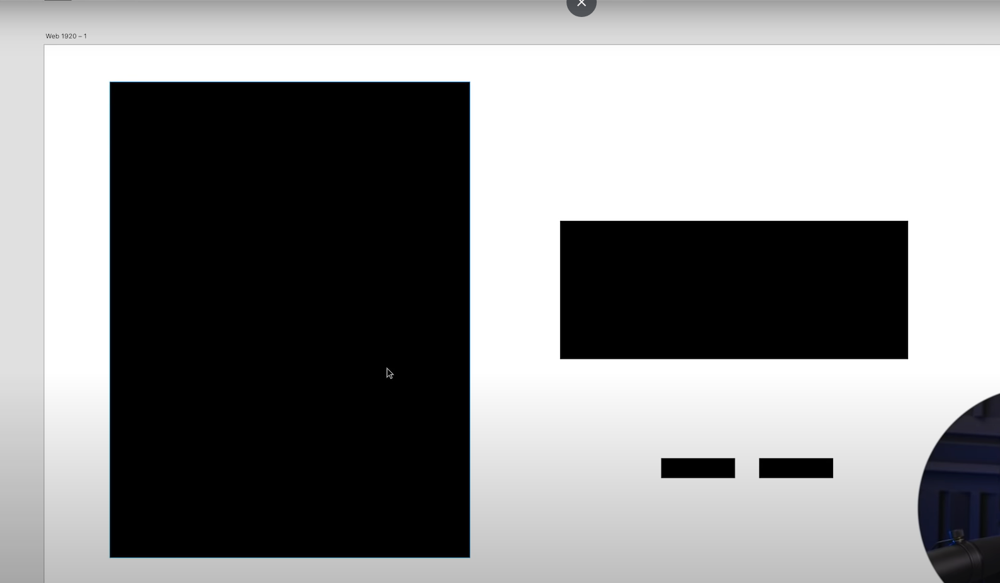

- **By Colour :-** 

    We can create hirarchy by the colour as well by its opacity or colour contrasts. Ex : `Buy Now` and `Learn More` buttons on the websites.
 

    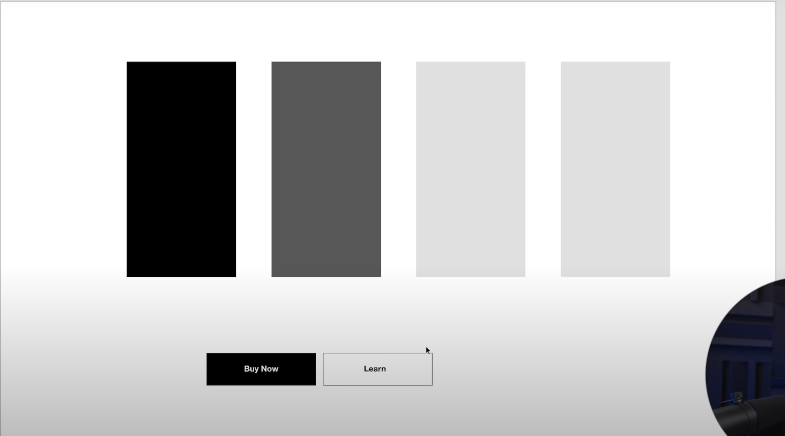

- **By Position :-** 

    We can create hirarchy by the position of the elements as well. EX : Subscription plans which they want to see us will be placed at different position.

    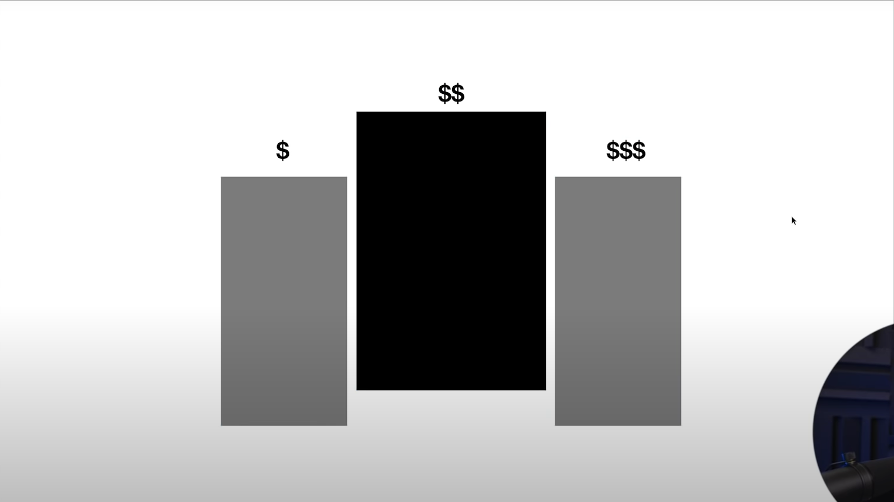

### WireFrame

Wireframe is the pre plannig of raw structure of the website which have to be first on the paper and if we need approval on that it should be on the software with the dummy content on the page with the lauyout.

- **Best Resource** :- 

    `platform ui kits` for faster desining with already availabel content we just need to do the placement and layouts with it.

    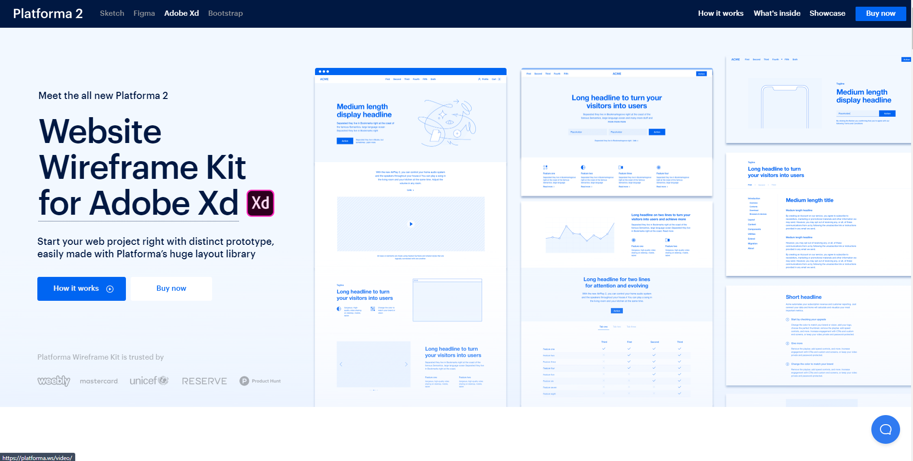

**Most Imp :- The most important thing about wireframing please prefer pen and paper for the quick ideas and its execution rahter than wasting time on the softwares.**

### Hero Section

Hero is the main section of the website which can be the first view after opening the website.

- **Passing the 15 seconds rule :-** 

    if Hero would not be attractive the user gonna leave in 15 seconds bcoz its not appropriate or it confusing or soo on.

- **Rules of hero section :-**

    - Where we are 

    - what is this?

    - what do you do?

    - what's in it for me?

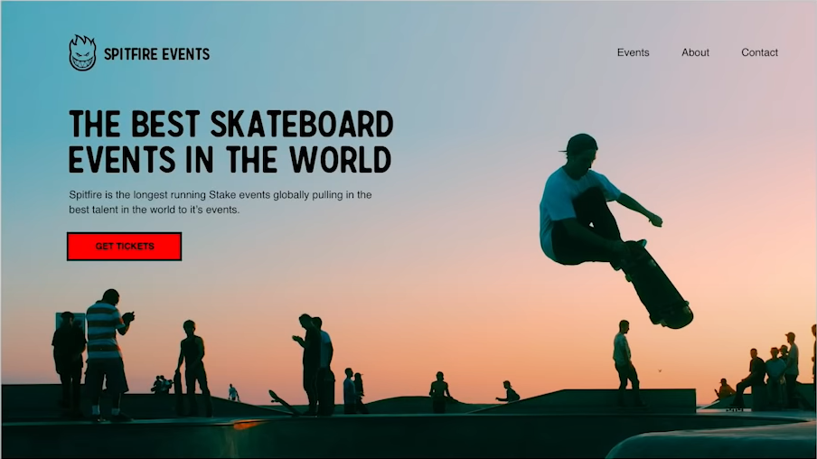

**Hero Explaination :-**

- **Where we are :-** 

    Our logo and company name defines where we are in the hero.

- **What is this :-** 

    Our Primary text tells us what we do.

- **What do we do :-** 

    Our paragraph below the primary text tells us what we do.

- **What's in it for me :-** 

    Our call to action button tells us the what we have for the client.

- **More About us :-** 

    Our navigation menu tells more about us.

**Most imp :- This all rules and the points should be there in your website which fullfills the users questions.**  

### Website content Structure

We need to undetstand the major goal of our website or maybe the goal of updation soo the content should be help about it.

**Steps and rules of content structure :-**

- Understanding the primary goal and secondary goal.

- List of the content types to support and achieve this goals.

- Card sorting to make it in structure.

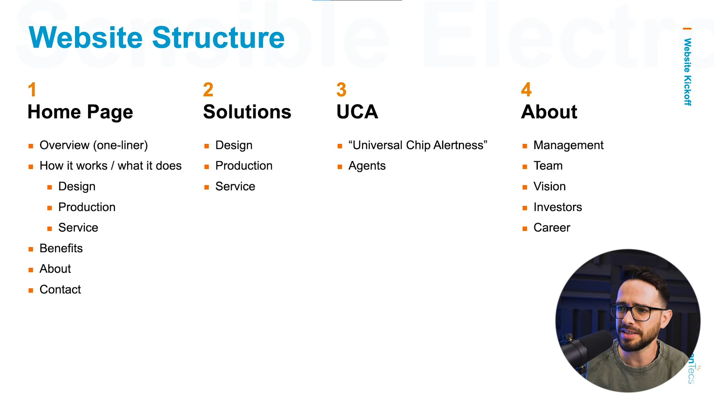

**One Pager :-**

One pager we can see in the modern websites in which all the content like home,about,serivces,contact and footer comes in single page and user just scroll down the page.

**We need to understand that our content should be on the single page or if its wast we should prefer the navigations.**

### UI & UX Best Practices

- **Navigation :-** 

    Navigation is can be the important part in the website which is mainly used to tell the user what we have available for you and where you are exactly on the website soo user can understand where is the user exactly on the website.

    **Best Practices :-**

     - User should know where he is exactly with the help of ui like some small changes in nav bar with its color or opacity.

     - Or we can use the `breadcrums` is also the best practice for the navigation.

- **Buttons :-**

    **UX Best practices :-**

    - `straight forward :-` Button text should be straight forward and understandable in the first attempt. it should not be confusing.

    **UI Best Practices :-**
    - `Identification :-` We can teach the user about the identification of button with mouse `cursor:pointer` and `hover effect` and consistant color for all the buttons and it should not be used in some another context soo it can be confusing for the user.

    - **Visual indication :-** `Cursor:pointer` only helps in the terms of website but on the mobile user should know the how its a button with its identification about like border, color, etc.

- **Contrast :-** 

    In every part of the website there should be maintained contrast soo user can easily focus on the things without any efforts.

    **Text on image :-** Text and image colours should have opposite contrasts soo first it would not mix up with the image and due to contrast user can easily focus on the both of the things.

### Photo Editing

We need to focus on the content and if the image is not as we want soo we can use the iamge editing to make the contrast on it and to focus on the content.

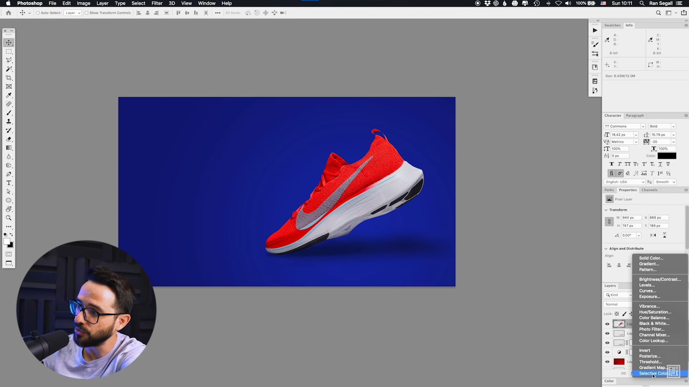

When we need to overlay the text on the images but we have the busy image soo we can use the color overlay soo we can create contrast on it as like mentioned below.

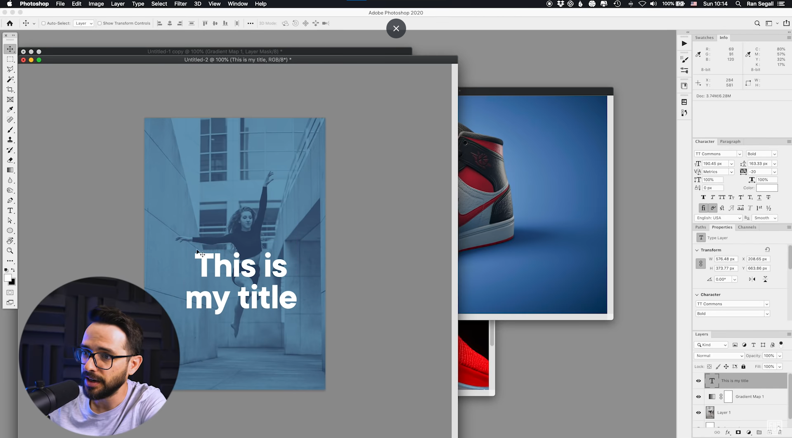

### Designing home page with XD

We are going to go through a small process how we gonna work on the adob xd for design.

**Steps and setups :-**

- First we need to set up the typography with the help of `typescale.com`.

- And we need to set it to styles.

- Then we need to create buttons and we need to make it component.

- We need to create nav bar with with same spacing in the letters in the navbars and the logo at left side and remember navbar should be streched out to full and there should be logo at left and navigations to the right.

- Then we are going to create hero soo we need image and h1, h2 or h3 maybe and cta buttons.

- And we need to overlay the image to create contrast with the informations.

All this actions will be performed by keeping our designing rules for that perticular section in mind.  

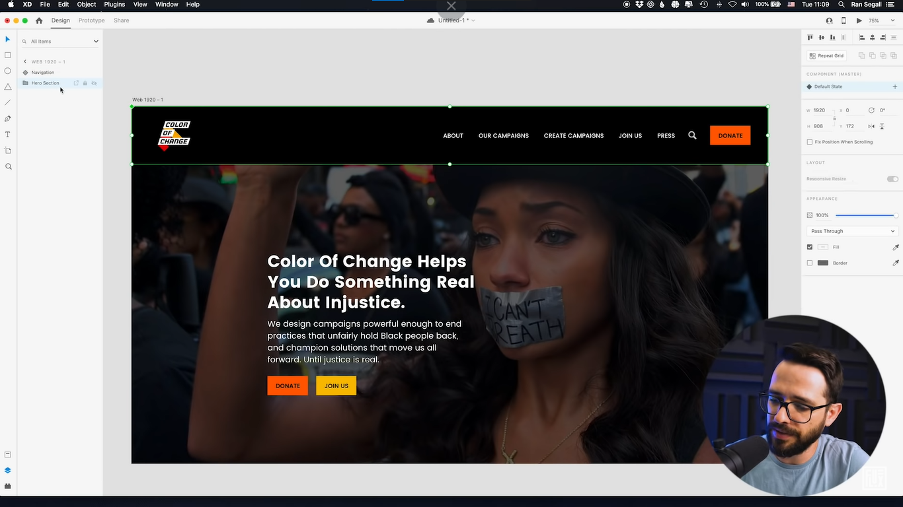

### Getting your Design Ready for developement

**Rules :-** 

- Hover State

- Hover Scenarios

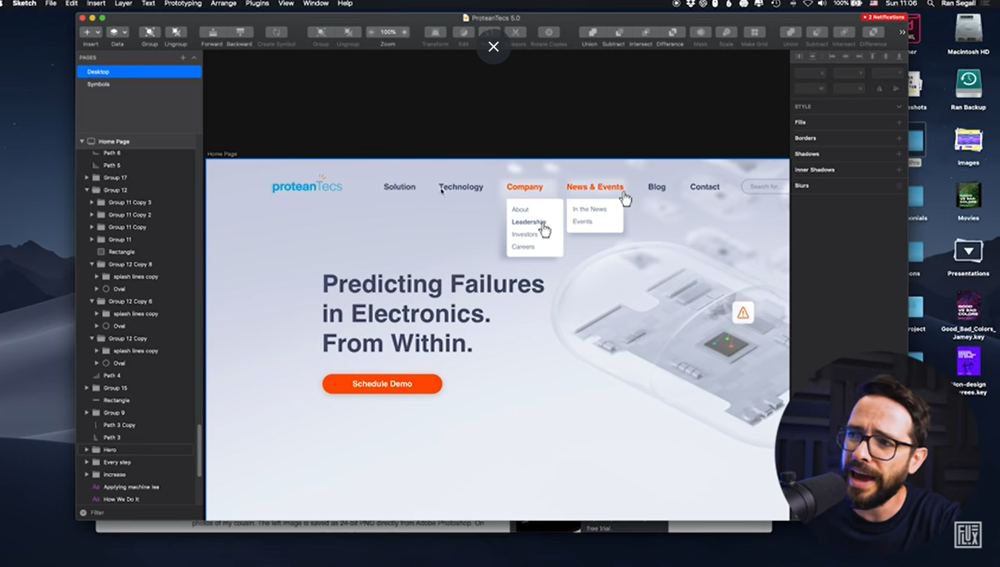

**Exporting Assets :-**

- `Vectors & Illustrations & Icons:-` SVG

- `Images with filled background :-` 2X JPEG

- `Transparent background images :-` PNG

**Compressing Asstes while exporting :-**

- `www.tinypng.com` - For reducing the size of the assets.

### Major Types of websites

- **Eccomerce :-**

    When we are working on the eccomerce websites and projects our focus should be on `Product` because our focus is to sell the products to the clients.

    **Design Challenge :-** `Product Showcase`

    **Things to take care of :-**

    - Hero Page With product highlight.

    - Categories

    - Product Grid

    - Product view 

    - Checkout Design

    - Payment Design

    **REFRENCE :-** `https://www.allbirds.com/`

- **Marketing / Buissness :-**

    When we are working on the buissness/marketing website you need to focus on the story of that buissness and their social proof their qualities and the things which can buid up the things.

    **Design Challenge :-** 

    - Clear Description

    - Value Proposition

    - Benifits

    - Story
    
    - Social Proof

    - Call to Action (Reaching us for the work)

    **REFRENCE :-** `https://www.trevorblountpilates.com/`

    
- **Blog and Media Outlet :-**

    When you are working on Blog and Media outlet websites you need to focus on the main content, Imagery and category of blogs and news.

    **Design Challenges :-**

    - Content

    - Categorisation

    - Imagery

    **REFRENCE :-** `https://www.thinkglobalhealth.org/`

- **Educatinal :-**

    When we are going to work on the educational websites we need to keep the user engaged with the website with the interaction, small surpirsies and all the cool stuff soo the user will not be board and will leave the website.

    **Design Challenges :-**

    - Engagement

    - Orientation

    **REFRENCE :-** `https://www.coursera.org/in`

- **PortFolio :-**

    When you are going to work on the portfolio website you need to focus on show you who you are, what you did, which thins on which you worked and how you can make difference to their firms.

    **Design Challenges :-**

    - Art Direction

    - Personality

    - Call to Action (Can be Mail for hirigin)

    **REFRENCE :-** `https://zhenyary.com/`

### Inspirations

Web Inspiration in 2 stpes :- 

- `awards.com` - Web Design inspirations

- `lapa.ninja` - Web Design inspirations.

- `invisions.com` - To save our inspirations.

Find the things related to our topic on the google like history, visuals, movies and all soo which might not be used in other web desings soo you can create with your own.

**Most Imp :- Inspiration doesn't means just copy pasting someones idea of website and building same kind of. you can come up with your ideas new things adn prefer somethings from their desings as well soo you can create your own unique design.**

### Psychology Principals Of People

- **Mirroring :-**

    Mirroring is the psychology principal in which people mirror others conditionally or unconditionally soo we can infulence the people with the visuals like happy images, and all the visuals soo we can get the people in to that zone and that mood.

- **Social Validation :-**

    Social validation is the thing in which we take our decisions on the basis of the what people are doing and our brain dont want to get into deep and research and want to take all the decions by using shortcuts.

    This same psychology same used in social prooof which is mentioend on all most of the websites and when the people see the numbers of people worked with, big big clients images and company logos people get influence and they do the same.

- **Psychology of colours :-** 

    Our mind emotionally ineract with colors like when we see red colour our heartbeat and this kind of effects we get on colors interaction soo we need to choose the colors as per the psychological and phisiological effects on us.

**resource :-** `empower-yourself-with-color-psychology.com`

### Tools to develop the websites

### Master Typography

**Typography Rules:-**

- **how many fonts :-** 

    You should only use 1-2 fonts in the website bcoz as new fonts get time to recognize in our brain and takes time can be confusing with multiple fonts soo we have to use max 1-2 fonts in our website.

- **line height & spacing :-** 

    Ideal line spacing should be `125% to 150%` soo the readabitlity will be maintained.

- **emphasizing something :-** 

    We dont need to over emphasize something like with underline and different colour its being misleading soo if you wanna emphasize something you just need to do the bold or size.

### Content Strategy & Information Architecture

Content Strategy and information architecture we are going to do with the following steps : 

1. **Do your Prepration :-** 
    
    First of all you dont need to ask everything to the client but you should be done with the prepration as per the below points.

    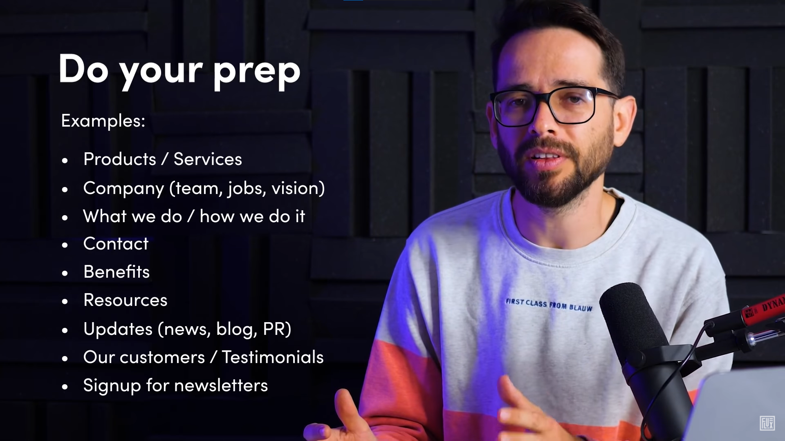

2. **Brainstrom and content tone, SEO :-** 

    In the the second step we need to sit with the client and need to discuss about content, and seo keywords and the things which needs to have to have on the website.

3. **Sorting and Grouping :-** 

    We need to write our topics on the sticky notes and we need to group them under the right title as like mentioned below and most importantly what should be the titles of the pages and sections. 

    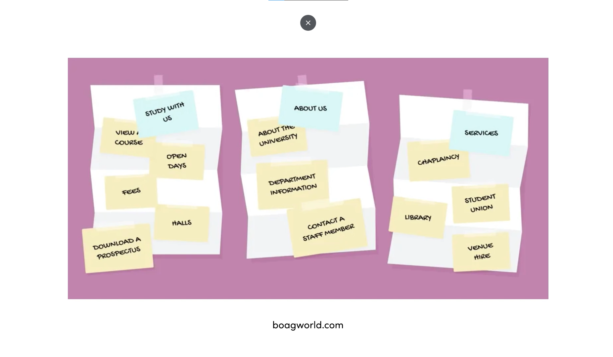

4. **How to structure the content :-**

    We need to architect our content in the website in such a way that it will optimize the space and will not confuse the user as like mentioned in the example the marketplace will be soo confusing but in the airport wherever we will be we will get to know how to get into a way bcoz airport uses expectaions and put it on the sign boards.

    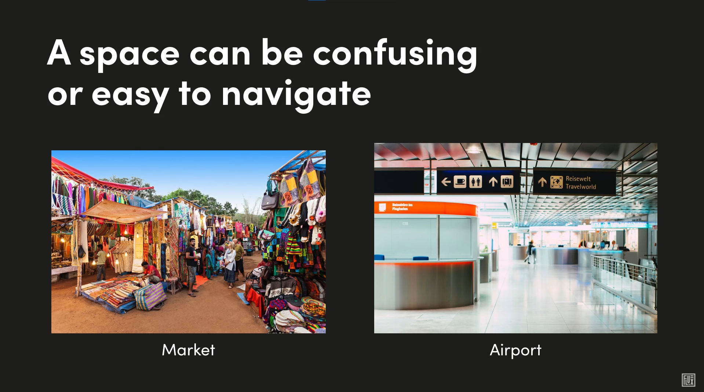

    Soo we are going to design something that will be like airport where people will get to used to.

5. **Tool For Mapping Structure:-**

    We are going to use the fancy way which is sitemap for the grouping the sections in the website.

    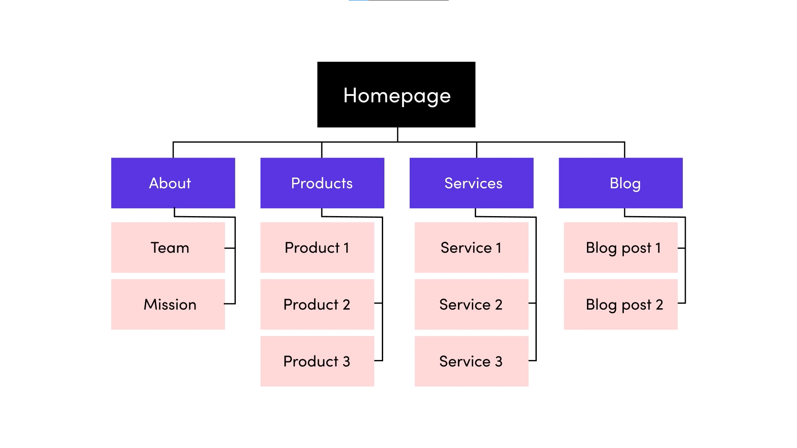

    Non Fancy way will be the on any plane document by using tabs.

6. **SiteMap labelling:-**

    As much as sitemap important that much the labelling is also important for the sitemap bcoz its going to give the clearity about page or section in the website.

7. **Structuring and Structure types :-**

    - `Single Page` :- Your all website would be in a single page and devided section with the help of one pager.

    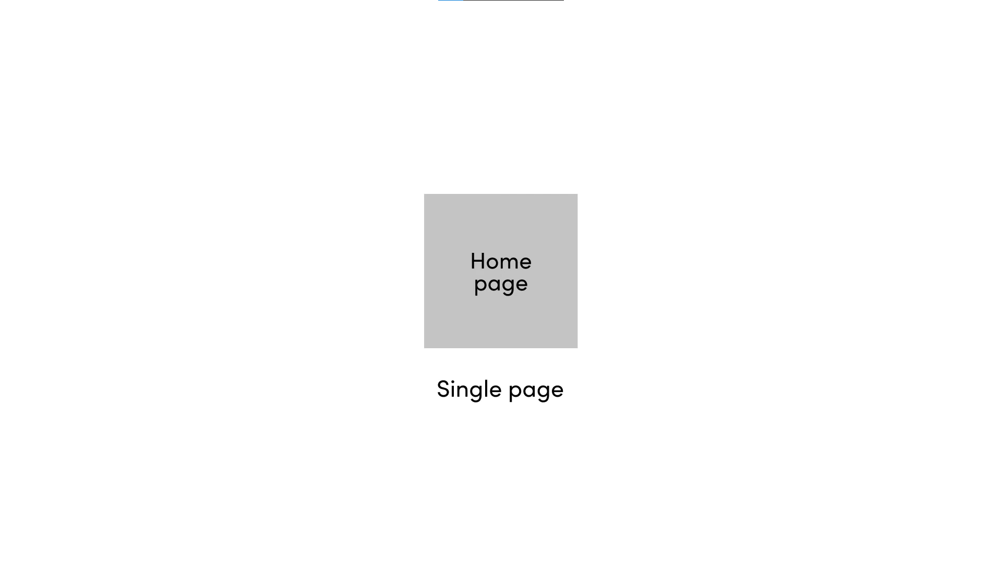

    - `Flat Structure :-` We can got the next or back only as like checkout processes.

    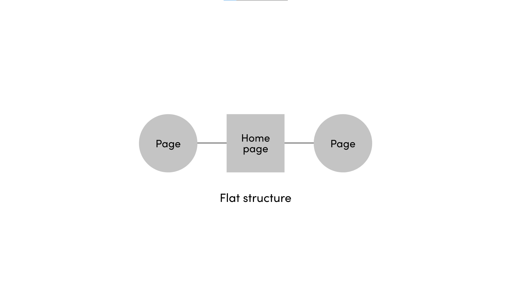

    - **Index Page :-** Home pages links to the other pages as like the traditional websites.

        
        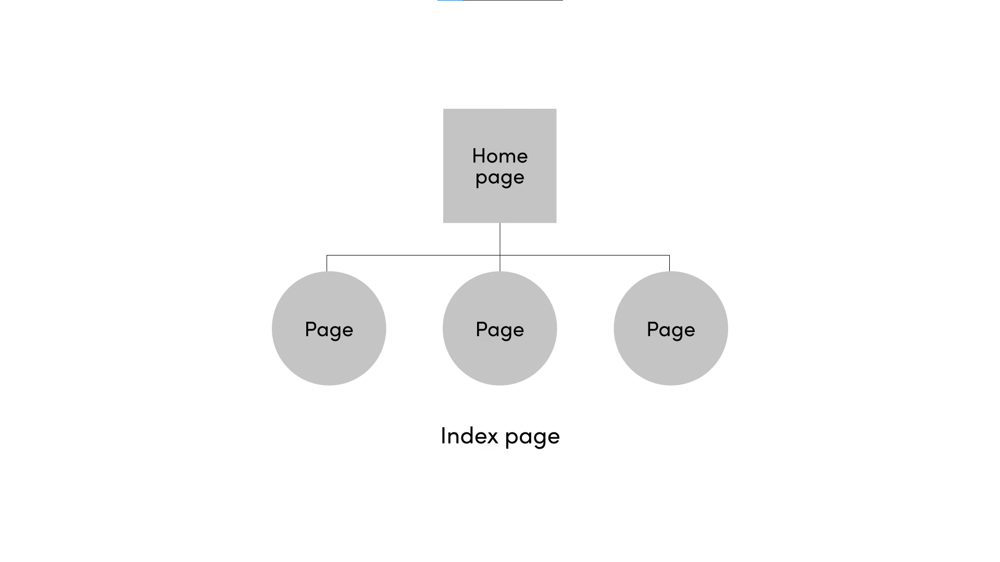

    - **Strict Hirarchy pattern :-** We use the strict hirarchy pattern in the big or eccomerce webistes like amazon in which you navigate pages based on the hirarchy as like mentioned below.

        
        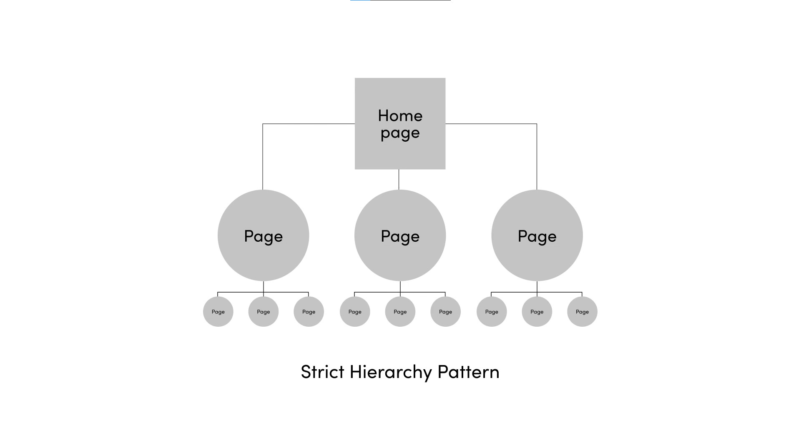

8. **How to choose your structure :-**

    - **One pager :-**

        - **pros :-**

            When you want a simple user journey and simple story of your website you can use one pager in which all content will be on the single page only and the conversion rate would be higher and most importantly include all the information which needs to make decision.

        - **Cons :-**

            One pager is not that much awesome for the seo and when you have tons of content it would not be the best option you can choose.
        
    - **Multi Pager :-**

        - **Pros :-**

            When you have huge content and lot of services you can use the multi page and most importantly when someone search for specific keyword google ranks you website and take user to that page.

            Its easy for scalibility and the content management and we can do better seo on it.

        - **Cons :-**

            Multiple Entry points.

            Harder to maintain.

            Might Get Confusing.

9. **Common Components :-**
    
    - **Homepage :-**

        **Purpose :-**

        1. Who they are and What do they do

        2. Build trust who worked with them

        3. Has anything Changed

        **Structure :-** 

        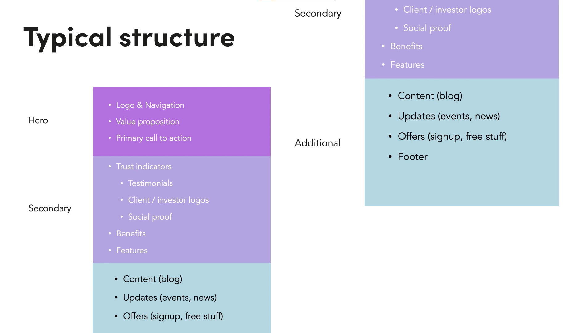

        **Note :-**

        1. Lot of people dont start at home page.

        2. Dont try to do too much in homepage.
    

    - **Navigations :-**

        **Purpose :-**

        1. Where am I.

        2. What's in here?

        3. Persistent CTA (Optional)

        **Navigations Rules :-**

        1. Logo should be on the left side and should linked to the homepage.

        2. 5-7 Navigation links max to max should be in navigation.

        3. If we will have heavy contetn we should categorise them and put inside the dropdowns and menus.

        4. Current Page should ne highlighted.

        **Utilities in navbar :-:-**

        We need to keep seprate the utilities in the desing and ui bcoz its not going to navigare anywhere.

        We can seprate them by `Color, Position, Hirarchy`.

        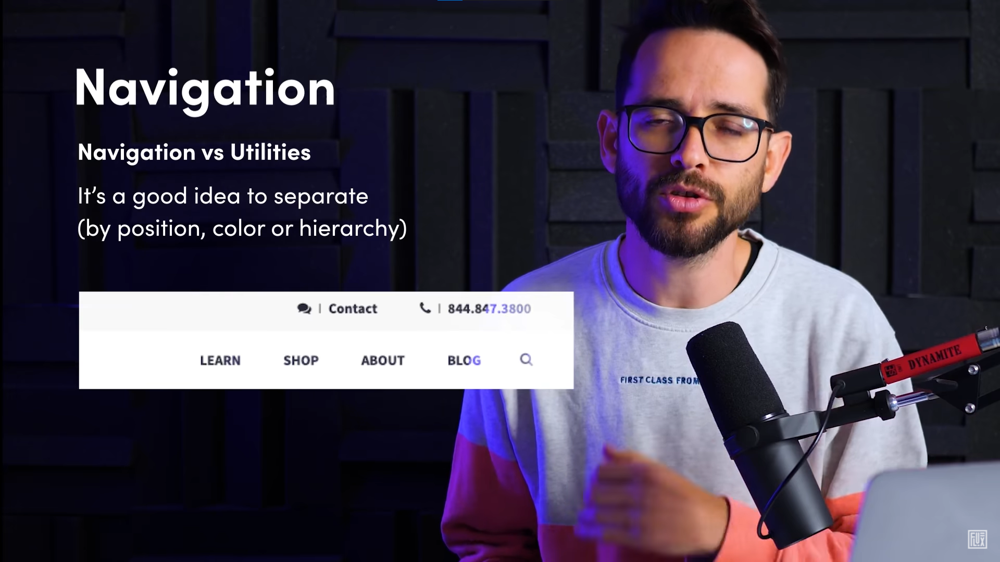

        **Global Navigation and Local Navigation :-**

        `Global Navigation :-` Global Navigation is the navigation which should be the main navigaion for the main categories.

        `Local Navigation :-` When we have Multiple pages or categories in specific category or if we have a lot of content and if we want to directly navigate to any section we can use the local navigation.

        as like mentioned below.

        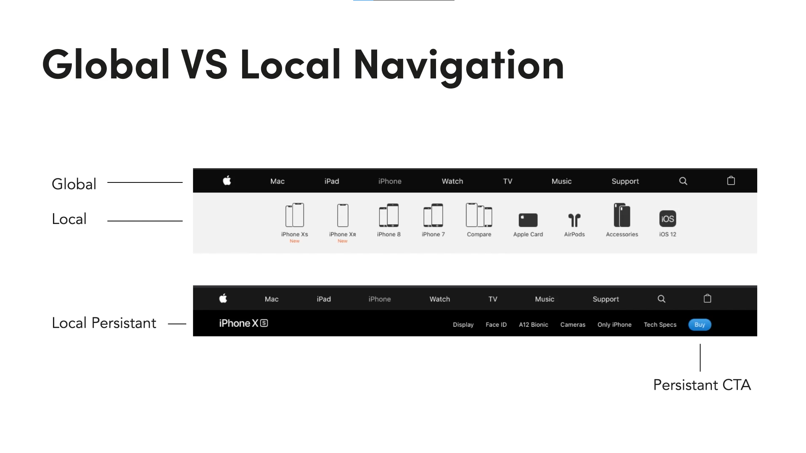

        **Current Page Indications :-**

        1. Current Page should ne highlighted by the color, opacity soo user can understand the current page he is going on. 

            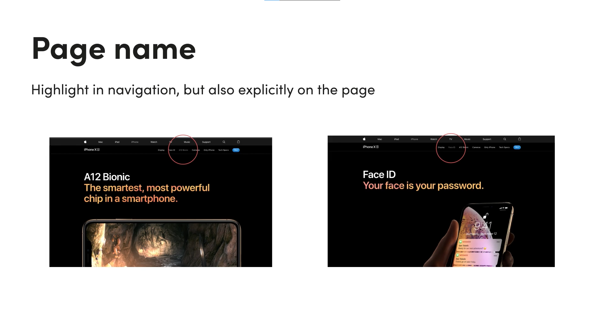

        2. Using breadcrums we can also show the current page mainly when you dont have direct link to specifc page but you have link from a perticular section or page as like mentioned below.

            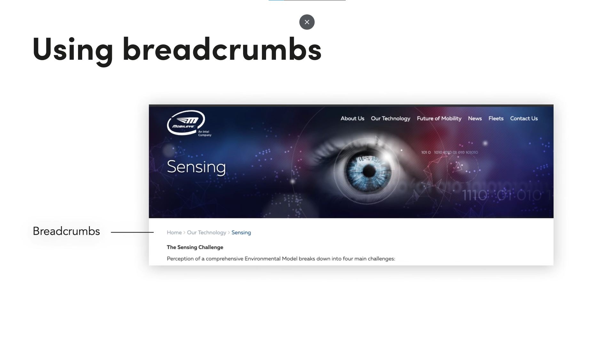

            **Usecase :-**

            1. When we dont have direct link to that page.

            2. When we cant show the cuurent page highlighted due to its nested soo there we can use the breadcrums.

            **Search Functionality :-**

            Usecase and Requirement :-

            1. When you have a lot of content and its hard to find it specifically then you should have to have search functionality in your navigation which just navigates to spefic page or section of content.

            2. When you some pages and sections which can be directly navigated through the navbars and through the menus then you dont need to use the search functionlity.

    - **Hero Section :-**

        **Purpose :-**

        1. Hero Section includes what is it, where they are, what do the do, 
        why should i care, and what they have for me in it.

        2. Value proposition of the website.
        
        3. CTA Button on it.

    - **Testomonials :-**

        **Purpose :-**

        1. Used to build trust.

        2. Show the users who already our coustomers with the same problems and show their best experience with us.

        3. How our product and service can be helpfull for them.

        **Testomonials Rules :-**

        1. It should include photo of concern person and its title and its feedback as like mentioned below.

            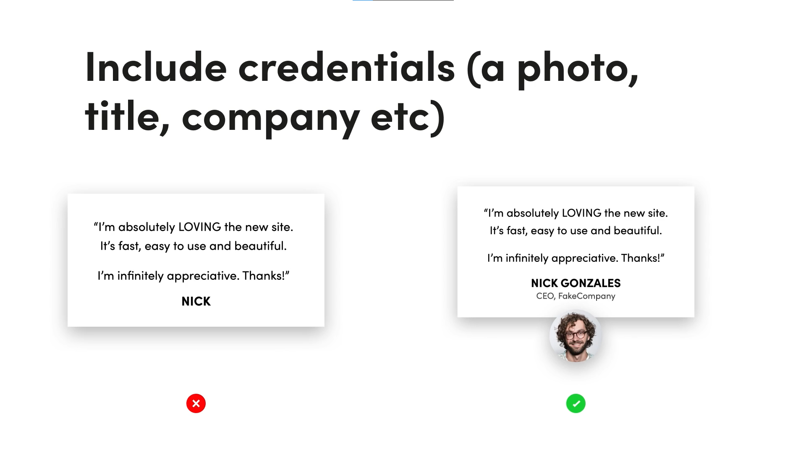

        2. Social media testomonial can be a best proof bcoz noone dont post its experience on the social media and if that would on be our website we can produce more trust inside the users.

            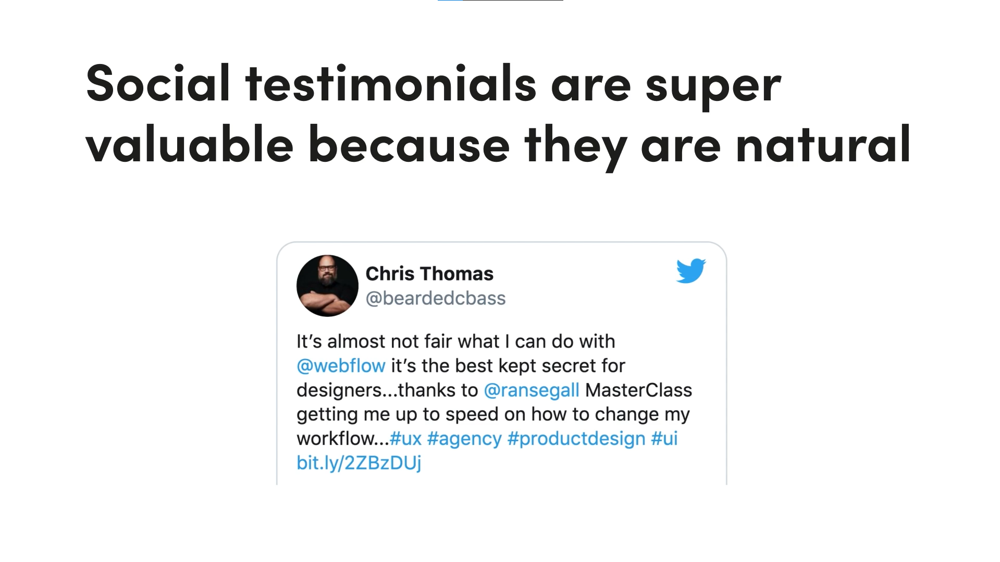
        
        3. Video testomonial would be the best social proof bcoz it would not be manipulated and it will never be faked and user can understand the efforts took for shotting the video.

            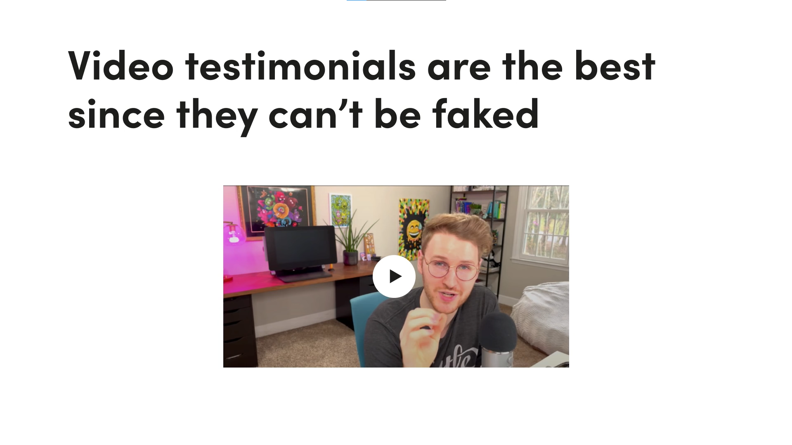

        **Logo Bar :-**

        Logo bar can be the best one and ideal for the social proof rather than the cards of their quotes and all soo we can use the logos of the companies which worked with us.

        **Logobar Rules :-**

        Many companies have logos different sizes and colours adn it can look inconsistant soo we can remove their colour adn give one static colour like grey or black and we need to keep all of them in consistant size as like mentioned below.
            

        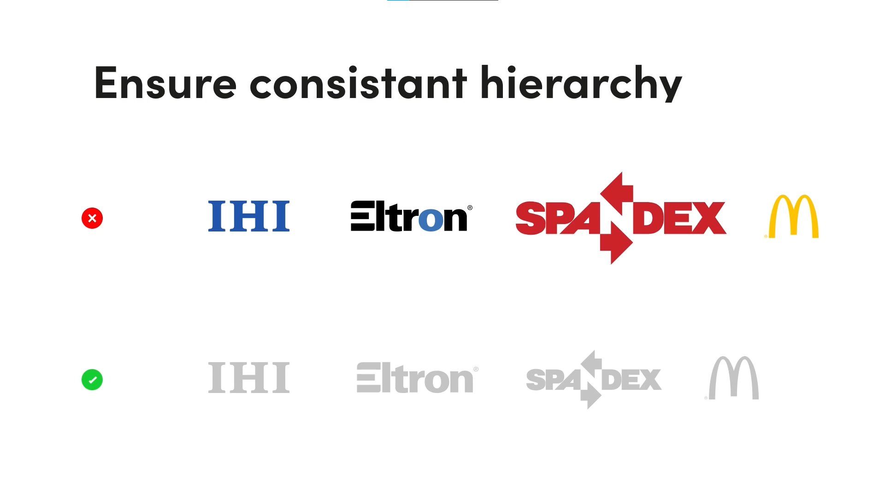       

    - **Pricing table :-**

        When we are selling something to the visiors of the websites it should be in pricing table and cards as like mentioned below.

        **Pricing Table Rules :-**

        Make emphasize your most recommended plan with the hirarchy by border, color, button, and position soo user can take it as sugesstions and most likely take decision along with it.

        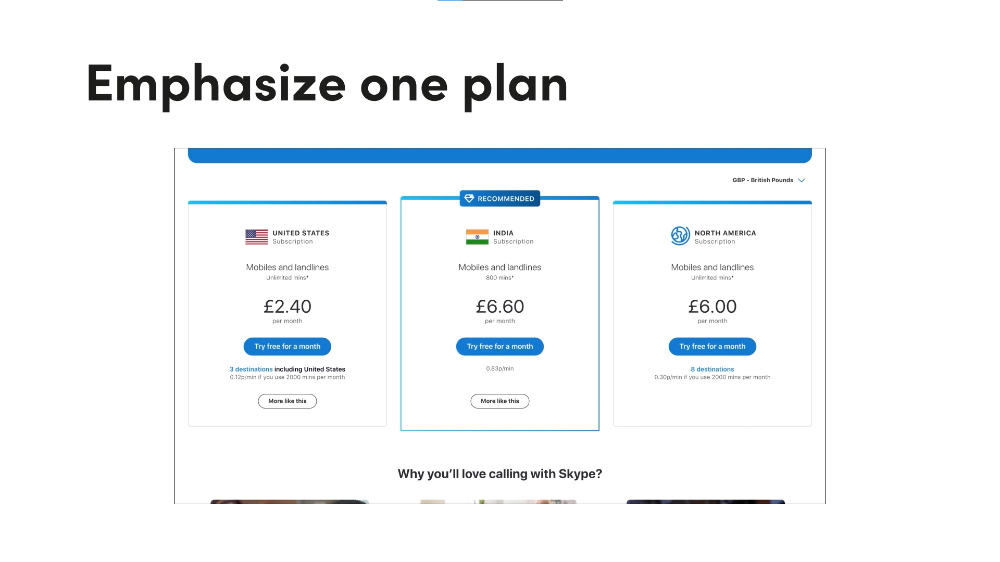

        **Feature list :-**

        Feature list should not be to lengthy and consufing it should be simply with its key points as like mentioned below.

        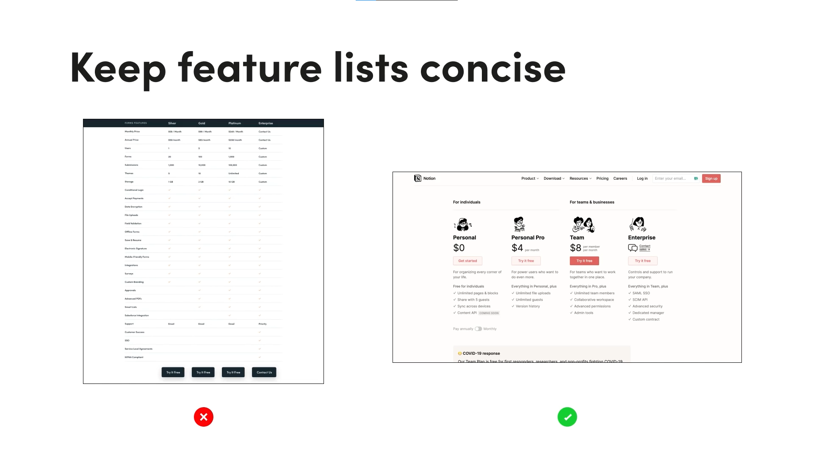

        **Concise CTA Button on pricing table :-**

        As you are selling that thing their should be very clear Primary CTA button which would be effective.

        

    - **Product Page :-**

        Whenever the company have product we would have the product page on the website which should be followed by follwing rules. 

        **Product Page Rules :-**

        1. Very Prominant and Actual Image of product

        2. Textual Content :- 

            Name, description, features, price and CTA.

        3. Social Proof (Can be reviews)

        4. Relevant product sugesstions

        5. Customer Support.

    
            
            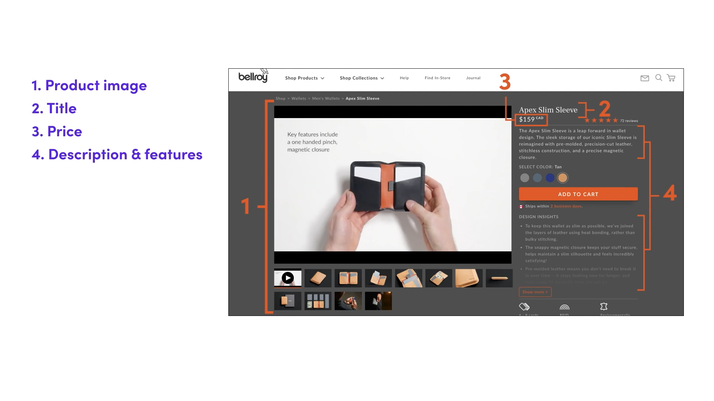

            

    - 

    
