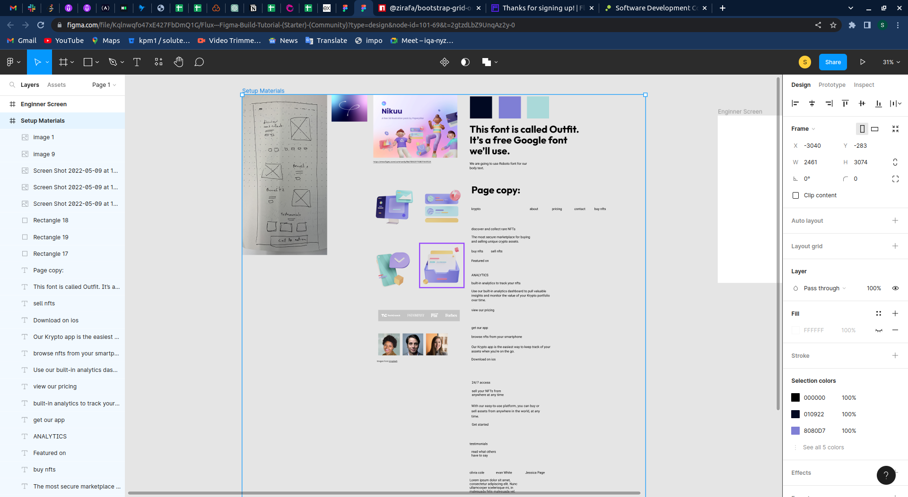

# Figma
 
In the figma we can create wireframes for the websites with the controls mentioned below.

### ShortCuts

- **Zoom In & Zoom Out :-**

    We can zoom in & out with the help of `ctrl and + ` & `ctrl and -`.

- **Move :-**

    We can move the canvas by pressing `space` and `holding left click and move`.

- **Create Frame :-**

    We can create frame by pressing `f`.

- **Duplicating Item :-**

    We can duplicate the item by pressing `alt` and `mouse click with drage` for its duplicate items position.

- **Multiple Selection :-**

    We select multiple items at once with the help of `shift` + `mouse click` and we can drag and style together.

- **Section Selection :-**

    Sometimes we need to select all the elements at some place or in some section and we can do with the help of `mouseclick + drag` and draw rectangle around the section and  we can drag the elements with `section click + drag`.

- **Grouping :-**

    We can group the multiple items into one by `Ctrl + G` and we can select them all by clicking group layer in the sidebar.

- **Eye Dropper :-**    

    We can get the eye dropper instantly for the background color with `i` keyword.

### Layers 
Layers are like z-index by which we can stack the elements above and below of something.

In the above image we can see the layers for Setup Materials section in the  left sidebar.

We can move the layers by finding the layer of current element and dragging it down or up of placement layer.

### Frames

Frames are the canvas with the different sizes as per our purpose and requirements.

In the above image you can see create frame button which shows us the select 
screen sizes options in the middle of right side bar.

We can creatfe Frame by pressing `f` and choosing size as per our requirement.

### Grid

We need 12 Columns grid in web desing to well understanding about the space optimisations for the webpage and to make it centered on the huger screen sizes.

We can Create grid by locating `Add Layout grid` in right sidebar as mentioned in above image.

Change grid into columns by clicking on its dropdown of 12 colums as shown in above image.

### Muliple Selections

Sometimes we need to select the multiple items at once and we can do with `shift + click` on element as like mentioned in below.

### Grouping

We need to group the multiple elements into one to move and style them together and it should not visible at layers for single elements.

We can group the elements with the help of `Ctrl + g` and we can move them together with the help `mouse click + drage` as like mentioned above.

We can select them all by clicking its groups layer in the left sidebar.

### Font Styling
We can style the font in the right sidebar in Text section.

- **Font-Family :-**
    We can control the font-family to available fonts and various google fonts with the control mentioned below in section.   

    

- **Font-Size :-** 

    We can control the font-size with the control mentioned below in section.

    

- **Font-Weight :-**

    We can control the font-weight to bold, semibold, bold, extrabold etc with the control mentioned below in section.
    

- **Case Change :-**

    We can change the font case to capitalized, first letter capital, smallcase, uppercase with the control mentioned below in section.

    

- **Letter Spacing :-**
    We can control the space between the charecters of word with this control as like mentioned below in section.

    

- **Line Height :-**
    We can control the vertical spacing in between the words with this conrols as like mentioned below.

    

### Common Text Styles

Sometimes we need to common stylings for text which are going to be used on the throughout figma.

We can create common text style in text section in right sidebar by clicking `more optinos + add icon` and provide Title and description for the same as like mentioned above.

Created styles will appear as list in Font styling section, When we select text elements, and click the text styles it will be styled as per its text style stylings.

### Container Styling

We can style the container from its dimensions to border radius, rotate, Its alighment etc in the content section as like mentioned below.

- **Width :-**
    We can control the width of the container with this control as like mentioned below.

    

- **Height :-**
    We can control the height of the container with this control as like mentioned below.

    

- **Border Radius :-**
    We can control the border-radius(corner rounding) of the container with this control as like mentioned below.

    

- **Rotate :-**
    We can control rotate the container with this control as like mentioned below.

    

### Paste & Match Style

If we paste some other text in the place where we already styled our text previously when we paste the new content its styling also get pasted which we can prevent with `Paste & Match Style` as like mentioned below.

### Auto Layout

Sometimes we need to paste more content without breking the current layout and chaging its dimensions to new again.

We can use auto layout which considers the section as one component and prevents the layout weather if content increases.

We can control autolayout by the control mentioned below.

### Masking

Sometimes we have to mask the thigs in some layout and fit into it, We can achieve that with the help of the mask.

We can mask the Layers by selecting the layers and `right click + use as mask` as like mentioned below.

### Image Blending

Sometimes we need to blend the image with our current design theme with multiple variations.

We can achieve that image blending with theme with the help of blend control as like mentioned below.

### Layout Constraints

Sometimes we have to increase the the frame which we choosed with `f` but due to relativility of content it will get teardown if we try to increase the frame dimensions.

We can use the contraints with the control as like mentioned below.

### Gradient

We can create the gradients in between 2 colors used by our color theme to give some effect on containers.

We can create the gradient by selecting the layer and by clicking on fill color icon with the help of control as like mentioned below.

### Alignments

We can choose the spacings for the data inside the container and as well as the container posisiton in the top section of right sidebar 

We can select the group of layers and click the desired layouts from the header of right sidebar as like mentioned below.

