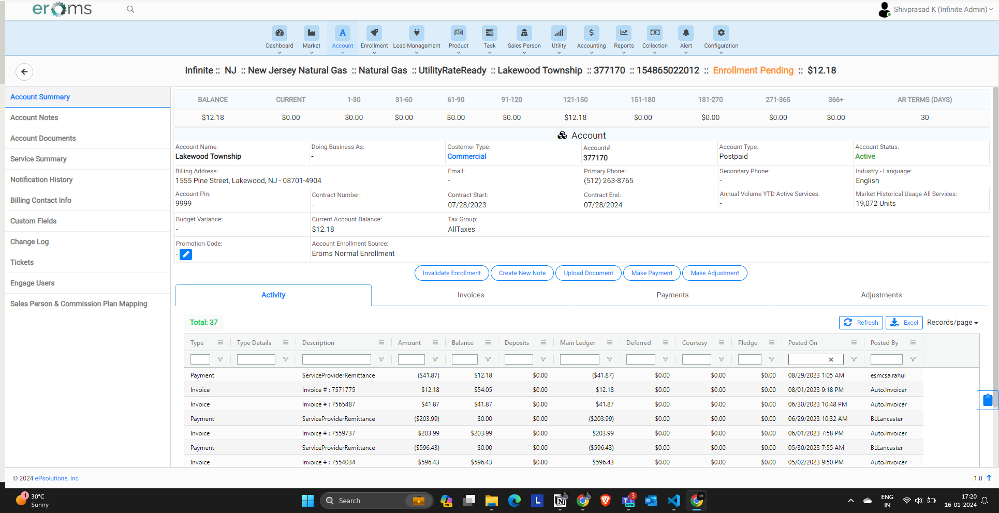

# EP Solutions

As we have BharatGas, HPgas for natural gas and reliance, torrent like electrical commodities agencies in india outside it get provided by the companies like Texpo, YEP and etc.

EP Solutions is online intermediator platform in between end consumer and the agencies for their management and delivering the goods to the customers. It consits of the throughout process from the enrollment of the public user for any kind of service till its service for that perticular customer and even further management related to their accounts for the customers and all the records for the customer and their management for the service providers.

<!-- ### Platforms

- **EmSigner :-**

    EmSigner is the public enrollment portal for the end customers to enroll for some commodity in their service area or whereever they need the service.

    We had configured clientwise emsigner portals like for texpo we have 3 emsigner for TEXPO, YEP and SWPL (South-West Power & Light) which are hosted on different domains and can be called as different web portals in themselves itself.

    Texpo and SWPL Provides the services only in the texas area and it only accepts the texas area if you provide any zip code rather than texas it wont load the further options and raise the disabled cursor as like mentioned below.

    

    **Enrollment Process :-**

    - **Service Provider :-**

        

        1. First enter the zip code for your service area which loads the further fields like utility providers and their services.

        2. Select the adress type is eiter residential or commercial./

        3. Select utility provider in your area.

        4. Select the service for that provider for which you are enrolling.

        5. Enter the promotion code if you came from any brokers for the enrollment which provided you the promotion code which defines the discounts or the services based on it.
    
    - **Plan Selection :-**

        

- **Engage :-**
- **Erom :-** -->
  

## Eroms

### Foundations

**Supplier :-**

Suppliers are the private companies providing commodity in the US basically as like Reliance, Bharat etc. 

They are mostly into electricity & natural gas supplies.

We have 4 suppliers in the EP solutions as mentioned below.

1. **Texpo :-**
    
    Texpo provides services mainly in texas states in US. Enrollment with texpo supplier can be only done when the end customer will be residing in the texas areas having texas zip codes.

    IE - 77022, 76063

2. **Infinite :-**
    
    Infinite provides services mainly in the non-texas states such as New Jersy, Ohio etc in US. Enrollment with infinite supplier can be only done when the end customer will be residing in non-texas areas having new jersy, ohio zip codes.

    IE - 07002, 44021, 44022.

3. **Alliance :-**

    Alliance provides services mainly in the texas states itself, Its operates in the 79248 etc.
   
4. **SFE :-**
   
   SFE provides services mainly in the texas states, Its operates in the zip codes such as 78552, 6448 etc.

**Utility :-**

**Market :-**

### Enrollment
Enrollment is the process of enrolling an new customer to for perticular suplliers to consume their commodity services such as electricity & natural gas.

We can enroll the customer through emsigner portal which is the public portal as well as eroms portal for individual customers as we have saw above. 

There are 3 types of enrollment in eroms portal, such as single enrollment, batch enrollment & lead enrollment. We will go through the all enrollments step by step.

**Single Enrollment (Home > Enrollment > Single Enrollment):-**

1. **Choose Suppplier :-**
   
   1. Enter the zip code in the field.
      
   2. We get the list of Supplier in dropdown beside & if there is only supplier for the entered zip code then it will be default selected.

2. **Service Address :-** 
   
   1. Service Address section gets loaded when entered zip code in first step then we need to provide full address information such as Address Line One, Address Line Two, City, State and ESIID and ASMR meter toggle. 
   
        `What is ESIID and ASMR Meter Toggle`

   2. When we enter address info list of addresses get fetched for that perticular zip code, We have to choose the address from the list itself for texas states.
   
        `What if address not menitioned in the fetched address list ?`

   3. We have we don't have address validation for Non-texas states and on infinite eroms portal as infinite client takes care about non-texas states. We have skip validation button on infinte client.
   
3. **Select Utility & Commodity :-**
   
   1. Here We choose utility, commodity - with plan, customer type either residential or commercial, utility account number, Social security number & Invoice delivery method.

   2. We have validations for Utility Account Number for infinite client accordig to utily selected utility such as it should be minimum of 13 digits & We get POD id which as like utiltiy account number for NJ state on infinite.

    `I can see POD ID, SOCIAL SECURITY NUMBER, and Request historical fields extra for infinite clients, What are those and when do they appear while enrollment?`

    3. For New Jersy zip code perticularly for New jersy Natural gas utility we have some additional fields in the section such as Market Premise Type, When the Market Premise Type is selected as Large-Non Residential we get 2 more additonal fields as mentioned below.

        1. Highest Monthly Average Daily
        2. Maximum Daily Quantity
    
4. **Product & Start Date Selection :-**
   
   1. When Select utility commodity and fill out the section available products grid is loaded according to data you have entered for Address & Utilty. If there is only one product available according to data you entered then it would be default selected.
   
   2. We have additional column as Is Template for single enrollment specifically for SFE & Infinite Client NJ state utiliies which contains Yes No Values in it.
    
    Template product is basically for which we can choose custom rate & contract term by our own in range provided by the utility.

   3. We have option to choose the start date but we can't select date perticularly, we are able to select month. When you are enrolling wiht infinite client for ohio state then if you are enrolling before 21st of month current month can be selected else next month onwards will be selectable. For NJ we are only able to select the start date as next month itself.
   
   `Do we have start date selection only for infinte supplier, if yes then how service start date works for other suppliers.`

   4. We have Checkbox for **"Yes, I want paper coipes of my Agreement sent to the mailing address indicated in my enrollment"** this would be by default selected when you seelct Invoice delivry method as Mail, Disabled for email & would be selecable for delivery method as both in select utility & commodity section.

   
   5. We have switch selection for texas states & for alliance, SFE client where we need to select Standard switch 814_01, Self Selected Switch 814_01, Move-in 814_16 and Establish CSA checkboxes as mentioned below.
   
   - standard_switch - Next available date.
   - self-selected switch - Future date selected by the user.
   - Move-in - Select future date and moving type (standard/priority).
   - Establish CSA - Opt for multiple services at the same time.
   

    `Do we have this option for texpo client`
   
   

5. **Contact Information :-**
   
   1. We need to fill the basic contact information such as First Name, Middle Initial, Last Name, Primary Phone Number, Secondary Phone Number, Email & Pin etc.

    `What is pin in contact information section`

    2. We need to fill some additional information for texas states or with Alliance, SFE, & Texpo clients such as Driver's License State, Driver's License, Date of birth, Social Security Number etc.

    3. We need to validate customer and Determine Deposit action for texas state & SFE, Alliance.
    `Do we have this option for texpo client`
    `What is validate Customer and Determine Deposit, How does it work or does supplier involved in it`
   
   
6. **Tax Details :-**
   
   1. We need to provide tax details in this section such as WACOG & MPA number suplier uses for internal purpose.
   
    `Do we have tax details option only for infinite supplier`

7. **Enrollment Options :-**
   
   1. This option is only available texas states suppliers, SFE & alliance clients.

   2. We need to Choose How did you hear about the company, Notification Language, Account Refrence Number, Tax Group, Deposite Amount, Net Terms, Billing Day of the month, and Options to be selected as Life Support Used?, Invoice Itemized, Notification Wavier Request, Average bill.
   
   `What is Invoice Itemized, Notification Wavier Request & Average bill options in Enrollment options section & do we have this only for texas states`

### Batch Enrollment

Batch Enrollment is the feature in eroms for enrolling the customers in the bulk at a time rather than enrolling one by one.

**Steps :-**

**Home > Enrollment > Batch Processing**

- **Download template & fill the data :-**
    We need to download the template from the erom portal for that perticular supplier which would include the fields same as Single enrollment, We need to fill the details according to supplier & utility as mentioned in detail above in single enrollment section.

    The differentiation of columns for different clients represents the diffence of fields according to supplier, utility and state as we saw in singe enrollment.

- **Upload the template :-**
  
    We need to upload the excel file and we would be able to view records according to data mentioned in the the excel sheet.

### Lead Enrollment

Lead enrollment is only used by SFE Client. Lead enrollment goes through serval stages, and can be started by add new lead through Lead management module in SFE eroms portal.

In the Lead enrollment It has been divided into serval sections as mentioned in details below.

**Home > Lead Management > Add new lead**

**Add New lead :-**

1. **Customer Information :-**

    In the customer information We provide some basic information such as Salesperson or broker name, Buissness name, doing buissness as their tax id & Suppler and billing info of the customer.

    After saving customer information it creates the lead id for that customer and it will be in pending state by default.

2. **Service Location :-**
    
    In the service location tab we can search direction for the address or we can search for the address by the old way, as we did in enrollment.

    We select the address or service location either ways and we can select the multiple service address as well with lead enrollment and we get the list of service locations we have selected and then we need to provide some more details for it such as switch type, Total historical usage, Is critical care and Add/Upload HUD etc.

    Total historical usage is the usage used for that perticular location in last 2 months, we can enter it manually eihter we can provide HUD document contains the information about the same.

    Critical care checkbox we have available there which means service location could be an hospital or some important location so we can mark the same.

3. **Billing Prefrence :-**
    
    We need to provide some basic information for the biling, such as bill type, Langugae, Billing Delivery, Email, Billing day, Tax group, & Billing address etc.

    `What is billing type summerized and itemized`
  
4. **Contract Information :-**
   
    We need to provide some contract related information the lead enrollment such as Contract start date, Contract signed date, Contract Recieved date, Contract Number & Pricing Refrence Number etc.

    `What is Pricing Refrence Number while filling contract information in lead enrollment`

    We can select Different multiple price details to send for approval in this tab & we need to choose the product template as well for the same.

    All the lead enrollment are the custom enrollments and we are already providing price details such as contract length, price etc we would be only getting template products to choose in this section.

5. **Documents :-**
    
    This section is optinal, It is similar as accoutn document where we can attaach any refrence documents.

6. **Comission Plan :-**
   
   In this tab we select the predefined commission plan based on some formula's and have Calculate Credit score & Submit for approval action .

    `how calculate credit score works like does market takes care about it or we are handelling on our side by using some third party api's in commission plan section while lead enrollment`

    We can suspend the lead as well from this tab which will discard the lead and it will be visible in Leads-Suspended section of Lead management module.

    When we submit the request for Check calculate credit score & if it gets rejected it will be visible in Leads-Suspended section of Lead management module.

**My Lead :-**
  
The lead customer we have added throgh Add new lead tab or leads added by sales person with any status will be visible in my lead section but only with view access.

We cannot edit the details of lead through my lead section.

**Lead Pending :-**

Leads are still not filled all the details yet and not submitted for check credit score & approval request it will be visible in this tab.

**Leads - Ready for Credit Approval :-**

Leads which sucessfully passed the credit score check will be visible in this section where we can Approve and Submit for the pricing approval.

`Who does operates this credit approval in system, sales person itself or someone else with other role in leads for credit approval tab while lead enrollment.`

**Leads - Credit Rejected :-**

Leads got rejected due to poor credit score will be visible in this section.

We can override the credit score manually from credit information tab and we can fill out the deposite information as well in this section, either individual for multiple service locations with **"Apply for Each Service"** option or it will be considered as total deposit.

  
**Leads - For Price Approval :-**

Leads got passed the credit check are visible in this section for pricing approval, where we need to choose the appropriate price from the user added price details in contract information tab.

We can Accept & submit the lead for Enrollment from this section.

`Who does operates this Price approval in system, sales person itself or someone else with other role in leads for credit approval tab while lead enrollment.`

**Leads - Ready For Enrollment :-**

Leads got passed Price approval are visible in this section for Approvie it for enrollment, where we need to check Contract Start Date, Contract end date and pricing refrence number in contract information tab.

We dont need to remember what we need to check in each tab, when we hover on Sucess action for that section it will view small popup containing the required fields and we can look into it.

From this section we can manage the lead either to approve, price reject, credit reject and to suspend lead.

Once we approve the enrollment user get navigated to accountdetails page as usual as single enrollment.

`Who does operates this Price approval in system, sales person itself or someone else with other role in leads for credit approval tab while lead enrollment.`

**Leads Enrolled :-**

The leads got approved and enrolled with all the previous approvals will be visible in this section.

**Leads Suspended :-**

The leads got suspended from any of approval section will be visible in this section.

**Leads - Marked as Duplicate :-**

The Leads got marked as duplicate from the approval sections will be visible in this section.

### Account Details

**Home > Account Listing > Click on account number mentioned in Account# Column**

When the user is enrolled with any of the commodity provider according to their regions and states, account details for that enrollment will be visible in account details section.

There are servel sections in the account details as mentioned in left sidebar of it, we will have look into each section in the details.

**Account Details Sections**

1. **Account Summary :-**
    
    In the account summary section we can see the overview of the acccount with customers contact information, Customer type, Account status etc.
    
    **Actions :-**

    1. **Create New Note :-**

        We can create new notes and tasks for the refrence, which will be visible in notes section or pinned note on the account details section.

        It opens the pop up with an form for creating note containing fields such as Notes, Type, Direction, Reason, Sticky, Task, Title, Assigned to, Due on, Status, Priority and Service.

        When we choose the Sticky checkbox it will view the note pinned to that account details and if we choose Task checkbox while creating note it will create task as well for the same which will be visibile in `Home > Tasks > Tasks`

        Created note will be visible in `Account Details > Account Notes` section.

        We can see all the notes with the help of Clipboard floating button in account details right side.

    2. **Upload Document :-**

        We can upload the documents as refrence for the selected account details, which will be visible in `Account Details > Account Documents` section.

        It opens up the pop up with an form for selecting the doucment type & description & upload doucment button(Required to select document).

    3. **Make Payment :-**

        We can make the due payments for the selected account details through Make payment action.

        It opens the popup with form for making the payment contaning fields such as Specify Payment Destination, Payment amount, Payment assistance, Payment Fee, Total Amount, Payment Date, Payment Method, Profile, Payment notes, Task & Billing address information.

        Through Specify Payment Destination we can specify the payment desination where it should be credit such as main ledger which is invoiced payment amount, deposits & Deffered ledger which we will checkout further ahead.

        Credit Card & Echeck(Bankdraft payment) are the gateway payements from among the payment methods, Gateway payment methods are only available for TEXPO & SFE client. 

        While making tee payment with Credit card We can save the card for later use & we can enable the autopay as well with the same. Allowed credit card types are mastercards & visa for credit card payments.

        `What are ACH,ACE, Collection Remittance, Service Provider Remittance, Chase Lockbox, Chase PO Checks in payment types while making payment from account accoun details > account summary.`

        Payment Profiles which is an option for payment type are reusable payment methods which are created through `Account Details > Payment Profiles` section.

        For Manual Bank Account & Manual Credit card payment types we have Payment date is enabled so we can make the backdated payments through it.
    
    4. **Make Adjustment :-**

        When the invoice is already genrated for an account, suppliers can make adjustments in the payment amount for multiple type of reasons we will look further ahead. Adjustment amount can be either positive or negative amount in adjustments.

        It opens popup with the form for making adjustments such as Amount, Posted On, Appears as Invoice, Notes Details sections, Sticky & Specify Adjustment Destination.

        Through Specify Adjustment Destination we can specify the payment desination where it should be credit such as main ledger which is invoiced payment amount, deposits & Deffered ledger which we will checkout further ahead

        `What is Bad debt Write-Offs/ Recovery, Bad debt Write-Offs/ Recovery - NON UCB, Courtesy/Misc Credit, LDC Issued Charges, POR Fees, Rate Ready True-Up Adjustments, Conversion-Hub to LZ, Courtesy Installment, Expedite Rate, InCorrect TDSP Charges, MGRT Reimbursement, Pledge Installment, PUCA Reimbursement,True up, TDSP pass through Charges, NSF Charge, and Utility Payment Difference in appear invoice as options while making adjustments through Account Summary > Make adjustments`

        When the adjustment is posted it goes to approval process, and the approval queue can be visible through `Home > Accounting > Adjustment Approval Queue`.

        `Who approves the adjustment in the process of making adjustment in payment amount?.`

        When the adjustment is approved then it will visible in Adjustments tab in Account Summary.It also creates an activity for the adjustment which will be visible in Activities tab in Account Summary.

        When the adjustment is requested for negative amount, `Apply credit to tampering fee` checkbox appears which is used by supplier internally for their accounting.

    5. **View in engage :-**

        We can view engage portal for selected account directly from erom portla with this action.

    6. **Invalidate Enrollment :-**

        Only for non-texas state enrollments we have one more additional option for Invalidate enrollment action which invalidates enrollment if any incorrect enrollment has been done then we can invlidate that enrollment through this action.

        When the enrollment is invalidated then it append invali in front of UAN Number, changes the account name to dummy & the invalidated account will not be visible through account search. It creates an change log which will be visible in `Account Details > Change Log`.

    **Tabs :-**

    7. **Activity :-**
        
        Any Activity done on the account such as Invoices, Adjustment in payments, Payment for invoices etc will be visilble in data table format which we call it grid.

        If any of the amount in grid in negative formats it will displayed as ($0.00) & $0.00 if positive.
 
    8. **Invoices :-**

        Generated invoices for the selected account will be visible in this tab.

        `What is Generate Disconnect notice option in Account summary > invoices grid?`

        We can resend the invioce for the selected account email information or to any account with the help of option Email invoice present in invoice grid.
        
    9.  **Payments :-**
        
        All the payment related transactions will be visible in this tab in the format of grid.

        We can reverse the payments as well from this grid with the help of `Reverse Payment` action & it will generate debit entry in the payments for the same.

        Reverse a payment will opens up the popup with form containing the form fields such as Reverse via payment gateway, Apply NSF Fees, Send NSF Notice, Notes Details section, Sticky & Task.

        Reverse via payment gateway option will be only available for Credit card & Echeck payment types.

        NSF is termed as Non Sufficient Funds, and Mark as NSF action is there for echeck payments.

        Mark as NSF action will open up the popup with form containing fields such as Apply NSF Fees, Send NSF Notice, Notes section, Sticky & task selection options.

    10. **Adjustments :-**        

        All the payment adjustments made on the selected account will be visible in grid format in this tab.

2. **Account Notes :-**
3. **Account Documents :-**
4. **Service Summary :-**

    Service summary have detailed information about the services getting consumed by the selected account, We have list of services so if we have multiple services for single account then it will be visible in table format.

    **Actions :-**

    1. **Change Move in date :-**

        If the selected account is enrolled with enrollment type as move-in then we have Change move in date action available in Service summary section.

        The accounts are enrolled with switch type of enrollment then this actions will not be visible in Service summary.

        It openes the popup containing single form field as Move-in date and user can change the move in date with it & service transaction which will have refrence transaction number as well in it.

        Normally customer changes move in date when they enrolled for move type enrollment and they want to postpond or preplan their move in at that time customer will use Chang move in date action.

    2. **Move out :-**

        If the customer dont want's to continue with the current utility then customer uses Move out action.

        It opens up the popup containing fields such as Move out date, Second move out request checkbox, Instructions to Utility & Drop and investigate removal of meter and service.

        One service transaction will be created for it, and it will be cancellable, In the actions column Cancle option will be available which opens up popup containing Reason type & Description.

        When the cancel request is sent in terms of move out request it will also generates an market transaction refrencing the transation number of previous move out transaction.

        When we request for move out Change move out Date action will be accesible in service summary actions which we will look futher ahead.

    3. **Change Move out Date :-**

        When the customer already requested for move out to utility then this action will be visible, Its same as change move out date action.

        It opens up popup containing form with single field as Move-out date & one service transaction will be generated for the same.

        
    4. **Drop Customer :-**

        Similar to move out we have action as drop customer which will be visible for the non-texas state enrollments.

        It opens up popup containing form with form fields Select Reasons, Drop-out date & on the submission of drop customer form it will create an service transaction.

        `Dont we have cancel option for drop customer request for non-texas states in account details > service summary`

    5. **Add Service :-**

        Add service is the options if we want to have new commodity connection at some other location under the same account rather than creating different enrollment for it.

        It opens up popup containing form with checkboxes for Term to use existing contract term or New contract term. when user opted for existing contract term then the contract end date for the new service will be primary service of the account.

        It Redirects the user to enrollment form but there would be some restrictions to the enrollment rather than normal single enrollment such as Supplier selection will be disabled as we cant have multiple suppliers under same account, Customer type will be also disabled as residential & commercial enrollment works differently.

        If we add the zip code while adding service of already existing utility then the product will be pre-selected by default as per primary service, If the customer does not have social security number then anymore services cannot be added on UAT specifically as we delete the sensitive information while taking prod copy of data.

        We dont have customer information section while adding service as we already have that details for selected account as its already enrolled in the system.

    6. **Transfer service :-**
        Transfer service means customer wants to disconnect the current ongoing to service and wants to continue it to some new location.

        Transfer service action is accesible in service summary if the contract end date is not available for the selected account. 

        It opens up the popup containing single form field for Drop date after submitting it navigates to single enrollment form & limitations would be similar as Add service action.

    7. **Reenroll Customer :-**

        Reenroll customer is process of reenrolling the customer into the system if enrollment got rejected from the utility or anything was been wrong while enrollment, but customer wants to request for enrollment with same details.

        It opens up the popup containing single form fields for utility account number, meter number, selecting move in type, service start date, Move in type, Is safety net & instructions to utility.

        `What is is safety net while reenrolling customer from account details > service summary.`

        `Why do we have Reenroll customer option accesible if customer is already enrolled in the system & have active status.`

       
    8. **Denial Notice :-**

        `What is denial notice`

        It sends the request for denial notice which will be visible in `Account Details > notification history`.
    
    9. **Calculate ETF :-**

        ETF stands for Early Termination Fees, User can checkout the ETF before termination or for his informaion purpose.

        It opens up the poopup containing ETF amount for the selected account based on current account state.

        `What is SP which calculates etf etc.`

    10. **Save Special Need :-**
        
        If user wants to use the commodity supply for some special or necessity purpose which would like hospital usgae, ventilator support or something and user didnt opted for Special Need checkbox while enrollment then through this action user can inform the utility for special need requirement.

        It creates the market transaction for it with document id as 814_PC which will be visible in market transactions grid available market-transactions tab in service summary.
        
        `Do we have save special need option for infintie client, if yes then i am not able to see it for enrollment pending account.`

    11. **Send historical Request :-**

        If we want to have active data for selected service then we can just send historical request to utility or market.

        It will create market transaction with document id with `814_26` which will be visible in Account Details > Service Summary > Market transactions grid.

    12. **Create Service Order :-**

        If supplier get any kind of service request such as meter maintaince, technical issue fix or something then to keep track of work going on supplier side or to contact with utility to send their executive to that location for service Create Service order is used.

        It opens up the popup containing form with form fields such as Service order type, Action, Reason, Reason, Direction, Customer Remarks, Service Request Date, Priority Code, Meter No, Override meter and notes section.

        `What is Authrozie Friday Disconnect if we have selected disconnect service order type while creating service order in Account Details > Service Details > Create Service Order.`

        `What does meter override means while creating service order in Account Details > Service Summary > Create Service order.`
        
        `What is call ahead code if we have selected meter test or meter exchange in action type while creating service order in Account Details > Service Summary > Create Service order`

        It Creates a service order which will be visible in service orders grid in Service Summary > Service orders tab & it will also creates an market transaction with doucment id of 650_1 which will be visible in market transaction grid inside market transactions tab.         
    
    13. **Change Rate :-**

        Change rate options is specially for the customizing the rates of product for the customer specific products only. If customer is enrolled with customized product then the rate would be changeable with the help of this action.

        If product is not customer specific and if we try to change the rate then it shows the toaster message as `The product is associated with multiple customers and it would be advisable to change the product`.

        If the product is customer specific and if we try to change the rate then it will navigates to edit producct plan screen which we will cover further ahead in products section.
    
    14. **Change Status :-**

        Change status feature is for internal use, if the account has been inactive and due to some issue it wasnt marked as inactive so change the status manually we use Change status feature.

        It opens popup with form containing form fields such as Market Status, Service Start Date, Service End Date & Notes section.

        We have some validations in this form like Service Start Date should be less than today & Service End Date should be greater than service start date according to Market status as mentioned below.

        `What are the validations while changing status according to market status in account details > service summary.`

    **Tabs :-**

    We get the data in the below tabs according to currently selected service.

    1. **Monthly Usages :-**

        Monthly usages are nothing but invoices where we can get to know usages for created invoice in details.

        This tab contains data grid for monthly usages with columns such as Invoice Number, Recieved Date, Start Date, End Date, Quantity, Unit, Read Interval, Purpose Code, Final Read, Invoiced, Invoice Date.

        When clicked on invoice number It opens popup containing selected Invoice details in which we get to know invoice amount breakdown, Usages, Invoice tax, Invoice details as per utility number, TDSP charges.

        Purpose code defines if its an invoice, rebill or cancel invoice & final read if the user is moving out then the final read will be yes in that case and Read interval defines if its an monthly invoice or etc.

        If the customer have multiple services on single account we will be able to checkout its details according to utility number in Invoice details Per Utility Account Number tab in the popup which gets open on click of invoice number.

        If we have multiple services for single account we can see the total usages for the year of all services in Account Details > Account Summary as `Annual Volume YTD active Services`.

    2. **Historical Usages :-**

        Historical usages are the historical data of customer commodity usage which we ask to market to have historical usage data while enrollment.

        It is used for analysis purpose for supplier such as if customer historical usages are good enough and if some sales person brough that customer to supplier then supplier calculates some commissions for sales person to get an good lead for enrollment.

        If we have multiple services for single account we can see the total usages all services in Account Details > Account Summary as `Market Historical Usage All Services`.

        This tab have 2 child tabs in it which are Market Usages & Lead/Manual Usage.

        **Market Usage :-**

        This contains data grid for historical usage which we get from the utility or market with columns such as ESIID, Customer Name, Unit of Measure, Rate Class, Time of Use, Metered Units, Actual KWH, Billed KW, Start Date, End Date, Meter read cycle, Service Address, Load Profile, Power factor, Region, Metered KVA, Billed KVA.

        `What is ESIID, Power factor, Metered KVA, Billed KVA in Account details > service summary > Historical Usages > Monthly usage?`

        **Lead/Manual Usage :-**

        We provide option to supplier to upload the monthly usages if they got from the customer and they wants to load the data in the system manually.

        When clicked on Upload Button, it opens up the popup with choose options such as Add Lead / Manual Usage (Form for making entry one by one), Upload Excel (User can download the template & upload the data in provided format), Upload Excel(Multi Service) (Same as Upload Excel option but specifically for multi services data together).

    3. **Market Transactions :-**

        In the market transaction tab we can checkout the requests and responses for the communication between the supplier and utility interactions.

        We have multiple types of transactions which are identified by their document id.
        
        In the Actions columns We get to see the cancel button if the request is move out request and for the requests which are cancellable.

        `What are the requests are the cancellable as like if we send moveout request then we get to see cancle option for that service transaction in account details > service summary > market transactions`

        If we have already sent disconnection service request to utility which creates one service transaction with document id 814_6 refrencing to previous disconnection service transaction.

    4. **Products :-**
    5. **Meter Info :-**
    6. **Service Notes :-**
    7. **Service Orders :-**

    8.  **TDSP Invoices :-**

        TDSP Invoices are the invoices for utility charges specifically, as we have saw earlier we are able to see the tdsp charges in invoice details form monthly usgaes grid.

        In this TDSP invoices we can see the charges needs to pay to utility against the invoice numbers and their time period of usages.

        We can view the details as well for the selected invoice it opens the popup containing Invoice details & the list of chrges where we can see the brakedown of tdsp invoice amount.

        We can see the charge details as well by expanding the charge from list of charges for having information in more details.

    9.  **UAN History :-**

### Products

`Home > Products`

Product are the important part of the lifecycle, While enrollment customer can choose the existing product while enrollment or can have customer specific product as well for which contract term & charge per unit will be specifically designed for the perticular user.

**Add New Product :-**

`Home > Products > Actions > Add New Product`

It opens up the popup in which we have 2 options such as clone product or create new product.

Clone product means we can clone existing product configuration but we can update the values such as charge per unit

1. **General :-**

    In this section we need to provide some general information about the product, We need to provde details such as Product Name, Marketing Name, Marketing Spanish Name, Description, Valid from, Valid Till, Supplier, Utility, Commodity - Bill type, Customer type, Product type, TOS Document, YRAC Document, EFL English Document, EFL Spanish Document, Charges Selection Strategy, Is Default Product, Is Popular, Is Template.

    YRAC stands for Your Right as Customer, TOS stands for Terms of service, EFL stands for Electricity Facts Label Document. We can upload this documents for customers refrence in english & spanish as well.

    This Section is required for creating product.

    `What is Is Default, Is Popular & Is Template while adding procut in general details?`

2. **Contract Options :-**

    `What is Cascade Plan & Cascade Allowed while adding product in Contract options section?`

    In this section we can choose selection options which means For what purpose product should be available like renewal, enrollment etc.
    
    We can select Notification & Contract term types as well if we want procut should have maturity, or fixed term or for monthly basis.

    This section is not strictly required while creating product.

3. **Deposits :-**

    In this section we can configure deposits required for the product, or we need to configure deposit based on credit score.

    When we choose for deposit based on credit score, then we can choose Global deposits which are taken globally or product level deposit which will be specifc for product which is getting created.

    When we want to configure product level deposit which oepns an form section containing fields such as Credit Bureau Name, Risk Model Name & Fraud deposit Amount which are all required fields.

4. **Usage Charges :-**

    We can create usage charges for this product where we define charge per unit, products validity, & tax details.

    We need to provide details such as Pricing Type, Appears on Invoice As, Valid From, Valid till, Taxable, Usage Comment, Utility Rate Sub Class, Standard Pricing details such as Charge per unit, Unit of measure and net metering charge.

    Pricing type tiered means we can define the charge per unit according to range of units such as 1-100, 100-500 etc.

    `What is Exception pricing, Utility Rate sub class, and net metering charge flag? Do we need to know exception pricing for understanding?`
    `

5. **Utility Charges :-**

    `What is pass through Provider Charges while adding product in utility charge section?`

6. **Recurring Charges :-**

    Recurring Charges are the charges are added in each invoice in recurring way.

    This section is same as invoice usage charges where we need to provide charge per unit, Appear invoice as, Valid from, Valid till, Amount.

7. **Non Recurring Charges :-**

    Non Recurring Charges doesnt get added to each invoice, instead it will be added only when the mentioned event occurs.

    This section is same as Recurring Charges section where we need to provide Appears on Invoice as, Valid From, Valid till, Amount.

8. **Event Charges :-**

    Event charges are the charges which will get added when some event occurs such as disconnect fee, early termination fee, reconnect fee etc.

    We need to provide details such as Event type, Appears on Invoice as, Valid From, Valid till, & details according to event types.

    **Important Event Types & Their Meanings :-**

    - **Minimum Usage Fees :-** 
      
        This will be applied to invoice if minimum usage critirias such as Minimum usage units or Minimum usage days are not met the critira.
  
    - **Early Termination Fees :-**

        If the customer terminates the service before minimum contract term then this fees will be applied to the invoice.

    - **Disconnect Fees :-**

        If the supplier has sent the disconnect notice to the customer due to failure of payment on time or due to some other reason this fees will be applied to the invoice.

    - **Reconnect Fees :-**

        If customer has already disconnected from the service then if customer wants to reconnect then this reconnect fees will be applied to the invoice.

    - **Usage Credit :-**

        `What is Usage credit,Auto Draft, Non Auto Draft Fees,Late Notice Fees event type in event charges while creating product?`
    
    - **Auto Draft Fees Per KWH :-**
    
    - **Non Auto Draft Fees Per KWH :-**
    
    - **Late Notice Fees :-**

        It is similar to disconnect fees itself.

        `is ther any difference between late notice fees or dicsconnect notice fees in event type while creating product?`
    
9.  **Net Metering Options :-**

    `What is net metering options while creating prouct and how does it work?`

10. **Product Add Ons :-**

    This section is no more used by the supplier.

11. **Permissions :-**

    In this section we can configure where this product should be displayed, such as on eroms enrollment, emsigner enrollment, broker exclusive, show on engage, show on verzana, exclude renewal xml.

    We have third party broker enrollments as well so if we allow broker exclusive then this product will be visible while enrollment being done by the broker.

    Verzana was the application used for broker mapping and comission calculations but we are not using it anymore.

    We have feature as Contract Renewal XML generation in which if we have customer with this product and if we allow exclude renewal xml then it will be excluded.

12. **EFL :-**

    EFL stands for Electricity facts label, and in this section we can upload the necessary EFL documents.

    And this Section is only accesible for TX states utilities only, non-texas states using contract summary doucment for the same.

    `What is EFL exactly & EFl doucment which we upload while creating product?`

13. **Average Charges :-**
    
    In this section we provide average pricing for the range of units so customers get to know the average pricing in what range of consumption.

    This will be only used in invoice calculations if we have provided charge per unit in such manner else it will be only for display purpose.

14. **Associate Engage Renewal Products :-**

    When the customers the renews the products from engage so few accounts are broker specific, and some broker wants only their products to be displayed to the customers but not all other products available in the system.

    On the engage maximum 7 products can be visible to customer so if the broker wants to display only 2-3 products then we choose those products to display to the customer while renewal from engage portal.

### Product Import

`Home > Products > Actions > Import Product Using Excel`

We have product import feature on eroms for product creation or updation in the batch operation. We can download hte template to update or add the product in batch with the help of download template button.

We will see the terminologies used in excel file for product import as mentioned below.

**Columns & their meaings in template :-**

- **Brand :-** Suppiler Name.

- **RateCode :-** 

    Uniqueue Product Code which will be different for each product. If we have product already with existing ratecode it updates the existing product with the data as mentioned in the sheet.

- **RateDescription :-** Product Name, This product name should exist in DisplayNames sheet.
If we have provided valid version name for EFL docuements but we didnt provided the rateCodeDescription then EFL will not be generated as it lacks of dislay name.

`If product does not exist already and we want to create new product then how this validation handelled for this name should exist in Displaynames sheet while importing prpoduct?`

- **NameFriendly :-** Marketing Name for Product.

- **RateAmount :-** Usage Charge

- **EffectiveDate :-** Valid From Date, Effective date cannot be past date, it can be today or future date. Even if we enter previous date it will be uploaded but records will not be updated.

`What if rateCode not present & we enter previous date while importing products?`

- **TermLength :-** Contract term length in months

- **UtilityName :-** Name of the Utility

- **State :-** State Code.

-  **Commodity :-** We add `E` for electricity & `G` for Natural Gas.

-  **SystemUFE :-** `What is SystemUFE while importing products for batch operations?`

- **ShowOnEmsigner -** Takes boolean value such as `0` for false & `1` for true. `Yes` & `No`  values are also accepted in this column.

- **ShowOnEroms :-** Takes boolean value such as `0` for false & `1` for true. `Yes` & `No`  values are also accepted in this column.

- **ShowOnVerzana :-** Takes boolean value such as `0` for false & `1` for true. `Yes` & `No`  values are also accepted in this column.

- **Avg500 :-** Average Price till 500 units.

- **Avg1000 :-** Average Price till 1000 units.

- **Avg2000 :-** Average Price till 2000 units.

- **Show on Engage :-** Takes boolean value such as `0` for false & `1` for true. `Yes` & `No`  values are also accepted in this column.

- **For New Enrollments :-** Takes boolean value such as `0` for false & `1` for true. `Yes` & `No`  values are also accepted in this column.

- **IsPopular :-** Takes boolean value such as `0` for false & `1` for true. `Yes` & `No`  values are also accepted in this column.

- **IsTemplate :-** Takes boolean value such as `0` for false & `1` for true. `Yes` & `No`  values are also accepted in this column.

- **IsDefault :-** Takes boolean value such as `0` for false & `1` for true. `Yes` & `No`  values are also accepted in this column.

    If you want to add cascadePlanProduct then this will be false or ignore because if we set this flag as true then this same product will be applicable as cascadePlanProduct.

- **Plan Type :-** Product Type.

- **MinUsageFee :-** Minimum Usage Fees for minimum usage event.

- **MinUsageInKWH :-** Minimum Usage in KWH for minimum usage.

- **MinNumberOfDays :-** Minimum Number of days for event.

- **Prorate :-** Prorate takes boolean value such as `0` for false & `1` for `true`.  `Yes` & `No`  values are also accepted in this column.

- **AutoDrag :-** Processing Fees for AutoDraft Event. If this value is filled then that event will be added to product.

- **MeterCharge :-** Charge for Recurring Charge Fees event.

- **CascadePlanName :-** What cascaded Plan will be added after contract term expired so the valid product name should be entered.

We have some templates for Product Documents mentioned in EFL Templates Sheet in your downloaded template, It have Version number for each Template so we enter template version numbers according to Document type in it.

If we marked the plan as default product then it will continued after contract term expiration, we dont need to input any cascade plan for it.

- **EFL_Version :-** We have multiple versions for EFL, so Apropriate version number should be entered.

- **YRAC_Version_English :-** Apropriate version number should be entered for YRAC English template.

- **YRAC_Version_Spanish :-** Apropriate version number should be entered for YRAC Spanish template.

- **TOS_Version_English :-** Apropriate version number should be entered for TOS English template.

- **TOS_Version_Spanish :-** Apropriate version number should be entered for TOS Spanish template.

- **ContractSummary_Version :-** For Contract summary we have multiple templates mentioend according to State mentione in the sheet named as `NJ CS`, `PA CS`  and `PA CS Gas`

- **Premise Type :-** Premisetype should be entered as `Commercial` or `Residential`.

- **Bill Types :-** Valid Bill type should be entered such as `Supplier Consolidated`, `Rate Ready` or `Bill Ready` etc.

- **Global Deposit Applicable :-** Global Deposit setting which we do for credit score, Takes boolean value such as `0` for false & `1` for true. `Yes` & `No`  values are also accepted in this column.

- **Global ETF Applicable :-** Global ETF setting for Early Termination Fees event, if this is set then that event will be added, Takes boolean value such as `0` for false & `1` for true. `Yes` & `No`  values are also accepted in this column.

- **Fixed ETF Amount :-** Fixed ETF value for Early Termination Fees. This takes custom value.

- **Auto Renew :-** Boolean Flags but not used anywhere in the system.

- **Auto DNP :-** Boolean Flags but not used anywhere in the system.

- **Printed Corresponding Fees :-** Fees for Late Notice Fees type event.

- **Reconnect Fees :-**  Fees for Late Reconnect Fees type event

- **Broker Exclusive :-**  Broker Exclusive boolean permission,Takes boolean value such as `0` for false & `1` for true. `Yes` & `No`  values are also accepted in this column

- **Disconnect Fees :-**  Fees for Late Disconnect Fees type event

- **UtilityRateCode :-** `What is rateReady products and what is utility rate code related to it while importing products?`
  
- **Daily Fees :-** It is also one of the recurring charge, we can enter the custom value if entered it will set the daily fees for the product.

  

    
    

     

    

