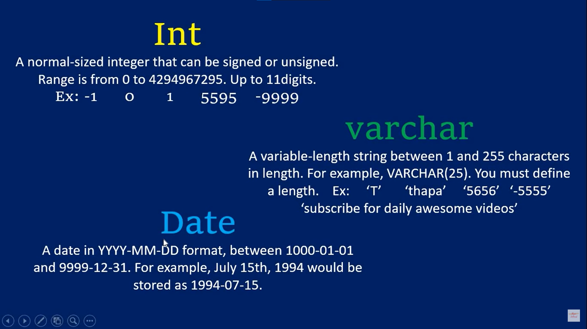
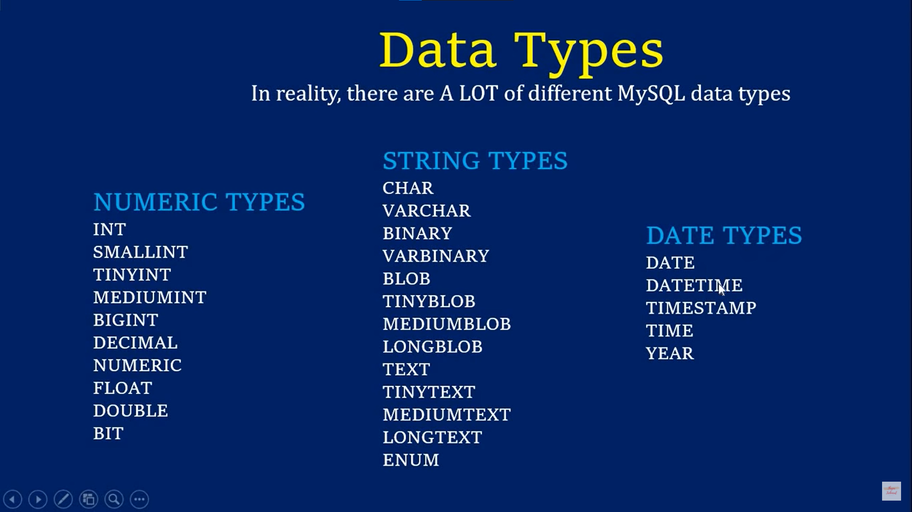

# SQL

Sql stands for stuructured query language which is used to manage the databases.

### How to Create Database

`CREATE DATABASE <name>` - It will create the database on your input name.

### How to Delete Database

`DROP DATABASE <name>` - It will delete the database the name we provided.

### How to see the all databases

`SHOW databses` - It will list down the databases.

### How to use some database

`USE <name>` - It will use the mentioned database.

### How to get the current database

`SELECT DATABASE()` - It will return you the current databse name.

### FEILDS & RECORDS

- `FEILDS -` Columns in the database.

- `RECORDS -` Rows in the database.

### Data Types

**Numeric :-** INT

**Strings :-** VARCHAR

**Date and Time :-**  DATE  

**Most Imp Datatypes :-**





### HOW TO CREATE TABLES

```
CREATE TABLE users(
    name varchar(55),
    age int
);
```

It will create table with name which datatypes assgined to it.

### HOW TO SEE THE TABLES IN DATABASE

`SHOW TABLES` - It will show all the tables in the database which you are using.

### HOW TO SEE THE DESCRIPTION OF TABLE

`DESC <tablename>` - It will show the table information.

### HOW TO DELETE TABLE

`DROP <tablename>` - It will delete table from your current database.

### HOW TO INSERT DATA IN TABLES

- `INSERT INTO <tablename>(column1, column2) VALUES (value1, value2)`

- `INSERT INTO <tablename> VALUES(value1,value2)`

Above both queries will insert the data in the table.

### HOW TO GET DATA

`SELECT * FROM <tablename>` - It will give all data of table.

### HOW TO SEE WARNINGS

`SHOW WARNINGS` - It will show the warnings.

### NULL & NOT NULL

`NULL` - NOT KNOWN

`NOT NULL` - CANT BE NULL

We use not null while creating the table like 
```
CREATE TABLE(id INT NOT NULL,name VARCHAR(55) NOT NULL)
```


