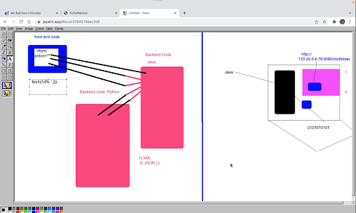

# Node JS (Backend)

We cant perform the buissness and major logic to the client side on the browser like front-end it can slowdown your application soo thats why we need backend to perform major tasks and our side and minimum and required only oprations should run on the client side soo the application will be faster.

A compiler which compiles the higher level language can convert the things into machine understandable code and perform the tasks.

Its serverside javascript runtime enviornment.

### Uses of Node Js

1. Node Js is mostly used for api.

2. We can connect the same database with Web App, Mobile App.

3. Node Js is super-fast for API.

4. You can be a full stack developer, you can become full stack developer.


### What api does

When we request an api call it will take data from the database and file server and give it to mobile app and web applications.

### Server :-
When we write the code like in example if we built an software like calculator and someone wants to use it but he is not able to create from scratch soo he will ask you to provide files for the software but we cannot provide our files to everyone who resides in the another corner of the world soo the concept of **Sever** comes up.

### Deployement :-
On the server we can put our local code files of our software called as deployement and with the specific adress now everyone can use it by acessing that adress from their browsers.

A serve converts your local code to global which can be used by rest of the world by acessing it on specific adress.

### How dow we get files from server :-
When we acess the adress of server it will send us the HTML and CSS files and Javascript as well and this files will get executed on the client side and thorugh the javascript it will give the call server for the data and at the server side the code will get executed and it will return data in the form of response.

### API and Cloud Services
Api stands for application programminhg interface but backend can be only called by the front-end soo if another backend code wants interact with another backend code which is built in another language here API comes out.

API's are language independant and platform independat means transfering data in some format which can be understandable with every programming language soo api returns the data in the form of json.

soo with the another backend language as well we can consume the data just by calling its functions and giving the required inputs and will get the data in the form of json.




### Types of Api's :-

- **SOAP :-** Simple object acess protocol. 

It transfeer the data in small envolop which will be in the format in XML.


- **REST :-** Representational state transfer protocol.

    In REST api it will be designed for any resource which means create,retrive,update and delete.

    Any resource to be created in which we can create,retrive, update and delete can be performed.

    Methods : 
    - Get
    - Post
    - Put
    - Delete

**NPM (Node package Manager) :-**
    We can install packages and libraries with the help of npm.

- It will create node modules folder.
- It will create package.json and package.lock.json in which installed packages details and dependencies will be present there.


---

### undefined in node js

As node uses chromes v8 engine soo as we get undefined on the chromes javascript compiler we also get the undefined in the node js as well.

`undefined :-` when any line or statement doesnt return something it will say the undefined as well

### How Node js works

---

### Fundamentals of Node Js

- **How to import and export code :-**

    As we do import and export in the javascript it doesnt run in the nodejs as well bcoz its running the bit lower version javascript which doesnt support the import and exports like angular and react and all.

     - **Solution for imports and exports :-**

        In nodejs we can only export and import only objects.

        **Exporting object :-** We can export object by using `module.export={x:20,y:30}` and we can import this object in the project.

        **Importing object :-** We can import object by using `const filename = require(../app)` and we can use the variable as object in the applications as we can acess the values as well.

- **Filter :-** 

    Filter is array method with which we can filter the data from the array and return the array with the filtered values.

    **How to filter basic :-**
        we can return the value which we want in the return statement as like mentioned below.
    ```
    let a = [1,2,3,4,5]

    let filtered = a.filter((item)=>{
        return item===3
    })
    console.log(filtered) // returns 3
    ```

### Core Modules

Core modules are the modules are predefined modules where we dont need to write it from scratc. like ex : `fs,console,buffer,http,etc`.

- **Global Module :-** The modules we dont need to import and we can use them without importing is called as global modules.

- **Non-Global Module :-** The modules we need to import it before using it is called as non-global modules.

- **Directory and files :-**
    - `__dirname :-`  it will returns the directory path.
    - `__filename :-`  it will returns the files which are mentioned in the directory.

- **Howt to import module with specific function :-**

    Yes we can import the specific function from the module as like mentioned below.

    `let fsWrite = require('fs').writeFileSync` And we can use it.

### Basic Server and Output on browser

We can create server with the help of http module.

- First we need to import the http and store it in variable like `const http = require('http')`

- Then we have `createServer(req,res).listen(port)` this function will create server which will be running on `localhost:4500/` and `createServer()` will take a call back function the first param will be `request` and second will be `response`.

- Then we can write on the server with the help of `response.write()` function.

- And at the end we need to tell the node js as well where to stop soo we have `response.end()` so it will end the process over there.


```
const http = require('http')

http.createServer((req,resp)=>{
    resp.write("Hello World");
    resp.end()
}).listen(4800);

// This will create server on localhost:4800 port and will show what we written on it.
```

**Most Imp :-** When we make changes in our code will not show on the server we need to rerun the our nodejs server for it.

### Package.json

Package.json holds all the packages information and project information and detials about your project and some commands as well about your project.

**Its most important file of project which should not be deleted never. Else the project will be destroyed.**

- **How to create package.json :-** We can create package.json with the command `npm init` soo it will ask you for project detials and it will create package.json.

- **How to create node modules and package.lock.json :-** Whenever we install any node package in our project package.lock.json and node modules folder will be created.

- `package.lock.json :-` package.lock.json file holds the detial information of packages which you installed in your project and if its deleted whenever we do npm install it will be created again.

- `node modules :-` It will hold the folders of the packages and npm will  automatically install its related and dependant packages as well which will be stored in the node modules folder itself.

- **How to ignore node modules while pushing to github :-** For skipping the node modules folder while pushing the project on github or bitbucket we need to create .gitignore file and in that we need to do `/node modules` soo it will ignore all the node modules folder.

### NodeMon
Nodemon is the node package which will used for time saving purpose and which will work as live reload, we dont need to rerun the files again and again it will do it automatically.

 - **Installation :-** `npm i nodemon`

 - **Use :-** Before we used to use the `node filename` soo rather than it we can use now `nodemon filename` soo it will run the server with the nodemon with live reload.


### Static Api

We need to create the api with the `http module` and `createServer` function.

**Most Imp :-** We need to stringify the whatever the data will be we need to stringify it first and then we can use it in `response.write()`. 
 
- First we need to create server with http module.
```

http.createServer((req,res)=>{
    res.writeHead(200,{'content-type':'application\json'})
    res.write(JSON.stringify(dt));
    res.end();
}).listen(4800)
```

- Then we need to write headers like `res.writeHead(200,{'content-type':'application\json'})`


- Then we need to use `response.write(stringified data)`.

ex : 
```
// data File

let data = [{ name: "Shiv", age: "18" },{ name: "Shiv", age: "18" },{ name: "Shiv", age: "18" },{ name: "Shiv", age: "18" },{ name: "Shiv", age: "18" }];

module.exports = data;


// main file
const http = require("http");

let dt = require('./data');

http.createServer((req,res)=>{
    res.writeHead(200,{'content-type':'application\json'})
    res.write(JSON.stringify(dt));
    res.end();
}).listen(4800)
```

### Input From Command line

We can grab input from the command line with the help of `process` object with the help of `process.argv` which returns an array of `node.exe path` and `current dir path` and the things we put further of run command that things will be appended in this array.

```
let input = process.argv
console.log(inupt) // returns an array with node path, and current file path and further the inputs.
```

### File System

File system is the module in the node js which is usefull for creating, reading, writing, deleting files in the current directory.

**How to use :-**

- import file system like `const fs = require('fs')` and we can use its internal functions for the oprations.

**Fs Oprations :-**

- **create File :-** 
    
    `fs.writeFileSync(name,content)` It will checks for the file availability and if not then it creates new file and it appends the content in it.

- **create with folder path :-** 
    
    `fs.writeFileSync(path+fileName,content)` this will create the file inside directory which is mentioned.

- **Read File :-**

    `fs.readFile(dir/file,'utf8',(err,res)=>{console.log(res)})` this will read the file in ut8 format.

- **Append Data in file :-**    

    `fs.appendFile(dir/file,data,(err)=>{if(!err){console.log("Data Appended")}})` this will append the file and this will only have one parameter in its callback which is err and we need to show the sucess massage on it.

- **Rename File :-**

    `fs.rename(dir/file,dir/newfilename,(err)=>{if(!err){console.log("File Renamed")}})` This also takes only one parameter in its callback which is err and we need to show the sucess massage on it.


- **Read Directory :-** 

    `fs.readdir(path,(err,res)=>{console.log(res)})` this will take path as first arguement and a callback as the sec parameter in which first param will be error and sec will be response.

    This will return an array of file names.

### Path

Path is nodejs's core module which is very usefull for the directory creating, returning paths for the required oprations.

**How to get path of specific folder :-**

`__dirname` returns your current directory but if you want to create the files inside the folder then you need to get the path of that folder first and than only we can create the files in it.

For getting path we have `path.join(dir,foldername)` which returns the path to that folder and we can create file inside it as like mentioned below.

```
// Foldername is Data which is created manually

const path = require('path')
const dataPath = path.join(__dirname,'data/') // returns dir/folder/

// create file inside that folder wiht fs
fs.writeFileSync(filesPath+'dummy.js','let data = {name:"Shiv",age:18}')

```

### Express Js

Express is the node js framework which helps us to create api's in less time and to save our time rather than writing api's in scratch node js.

Genrally Express simplifies our work.

**How to use Express :-**

- Import express `const express = require('express')`

- Create instance of `express()` `const app = express()`

**Fundamentals of express :-**

- **starting server :-**    

    As previously we used to start the server with the help of `http` module with `createServer()` method we can do the same here with `app.listen(port)`.

- **Creating Calls with routes :-**    

    We can create requests as like mentioned below.

    - **Strucure of calls and routes :-**

        ```
        
        app.get(route,callback(req,res)=>{
            res.send(data)
        })
        ```

    - **Created Server and Some basic api calls :-**
        ```
        const express = require('express')
        const app = express()

        app.get('/home',(req,res)=>{
            res.send("home")
        })

        app.get('/about',(req,res)=>{
            res.send("about")
        })

        app.get('/services',(req,res)=>{
            res.send("Services")
        })

        app.get('/contact',(req,res)=>{
            res.send("contact")
        })

        app.listen(4800)
        ```
- **Render HTML on browser :-**

    Through the node Js we can render html as well on the browser by sending html as a string in the resonse.

    ```
    // This will be rendered as h1 tag of html  

    app.get('/home',(req,res)=>{
    res.send("<h1>home</h1>")
    })
    ```
- **Acess Server Folder Files through browser :-**

    We can directly acess the server files which for the acessible directory we provided.

    We can do that with the help of `app.use(express.static(dir))` and by this we can enter the filename in the url to hit and the file will be rendered on the browser.

    ```
    const express = require('express')
    const app = express()
    const path = require('path')

    let dataDir = path.join(__dirname,'data/')

    app.get('',(req,res)=>{
        res.send("<h1>home</h1>")
    })

    app.use(express.static(dataDir))

    app.listen(4800)
    
    ```

### Send File without extension with express

Above as we mentioned with the help of `express.static(dirname)` we needed to use the filenames with extensions soo, as its not a good practice we can hendle the thing with the help of `app.sendFile(path/filename)` as like mentioned below.

```
const express = require('express')
const app = express()

let dataDir = path.join(__dirname,'data/')

app.get('/data',(req,res)=>{
    res.sendFile(`${dataDir}/data.js`)
})
// app.use(express.static(dataDir))

app.listen(4800)
```

### 404 routing in expressJs

404 page is the page which appears on the hitting of invalid url and that can be done by mentioning `app.get('*',(req,res)=>{})`.

This will Route to the page or the response which we have sent on the 404 page.

```
const express = require('express')
const app = express()

 app.get('*',(req,res)=>{
        res.send('Invalid URL')
    })
```

### Middleware in expressJs (Global - For all Routes)

Middle ware is the intermediator of browser and the server which process the things as per the requirement before fullfilling the response like checking age, uesr login and all.

Middle ware is the function with the 3 params, `(req,res,next)` in which `req, and res` are request and response as usual and `next()` proceeds the request.

```
  const ageFilter = (req,res,next)=>{
        if(req.query.age==undefined){
            res.send("Please provide your age.")
        }
        else if(req.query.age<18){
            res.send('You Cannot acess this url, as your age is not 18+.')
        }
        else{
            next()
        }
    }
    app.use(ageFilter)
```

### Route Level Middleware

Route level middleware is where we apply middlewares for the perticular routes only and it will not be applied as global middleware.

For creating the route level middleware we need to pass the middlewear in the routes as an arguement after route defination and before callback.


```
const ageFilter = (req,res,next)=>{
    if(req.query.age==undefined){
        res.send("Please provide your age.")
    }
    else if(req.query.age<18){
        res.send('You Cannot acess this url, as your age is not 18+.')
    }
    else{
        next()
    }
}
 app.get('/data',filter,(req,res)=>{
        res.sendFile(`${dataDir}/data.js`)
      
    })

```
We can create the middlewares in the another directory as well, we need to import `const filter = require('./Middlewares/Filters')` and export the middlewear from the file with the help of `module.exports = ageFilter`.

### Middleware for group of routes.

We can't apply the middlewear for the every route soo we need to group the route and we need to apply the middlewear for the route group.

**How to create group routes :-**

- create the router with `const router = express.Router()` which can be used for grouping of routes.

- create the routes with the help of `router.get(path,callback)` rahter than `app.get(path,callback)`.

- use the middleware for the custom router like `router.use(middleware)` it will apply the middleware to the defined routes with it.

- use the router for the app soo it can recognize the routes made with router. `app.use('/',router)`. 

The above step will apply the middleware for the group routes only which are created by the router itself.


### MongoDb

MongoDb is the NOSQL database in which the data is stored in the format of objects and not in rows and columns.

There are no tables in the mongoDb rather than it have collections which are act as the tables in the mongoDb.

**Basic Commands for ubuntu :-**

- **To start the server :-** `sudo service mongod start`

- **To Stop the server :-** `sudo service mongod stop`

- **To restart the server :-** `sudo service monogod restart`

- **To check the status :-** `sudo service mongod status`


### MongoDb compass

MongoDb compass is the gui tool for the mongoDb as like php myadmin form which we can manipulate the databases, collections and all.

**MongoDb Command Line (Basic Commands) :-**

- `show dbs :-` It will list down the all the databases.

- `use database_name :-` It will use the database.

- `db.createCollection('name') :-` It will create collection with name.

- `db.collection_name.drop() :-` It will drop collection.

- `db.dropDatabase() :-` It will drop database.


### CRUD in MongoDb CLI

**CRUD through commandline :-**

- `db.collection_name.insertOne(obj) :-` 
    
    It will insert data in the form of object in collection.

- `db.collection_name.find() :-` 
    
    It will list down the data in the collection.

- `db.collection_name.updateOne({name:'mohan'},{$set:{brand:'Oppo'}}) :-`

    This will update the entry where name will be mohan and updates the brand or inserts a key value if key does not exists.

- `db.collection_name.deleteOne({name:'shiv'}) :-`  

    This will delete the entry where name will be shiv.

### CRUD in NodeJs with MongoDb

For connecting the mongoDb with nodeJs we need to install `npm i mongodb` which is official driver of the mongoDbl.

**Steps to connection and getting data :-**

- First import `mongoClient` like `const {MongoClient} = require('mongodb')`.

- Create config variables as like mentioned below.

    ```
    const {MongoClient} = require('mongodb');
    const url = 'mongodb://localhost:27017';
    const db_name = 'Users'
    const collection = 'Users_data'

    const client = new MongoClient(url)
    ```

- Create Function for the connection in which tell the mongo client about the dbname and collection as like mentioned below and use the mongo Methods on the `col_obj` as like mentioned below.

    ```
    // Config
    const {MongoClient} = require('mongodb');
    const url = 'mongodb://localhost:27017';
    const db_name = 'Users'
    const collection = 'Users_data'
    const client = new MongoClient(url)

    // Connection and get Data Function
    async function connect() {
        let connection = await client.connect()
        // console.log("Connection =>",connection)

        let db = connection.db(db_name)
        let col_obj = db.collection(collection)
        let data = await col_obj.find().toArray();
        console.log("Data =>",data)
    }
    
    // It will return the array of objects in which data will be stored.
    connect() 
    ```

In the above process, when we want to get the data from mongo we need to convert the resolve promise into array. like `let data = await col_obj.find().toArray();`.


### DB Config File and Calling function in another files

- First create seprate file for database configuration and return the `collection` like mentioned below and weather if it will be function but pass it as variable at the `module.exports = connect`.

    ```
        const {MongoClient} = require('mongodb');
        const url = 'mongodb://localhost:27017';
        const db_name = 'Users'
        const collection = 'Users_data'

        const client = new MongoClient(url)
        // let col_obj;

        async function connect() {
            let connection = await client.connect()
            // console.log("Connection =>",connection)

            let db = connection.db(db_name)
            let col_obj = db.collection(collection)
            return col_obj
        }

        module.exports = connect
    ```
- Import `dbConnection` in the another file like `const connection = require('./db/mongoConfig')`.

- Create the Get Data Function in which call the connection first and use the `await` bcoz it's async function return and which returns the promise.
`let dbObj =  await connection()`.


- And Now we can use the all the collection methods on the dbOnj variable liek get and all as like mentioned below.

    ```
    const connection = require('./db/mongoConfig')

    async function getData() {
        let dbObj =  await connection()
        let data = await dbObj.find().toArray();
        console.log("Data =>",data)
    }
    getData()

    ```


### Insert Opration in mongo In nodeJs

Nothing special for the insert opration, same we need to import the connection and we need call it asynchronusly and we need to call the `.insert({name:'shiv'})` for the single insertion and `.insert([{name:'shiv'},{name:'Sai'}])` for the batch insertion.


```
    // For single insertion
    async function insert(){
        let dbObj =  await connection()

        let inesrted = await dbObj.insertOne({name:'shiv2'})
        console.log("Inserted result =>",inesrted)
    }

    insert()

    // For batch insertion
    async function batch_insert(){
        let dbObj =  await connection()

        let inesrted = aw dbObj.insertOne([{name:'shiv2'},{name:'sai2'}])
        console.log("Inserted result =>",inesrted)
    }

    batch_insert()
```


### Update Opration in mongoDb in nodeJs

For the update opration in mongodb through nodejs is done with the help of `dbObj.updateOne({property:'value'},{$set:{proprty:value}})` which checks for the existing proerty and updates the value and if property is no exists will update the property with the provided value.

```
// Update
async function update(){
    let dbObj = await connection()
    let update = await   dbObj.updateOne({name:'shiv1'},{$set:{name:'First Shiv'}})
    console.log("Update Result =>",update)
}
update()
```

### Delete Opration in mongoDb in nodeJs

Delete opration in mongodb through nodejs is done with `dbObj.deleteOne({name:'shiv5'})`.

```
// Delete 
async function deleteSingle(){
    let dbObj = await connection()
    let deleteSingle = await dbObj.deleteOne({name:'shiv5'})
    console.log("Deleted Response =>",deleteSingle)
}
deleteSingle()
```

### Get Api with mongoDb

We need to make connection in the get function and we need to get the data with the method `find().toArray()` and we need to send the data as response like `res.send(data)` as like mentioned below.

```
    app.get('/data',async (req,res)=>{
        let dbObj = await connection()
        let data = await dbObj.find().toArray()
        console.log("Data Fetched =>",data)
        res.send(data)
    })
```

### Post Api with mongoDb

For posting the data most importantly we need to acess the `request.body` and for that we need to use `app.use(express.json())` with the help of this we can acess the body of the request.

And we need to pass the body data to the `insert` function like `dbObj.insert(reqData)` and further as like mentioned below.

```
// Acessing request body
    app.use(express.json());

// Post
    app.post('/user',async (req,resp)=>{
        let dbObj = connection()
        let reqData = req.body
        console.log("Data Recieved in Post=>",reqData)
        let insert = (await dbObj).insertOne(reqData)
        resp.send(reqData)

    })
```

### Put api with mongoDb

For Update api with mongoDb most importantly we need to grab the property and its value from the request.

syntax : `dbObj.updateOne(conditionalObj,{$set:valueObj})`

**Conditional :-** 
    
`app.put('/user/:name',callback)`  name will be property of params obj.

`/user/Abhishek` Abhishek will be the value of the name property like `{name:'Abhishek'}`.

**How to acess conditional obj :-**

- `let propertyToUpdate = req.params` This will return an obj `{name:"Abhishek"}` which we can put as the conditional obj in the update Query.


- `let dataToUpdate = req.body` This will return the body object as we passed to the body as same as post.

**Update Query dynamic :-**

```
let update = await dbObj.updateOne(propertyToUpdate,{$set:{...dataToUpdate}})
```

Whole update function is like mentioned below.

```
//To acess the request body
    app.use(express.json());

// Whole update function
    app.put('/user/:name',async (req,resp)=>{
        let dbObj = await connection()

        let propertyToUpdate = req.params

        let dataToUpdate = req.body

        console.log("Query Params =>",propertyToUpdate)

        console.log("Data to update =>",dataToUpdate)

        let update = await dbObj.updateOne(propertyToUpdate,{$set:{...dataToUpdate}})

        console.log("Data Updated Resopnse =>",update)

        resp.send(dataToUpdate)
    })
```

### Delete Api with mongoDb

In Delete api if we want to delete the data based on the id, 

**In mongoDb id is not only string, its mongodb.ObjectId and we need to convert our id in to the same with `new mongo.ObjectId(req.params.id)`.**

We can delete the object with the query ` let deleting = await dbObj.deleteOne({_id:new mongo.ObjectId(req.params.id)}).`

All the code is mentioned below for the delete.

```
// Delete
   app.delete('/user/:id',async (req,resp)=>{
        
        console.log("Params =>",req.params.id)
        let condition = {
            _id:new mongo.ObjectId(req.params.id)
        }
        resp.send(condition)

        // deleting
        let dbObj = await connection()
        let deleting = await dbObj.deleteOne(condition)
        
        console.log("Condition For delete =>",condition)
        console.log("Deleted")
    })
```

### Mongoose and db Connection in mongoose

Mongoose is also a npm package to connect nodejs with mongodb with some advance features like validations, models, interfaces and all.

**How to connect with db with mongoose :-**

- import mongoose `const mongoose = require('mongoose')`

- then connect with the db with `mongoose.connect(url)`.

### Mongoose Model and Schema

Mongoose have advance functionalities like model and schema which helps us to create interfaces and restrict the data in the format.

- **Schema :-**

    We create schema in the mongoose with the help of `mongoose.schema(schemaObj,collectionObj)` as like mentioned below.

    ```
    const userSchema = new mongoose.Schema({
    name:String
    },
    {
        collection:'Users_data'
    })
    ```

- **Model :-**

    We create a model which can be used for the further all oprations with the help of collection name and schema as like mentioned below.

    ```
    let userModel = mongoose.model('Users_data',userSchema)

    // For creating new user
    let user = new userModel({name:'Mongoose',age:18})
    let result = await user.save()
    console.log("Result =>",result)
    ```

### Crud with mongoose

In the mongoose earlier as we used to get the dbObj instance of `connection()` here we need to create model in every function get, put, post, delete.

First we need prepare userSchema and make connection as like mentioned below.

```
const mongoose = require('mongoose')

//Schema
const userSchema = new mongoose.Schema({
    name:String
},{
    collection:'Users_data'
})

// Connection
const url = 'mongodb://localhost:27017/Users';
mongoose.connect(url)

// Model
const User = mongoose.model('Users_data',userSchema)
```

- **get :-**

    For fetching all the data from the db as normal we need to call the `Model.find()` method asynchronusly with await as like mentioned below.
    
    ```
    // Get
    async function getAllData(){
    let User = mongoose.model('Users_data',userSchema)

    let data = await User.find()
    console.log("All Data Fetched =>",data.length)
    }

    getAllData()
    ```
- **insert :-**

    For inserting the data into db we need to pass the data to `new Model(data)` as like mentioned below.

    ```
    // Insert

    async function insert(){
    let user = new User({name:'Mongoose',age:18})
    let result = await user.save()
    console.log("Result =>",result)
    }
    insert()
    ```

- **update :-**

    For updating the record we need to use the 
    `Model.updateOne(conditionalObj,{$set:valueObj})` same as before.

    ```
    async function update(){
    let update = await User.updateOne({name:'Mongoose'},{$set:{name:'Mongo DB'}})
    console.log("User updated =>",update)
    }

    update()
    ```

- **delete :-**

    For deleting the record we need to use the `Model.deleteOne(conditionalObj)` same as before, as like mentioned below.

    ```
    async function deleteOne(){
    let deleting = await User.deleteOne({name:'Mongo DB'})

    console.log("Deleting Mongo DB =>",deleting)
    }

    deleteOne()
    ```
### Crud Api's mongoose

First we need to connect with the mongoDb with mongoose with `mongoose.connect(url)` and we need to create schema and model as like mentioned below.
```
const userSchema = new mongoose.Schema({
    name:String
},{
    collection:'Users_data'
})
const url = 'mongodb://localhost:27017/Users';
mongoose.connect(url)

var User = mongoose.model('Users_data',userSchema)
```

After connection we need to create the api's with the help of `app = express()` and with its calls.

- **Get :-**

    For the get api we need call the get method with the route and we need to use find method only on the model like `let data = await User.find()` as like mentinoed below.

    ```
    app.get('/users',async (req,resp)=>{
    let data = await User.find()
    console.log("Data Fetched =>",data)
    resp.send(data)
    })
    ```

- **Post :-**

    For the post api we need to call the post method with the route and we need to creae new Model like `let data = new UserModel(req.body)` and we need to save like `let save = await data.save()` as like mentioned below.


    ```
    app.post('/user',async (req,resp)=>{
        let reqData = req.body
        // console.log("Data Recieved in Post=>",reqData)
        let insert = new User(reqData)
        let save = await insert.save()
        resp.send(reqData)
    })

    ```

- **Put :-**

    For the put api we need to put method with the route and we need to grab the data from the req like `let dataToUpdate = req.body`  and we need to grab the property and its value `let propertyToUpdate = req.params` and finally for the update opration use the `Model.updateOne()` method like `let update = await User.updateOne(propertyToUpdate,{$set:{...dataToUpdate}})` as like mentioned below.

    ```
    app.put('/user/:name',async (req,resp)=>{
        let propertyToUpdate = req.params
        let dataToUpdate = req.body

        console.log("Query Params =>",propertyToUpdate)
        console.log("Data to update =>",dataToUpdate)

        let update = await User.updateOne(propertyToUpdate,{$set:{...dataToUpdate}})

        console.log("Data Updated Resopnse =>",update)
        resp.send(dataToUpdate)
    })
    ```

- **Delete :-**

    For the delete method we need to grab the id or unique key from the params and create the condition with it like `let condition = {_id:req.params.id}` and we need to call the `Model.deleteOne` method as like mentioned below.

    ```
    app.delete('/user/:id',async (req,resp)=>{

    console.log("Params =>",req.params.id)
    let condition = {
        _id:req.params.id
    }
    // resp.send(condition)

    // deleting
    let deleting = await User.deleteOne(condition)
    
    console.log("Condition For delete =>",condition)
    console.log("Deleted")
    resp.send(deleting)
    })
    ```

Thats how we can create dynamic crud api's with nodejs and mongoose.

### Search Api with nodejs and mongoose

For the search api firstly we need to grab the search value from the url by `req.params.value` and for the search purpose we need to use the find method with ``$or`:[{"name":{$regex:req.params.value}}]` as like mentioned below.

```
   app.get('/users/:searchVal',async (req,resp)=>{
        console.log("Search Value =>",req.params.searchVal)
        let data = await User.find({
            "$or":[
                {"name":{$regex:req.params.searchVal}}
            ]            
        })
        console.log("Data Fetched =>",data)
        resp.send(data)
    })
```

### File Upload in Node Js

### Remaining
---

### OS Module

Os module is the module usefull for grabbing clients systems information in nodejs.

It is usefull when we need to run different conditinos and functionalities based on the different os information and when we need to work on the things os related like showing systeminfo and all then we use os module.

For using the os module we need to install it by `npm i os` and we need to import with `const os = require('os')`.

**Some Usefull methods :-**

- **Architecture (32bit or 64bit) :-** `os.arch()`

- **Free Ram :-** `os.freemem()`

    Freemem returns the free memory in bits and we need to convert it acording to our requriement as like mentioned below.

    - **kb :-** `os.freemem()/(1024)`
    - **mb :-** `os.freemem()/(1024*1024)`
    - **gb :-** `os.freemem()/(1024*1024*1024)`

- **Total Ram :-** `os.totalmem()`
    totalmem returns the free memory in bits and we  need to convert it acording to our requriement as like mentioned below.

    - **kb :-** `os.totalmem()/(1024)`
    - **mb :-** `os.totalmem()/(1024*1024)`
    - **gb :-** `os.totalmem()/(1024*1024*1024)`
    
- **HostName :-** `os.hostname()`

- **Oprating System :-** `os.platform()`

That's how we can work with os stuff.

### Events and Event Emitters (For Visitors count)

Events and events emitters are also like other events emitters in which we get a kind of single and when its got we can perform certain activity on it.

Best Use of the events can be understand throuh counter programme in which we can emit event in every api call and on the counter we can get the visitors count.

**How to use it :-**

- first import it like `const EventEmitter = require('events')`.

- Then we need to create instance of it like `const event = new EventEmitter()`.

- We can emit the event like `event.emit(something)` 

- To catch the event we can use the `event.on(string,callback)` as like mentioned below.

```
   const EventEmitter = require('events')
    const event = new EventEmitter()

    event.on('count',()=>{
        console.log("Event Called...")
    })

      app.get('',(req,resp)=>{
        resp.send("<h1>home</h1>")
        event.emit('default')

    })
```

### REPL shell in node

Read Evaluate Print Loop is the thing where we can write the javascript in the terminal itself for the small things and calculations.

For activating the REPL shell type `node` and to exit from it `.exit`.

### MySql connection

Previously we have used nodejs with nosql db with mongodb but here we are going to use the nodejs with sql db and we can run the queries here itself.

**Installation :-** `npm i mysql`

**Connection :-**

- First import mysql module like `const db = require('mysql')`.

- Then we need to create the connection object as like mentioned below.

```
const conn = {
    host:'localhost',
    user:'root',
    password:'',
    database:''
}
```
- Then we need to call the `db.connect(cb)` method in which check the error and log the connection status.

    


 


