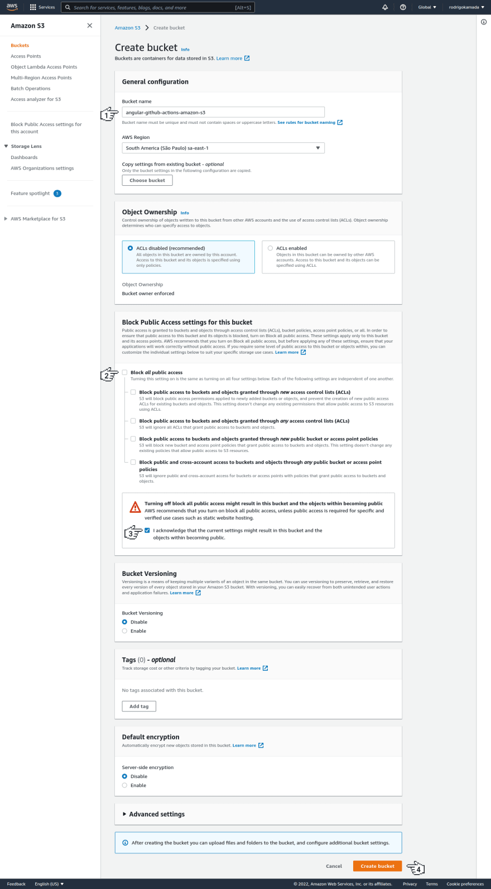
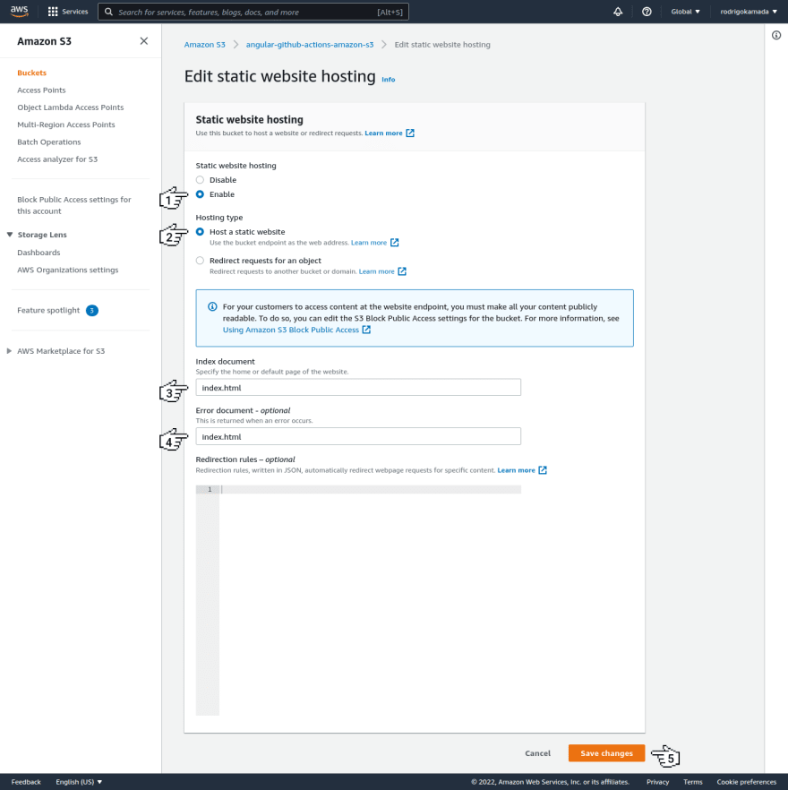

# CI CD throguh Github Actions

We can deploy our application automatically through our commit directly on server without putting down the build manually on server.

## AWS S3 Bucket

Firstly Create Amazon Web services account to use AWS S3 services.

1. **Create S3 Bucket :-**
    
    First create a bucket with public access and default encryption disabled as like mentioned below.

    

    **Remember :-**
    
    - Uncheck checkbox of `Block all public access` and check `Turn of warning`.

    - Check `Bucket Versioning`  disabled checkbox.
    

2. **Enable Static Website hosting :-**

    Click on s3 object and in properties go to `enable public hosting` and click on `edit` and as like mentioned below.

    

    **Remember :-**
    - Enable `static website hosting`.
    - Check `Host a static website`
    - Add `index.html` in index and error document.

3. **Create user in IAM(Identity And Acess Management) :-**

    Navigate to `IAM` from `Services > Security, Identity & Compliance > IAM` and click on navigate to `users > Create User`.

    **Create User :-**
    - Provide username and next.
    - Check attach policies directly and search `AmazonS3FullAccess` and check it and Next.
    - 

