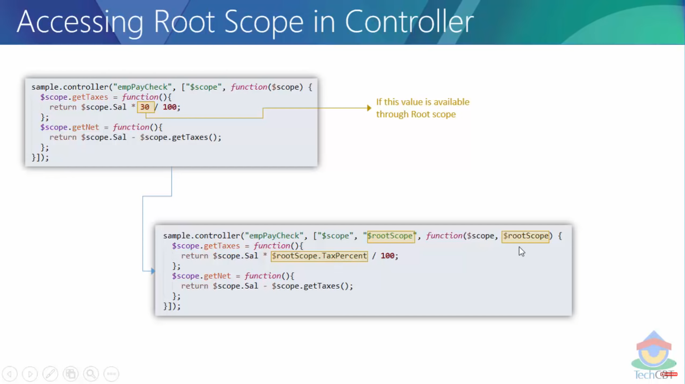

# Angular JS

Angular js the framework to add custom directives to your html & make the process easier of dom manipulation.

Its has most of 3 parts, view, model & controller in which view is our template & model is our data & controller is our functional code which interacts with servers to retrieve the data.

### Instllation

We can install angular app without even downloading or something, we can just include the script of angularjs in `head tag` in html as like mentioned below.

```
<head>
<script src="https://cdnjs.cloudflare.com/ajax/libs/angular.js/1.8.3/angular.min.js" integrity="sha512-KZmyTq3PLx9EZl0RHShHQuXtrvdJ+m35tuOiwlcZfs/rE7NZv29ygNA8SFCkMXTnYZQK2OX0Gm2qKGfvWEtRXA==" crossorigin="anonymous" referrerpolicy="no-referrer"></script>
</head>
```

### Creating First Angular App

**Steps to create :-**
1. **Create Module :-**
   
    For Creating the application we need to create module with `angular.module('name',[])` which will create the module.

    Remember that if you dont provide the second parameter like `angular.module('name')` it will look for existing module with that name and will return it. But here we are creating the module so we need to pass second parameter as `[]` so it will intialize the new module.

    ```
    <!DOCTYPE html>
    <html lang="en">
    <head>
        <meta charset="UTF-8">
        <meta name="viewport" content="width=device-width, initial-scale=1.0">
        <title>Document</title>
        <script src="https://cdnjs.cloudflare.com/ajax/libs/angular.js/1.8.3/angular.min.js" integrity="sha512-KZmyTq3PLx9EZl0RHShHQuXtrvdJ+m35tuOiwlcZfs/rE7NZv29ygNA8SFCkMXTnYZQK2OX0Gm2qKGfvWEtRXA==" crossorigin="anonymous" referrerpolicy="no-referrer"></script>

        // Creating Angular Module
        <script type="text/javascript">
            angular.module('main',[])
        </script>
    </head>
    <body></body>
    </html>
    ```

2. **Bind that module to ng-app :-**
   
   Even if you create the module but untill and unless you bind the module to angular app we cant use angular features in our html.

   For binding module to app we need to bind to any html element or body of tag as like mentioned below.

   ```
    // Binding module to app
    <body ng-app="main">
    </body>
    </html>
   ```

3. **Write Your First Code :-**
   
   Now we can start consuming angular features like interpolation or angular expressions `{{javascript code}}` in which we can write simple single liner javascript code for computing the javascript in html itself.

   ```
   <body ng-app="main">
    sum of 3 + 2 = {{ 3 + 2}} // sum of 3 + 2 = 5
    </body>
   ```

### How Angularjs Get Executed


**Steps of Angular Execution :-**
- **Angular Engine Execution & Initialization :-**
   When we integrate the CDN link into our head tag angualr engine gets executed.

- **Module Creation :-**

    When we add module into application its get created.

- **Template Identification :-**
  
    Angular HTML compiler is different from browser html compiler, it looks for angular directives which usually starts with `ng-directiveName` and looks for angular templates which contains interpolation `{{}}` data binding etc.

    HTML containing angular directives, interpolations and angular stuff are called as templates.

    Basically angular html compiler identifies angular templates first.

- **Template Processing :-**
  
  After being done identifying angular template it Compiles the template to checking if syntax is correct or does contains any errors.

  After compilation it loads the template in instance of memory of browser itself & transforms the template into simple browser understandable HTML.

- **Rendering Transformed HTML :-**
  
  The transformed HTML is rendered on the page with the help of browser's html engine itself.

### Controllers


Angular controllers are nothing but the javascript objects which contains data, variables, methods etc.

With the help of controllers we can execute our complex logic or javascript in it and then we can interact with view for displaying the results in the application.

We can consume the controller with the help of `ng-controller="controllerName as variableName` attribute, the attributes starts with `ng` are called as directives in angular. variable name contains the refrence to the controller and we can consume controllers properties and method as like mentioned below.

```
// Controller
    const app = angular.module('sampleApp',[]);
    app.controller('main',function(){
        this.name = 'Shivprasad';
    })

// Template
 <div ng-app="sampleApp" ng-controller="main as c">
        Hello {{c.name}}! // Hello Shivprasad!
    </div>
```

**Role of Controllers :-**


Data is termed as `Model` in angular & controllers are usually used to exchange of data with views.

View doesn't have any idea about controllers, it only believes in model's but controller works as middle man or data provider to view in terms of model.

Even controllers doesnt interact with databases directly, controllers communicate with web services & web services communicate with databases and delivers data to controller which controllers pass to view in terms of model.

### Scope


As we saw earlier Controller returns the model which is data indirectly but it doesn't send the data directly to view.

Scope is the mediator in between view & controller which carries the context of controller due to which it contains the all the data, method etc.

Remember if any property not present in the controller and still we try to access it through scpoe it does not throw any error, that why we use `use strict` in the controller.

Previous we was accesing the variable of controller through refrence created with the help of `as`, when we set the property to scope in controller we can directly access in the view without creating any refrence to controller as like mentioned below.

```
<script type="text/javascript">
        const app = angular.module('sampleApp',[]);
        // Assigned value to scope
        app.controller('main',function($scope){
            $scope.name = 'Shivprasad';
        })
</script>

<body ng-app="sampleApp" ng-controller="main">
    sum of 3 + 2 = {{ 3 + 2}}
    <br>
    // Consuming the variables from scope directly
    <div class="greet">
        Hello {{name}}!
    </div>
</body>
```

**Providing Collections rather than direct variables :-**

Browsers or servers usually minimzes our code in which case our variables get replaced with some simple charecters as like menioned below.
```
 // Assigned value to scope
        app.controller('main',function($scope){
            $scope.name = 'Shivprasad';
        })

// Minified
    app.controller('main',function(c){
        c.name = 'Minified';
    })
```

But the code gets minified it modifies the variables as it wants to be but that wont work in the view. To prevent this modification by browsers and servers we need to provide the collections for variables or dependencies as like mentioned below.

```
 // Assigned value to scope
        app.controller('main',function($scope){
            $scope.name = 'Shivprasad';
        })

// With Collection
    app.controller('main',['$scope',function(scope){ // Provided collection with ['instance',function(varible)]
        scope.name = 'Minified';
    }])
```
This is the standard we follow world wide for preventing the modification of dependencies but we need to keep in mind that its mapping is purely index based. If you provided a dependency at index 1, parameter 1 of the function will redirect to it.

```
app.controller('main,['inj1','inj2',function(var1, var2){

}])
```

**Creating & Using Multiple Controllers :-**

```
    // Shiv controller for Employee shiv
    app.controller('shiv',['$scope',function(scope){ // Provided collection with ['instance',function(varible)]
        scope.name = 'Shivprasad';
    }])

    // Sai controller for Employee Sai
    app.controller('sai',[$scope,function($scope){
        $scope.name = 'Saikiran'
    }])

    <div ng-controller="shiv">
        Employee name : {{name}} // Shivprasad
    </div>

    <div ng-controller="shiv">
        Employee name : {{name}} // Saikiran
    </div>
```

When we bind controller to some div it will refer its method & properties to its controller itself. No matter if proerties or methods are same.

**Controller Binding Syntax Differences :-**

- **Using refrence for controller :-**

    ```
     app.controller('main',function(){
        this.name = 'Shivprasad';
    })
    <div ng-app="sampleApp" ng-controller="main as c">
        Hello {{c.name}}! // Hello Shivprasad!
    </div>
    ```

    In this syntax controller scope is accesible from the view but rather the methods & properties of the scope will be set as refrence variable in scope like `scope.c` will refer to scope. there will be c property in the scope in which properties and methods from the controller will exists.

- **Using scope for controller :-**

    ```
     app.controller('main',function($scope){
        $scope.name = 'Shivprasad';
    })

    <div ng-app="sampleApp" ng-controller="main">
        Hello {{name}}! // Hello Shivprasad!
    </div>
    ```

    In this syntax controller variables & methods will be directly accesible through scope itself. it will exist in scope object with other inbuilt properties and methods rather than creating another property refering to this controller data.

### Scope Inheritance


When the angular html compiler sees ng-controller directive then it creates a scope context referring to directives scope, anything will be defined in the scope of controller like properties, methods or everything will be accessible withing the html elment on which ng-controller binded.

When we use another controller within that existing div element which is already binded with some controller then it creates another scope context in existing parents scope context, so in the child scope context parent scope's properties and methods will be accessible due to inheritance as like Oops concept.

```
// Controllers
    const app = angular.module('sampleApp',[]);
    app.controller('main',["$scope",function($scope){
        $scope.name = 'Shivprasad';
    }])

    app.controller('child',['$scope',function($scope){
        $scope.salary = 45000;
        $scope.age = 25;
    }])

// View
<body ng-app="sampleApp" ng-controller="main">
    sum of 3 + 2 = {{ 3 + 2}}
    <br>
    <br>
    <div class="greet" ng-controller="child">
        Hello {{name}}!
        <br>
        Your Salay is {{salary}}
        <br>
        Your Age is {{age}}
    </div>
</body>

// Result
sum of 3 + 2 = 5

Hello Shivprasad!
Your Salay is 45000
Your Age is 25
```

As you can see we are able to access name which is declared in main controller in the scope of child scope.

We can nest n numbers of scope in each other as we have saw above, if you want to seprate the logic mdoule wise then we can use multiple controllers nested within same entity such as Employee will be main scope & Personal details, Financial details will act as child scope where they would contain its relative logic.

### Root Scope


Rootscope is the scope gets created when the the ng-app binding(module binding) is declared with root module for the application.

Root scope contains all the nested or child scopes it as gets created for module binding with dom.

And nesting of the scopes in hirarchial order will be the same in its child scopes.

**Root Scope Access :-**


All the child scopes have access to rootscope methods & properties due to inheritance, When we bind module to dom element it creates root scope by default & as we declare the controllers in it creates controllers context inside the rootscope due to which all the scopes have access to root scope properties & methods.

**Declaring properties & methods in root scope :-**

We have `.run(['',function(){}])` method on module which gets executes when the module is initialized.

```
   const app = angular.module('sampleApp',[]).run(['$rootScope',function($rootScope){
            $rootScope.manager = 'SK';
        }]);

    app.controller('child',['$scope',function($scope){
            $scope.salary = 45000;
            $scope.age = 25;
        }])

<body ng-app="sampleApp">
    <div class="greet" ng-controller="child">
        Your Salay is {{salary}}
        <br>
        Your Age is {{age}}
        <br>
        Your manager is {{manager}}
    </div>
</body>
```

**RootScope Modifications :-**


As mentioned above every controller scopes are referring to same rootscope variable TaxPercent, if we modify the rootscope values then it will be reflected in each and every controller.

`Note :- Rootscope gives us the comfortability to have access in each & every scopes but its not the good practice to use rootscope for sharing the data across multiple controllers. It should be only opted when there is no else way is remaining.`


**Accessing Root scope in Controllers :-**



If we dont have variable named in our local scope or parent scope it will directly refer to root scope if we have declared the variable with that name.

But it's not good practice to access the rootscope variable with direct access as it doesn't gives any clarity from where exactly we are accessing the values or where are those declared.

Best way to access the rootscope variable or values is with `$rootScope` parameter which is reserved keywork in angualr which we can inject as same as scope in the controller.

```
   const app = angular.module('sampleApp',[]).run(['$rootScope',function($rootScope){
            $rootScope.manager = 'SK';
            $rootScope.tax = 1500;
        }]);

    app.controller('child',['$scope',function($scope){
            $scope.salary = 45000 + $rootScope.tax; // We have accessed rootscope with $rootScope instance.
            $scope.age = 25;
        }])

<body ng-app="sampleApp">
    <div class="greet" ng-controller="child">
        Your Salay is {{salary}}
        <br>
        Your Age is {{age}}
        <br>
        Your manager is {{manager}}
    </div>
</body>
```

There is not necessity to declare the rootScope values in the `module.run` method only, we can declare the rootScope values from any of the child controllers as well. But it just should be declared before consuming it as like mentioned below.

```
const app = angular.module('app', []);

app.controller('myController',['$scope','$rootScope',function($scope,$rootScope) {
    $scope.name = 'Shiv';
    $rootScope.manager = 'SK'; // Setting rootscope values from child controller.

}])
```