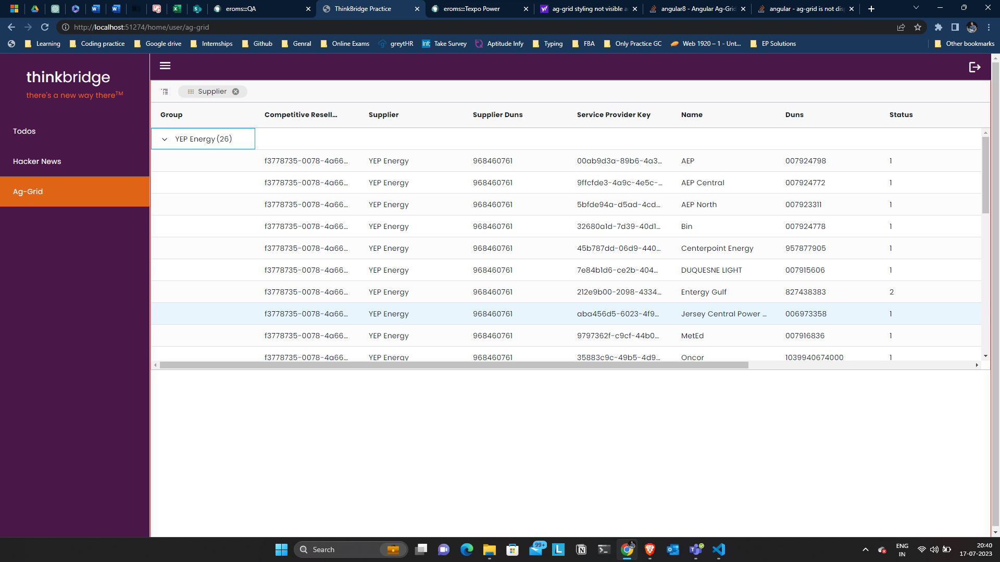
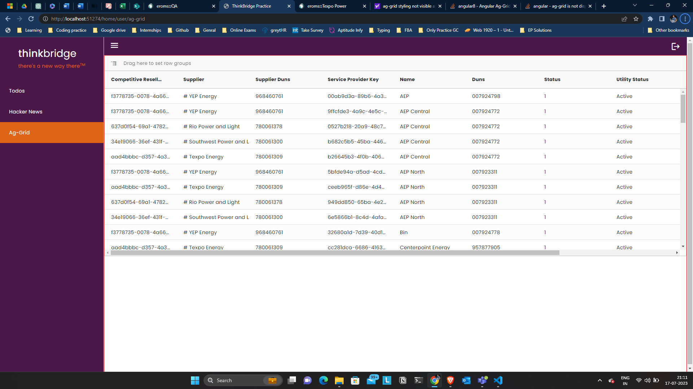

# ag-grid

ag-grid is the library which involves the main functional components like tables and all with all features inbuit like search, filter, sort, paginations,actions etc.

### Installation

We need to install ag-grid-community with `npm i ag-grid-community` which contains buissness logic in it and ag-grid-angular with `npm i ag-grid-angular`.

After installation we need to register ag-grid into `app.module.ts` like `import {AgGridModule} from 'ag-grid-angular'` and add it into `imports:[]` array.

### How to Use

We can integrate ag-grid component with `<ag-grid-angular></ag-grid-angular>` by providing directives along with the requirements.

At least `rowData` & `colDefs` are the 2 important which provides data and its column definations as like mentioned below.

**Steps For Integration of Basic Grid :-**

- Integrate column Definations along with rowData as like mentioned below.

    ```
    // template
    <ag-grid-angular [rowData]="rowData" [columnDefs]="colDefs"></ag-grid-angular>


    // class
      colDefs:ColDef[] = [
        { field:'fieldname1'}
        { field:'fieldname2'}
        { field:'fieldname3'}
    ]
    
     rowData = [
        { fieldname1:'value'},
        { fieldname2:'value'},
        { fieldname3:'value'}

    ];
    constructor(){}
    ```

- Import ag-grid-angular stylings  such as ag-grid theme with `@import "ag-grid-community/dist/styles/ag-grid.css"` & ag-grid styles with `@import "@import "ag-grid-community/dist/styles/ag-theme-alpine.css"` in style.scss files as like mentioned below.

    ```
    // style.scss
    @import "ag-grid-community/dist/styles/ag-grid.css"
    @import "ag-grid-community/dist/styles/ag-theme-alpine.css"

    ```

- Add ag-grid theme styling Classes and height and width to ag-grid component for its appearance as like mentioned below.

    ```
    <ag-grid-angular 
    class="ag-theme-alpine" 
    style="height:500px,width:600px"
    [rowData]="rowData" 
    [columnDefs]="colDefs"
    ></ag-grid-angular>
    ```

    If we want the other themes like dark we need to update the theme import with its suffix & update the same in class as like mentioned below.'

    ```
    // Template
    <ag-grid-angular 
    class="ag-theme-alpine-dark" 
    style="height:500px,width:600px"
    [rowData]="rowData" 
    [columnDefs]="colDefs"
    ></ag-grid-angular>

    // Style.scss
    @import "@import "ag-grid-community/dist/styles/ag-theme-alpine-dark.css
    ```

- Add click event if you want to perform some action on row click by getting its data with `(cellClicked)` event as like mentioned below.

    ```
    // Template
    <ag-grid-angular 
    class="ag-theme-alpine-dark" 
    style="height:500px,width:600px"
    [rowData]="rowData" 
    [columnDefs]="colDefs"
    (cellClicked)="onCellClicked($event)"
    ></ag-grid-angular>

    // Class
    onCellClicked(event:CellClickedEvent){
        console.log("Cell Clicked : ",event);
    }
    ```

### Directives

we need to define input data and column defination to ag-grid-angular component as like mentioned below.

- **columnDefs :-**

    We need to define the colum definations which we can do by `ColDefs` interface provided by ag-grid.
    ```
    colDefs:ColDef[] = [
        { field:'fieldname1'}
        { field:'fieldname2'}
        { field:'fieldname3'}
    ]
    
    constructor(){}
    ```

    With the `field` key we can assign the string value for which can be identified in rowData.

- **rowData :-** 

    We can provide the `rowData` to ag-grid-angular by assigning values to mentioned keys in rowDef's as like mentioned below.

    ```
    rowData = [
        { fieldname1:'value'},
        { fieldname2:'value'},
        { fieldname3:'value'}

    ];
    constructor(){}
    ```

- **defaultColDef :-**

    We can apply the featues for each columns at single place with `defaultColDef` directive integrated to component as like mentioned below.

    ```
    defaultColDef:ColDef = {
        sortable:true,
        filter:true
    };
    ```

- **rowSelection :-**

    We can select multiple rows by providing value `multiple` to this directive as like metioned below.

    ```
        <ag-grid-angular [rowSelection]="'multiple'"></ag-grid-angular>
    ```

- **animateRows :-**    

    We can animate the rows while sorting and filtering by providing true value to this directive to template as like mentioned below.

    ```
    <ag-grid-angular [animateRows]="true"></ag-grid-angular>
    ```


### Sort & Filter

We can make the columns sortable and filterable by adding for sort `sortable:true` & for filter `filter:true` in that perticular column field object where we want those features.

If we want that features to be applied to all the columns without defining those for individual columns we can provide default column defination with its features with `defaultColDef` as like mentioned below.

```
// class
defualtColDef:ColDef = {
    sortable:true,
    filter:true
}

// template
<ag-grid-angular [defaultColDef]="defualtColDef"></ag-grid-angular>
```

### Using AgGrid Api 

We can manipulate the grid behaviour as per our convinience by by taking `AgGridAngular` template refrence and we can consume its properties and methods.

```
@ViewChild(AgGridAngular) agGrid:AgGridAngular;

constructor(){}
```
For Example if we want to clear the selections from grid from an button we can call its `deselectAll()` method as like mentioned below.

```
<button (click)="clearSelections()">Clear Selected Grids</button>

@ViewChild(AgGridAngular) agGrid:AgGridAngular;

constructor(){}

clearSelections(){
    this.agGrid.deselectAll();
}
```

### AgGrid Enterprise

ag-grid comes with 2 versions, above we have seen the commnity version of ag-grid where community version extends the functionalities of ag-grid features.

**Installation & How to Use:-**

We need to install `ag-grid-enterprise` package for accessing their enterprise features and we need to activate those features by importing `ag-grid-enterprise` in app.module as like mentioned below.

```
//App Module

import 'ag-grid-enterprise'
```
After these steps we will be able to access enterprise features like filter by value, ag-grid right click menu etc.

### Row grouping

We can show our data by grouping value of any row in which we will get the records in the dropdown according to grouped row values like mentioned below.



We can get grouping header where we can drag the columns which will create the row gouping with that value by adding `enableRowGroup: true` in defaultColDefs as like mentioned below.

```
// Template
  <ag-grid-angular class="ag-theme-alpine" 
    [rowGroupPanelShow]="'always'"
    ></ag-grid-angular>

// Class
  defaultColDef: ColDef = {
    sortable: true,
    filter: true,
    enableRowGroup: true
  };
```

### Cell Renderer

We can integrate our custom component itself in cells which would be fully customizable to receive all row and cell related data. Here

**How to Use Custom Component in Cell :-**

- First Create custom component and implement `ICellRendererAngular` method to its class which will create `agInit(){}` & `refresh(){}` methods as like mentioned below.

    ```
    export class CustomCellComponent implements ICellRendererAngularComp {

    agInit(params: ICellRendererParams<any, any, any>): void {
        throw new Error('Method not implemented.');
    }
    refresh(params: ICellRendererParams<any, any, any>): boolean {
        throw new Error('Method not implemented.');
    }
    }
    ```

- We can get cell values,params and etc in `agInit(params)` params by which we can access the ag-grid-cell values along with serveal properties and events.

    For example if we want to access the value of cell and concat that value with custom-cell string it can be done as following.

    ```
    // Template
    <p># {{value}}</p>

    // Class
    value: string;

    constructor(){}
    agInit(params: ICellRendererParams<any, any, any>): void {
        this.value = params.value;
    }
    refresh(params: ICellRendererParams<any, any, any>): boolean {
        return false
    }
    ```

- For Integrating this component for specific column we need to assign it to `cellRenderer:CustomCellComponent` in column definations as like mentioned below.

    ```
    celDefs:CelDef[] = [
        {
               { field: 'CompetitiveResellerKey' },
                { field: 'Supplier',cellRenderer:CustomCellComponent},
        }
    ]
    ```

- Now custom component will be rendered rather than cell values which will render in each cell along with its cell values as like mentioned below in the Supplier Column.

    

**Passing Parameters to Cell Renderer :-**

If we want to render different components in different columns rather than creating multiple components we can pass the params to component as well as by assigning value to `cellRendererParams:{key:value}` in `columnDef` specific column object as like mentioned below.

```
// Passing param from colDef
 colDefs:ColDef={
      field: 'SupplierDuns',
      cellRenderer: CustomCellComponent,
      cellRendererParams: { symbol: '$' } as Param
}

// Catching param in custom-cell component
  value: string;
  param: any;

  constructor() {}

  agInit(params: ICellRendererParams<any, any, any> & Param): void {
    this.value = params.value;
    this.param = params.symbol;
  }
```

**Choosing component based on conditions :-**

If we want to render whole different component itself rather than passing parameters we can do that as well by using callback function `cellRendererSelector:(params:ICellRendererParams) => {}` in column object defind in columnDefs as like mentioned below.

For example column defines age of user and we want to render under or above component which have its owne stylings which can be achieved as like mentioned below.

```
// Using cellRendererSelector Method
 colDefs:ColDef = {
      field: 'SupplierDuns',
    cellRendererSelector:(params:ICellRendererParams)=>{
        if(params.value < 18){
            return UnderComponent
        }else{
            return AboveComponent
        }
    }
    }
```

**Returning HTML string rather than creating component :-**

If we have some small change for its value or we dont want to crate whole component for something we can return HTML stiring which will be rendered in cell.

```
// Cellrender Callback for returning html string
  colDefs: ColDef[] = 
    {
      field: 'CompetitiveResellerKey',
      cellRenderer: (params: ICellRendererParams) => {
        return `<b>${params.value}</b>`
      }
    },
```
### Setting Dynamic row height

### Getting Parent instance in cellrenderer and Calling Parent Method

### Custom Filter 

### column Api

### row Api

