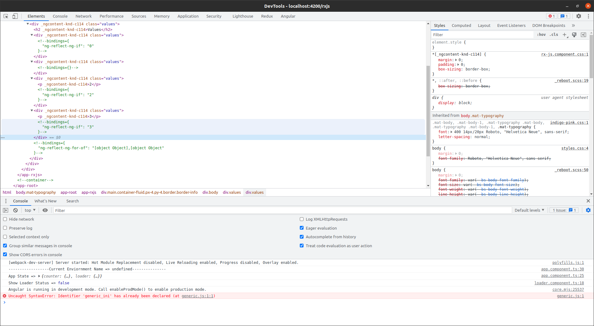
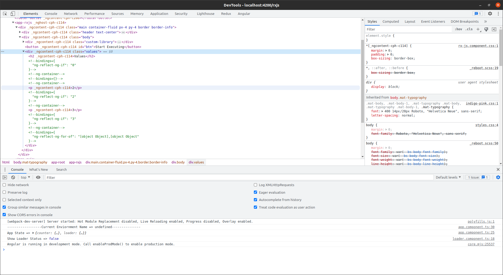

# Angular

### Installation
- First install nodejs into your system to use npm module.
- Installation of cli module (Angular)
    **`npm install -g @angular/cli`**

### Creating Your First Angular App
 - **`ng new my-app`**

### Running Your Default Template
1. First bring your terminal to the current directory by 
- `cd foldername/foldername`
2. To run our Angular-App 
- `ng serve`

3. To run and open your app in browser 
- `ng serve --open` OR `ng serve --o`

### Important Angular CLI Commands

- **`npm install -g @angular/cli`** - To install angular cli in your system globally.

- **`ng new my-Angular-App`** - To Create new project in angular

- **`ng serve`** - To run your ANGULAR application.

- **`ng help`** - It will provide us the some angular basic CLI commands which are necessary.

- **`"ng generate component newComponent" Shortform :- ("ng g c newComponent")`** - It will create new component in our angular project.

- **`"ng generate module newComponent" Shortform :- ("ng g m newComponent")`** - It will create new Module in our angular project.

- **`"ng genrate class newclass"`** - It creates class for us with 2 files 1.classname.ts & 2.classname.spec.ts

- **`"ng build"`** - it will create our application for the production and it will create the dist folder in your directory and it we can run our application on the serve by putting that folder on the server.

### Angular File Structure

**In Angular we get bunch of files like node_modules,src,angular.json,package.json,tsconfig.json etc** 

**But we need to focus on src folder which contains all the working files in the angular**

**In src folder you will get:** 

Global Files : 

- **index.html** -  which will be single page file and 

- **style.css** - for global styling of the files

- **main.ts** - which will contain all the global typeScript code. 

In `src/app` folder App-Files : 

- **app.component.html** - Which will contain HTML code for the main app component which is included in **index.html**

- **app.component.css** - Which will contain CSS code for the main app.

- **app.component.ts** - Which will contain TypeScript code for the main app.

- **app.component.ts** - Which will contain TypeScript code for the main app.

- **app.component.spec.ts** - Which will contain TypeScript code for the testing of the app.

- **app-routing.module.ts** - Which will contain TypeScript code for the routing of the main app.

### Using js/ts code inside the HTML (Interpolation)

We can execute ts code inside the HTML inside **{{title}}**
We can use the interpolation for the class and all the attributes as well.

Which things we can't use inside the interpolation : 
- `title="newBlog"` we cant assign any value to the varibale.

- We can't use typeof, Increment(`num++`), Decrement(`num--`), **New** Keyword.


### Angular Components

It will create component all 4 files in components folder.
 
 **`ng generate component 
 foldername/component-name`**

In the default files component.html will contain only code will be `<p>Component works</p>`

We dont need to import the each and every component inside our **app.component.ts** file like react or other frameworks.

1.  **Types of Component**

    1. **inline-style component** - 
     
        we can genrate inline-style component by command **`ng generate component myComponent --inline-style`** in which we can skip css file and we can add css in **component.ts** file where url's are declared inside the [`.class{color:red}`].

    2. **inline-template component** - 
    
        we can genrate inline-template component by command **`ng generate component myComponent --inline-template`** in which we can skip HTMl file and we can add HTML in **component.ts** file where url's are declared inside the **[`<h1>This is the header</h1>`]**.

    3. **inline-style and inline-template component** - 

        we can genrate inline-style and inline-template component by command **`ng genrate component myComponent --inline-style --inline-template`** in which we can skip both HTML and CSS file and and we can write HTML&CSS in **component.ts** file.

2.  **Loading-Component In APP**

    To load the component in the **app.component.html** we need to use it like HTML tag **<app-component></app-component>** and component will be automatically loaded inside our app. 

3. **Taking or using Input in the component**

    If we want to use attributes to the component tag like **`<app-component [text]="'Add'" ></app-component>`**

    - First we need to initialize the input in the component.ts file 
        ```
        import {Input} from '@angular/core'
        @Input() text:string;
        ```
    - Then we can use that variable inside the component's html file for the value and then we can pass it value by attribute in **app.component.html** as like mentioned below.
    ```
    // Button Component Ts
    <button 
    [ngStyle]="{'background-color': color, color:fontcolor}"
    class="btn"
    (click)="onclick()"
    >{{text}}</button>

    // App Component Ts
    <app-button color="purple" text="Add" fontcolor="white"></app-button>
    ```

4. **Inline CSS in Components**

    For that we need to use ngdirective to use inline styline as mentioned below : 

    **[ngStyle] = "{'property-property':'value'/variable,property:'value'}"**

### Types of selectors in angular

In angular for the component there are multiple selectors which we can use in the html file.

Selector => 
```
@Component({
  selector: 'app-search-pipe',
  templateUrl: './search-pipe.component.html',
  styleUrls: ['./search-pipe.component.css']
})
```
**Types :-**

- `'app-form' :-` 
  
  We can use the component with tag `<app-form></app-form>`

- `'[app-form]' :-`  
  
  We can use the component with attribute like `<div app-form></div>`

- `'.app-form' :-`

  We can use the component with the class like `<div class="app-form"></div>`

As like this we can use the components with the different types in the html.

### Modules in Angular (Feature Module)

Modules are the group of components or a complete functionality like **user-authentication** in which it can contain login,register,forgotpwd,etc.

Modules are not reusable but components containing inside a model we can use that components.

1. **How to genrate module** 

    We can generate module by using command  **`ng generate module user-auth`** in which we get only 1 file in folder ***user-auth.module.ts***.

    In ***user-auth.module.ts*** file it will have some imports,declarations in which in ***imports:[CommonModule]*** contains the module names and ***declarations:[log-in]*** it will contain components declarations.

2. **How to generate component in module**

    We can genrate component in module by using command **`ng generate component folderName/componentName`**

    BUT

    when we create component in some module it will declare inside ***created module*** not in ***app.module.ts*** 

3. **For using that component created inside any module**
    
    As We know...
    when we create component in some module it will declare inside ***created module*** not in ***app.module.ts*** 

    soo.. 

    We need to register that component inside the ***app.module.ts*** file and then we can use it.

4. **How to register module in app.component.ts**

    First of all we need to import that module like **`import {UserAuthModule} from './user-auth/user-auth.module'`** and we need to register that module in the **imports:[UserAuthModule]**.

5. **Using that component inside the app anywhere**

    If we use the component it will throw an error bcoz angular doesn't know the component exists.

    SOO... 
    
    We need to export that component to the angular app by **exports:[LoginComponent]** below the imports and then the component in the `UserModule` is globally available in your angular app.

### Shared Module

Shared module is nothing but the common imports module in which we can import all the necessary modules, like formsmodule and all and all the directives, pipes and all soo rather than adding single single things in the shared module we can directly import the shared module in the modules for the acessibility of all the things.

### Core Module

Core Module is the module which we create for the all the necessary services, providers and http interceptors.

And we can directly import that core module in the `app.module.ts` for the usage of all the services.

### Functions in Angular

The most important point in functions in angular is we are declaring functions inside the class as we know angular is class based framework soo we dont need to use **function** keyword while declaring the function and let,var and all while declaring the variables.

EX: 
```
getName(name:string,name2:string)
{
    console.log(name)
    console.log(name2)
}
```
In the angular before 11 we didn't got errors or we was not compulsed to define the data types but in the angular 12 strict mode is on soo we need to use the datatypes as per typescript in angular 12.


### Styling in Angular
**Types of Styling in Angular** : 

- **global styling** - which we do in style.css and which is applicable to all elements we styled in global styling.

- **external styling** - which we do in component.css file.

- **Internal styling** - which we do inside the component.html file in `<style></style>` tag.

- **inline style** - which we do in inline element in basic style attribute.

### Dynamic Styling in Angular

In the angular if we want to use the dynamic style means if we want it to be an variable and it could be depending on some functions we can use the dynamic styling.

In the dynamic styling we use the `objec`t aginst the `[ngStyle]` attrubute like 

**Syntax :-**
```
<div [ngStyle]="{css property:value}">
This is content
</div>
```

Ex : 
If we want to change the background of the div based on its status it will be like mentioned below.

```
// component.html
<p [ngStyle]="{background-color:getBgColour(user.value)}" #user>online</p>

// component.ts
getBgColour(value:any){
  if(value=='online'){
    return 'green'
  }
  else{
    rerurn 'red'
  }
}
```

### Dynamic Classes
With the help of dynamic classes we can apply the different classes on the different scenarios.

**Syntax :-**
```
<div [ngClass]="{classname : true}">online</div>
```
```
<div [ngClass]="isOnline ? 'online' : 'offline'">online</div>
```

With the mentioned above 2 options we can use the dyanamic classes to the html elements.


###  If-Else Statements in Angular (*ngIf)

*ngIf is the functionality of the angular in which we can check the conditino inside the component.html page in html attribute `<p *ngIf=true>Visible</p>`.

it will show the element onlyif condition will true.

Types of If-Else Statements - 

- **Simple if statement** : 

    **`<h1 *ngIf="true">This is a heading</h1>`**


    in this statement the element will be visible on the screen when the condition will be true.

- **IF statement with varibale** : 


    **`<h1 *ngIf="showStatus">This is a  heading</h1>`** 

    in this statement **showStatus** can be a variable or condition in the **component.ts** file it will be visible when that variable or function will be true.

- **if with else statement(ng-template)** - 
    ```
    <p *ngIF="showStatus else elseblock"></p>
    <ng-template #elseblock>
    <p>That paragraph tag is not visible.</p>
    </ng-template>
    ``` 
    in this statement if showStatus will be true it will execute own p block else it will execute elseblock.

- **if else block with both ng-template** -     
    ```
    <p *ngIf= "showcondition; then ifblock else elseblock"></p>

    <ng-template #elseblock><h1>Else Condition.</h1></ng-template>

    <ng-template #ifblock><h1>If Condition</h1></ng-template>
    ``` 
in this statement we will give **;** to the showStatus and we will put keyword **then ifblock else elseblock**.

- **else-if in Angular** - In Angular we dont have elseif soo we need to use **[ngIf]="color=='red'"** multiple times.


- **if else block with both ng-template with checking strings or values** -
    ```
    <p *ngIf= "showcondition=='shiv'; then ifblock else elseblock"></p>
    <ng-template #elseblock><h1>Else Condition.</h1></ng-template>
    <ng-template #ifblock><h1>If Condition</h1></ng-template>
    ```
    in this statement we are checking the value of **showCondition=='shiv'** **then ifblock else elseblock** it  will check the value fo showCondition if it will true it will execute if block else it will execute else block.


### IF else statement with [ngIF] attribute - 

- **For case if with else, we can use **ngIf** and **ngIfElse**.** : 
    ```
    <ng-template [ngIf]="condition" [ngIfElse]="elseBlock">
    Content to render when condition is true.
    </ng-template>

    <ng-template #elseBlock>
    Content to render when condition is false.
    </ng-template>
    ```
- **For case if with then, we can use ngIf and ngIfThen**. : 

    ```
    <ng-template [ngIf]="condition" [ngIfThen]="thenBlock">
    This content is never showing</ng-template>
    
    <ng-template #thenBlock>
    Content to render when condition is true.
    </ng-template>
    ```
- **For case if with then and else, we can use ngIf, ngIfThen, and ngIfElse.** : 
    ```
    <ng-template [ngIf]="condition" [ngIfThen]="thenBlock" [ngIfElse]="elseBlock">
  This content is never showing</ng-template>
    
    <ng-template #thenBlock>
    Content to render when condition is true.
    </ng-template>

    <ng-template #elseBlock>
    Content to render when condition is false.
    </ng-template>
    ```

### Switch Case in Angular

We use **switch case** when we have multiple condition more than 3-4 then we usually use the switchcase.
ex : - Days of week(7),Months of year(12)

In angular we have attributes which are usefull for the switchcase as followed : 
- **[ngSwitch]** - It will create a switchcase its a initialization of switchcase.

- **[ngSwitchCase]** - We can use this on the case.

- **[ngSwitchDefault]** - We can use this on the default case.

Uses of all the attributes are mentioned below : 
```
<div [ngSwitch]="color">
  <h1 *ngSwitchCase=" 'red' " style="color: red;">red color</h1>
  
  <h1 *ngSwitchCase=" 'green' " style="color: green;">green color</h1>

  <h1 *ngSwitchCase=" 'yellow' " style="color: yellow;">yellow color</h1>

  <h1 *ngSwitchCase=" 'purple' " style="color: purple;">purple color</h1>
  
  <h1 *ngSwitchCase=" 'orange' " style="color: orange;">orange color</h1>

  <h1 *ngSwitchDefault style="color: black;">Default color</h1>
</div>
```

### Loops in Angular (*ngFor)

*ngFor is the functionality of the angular which we can use inside the HTML as like for loop as mentioned below.

**Simple For loop over an array** : 

In the code mentioned below we just initialized an array in **component.ts** file and we are itrating over that an array are we are printing the values in the h1 tag as mentioned below.
```
//array specified in .ts file.
names =["sam","mad","ron","shiv"]

//How to run a for loop on the array and print its value inside the HTML.
<h1 *ngFor = "let item of names; index as i"> The username is : {{item}}</h1>
```

**For loop on array of objects** :

In the code mentioned below we just initialized an array of objects in **component.ts** file and we are itrating over that an objects of array
and accessing the values of that objects and we are printing the values in the p tag as mentioned below.

```
//Array mentioned in component.ts file

users=[
    {name:'shiv',password:'shiv@123'},
    {name:'raj',password:'raj@123'},
    {name:'dan',password:'dan@123'},
    {name:'john',password:'john@123'},
    {name:'doe',password:'doe@123'}
  ]

<div *ngFor="let user of users">
  <hr>
  <p>Username : {{user.name}}</p>
  <p>Password:{{user.password}}</p>
</div>
```

**Nested For loop on array of objects** :

In the code mentioned below we just initialized an array of objects in **component.ts** file and we are itrating over that an objects of array
and accessing the values of that objects and the array of the object value as well and we are printing the values in the p tag as mentioned below.

```
//Array mentioned in component.ts file 

 users=[
    {name:'shiv',password:'shiv@123',socialprofiles:['gmail','linkedin','twitter']},
    {name:'raj',password:'raj@123',socialprofiles:['youtube','linkedin','twitter']},
    {name:'dan',password:'dan@123',socialprofiles:['tinder','linkedin','twitter']},
    {name:'john',password:'john@123',socialprofiles:['happen','linkedin','twitter']},
    {name:'doe',password:'doe@123',socialprofiles:['omg','linkedin','twitter']}
  ]

<div *ngFor="let user of users">
  <hr>
  <p>Username : {{user.name}}</p>
  <p>Password:{{user.password}}</p>
    <h3>Social Pofiles : </h3>
    <p *ngFor="let profile of user.socialprofiles"> <li> {{profile}}</li></p>
</div>
```

Here we are just using **let item of user.socialprofiles** for nested array thats it not the rocket science in that.

### Style Binding
We can use style binding for dyamic styling like if we want to give the styling like colors and all from our component.ts file then we use style binding.'

We need to use the style binding **`<h1 [style.color]="fontColor" >Heading Tag 1</h1>`** rather than **`<h1 style="color:white" >Heading Tag 1</h1>`**.

Ex:
```
// Variables from the component.ts file.
fontColor = "teal"
backgroundColor=""
  bgc(){
    this.backgroundColor="teal"
    this.fontColor = "white"
  }

// component.html
<div>
  <h1 [style.color]="fontColor" [style.backgroundColor]="backgroundColor">Heading Tag 1</h1>
  <button (click)="bgc()">Chage the background-Color</button>
</div>
```

### Toggle Button or Events in Angular

Toggle event is the event which toggles some opration like to show or hide a content as mentioned below : 

```
// TypeScript Code
 display = false
  toggle(){
    this.display=!this.display
  }

// HTML Code
<h1 *ngIf="display">Heading</h1>
<button (click)="toggle()" class="btn btn-primary">Toggle Button</button>
```
**!this.display** - called negation in angular which makes the opposite of current state.

### Adding Bootstrap with single line of command : 

- **npm install bootstrap** - it will install bootstrap in your node modules.
- Then you need to add the bootstrap styling and js path to to the **build** array in angular.json.

- For CSS - **"./node_modules/bootstrap/dist/css/bootstrap.min.css"**
- For JS - **"./node_modules/bootstrap/dist/js/bootstrap.js"**

### Send the Data to child component

We can send the data to child component by using **@Input()** in the **component.ts** file and we can send the data in the properties in HTML like **<h1 [data]="'Name'"></h1>**.

- First Create the component by using the command **`ng g c child-component`**

- Then import Input in the **child.component.ts** as like mentioned below : 

  **`import {Input} from '@angular/core'`**

- Then define the input property with the Input Function.
  **`@Input() data;`**

- And we can use the data in HTMl like **`<p>{{data}}</p>`**

- Thats how we passed the data to child component.

### Send the Data to child component.

- First create the component.

- Create the array of objects in **app.component.ts** file.
  ```
  //app.component.ts
  userDetails=[
    {name:'shiv',age:18},{name:'Raj',age:21},{name:'Shawn',age:23}
  ]
  ```
- Run the for loop on the array of objects pass the item to the child component.
  ```
  <div *ngFor="let item of userDetails">

  <app-child [item]="item"></app-child>

  </div>
  ```
- Import the input in the **child.component.ts** file and intake the item with the input function.
  ```
  // Child.component.ts
  import {Input} from '@angular/core'

  @Input() item:{name:string,age:number};
  ```
- Use the imported item in the **child.component.html** file as like mentioned below.
  ```
  <p>{{item.name -- item.age}}</p>
  ```
- And Thats how we passed the for loop value to the child component.


### How to pass function to child component (To take data from the child to parent)

- First we need to create the child component.

- Declare the function in the **component.ts** file as like mentioned below.
  ```
  // app.component.ts file
  getData(item:any){
    console.log(item)
  }
  ```
- Pass the function with the **$event** to the child component as like mentioned below.
  ```
  <app-child (getData)="getData($event)"></app-child>
  ```
- import the **Output** and **EventEmitter** from angular core in the **child.component.ts** file and initialize the taken function with output and Eventemitter as like mentioned below.

  ```
  // Child.component.ts

  import {Output,EventEmitter} from '@angular/core'

  @Output() getData = new EventEmitter<string>();
  @Output() getUser = new EventEmitter<any>();
  ```
- And now we can pass use that function in child component and we can pass the data to it to the parent in **child.component.html** file.
  ```
  <input type="text" #inputBox>
  <button (click)="getData.emit(inputBox.value)"></button>
  
  // Or
  <button (click)="emit()"></button>


  // Component.ts

  // Or how to emit event in .ts file.

  emit(){
    this.getData.emit()
  }
  ```
- And thats how we passed the data to parent component and the function will print the data in the console.

### 1 way binding
By using one way binding, data can be shown only on html but it cannot be changed from the html, it will be used for only display purpose.


- **In Reactive Forms :-**

We can use one way binding in reactive forms with the help of `[ngModel]="var"` .

- **In Template Driven Form :-**


### 2 way binding in Angular

In angular 2 way binding update the properties realtime and display them without reloading.

For 2 way binding we need to use **[(ngModel)]** for binding the properties.

- First we need to import **FormsModule** from **'.@angular/forms'** and we need to initialize it in the imports.

- then we need to create an property with which we want to bind the input value with it. 

- Simply just display that property in required tag like **{{value}}**.

```
// app.html
    <div class="container my-5 p-5 border w-25">
    <h3>Two Way binding in angular</h3>
    <input type="text" class="form-control my-4" [(ngModel)]="inputValue">
    <h5>{{inputValue}}</h5>
    </div>
// app.ts
    inputValue:any;
```

### Template refrence Variable

Template refrence variable nothing different than providing the id to the input field like **#inputBox**.

And After that we can acess its each and every value like name,placeholder,class,value and soo on.

```
// app.html
<div class="container my-5 p-5 border w-25">
    <h3>Template refrence variable</h3>
    <input type="text" class="form-control my-4" #inputBox>
    <button class="btn btn-sm btn-primary" (click)="getVal(inputBox.value)">Get the value</button>
    
    <h5>{{value}}</h5>
</div>

// app.ts
 value:string=""
  getVal(item:HTMLInputElement)
  {
    console.warn(item);
    this.value=item
  }
```

### Basic Pipes in Angular
Pipes are those things in angular which is used to update or modify the strings dates and all with very easy easy rather than normal.

We can use the basic pipes for strings as mentioned below - 
Ex :
```

<h1>{{title | uppercase}}</h1>

<h1>{{title | lowercase}}</h1>
```

We can use the basic pipes for dates as mentioned below - 
Ex:
```
<h2>{{today | date}}</h2>

<h2>{{today | date : "fullDate"}}</h2>
```

### Pipes with parameters

**Pipes for strings**
How to pass parameters to the pipes and use the multiple pipes on the single element as mentioned below- 
Ex:
```
<h1>{{title | slice : 1 : 21 | uppercase}}</h1>
```
For multiple parameters or passing parameters we use **":"** and for multiple pipes we use **"|"**.

**Pipes for objects**
For printing the full array data which we can't print with just putting **{{userDetails}}** we can use the pipe **json** as mentioned below.

```
<h2>{{userDetails | json | uppercase}}</h2>
```
**Pipes for Numbers**
In the numbers pipes we can pass the parameters like how much values to show before points and after points like **2.2-3** it means that before point show 2 values and after point show 2 or max 3 values as like mentioned below. - 

```
<h3>{{0000223.564000 | number : '2.3'}}</h3>
```
**Pipes for currency**
We can show currency symbol before our value in numbers by just using currency pipe and passing value to it as per our requirement of symbol.

```
<h3>{{3 | currency : 'USD'}}</h3>

// If we want to show the value without decimals
<h3>{{3 | currency : 'USD' : true :'1.0'}}</h3> // or we can use symbol as well on the place of true.

```
We can pass the all currency values like USD,GBP,INR soo on. 

### Making Custom pipe in Angular

Command For Creating custom pipe in angular - **`ng g p pipes/customPipe`**

Always create your pipes in specific folder and keep it organized.

After creating pipe you will get 2 files only which will be **component.ts** and **spec.ts** and our work will be totally in .ts file.

- **How to call that custom pipe** - 

As mentioned below you will get the name of pipe and you need to use that name in your pipe.

**Below created the filter pipe :-**

```
// pipe.ts
@Pipe({
  name: 'usdInr'
})
```

```
@Pipe({
  name: 'usdInr'
})
export class UsdInrPipe implements PipeTransform {

  transform(data:any,value: any): any {
    if(value!=''){
      let result = []
      for(let item of data){
        if(item.email.toLowerCase().includes(value.toLowerCase())){
          result.push(item)
        }
      }
      return result
    }
    else{
      return data;
    }
  }

}
```
- By default that return value is set to be null so you need to make it as value so it will print the value.

- **How to pass arguements to custom pipes** - 

    1. As mentioned above we can pass the arguement to the pipe like normal **pipe : arg**.

    2. That passed arguement will be come in **..args array**
    which is `...args: number[]`.
    3. You need to take the arguement value by using const or let and we are multiplied the value with the value.
    ```
    const[x]= args;  
    return value*x;
    ```

### Pure and Impure pipes

There are 2 types of pipes in angular, Pure which will execute the pipe only when the html initiated and it will not respond if Data will be manipulated and changed but impure pipe will be executed after each and every change detection in the data.

Ex : 

If we have made the search pipe and we are passing array of objects to it, and if we searched with the keyword BUT **After Search results returned by the pipe and at the same time if new entry added, updated or deleted it show the data in the previous condition and not the updated one.** 

Here We have pipes purity in which impure pipes reacts to all the changes and we can make the pipe impure by `pure:false` as like mentioned below.

```
@Pipe{
  name:'filter',
  pure:false
}
```

### Angular Forms

Angular forms are different than others as like mentioned below.


**<u>Most imp in the angular forms we cannot connect angular with the databases like SQL,MongoDB etc like others.Rather than that we need to connect with the database with the help of api in angular.We call the API's throught the forms and API automatically send data to database.</u>**

**Types of forms**
- Template Driven Form :- In template driven forms most of the work will complete in the HTML file only like form,data,validation etc.

- Reactive Form :-  In reactive forms most of the work will complete in the TypeScript file only like form,data,validation etc.

1. **Template Driven Form** - 

    In the template driven form we import as mentioned below : 
    **`import { FormsModule } from '@angular/forms';`**

    In template driven form we normally make form and use **#userLogin="ngForm"** and the **(ngSubmit)="function()"** and **ngModel** in input feilds.

    **How to create Template Driven Form** - 
    
    - First we need to import **`import { FormsModule } from '@angular/forms'`** in **module.ts**.
    
    - Then we need to create normal HTML form and we need to bind its id like **`#loginForm="ngForm"`**.

    - After that we need to bind the input feilds with the **ngModel** and we have to provide **name="username"** as well because we are using **ngModel**.

    - We need to add on submit event with the help of **`(ngSubmit)="userLogin(loginForm.value)`** and we need to pass the form values to it.

    - We need to define the function which we called with **ngSubmit** in the **component.ts** file.

    - Finally as we passed the **form.value** in the function we are able to get the form values.

    ```
    //component.html
    <div class="container my-5 p-5 w-25 border">
      <h2>Reactive Form in Angular</h2>
        <form #loginForm="ngForm" (ngSubmit)="userLogin(loginForm.value)">
            <input type="text" class="form-control my-4" name="username" placeholder="Enter username" ngModel>
            <input type="text" class="form-control my-4" name="password" placeholder="Enter password" ngModel>
            <button class="btn btn-primary">Log In</button>
        </form>
    </div>

    //component.ts
    userLogin(item:any){
    console.warn(item)
    }
    ```
    

2. **Reactive Form** - 
    
    In the Reactive form we import as mentioned below : 

    - **`import { ReactiveFormsModule } from '@angular/   forms';`**
    - **`import {FormControl,FormGroup} from '@angular/forms'`**

    **Most Imp Thing** 
    - In the reactive form **we need to use the same formgroupname** in the **component.ts** file as well as in HTML file as well.
    
    - In the reactive form we use **formControlName** attribute rather than **ngModel** to bind the fields.

      Ex : **`formControlName="username"`**

    - While giving the name to the form we use **[formGroup]="loginForm"** like this and loginForm is the name of our form.
    
    **How to Create Reactive Form** : 
    - First we need to import
     **`import { ReactiveFormsModule } from '@angular/   forms'`** in module.ts file and intialize it in imports.
    
    - Then we need to import **`import {FormControl,FormGroup} from '@angular/forms'`** in **component.ts** file.

    - We need to create simple HTML form in **component.html** file and we need to give the name to the formGroup like **`[formGroup]="loginForm"`**.

    - Then we need to bind the input fields with formControlName like **`formControlName="username"`**.

    - After completing the HTML part we need to define the **formGroup** in **component.ts** file as mentioned below : 
      ```
      // Defining the FormGroup

      loginForm= new FormGroup({
      username: new FormControl(''),
      password: new FormControl('')
      })
      ```.
    - On Submit of form call the function with the help of **ngSubmit** like **`(ngSubmit)="userLogin()`**.

    - Define that function in the **component.ts** file like 
      ```
      userLogin(){
      console.warn(this.loginForm.value)
      }
      ```
    - Finally we can get the values of form feilds with the help of **`this.loginForm.value`** which is formGroup defined in the **component.ts** file.
  
    

    **Full reactive form is like mentioned below :** 
    
    ```
    // component.html
    <div class="container my-5 p-5 w-25 border">
      <h2>Reactive Form in Angular</h2>
      <form [formGroup]="loginForm" (ngSubmit)="userLogin()">

          <input type="text" class="form-control my-4" name="username" placeholder="Enter username" formControlName="username">

          <input type="text" class="form-control my-4" name="password" placeholder="Enter password" formControlName="password">

          <button class="btn btn-primary">Log In</button>
      </form>
    </div>

    // component.ts (FormGroup Defined)
      loginForm= new FormGroup({
        username: new FormControl(''),
        password: new FormControl('')
      })

      userLogin(){
      console.warn(this.loginForm.value)
      }
    ```

### Form Validations In Reactive Forms

- First we need to import Validatiors like **`import {Validators} from '@angular/forms'`**

- We can make the feild required by using **Validators.required** in Formgroup where we defined **FormControl** for that feild like **`username: new FormControl('',[Validators.required])`**.

- To Check the value validation (means value is there or not) we need to create getter (A function which returns something by calling it like property `username.value`)and we need to pass the initialized formControl as like mentioned below : 
  ```
  // Initialized FormControl
  username: new FormControl('',[Validators.required),

  // Getter For username
  get username(){
      return this.loginForm.get('username')
    }
  ```

- **ErrorMessage Validation :-**
  
    And after creating getter we need to apply on the error massage tag with the help of **ngIF** on **p** tag like mentioned below : 
    ```
    <p style="color:red" *ngIf="username && username.invalid && username.touched">Please Enter Valid Username</p>
    ```
    In the above code it will first check the value if its there or not and it will also check the **username.invalid** as well.

- **required :-**

  We have validator for email as well which we can use on the initialized field in the formgroup in **component.ts** file like 

  **`username: new FormControl('',[Validators.required,Validators.email]`**

- **Password & Custom Validations :-**
  
  We can validate with the patterns as well on the intialized field in the formgroup in **component.ts** file like 
  **`username: new FormControl('',[Validators.required,Validators.pattern('[a-zA-Z]+$')]),`**

  we are validating here the charecters from **'a-z'** and **'A-Z'** else if there input will be number it will show the errormsg.

- **Disabled Form Button Validation :-**

    In the Form When you need to disable the submit button till the form valid then you can use the `[disabled] attribute` with `form.invalid` condition like mentioned below.

    ```
    <button [disabled]="form.invalid"></button>
    ```
- **Field Read For invalid and touched :-**

  We can add the css as well when the input element get touched and invalid with the help of `input.ng-touched.ng-invalid{}`.

### Custom Validations in Reactive Form

We can create custom Validations in the `components.ts` file and bind it to validators in the form controls as like mentioned below.

```
// Validation method
names:any = ['shiv','sai']
isNameTaken(contol:FormControlName){  
  if(this.names.includes(control.value)){
    return {isNameTaken:true}
  }
}

// Validation Binding
 username: new FormControl('',[Validators.required,this.isNameTaken.bind(this)),

```
It will Push `isNameTaken:true` in `formcontrol.errors` object and same can be used for error message for that field.

If Validator showing error soo use `.bind(this)` in the validations if we have used `this.property` on arguements then we need to bind this with it to tell that its an existing proeprty.

### Asynchronus Validation

Asynchronus validations are the validation in which we are validating email or username something on the server through api soo it will append class `ng-pending` on which we can show the loader or error message.

While resolving promise of the validations we need to push the `true` with some key and that key will be shown in the errors object.

```
  isAlreadyPresent(control:FormControl):any{
    return new Promise((res,rej)=>{
      if(control.value.includes('shiv')){
        let validation = { nameInvalid : true }
        setTimeout(()=>{
          console.log("Form Control +>",control)
          res(validation);
        },2000)
      }
    })
    }
```

### FormControl Grouping and its vaildations

Form Group is the grouping of the form controls as per the sections in the forms like userData, education Details end etc.

**FormGroup in Both Forms :-**

- **FormGroup in template driven forms :-**

- **FormGroup in Reactive forms :-**

  ```
  // Grouping in FormControls in ts file

  form:any = new FormGroup({
    data: new FormGroup({
      name: new FormControl('',[Validations]),
      age: new FormControl('',[Validations])
    }),
    edu: new FormGroup({
      university: new FormControl('',[Validations]),
      grades: new FormControl('',[Validations]),
    })
  })

  // Calling Grouping in component.html
  <form [formGroup]="form">
  <div formGroupName='data'>
    <!-- controls -->
  </div>
  <div formGroupName='edu'>
    <!-- controls -->
  </div>
  </form>
  ```
### ValueChanges and StatusChanges & SetValues in reactive forms

- **Value Changes and Status changes :-**

  To catch the status and the value changes in the reactive form we can use the `form.statusChanges.subscribe(callback)` && `form.valueChanges.subscribe(callback)`.

  For that we need to do call the observable methods in the `ngOnInit()` itself.

  ```
  // calling 
  loginForm= new FormGroup({
          username: new FormControl(''),
          password: new FormControl('')
        })

  ngOnInit(){
    this.loginForm.valueChanges.subscribe((res)=>{
      console.log(res) // Form Object
    })

    this.loginForm.statusChanges.subscribe((res)=>{
      console.log(res) // VALID | INVALID
    })
  }
  ```

- **SetValue :-**

  Setvalue is used to set the values for the form from .ts file as like mentioned below.

  ```
    loginForm= new FormGroup({
          username: new FormControl(''),
          password: new FormControl('')
        })

  ngOnInit(){
    this.loginForm.setValue({
      userName:'shiv',
      password:'Saikiran@9604'
    })
  }
  ```

### Dynamic Forms in Angular

In the dynamic form we can create forms with the help of json.

In the json we get necessary value like mentinoed below.

```
[
  {
    "id":"name",
    "label":"Name",
    "type" : "input",
    "value":''
  },
  {
    "id":"email",
    "label":"Email",
    "type" : "input",
    "value":''
  },
  {
    "id":"password",
    "label":"Password",
    "type" : "password",
    "value":''
  }
]
```

Steps :-

**Getting json Data and genrating form :-**

  - First we need to create json.file in asset folder.

  - And secondly we need to get api call on that form and we need to put path in the url.

  - You need to call the get call on `ngOnIt()`.

  - In the HTML you need to crete each input type div with input element and label.

  - We need to show that feild as per the type.

  - Soo it will go inside the div and as per the input type it will create form feild.

  - On the external div we need to loop through that json soo on each itratration it will create input feild according to its type.

  - All Form will be rendered on the basis of type and label.

**Creating form Controls :-**

  - First we need to create empty formgroup variable in which we need to assign new FormGroup and emppty controls.

  - On `ngOnInit()` itself we need to create a function which will loopthrough on the array recieved from json and we need to add form controls to the empty form group which we declaerd with the help of `.addControl('firstName', new FormControl(''))`.


**Binding Form Controls to HTML fields :-**

  - We need to bind the formControl and formGroup to the form.

  - `[FormGroup]="dummyFormName"` thats how we need to bind the form group to it.

  - `[FormControlName]="item.field"` thats how we can bind the fieldName.

  - Create an div with json pipe and see the binding values chaging or not.

**Getting Form Values :-**

  - As we binded the values to the formControl our formControl values are updating realtime.

  - Create an Submit button which calls an method which prints the values of the form.

**Validations :-**

### Directives in Angular

Directive provides additional funcionality to HTML elements.
EX : **`*ngFor,*ngIf,*ngSwitch`**

1. **ng g d Directives/redEl** - it will create the directive  in which there will be only 2 files will be there.

    - **Directive.ts**
    - **Directive.spec.ts**
2. In the **Directive.ts** file we need to **`import ElementRef from '@angular/core'`**.

3. In the constructor we need to take **`constructor(el:ElementRef)`** like this and inside the constructor we can write the properties for it.

4. Then we need to acess the `nativeElement` property on the elements refrence for manipulating that element on that to change is poperties like mentioned below.

```
constructor(private element:ElementRef) { 
    element.nativeElement.style.color="red"
  }
```

5. To use that directive in the HTML element we already have provided the directive name in the file and we need to use that directive by that name.
```
// Our Directive Selector mentioned below.
@Directive({
  selector: '[appRedEl]'
})
```

### Advance Custom Directives (Renderer2 & @HostBinding())

In angular we can create custom directives in which previously we used to change the styling like `element.nativeElement.style.color = "red"` but we are doing this with the help of the javascript which can cause unexpected errors.

- **renderer2 :-**

  Soo for that we can use the `renderer2` for the custom directive which will not manipulate the html elemnt instead it will render the elements in the modified way.

  We need to use the renderer functions like setStyle, addClass and all for the manipulating it while rendering it and we need pass the arguements as its required.

  ex : 
  ```
  constructor(private element:ElementRef, private renderer:Renderer2) { 
      this.renderer.setStyle(element.nativeElement,'color','red')
    }
  ```
- **@HostBinding :-**

  With the help of `@HostBinding('property') var:type` we can create the variable of the target style,class and etc for the element.

  Rather than `this.renderer.setStyle(element.nativeElement,'color','red')` we can shorten it and bind it to variable as like mentoined below.

  ```
  @HostBinding('style.backgroundColor') color:string;
   constructor(private element:ElementRef, private renderer:Renderer2) { 
    }

  @HostListner('onhover') onmouseover(event:Event){
    this.color = 'red'
  }
  ```

The above mentioned code we have binded the property to the variable and we just providing the value to the variable.


### Directive oprations on the events (@HostListner())

On the html element on which we are using the custom directive, if we want to do the oprations on the specific events like mouseover, mouseout and all we can do that with the help of `@HostListner('name') event(event:Event){opration}` like mentiond below.

Ex : If we want to change the background color on the mouse over it would be like mentioned below.

```
@HostListner('onhover') onmouseover(event:Event){
  this.renderer.setStyle(
    element.nativeElement,'color','red'
  )
}
```

### Sending Data to Directives

We can send the data as well to the directives as well with the help of `@input()` decorator and with the alias as well.

Ex : 
If we want to pass the colors for the events as input from the parent component it will like mentioned below.

```
@Input() defaultColor:string;
@Input() highlightColor:string;

@HostBinding('style.backgroundColor') color:string;
@HostListner('onhover') onmouseover(event:Event){
  this.color = highlightColor
}
@HostListner('onleave') onmouseleave(event:Event){
  this.renderer.setStyle(
    this.color = defaultColor
  )
}

// Parent Component without Alias
<div appRedEl [defaultColor]="'red'" [highlightColor]="'purple'">This needs to be highlightedM</div>

// With Alias (@Input(directiveName) defaultColor:string;)
<div [appRedEl]="'red'" [highlightColor]="'purple'">This needs to be highlightedM</div>

```


### Routing in Angular

Routing is used in angular for navigating from one location to another on another page in application without reload routing is used.

**Basic routing** -
 - First we need to create routes in the **routing.ts** **in routes array.**.
 - How to create routes? We just need to give the path and component in the object as like mentioned below.
  ```
  import { FormComponent } from './components/form/form.component'
  {
    path:'form',
    component:FormComponent
  },
  ```
- After creating the routes we ca pass it to anchor tag as like mentioned below.

  **`<a routerLink="form" class="text-light">Form</a>`**

- But the component will not appear soo we need to write the tag in the **app.component.html** as like mentioned below.
  **`<router-outlet></router-outlet>`**

- Finally we can provide anywhere the page as routerlink in anchor tag in our whole app.

**Dynamic routing** - 

Basically we can make the single single routes for the parents or the groups but we cant make it single single for mutiple numbers like 200 or 300.

Soo therefore we need to use the dynamic routing.

**We just pass the ID for route ad get that id in that component.ts file**

- In the **routing.module.ts** we pass the id to the path as like mentioned below. 
  ```
  import { FormComponent } from './components/form/form.component'

  const routes: Routes = [
  {
    path:'form/:id',
    component:FormComponent
  }
  ```

- Now we can pass the id with the route like 

  **`<a routerLink="form/30" class="mx-3">Form-30</a>`**.

- **How to get the passed ID's**
  - In the constructor we need to give the route like 
  
    **`constructor(private route: ActivatedRoute)`**.
  - Then we can print the id in the console like 

    **console.warn(this.route.snapshot.paramMap.get('id'))**.
    **console.warn(this.route.params.subscribe(res=>console.log(id))**.

**Default Page Routing :-**

  Default page routing is the route which will be redirected if no routes will be there in the application and by default at the loading application that page will be loaded at first.

  ```
  const routes = [
    {
      path:'',
      rediretTo:'login'
    },
    {
      path:'home',
      component:HomeComponent
    }, 
    {
      path:'login',
      component:LoginComponent
    }
  ]
  ```
  The above mentioned empty route will be redirected to the login page at the start and that will be its default route.

**404 Page in Routing** - 
  
  When we accidently hit the invalid URL to our webpage then the 404 error occurs.

  We need to route the all URL's to the webpage which we created for 404 Page.

  We can route all the wrong URL's with help of wild card route which is mentioned below : 
  ```
  // Wild card routing for 404 page.
  path:'**',
  component:AppComponent
  ```
**Child Routing** - 

Child routing is the concept in which there are pages available which are already routed and we need to route that page as well soo we need to use child routing.

- For Child routing we need to create **childerns [array]** in the main component rout and in the childerns array there will be objects of the child routes as like mentioned below.

  Ex : 
  ```
  const routes: Routes = [
    {
      path:'form',
      component:FormComponent,

      children:[
        {
          path:'reactive-form',
          component:ReactiveFormComponent
        }
      ]
    }
  ```
- After that we need to give that child links in the main **component.html** file like this.
  ```
  <a routerLink="reactive-form" class="text-light">Reactive-Form</a>
  ```
- And Most important we need to create **router-outlet** in the **parent comopnent.html** file.

- And Thats how we have routed our child components as well in the parent components.
### Query Paramerters 

Query parameter is the thing with which we can send the data in the url and we can get that data in that component.

**Query params with activated route :-**

**We dont need to do anything with its route in routing module.ts file.**

- we can pass query parameter as like mentioend below : 
  ```
  import {Router} '@angular/core'
  constructor(public router:Router){

  }

  navWithQueryParams(wishId:any,eveId:any){
    this.router.navigate([`/contribution-details`],{queryParams:{eveId:eveId,wishId:wishId}})
  }
  ```

- We can get the data as like mentioned below : 
  ```
  import {ActivatedRoute} from '@angular/core'

  constuctor(public currentRoute : ActivatedRoute){

  }

  getParamData(){
    this.currentRoute.params.subscribe((res)=>{
      console.log(res)
    })
  }
  ```

**QueryParamsHandeling :-**

In angular when the route gets changes the all parameters will be lost soo we can preserve them with `queryParamsHandling:preseve` and We can merge with dynamic routing with `queryParamsHandling:merge`.
```
goUsers() {
  this.router.navigate(['/users'],
    {
      queryParams: { filter: 'new' },
      queryParamsHandling: 'merge' }
    );
}
```

### Fragments in Routing

As like we can send the data object with queryParams as well as we can send and single and important string as well with the fragment and that can be catched in the components with the help of activatedRoute.

Ex : 
```
// Passing fragment in route
this.router.navigate(['/404'],{queryParams:{name:'Shiv'}},{fragment:'IMP'})

// Catching fragment
this.router.fragment.subscribe(res=>console.log("Fragment =>",res))
```

### All Ways to Grab the data from the route

- **Catch Data passed with dynamic routing `:id` :-**

  - `this.router.snapshot.paramMap.get('id')`

  - `this.router.snapshot.params['id']`

- **Catch Live Data with dynamic routing :-**

  - 
  ```
  // Live dynamic id as like dynamic routing
  this.router.params.subscribe(res=>{
    let id = res['id']
    let name = res['name']
  })
  ```
- **Getting Query Params Data :-**

  ```
  // Catching query params
  this.router.queryParams.subscribe(res=>{
    console.log("Query Params",res)
  })
  ```
- **Getting Fragment String :-**

  ```
  // Catching fragment
  this.router.fragment.subscribe(res=>console.log("Fragment   =>",res))
  ``` 

### Module and Routing Recap

**Creating Module and Using the component** - 

- First create module with the command **ng g m userLogin**

- Then we need to create the components within that.
  **ng g c userLogin/signup**,**ng g c userLogin/signout**

- Then we need to export the components in the **userLogin.ts** file.

- For using the components which made in userLogin module we need to import **import {userLogin} from '../userLogin'**

- And we can use the components in the **app.ts**.

**Routing the components which created through module** - 

- We need to import the components in **app.routing.module.ts** file.

- Then In the **routes[]** we need to create the routes for the both of the components.

- After that we need to provide the routes in the **app.ts** in 

  **`<a RouterLink="login">Login-Component</a>`** and we are done with the routing as well.

### Module Routing in Angular

  Main purpose of routing module is we dont want to load the all routes while start of the app soo we can create the routes in routes under specific module soo while only using userlogin module only the routes will be loaded.

  **Creating Module and exporting components :**
  - We can create module with routing file with the command **`ng g m admin --routing `**.

  - We can create the routing file manually by creating the dummy file which will contain same code as **app-routing.ts** but we just need to change **.forRoot** to **.forChild** in the `routing.module.ts` of the copied one.

  - After that we need to create the components inside the module like 
  
    **`ng g c admin/login`** AND **`ng g c admin/signup`**

  - We need to export that component globally in application in **module.ts** file as like mentioned below.
    ```
    imports:[
      loginPageComponent,
      signupPageComponent
    ],
    exports:[
      loginPageComponent,
      signupPageComponent
    ]
    ```

  - We can use the components now globally.

  **Routing the components in module** : 

  - Firstly we need to import the components in **module.routing.ts** file and we need to create routes for them in **Routes[]** routes array.

  **Using that routing in app-component** : 
  - For using that module routing in our **app-component**
  
     **we need to import the module in app.module.ts file.**

Hence And we can use the routes defined in **module.routing.ts** file in app component.

### Group Routing in Angular

**Why we need Group Routing** : If we have 2 modules and we have same components in the both then it will problematic while routing the same component soo we need the group routing in which with routes we pass the module as well with it soo it looks like **admin/login** and **User/login**.

  ### Routing Guards

- **Routing Enter Guards :-**

  As an example Routing Guards which checks something before routing to page, if it will be true it will route the page and it not it will not route to the page and can route to the route we mentinoed.

  **ng g guard name :-** 

    Creates the auth guard service with canActivate method.

  - **Routing Enter Guard For Parent Component :-** 
  
    For Auth Guard we need to create the service `auth-guard.service.ts` in which we can implement `onActive(){}` method for activation for that route or not.

    Ex : If we want to route for some route if only user logged in.

    ```
    // auth-guard.service.ts
    canActivate(route: ActivatedRouteSnapshot, state: RouterStateSnapshot): any {
        let loggedIn = false;
        if(loggedIn){
          return true
        }
        else{
          this.router.navigate(['/404'])
        }
      }

    // For Which Route we need to use
    {
        path:'test-home',
        component:TestHomeComponent,
        canActivate:[AuthGuardService]
      }
    ```

  - **Routing Enter Guard For Child Component :-**

    With the Auth guard for child component the user can acess the parent compoenent but cannot acess the child compoenents without authentication soo we can do that with the help of `canActivateChild()` in the auth service.
    
    ```
    // Auth Guard Service code
      canActivateChild(childRoute: ActivatedRouteSnapshot, state: RouterStateSnapshot):any{
        if(this.loggedIn){
          return true
        }
        else{
          this.router.navigate(['/404'])
        }
      }

    // For which route we need to use
      {
        path:'form',
        component:FormComponent,
        children:[
          {
            path:'reactive-form',
            component:ReactiveFormComponent
          }
        ],
        canActivateChild:[AuthGuardService]
      },
    ```
- **Routing Leave Guards :-**

  Routing Deactivating guards can be used to prevent routing back or preventing to route to different route before performing some oprations and force the user to stay over there it self.

  - **canDeactivate() :-**

  CanDeactive guard is executed when the route is leaving that route to another.

  Ex : 

  If we have 2 routes `a, b` and if we are moving from route `a` to `b` then can deactivate will be called in `a` component.

  ```
   // auth-guard.service.ts
    canDeactivate(route: ActivatedRouteSnapshot, state: RouterStateSnapshot): any {
        let loggedIn = false;
        if(loggedIn){
          return true
        }
        else{
          this.router.navigate(['/404'])
        }
      }

    // For Which Route we need to use
    {
        path:'test-home',
        component:TestHomeComponent,
        canDeactivate:[AuthGuardService]
      }

  ```
  

  - **canDeactivateChild() :-**

    With this authguard user can navigate to the child component but on that parent component if user want to leave the child component and if we want to execute somthing then we can use the `canDeactivateChild()` guard.
    
  ```
    // Auth Guard Service code
      canDeactivateChild(parentRoute: ActivatedRouteSnapshot, state: RouterStateSnapshot):any{
        if(this.loggedIn){
          return true
        }
        else{
          this.router.navigate(['/404'])
        }
      }

    // For which route we need to use
      {
        path:'form',
        component:FormComponent,
        children:[
          {
            path:'reactive-form',
            component:ReactiveFormComponent
          }
        ],
        canDeactivateChild:[AuthGuardService]
      },
  ```

### Resolver Guard in Angular Routing

Resolver is the thing in the angular routing in which if we want to get the data from api and then only need to render the component then we can use the `resolver()` in `resolver.service.ts`.

Ex : If we want to load the edit page only after getting the data from the api and binding with the form then only.

---

### Remaining

---


### Lazy Loading in Angular (Module)
  
  Lazy basically applies on the routing,Normally if we have mutiple routes it will load at the start in First load and it can take a lot time soo to avoid that we load the components and routes as per our need.
  
  We can optimize the code by using lazy loading and performace and the render time with the use of lazy loading.

  - First we need to create a module and 2 components under that module.

  - We need to route that components in the **module-routings.ts** and after completing everything.

  **Most Imp thing : Dont load the <u>module.ts</u> in app.module.ts. We are going to import it throght the app.routing.ts file.**

  **To load the module through app-routing.ts file on specific routes :**

  - In the routes define the path and use the **loadchildern()** function which takes arrow function and the module name, path like mentioned below.

  ```
  Routes = 
  [
    {
      path:'admin',
      loadchildern()=>import ('./Modules/admin/admin.module').then(mod=>mod.AdminModule)
    }
  ]
  ```
  Soo it will load the **adminmodule** only when route will be **/admin/**.

  **<u>In the lazy loading we dont need to use the group routing like we dont need to pass the components as the childern as like group routing...We can directly pass them weather if it will be same name but we already going to rule that things in app.module.ts while lazy loading modules with the help of loadchildern function.</u>**

### Lazy Loading of services

We cannot directly lazy load the services but initially we are importing core module in `app.module.ts` itself which executes everything in the first run itself.

But we can lazy load the services,directives, pipes and all the things by importing `core module` in the different different feature modules soo the core module only be loaded when the module gets lazy loaded.


### Lazy Loading of Component

When we have multiple components in our angular application we there is no need of loading all the components at the first load soo it can consume your time and more render time sooo for code optimization and faster response and render time we use Lazy loading in components.

- First we need to import 2 most important things **ViewContainerRef** and **ComponentFactoryResolver** in our app.component.ts file as like mentioned below.

- We need to intialize this both in constructor as like mentioned below.
```
  constructor(private vcr:ViewContainerRef,private cfr:ComponentFactoryResolver)
```
- Then we need to clear the container.
**`this.vcr.clear()`**

- Then import the component as like mentioned below.
```
const {TodoListComponent} = await import('./components/todo-list/todo-list.component')
```

- Then create the component and resoleve its factory by initializing the component in the **resolveFactory(component)**.
```
this.vcr.createComponent(
      this.cfr.resolveComponentFactory(TodoListComponent)
    )
```
- Thats how we created the component on the button click.


### Service in Angular

Service are the classes in which data,functions and class can be there and we can use or share the same data or functions in multiple components its called as service.

If we want to use the function,or the same data in multiple components rather than declaring in each and every file we can create service and we can import it in mutiple files and components.

**Best practice of data and functions transfer in angular is service.**

- We can create service by commmand :

  **`ng g service services/userData`**

- We get the 2 files only **service.ts** and **service.spec.ts.**

- We need to define the data or function  like mentioned below.
  ```
  // Function which returns the array of objects containing data.

  userData(){
    return [
      {name:'shiv',age:'21',email:'shiv@test.com'},
      {name:'swapnali',age:'19',email:'swapa@test.com'},
      {name:'shru',age:'20',email:'shru@test.com'},
      {name:'sanj',age:'22',email:'sanj@test.com'}
    ]
  }
  ```
  - Then we need to import that service in **component.ts** file and intialize it in constructor as like mentioned below.

  ```
  // Importing service in component.ts
  import { UserDataService } from './services/user-data.service';

  // Initializing it in constructor
  constructor(private users:UserDataService){
      console.warn(users.userData())
      this.usersArray=users.userData();
  }
  ```
  we have assigned that data to an array and we can display that array on the screen by running for loop on it.

  - Finally If we want to use that service in multiple components we need to follow this same process in those components.

### HTTP Client and api integraion

With the help of http client we can integrate the api's in out application.

**Basic Steps :-**

- First create service in services folder.

- First we need to import **HttpClient** and **HttpClientsModule** in **service.ts** and **module.ts**.

  **`import {HttpClient} from '@angular/common/http'`**

  **`import { HttpClientModule } from '@angular/common/http';`**

- Initialize **HttpClient** it in the constructor of **service.ts**.
  **`constructor(private http:HttpClient) {}`**


- **Get data from API and display**

    For Getting the data from the server we need to use the `get` method of http client by passing url as like mentioned below.

  ```
  // api service

  get(url:sting){
    return http.post(url)
  }
  ```

- **Post the Data to API**

  While posting the data to api we need to call the `post` method of http client by passing it url and data as like mentionend below.

  ```
  // api service

  post(url:sting,data:any){
    return http.post(url,data)
  }
  ```

- **Update Data on Api**

    As we have used the post method before we can use the `http.put(id,obj)` which takes the id as an first arguement and the dataObject as the second and updates the object in the api.

  ```
  // api service

  put(url:sting, id:any, data:any){
    return http.put(url,id,data)
  }
  ```


- **Delete Data on Api**

    As we have used the other method we have delete method which takes id as an arguement `http.delete(id)` which deletes the record in the api's.

  ```
  // api service

  delete(id:any){
    return http.delete(id)
  }
  ```

**How to utilize the service :-**

Import the service in **component.ts** file and intialize **`constructor(private api:ApiService){}`** and call the service functions by passing them the arguements and subscribe them and further your oprations as like mentioned below.

```
users:any;
constructor(private api:ApiService){}

getUsers(){
  let url = `localhost:4800/users`

  this.api.get(url).subscribe(res=>{
    this.users = res;
  })
}
```


### HTTP Headers

We can add the http headers which will holds the api configration in which we can put `application/json` and auth key and all the things in the http headers.

**Last arguement of the any http call will be the http headers and it will hold and objects of key value pair.**

```
  //POST
  public post(url:any, data:any) {
    
      const httpOptions = {
        headers: new HttpHeaders({
          'Content-Type': 'application/json',
          'authorization': "vvv"
        }),
      };
      console.log(url);
      return this.http.post(url, data, httpOptions);
  }
```

### Query Params in http requests

Normally we add the query params in the http url's for the purpose of the search and page size for the pagination and other all userfull things.

We can add the params in the same object of configuration which we pass as the last arguement in the request with the key `params: new HttpParams().set('search','shiv')` .

**How to add the multiple params in call :-**

By the above mentioned method we can add only one param, for applying multiple params we can create an variable for the params and we can append the params to that variable as like mentioned below.

```
let params = new HttpParams()
params.append('search','shiv')
params.append('pageSize','10')

const httpOptions = {
        headers: new HttpHeaders({
          'Content-Type': 'application/json',
          'authorization': "vvv"
        }),
        params:params
};

return this.http.post(url, data, httpOptions);
```

### Observe in http requests

In the http requests some backend like firebase and some others does not return the whole response they just return the body soo in the terms of getting whole response we can use the `observe:'reponse'` then we can get the whole response object.
```
let params = new HttpParams()
params.append('search','shiv')
params.append('pageSize','10')

const httpOptions = {
  observe:'respone' | 'events' | 'body'
};

return this.http.post(url, data, httpOptions);
```
### HTTP_INTERCEPTERS 

For the sake of providing the headers to the http requests we need to delcare the header in the each and every function in the service soo it will be lenthy for us.

So rather than doing every time we can create `http intercepter service` which will be called before every http request call and we can manipulate headers, body, url and everything over there.

**Creating http intercepter service :-**

- `ng g interceptor name` This command will create interceptor service.

**Declration of interceptor service in module.ts :-**

- We need to create an object in the providers in `module.ts` as like mentioend below.
```
providers:[
{
  provide:HTTP_INTERCEPTOR,
  useClass:header,
  multi:true
}
]
```

### Manipulating Request Object with HTTP_INTERCEPTOR

While manipulating the request object in interceptors we can't directly manipulate the request object directly like `req.url = 'something'` for that we need to make another instance with `req.clone({manipulations})` and inside that we can do our manipulations.

```

intercept(request: HttpRequest<unknown>, next: HttpHandler): Observable<HttpEvent<unknown>> {
    console.log("HTTP INTERCEPTOR CALLED...")
    let modified = request.clone({
      headers:request.headers.append('custom-header','shiv'),
    })
    return next.handle(modified);
}

```

### Model (Interface) in Angular

Model is nothing but the **Interface** to define the datatype of an object.

We can create the file for the interface and we can define the model/interface in the file like menioned below : 
```
// This is the feature of typescript
export interface userType{
    name:string,
    age:number,
    email:string,
    id:number
}
```

After initializing the interface we can use it anywhere in the application by just simply importing **import { userType } from './userType';** interface like this.

### MatInput type number maxlength functonality

We can set `maxLength` property with the `mat-input` `type=text` but it dont work with the `type="number"` soo we need to do it with manually.

```
 oninput="javascript: if (this.value.length > this.maxLength) this.value = this.value.slice(0, this.maxLength);"
```

So it will check the value length and slice the value if

### Classes in Angular

Classes in the angular used to store anything specific things at one place itself and we can import that and use the specific data like links, json, objects.

**Steps :-**

- `ng g class models/Urls/Urls` - It will create Urls class inside the urls folder in models folder.

- In the class we need to use `static` , `public` , `private` , `readonly` for the variables. we can't use consatants for the variables as its properties of the class.

- Then we can import the class anywhere in the project where we want to use it and we can acess the variables with `.` dot notation and `['']` bracket notation.

ex : 
```
export class Urls{

  public static base_url = 'http://192.198.0.5/api/'
}
```


So it will check the value length and slice the value if value will be greater than maxLength.

### File Reader in Angular

We can read the files in the angular with the help of `FileReader()` api with javascript as like mentioned below.

**Steps :-**

- Declare file reader like `const reader = new FileReader()`
- reader have two methods as like mentioned below.
  
  - onload(fileObj) - Calls when reader completes the reading file.
  - onerror(fileObj) - Calls when reader get some error.

- call the method below like `file.readAsText()` and in the onload function your readed value will be assigned to the variable.

ex : 
```
readFile(file:any){
  let reader = new FileReader()
  let result;
  reader.onload((res)=>{
    result = res;
  })
  
  reader.onerror((e)=>{
    console.log("Error occured while reading file =>",e)
  })

  reader.readAsText(file)
}
```


### Angular LifeCycle Hooks

There is a lifecycle of every service, component, directive and all in the angular app while compilation and with the lifecycle hooks we can manage the inputs and outputs and we can inhance the performance of the app.

**Total LifeCycle Hooks in angular :-**

- `ngOnChanges() :-`

  This lifecycle hooks called when any `@input() property:any ` changes.

  ex : 

  If we want to reset the form only on the sucess of insertion in db then by default we can pass false and after insertion in the db we can turn that value into true and whenever that input property will be changed the `ngOnChanges(){this.loginForm.reset()}` and we can reset the form.
 

- `ngOnInit() :-`

  This lifecycle hook get called when its property and methods get initialized.

  ex : 
  If we want to call an api while loading the components then we can call it in `ngOnInit()` soo when the component gets initialize the api gets called.

- `ngDoCheck() :-`

  This lifecycle hook get called after every change in the component like button click and all the actions and property changes.

  ex : 
  if we have clicked any button or changed any variable value and all.

- `ngAfterContentInit() :-`

  This lifecycle hook get called when `<ng-content>`'s content get initialized in component.

  ex : 
  It calls only once when the component's content initialized.

- `ngAfterContentChecked() :-`

  This lifecycle hook get called when `<ng-content>`'s content get checked.

  ex : 
  if we have clicked any button or changed any variable value and all.

- `ngAfterViewInit() :-`

  This lifecycle hook get called when components view get initialized.

  ex : 
  It calls only once when the component's view initialized.

- `ngAfterViewChecked() :-`

  This lifecycle hook get called when the content is checked.

  ex : 
  if we have clicked any button or changed any variable value and all.

- `ngOnDestroy() :-`
  
  This lifecycle hook get called before component is getting removed from the view.

  ex : 
  If we want to reset all the values of the component before destroying the component.


### Send HTML data to child component

In angular we can send html data as well to the child component with the help of `<ng-content>` which will tells the component, the html written in between the component tag will be shown in the child component.

```
// Parent Component
<app-user>
<p>This is the HTML written in Parent Component.</p>
</app-user>


// Child Component
<ng-content></<ng-content>
```

### Acessing HTML Element in .ts file

We can acess the html element in the ts file by 2 ways.

First we need to give an template refrence variable to the html element.

**Acessing the HTML element in ts file :-**

- Passing element's refrence in function.

- @ViewChild('refrence') pager : ElementRef.

In angular we should not use `document.getElementById('')` it may cause not natural behaviour soo viewchild is the alternate of the same.

### Acessing HTML Element where we used `<ng-content>`

We cant use the `@viewChild()` for the `ng-content` bcoz the html does not exist in the pages html, and its resting in parent component in between component tags soo we can acess the `<ng-content>` html element in the `component.ts` with the help of 

- **@ContentChild('') user:any** 

### Observables in angular(rxjs)

Observable is an interface to handle variety of asynchronus oprations.

Observable is a function that converts the ordinary stream of data into an observable stream of data. 

Observables are too much sensitive which can cause the memory leakage problem bcoz its not component dependant it keeps running even if the component is destroyed, soo to handle this things if we are using observables by our own we should unsuscribe then on destroy.

**Angular Inbuilt observables like params, http and all gets automatically unsuscribed on the component destrouyed.**

**Custom Observables :-**

There are Multiple oprators in the rxjs which returns the observable but we can create our own observable as like mentioned below.

```

// Custom observable
let customInterval = Observable.create(observer=>{
  let count = 0;
  observer.next(count)
  setTimeout(()=>{
    count++;
  })
})
```

**Suscribe :-**

  We can register to the observable by register method and when you register to the observable you will get every new value whenever the next method is called.

  ```
  ngOnit(){
    this.costomInterval.subscribe((res)=>{
      console.log(res)
    })
  }
  ```
**Error :-**

  In the observable if something error occured then error block will be executed. we can throw the error by `observer.error('')` and the observable will execute the error block.

  We can throw the error as like mentioned below.

  ```
  let customInterval = Observable.create(observer=>{
  let count = 0;
  observer.next(count)
  setTimeout(()=>{
    count++;
  })

  if(count>3){
    observer.error("Count Exceeded")
  }
  })
  ```
**Catching Error :-**

  We can catch the error by callback at the second position in the suscriber.
  ```
   ngOnit(){
    this.costomInterval.subscribe((res)=>{
      console.log(res)
    },(err)=>{
      console.log("Error Occured",err)
    })
  }
  ```
**Complete :-** 

  We can mark the observable as complete with `observer.complete('')` as like mentioned below.

  ```
  let customInterval = Observable.create(observer=>{
  let count = 0;
  observer.next(count)
  setTimeout(()=>{
    count++;
  })

  if(count>3){
    observer.error("Count Exceeded")
  }
  else if(count>5){
    observer.complete("Observable completed")
  }
  })
  ```

**Catching Complete :-**

  We can catch the complete method as the third callback function in the suscriber like `.subscribe((data=>{}),(err=>{}),(complete=>{}))` as like mentioned below.

  ```
    ngOnit(){
    this.costomInterval.subscribe( res =>{
      console.log(res)
    },( err =>{
      console.log("Error Occured",err)
    }),() => {
      console.log("Observable Completed")
    })
    )
  }
  ```

**How to unsuscribe custom observable :-**

  First we need to store its subscription in a variable and then only we can unsuscribe the variable like mentioned below.

  ```
  // property
  custom_Observable:any;

  //  assinging subscription to variable
  this.custom_Observable = this.interval.subscribe(res=>console.log(res),err=>console.log(err),()=>console.log("Counter Completed"))

  // unsuscribing
  ngOnDestroy() {
      this.custom_Observable.unsubscribe()
  }
  ```

### Difference between ng-template, ng-container, ng-templateOutlet & ng-content

This above mentioned above directive's are the key core concepts of angular and how the angular templates work under the hood.

**Differences :-**

- **ng-template :-**

  ng-template is the directive in angular which doesn't render the template in the dom until and unless we direct it to render it.

  We can control rendering of the template with the ng-template and we can keep the content for the multiple purpose only on perticular scenarios but not to render elsetimes.

  ```
  <ng-container *ngIf="data else loading">
  <p *ngFor="let item of data">{{item}}</p>
  </ng-container>

  <ng-template #loading>
  Loading...
  </ng-template>
  ```

  In the above example you can see loading template will not render in the dom and you dont even need to handle with `!properties`, when the condition will get false only then the ng-template will be rendered.

  **Applications :-**

  - We can use `ng-template` to hold the content which will be used in structual directives.


- **ng-container :-**

  ng-container is used to prevent creation of extra dom elements which doesn't holds any content in the terms of using multiple structural directives on single element.

  Ex : 
  ```
  // HTML
  <div class="values" *ngFor="let value of values">
                <p *ngIf="value.id">{{value.id}}</p>
  </div>

  // TS
  values: any[] = [{id:0,name:'zero'},{name:'one'},{id:2,name:'two'},{id:3,name:'three'}];
  ```
  

  In the above code the ngFor will run even for the object which does not have id and internal div will not project if it does not have id but still the empty div's will be created for the objects without id's.

  To avoid this empty div's we can use ng-container which does not create any dom element but on which we can use structural directives like `*ngFor, *ngIf, *ngSwitch, etc.`

**With ng-container :-**

  ```
    <ng-container class="values" *ngFor="let value of values">
                <p *ngIf="value.id">{{value.id}}</p>
    </ng-container>
  ```
  

- **ng-content :-**


### Dealing with auth_token

In almost all the applications we need to build the login functionality in which after login request we will get the authToken for the user and further we need to preserve that `userToken` and pass it to the all api's.

- **Storing Auth Token :-**

  - We can create a service for getting the auth token, setting the auth token and updating the auth token and clearing the localstorage.

  - We can store the auth token in localstorage with the help of service.

- **Passing auth token to apis :-**

  We can pass the auth token to all the apis with the help of `http-header-intercepter` and we need to prevent the thing for the login and api with the help of conditions.
  
- **Already Login :-**  

  We can develop auto login functionality by checking the auth token in the localstorage and routing the user to the home page.

- **Auto Logout :-**  

  We can develop the auto logout functionality which will call the logout method at the auth token expiration time.

- **Preventing Routes With Auth Token :-**

  We can check the auth token in the auth guard service and if it will be true return `true` else `false`.


### Enviornment Profiling

With the help of enviornment profiling we can create various enviornments for qa, dev, local, stage, and the prod like all.

And the thing while testing which we need to do like we need to change the api urls soo it will be very difficult for us to do the again again soo...

We have profiling in which we create various enviornment and its files with its different base urls and all.

**Steps for the profiling :-**

- Create individual files for the qa, dev, local and all like `enviornment.dev.ts`, '`enviornment.qa.ts`.

- Change the keys and value against it like base url and all the things in the different different files.

- Add the configurations in the `angular.json` under `build and serve`=>configurations=>and the whole object for the enviornments and add the new object with `replace with` files with the respective enviornments in that as like mentioned below.

```
"local": {
              "fileReplacements": [
                {
                  "replace": "src/environments/environment.ts",
                  "with": "src/environments/environment.local.ts"
                }
              ]
            },
```

- While serving and building the applications add `--configuration=qa` soo the angular will build the application with the respective files.


### Modules Loading Strategies

- **Eager Loading :-**

  Eager loading is the by default module loading option in which all modules will be loaded before starting the applications.

- **Lazy Loading :-**

  As we seen lazy loading module when the user navigates to its corresponding route the module will be downloaded on the client machine.

  But it have an downside where user needs to wait till the download of the module when navigated to that route.

- **Pre Loading (Eager Lazy Loading) :-**

  In the preloading concept the only required and eagerly loading modules will be loaded only at the initialization of the application and the other modules will be loaded silently at the background which was loading only on that routes in the lazy loading.

  Soo only appmodule and required module will be loaded first and other all the modules will be loaded silently at the background.

  **How to enable preloading :-**
  
  As its combination of eager and lazy loading it will load the lazy loaded modules in the background soo firstly we need to lazy load the required modules expecting the modules we going to need initially.

  - Lazy load the required modules.

  - Then in the `RouterModule.forRoot(appRoutes)` add the configuration object further in the `app-routing.module.ts` as like mentioned below.

  ```
  imports:[
    RouterModule.forRoot(appRoutes, {preLoadingStrategy : PreloadAllModules})
  ]
  ```

  Above code will preload the lazy load modules silently in background.

### Automation testing in Angular

**Manual Testing** :- Basically manual testing is the thing where a person tests your angular application step by step like he checks the login,signup,webflow,clicks,and all.

**Automation Testing** :- If your application is too big manual tesrting can take upto 3-4 days rather than that we have automation testing in which we write some code which tests our full application in just few minutes.

**Types of automation testing** :-

- Unit Test case : This is the testing in which we test some specific or some important functions of our angular app.

- Integration testing : This is the testing in which we test the functionality as well as the dependencies regarding to it.

- End-To-End Testing : In the end to end testing our application gets fully tested end to end.

**Angular Automation Testing** : 

1. Protactor - Run Test case on browser.

2. Jasmine - Testing Enviornment, Run spec file for the latest test case.

3. Karma - Run test case in Multiple browser. (Karma.config.json)

### Angular Testing

**To check the default test cases** - **`ng test`**